# CI/CD

## Entrega de Valor

Sem CI/CD 
* Time de desenvolvimento desenvolvem 
* Time de infra disponibiliza (ação manual)
* Correções mais demoradas 
* Ciclos de feedback maiores

## Entrega Contínua de Valor

* Rápido as interações 
* Um círculo menor de feedback
* Visualidade 
* Automação de todo o fluxo


### CI (Continuous Integration)
O que é?
* Mesclagem regular de código no repositório Central 
* Refere-se ao estágio de construção 
* Necessário que o time tenha a cultura de integração

Qual Problema Resolve?

* Impossibilita a demora na integração do código 
* Permite feedbacks técnicos mais rápidos 
* Visibilidade

Como Funciona?

* Validações em tempo de Pull Request (builds e testes).
* A partir de um código integrado na branch main 
* Inicia-se todo o processo de construção 
* Instalação de dependências, builds e testes

### CD (Continuous Delivery)

O que é?

* Colocar tudo em produção e/ou homologação (disponibilizar o que foi feito no CI em um ambiente)
* Continuação da CI
* Código pode ser liberado gradualmente (exemplo liberar uma feature de forma gradual, 10% to tráfico para um nicho de clientes específico )

Qual Problema Resolve?

* Permite a entrega de valor de forma automatizada
* Garante facilidade em possíveis fluxos de Roll back
* Visibilidade

Como Funciona?

* Depois do fluxo de CI
* Inicia-se todo o processo de publicação
* Publicação homologação e/ou produção


# CI/CD - Ferramentas (Pipeline)

* Jenkins
* CircleCI
* AzureDevOps !
* Gitlab CI !
* GitActions !

## CI/CD - GitActions (GitHubActions)

O que é?

* Ferramenta do github que possibilita a implementação do CI/CD
* É um orquestrador de workflow/job
* Um workflow pode ter várias ações
* Elimina a necessidade de integração com serviços externos
* Na conta free do gifthub conseguimos utilizar essa ferramenta, tendo 2.000 minutos por mês para utilizar.

### Componentes

* Workflow (Local onde é descrito todo o processo de automação)
* Actions (Tasks que contemplam o Workflow )
* Runners (responsável por rodar o Workflow)

## Configurando a primeira repositório

Aqui vamos utilizar o projeto que criamos na fase 2 utilizando o `DockerTutorial.md`

1. Criando repositório no GitHub 

https://github.com/AndreMariaDev/rocketseat.ci.api

2. GitHub Actions 

Quando navegamos no repositório do Git temos o menu de Abas principais neste menu temos o item relacionado ao Action.


Clicando no botão vamos para a página to actons :


Aqui Vamos clicar em `set up a workflow yourself`


Aqui vamos renomear o arquivo para ci.yml

Logo após vamos clicar no botão `Commit Changes`


Click novamente em `Commit Changes`


Logo após devemos rodar o comando no terminal `git pull` para obter o novo arquivo criado no site do github.


Podemos reparar que no visual Studio code foi criado um novo diretório githrubi/ workfroes contendo o arquivo contendo um novo arquivo


Agora vamos incluir o seguinte trecho de código:

```hcl
name: CI

jobs:
  build:
    name: 'Build and Push'
    runs-on: ubuntu-latest
```

Aqui temos :

* `name: CI`: Define o nome do workflow, que nesse caso é "CI" (Continuous Integration). Esse nome é usado para identificar o processo de CI no GitHub.

* `jobs:` Este é um agrupamento de tarefas (jobs) que o GitHub Actions executará como parte do workflow. Cada job contém uma sequência de etapas a serem realizadas.

* `build:` Este é o nome de um job específico dentro do workflow. Cada job é uma unidade independente que o GitHub executa. Aqui, o job é nomeado "build".

* `name: 'Build and Push':` Nomeia o job "Build and Push", descrevendo brevemente o que ele faz. Esse nome aparecerá na interface do GitHub Actions.

* `runs-on: ubuntu-latest:` Define o ambiente de execução para o job. Aqui, ele usará a máquina virtual mais recente com Ubuntu fornecida pelo GitHub (ubuntu-latest), que contém ferramentas comuns de desenvolvimento e compilação.

Agora vamos implementar o `steps`.

`steps:` Este é o agrupamento das etapas (steps) que o job "build" executará. Cada etapa é uma ação específica.

O primeiro item que vamos declara no steps é `acesso ao código`. É necessário a declaração do `Checkout` que referencia a branch.

O `Checkout` é necessário porque ele baixa o código do repositório Git para a máquina virtual onde o workflow está sendo executado. Sem essa etapa, o workflow não teria acesso aos arquivos do repositório, o que impede a execução de ações que dependem do código.

Para configuramos o `Checkout` vamos consultar o site : https://github.com/marketplace?type=actions


Vamos clicar em `Checkout : https://github.com/marketplace/actions/checkout


Logo após vamos copiar o trecho `- uses: actions/checkout@v4` e add no script 

```hcl
name: CI

jobs:
  build:
    name: 'Build and Push'
    runs-on: ubuntu-latest

    steps:
      - uses: actions/checkout@v4
```

Assim temos : 

* `- uses: actions/checkout@v4:` Essa linha define uma etapa que utiliza a ação actions/checkout na versão v4. O actions/checkout é uma ação oficial do GitHub que faz o "checkout" do repositório, ou seja, baixa o código-fonte do repositório para a máquina virtual de execução (no caso, o Ubuntu). Isso é necessário para que as próximas etapas do workflow possam acessar o código.


Agora podemos realizar um commit na branch main.

``
`git add .`
`git commit -m "new: add first configuration for actions"`
`git push`

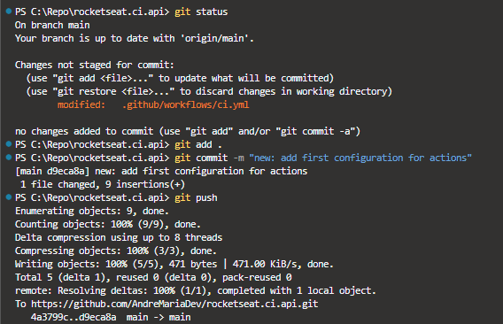


Após executar o commit vamos consultar o repositório no github. No site vamos navegar até a aba Action.

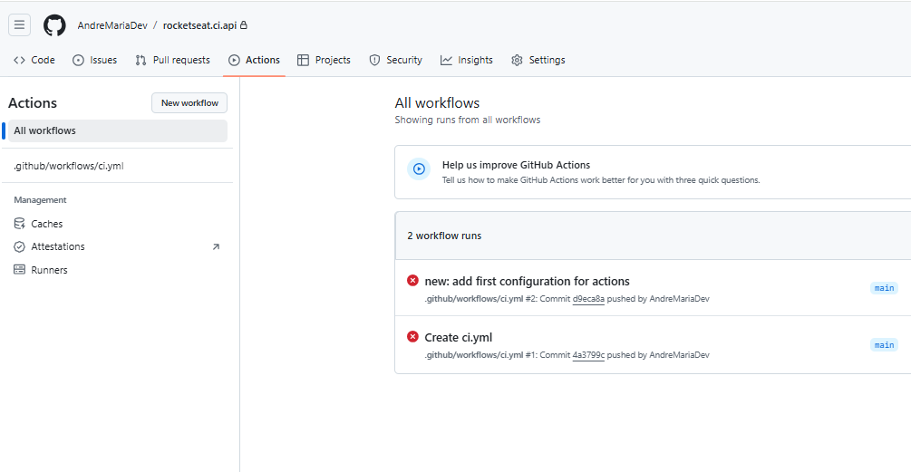

Vimos que ao executar a ação foi gerado um log de erro :

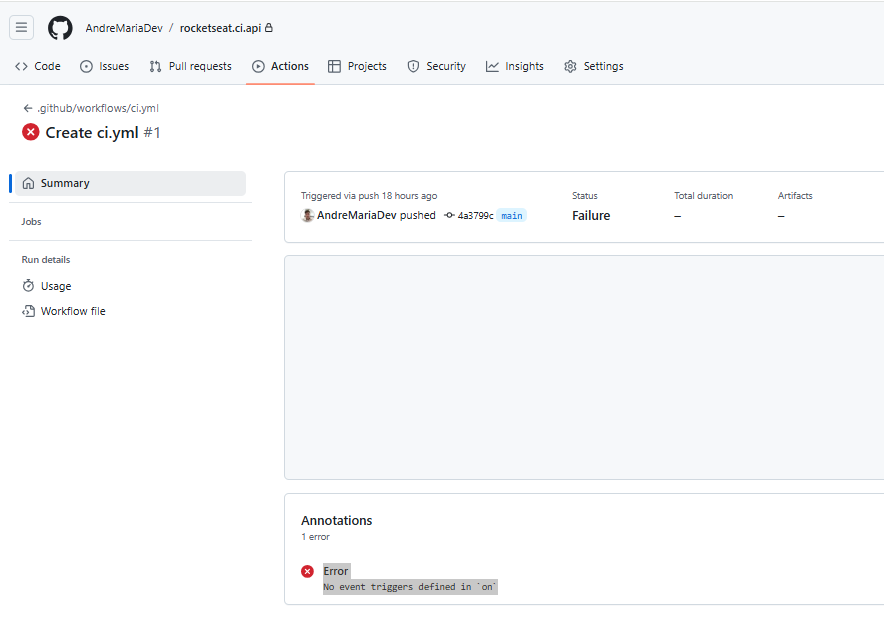

Por que?

O erro "No event triggers defined in 'on'" ocorre porque o workflow YAML está sem uma seção on, que define os eventos que devem disparar o workflow.

A seção on é essencial para que o GitHub saiba em quais condições ele deve executar o workflow. 

Por exemplo, você pode configurar o workflow para ser disparado quando houver um push, pull_request, ou outro evento específico.

Logo vamos modificar o arquivo `.github\workflows\ci.yml` com o seguinte trecho.
 
```hcl
name: CI

on:
  push:
    branches:
      - main
      

jobs:
  build:
    name: 'Build and Push'
    runs-on: ubuntu-latest

    steps:
      - uses: actions/checkout@v4
```

Agora podemos realizar um commit na branch main.

``
`git add .`
`git commit -m "new: add configure trigger pipeline"`
`git push`


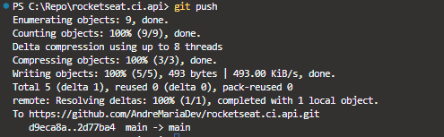


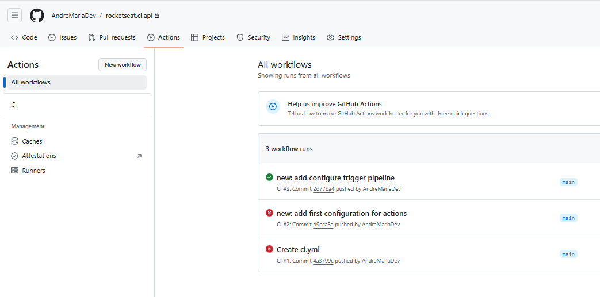


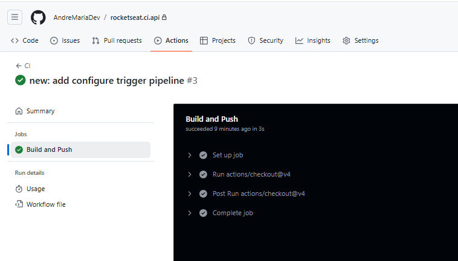


Agora vamos avançar em nosso script incluindo as configurações refrenetes a linguagem que nossa api foi desenvolvida.

Para isso vamos consultar novamente o site https://github.com/marketplace

Vamos pesquisar por `https://github.com/marketplace`


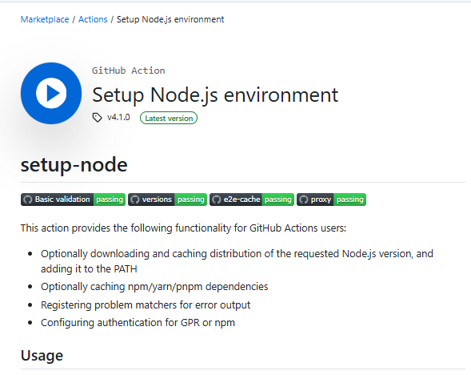

Logo vamos modificar o arquivo `.github\workflows\ci.yml` com o seguinte trecho.
 
```hcl
name: CI

on:
  push:
    branches:
      - main


jobs:
  build:
    name: 'Build and Push'
    runs-on: ubuntu-latest

    steps:
      - uses: actions/checkout@v4

      - name: Setup node
        uses: actions/setup-node@v4
```

O que acontece na etapa "Setup node"?

* name: Setup node: Esta linha dá um nome para a etapa dentro do job. O nome "Setup node" descreve que essa etapa será responsável por configurar o Node.js no ambiente do workflow.

* uses: actions/setup-node@v4:
        uses: O comando uses indica que estamos utilizando uma ação já existente no GitHub Actions.
        actions/setup-node: Especifica que estamos utilizando a ação oficial setup-node, que é usada para configurar o Node.js no ambiente de execução. Ela instala uma versão do Node.js, configura o gerenciador de pacotes npm (ou yarn), e prepara o ambiente para rodar tarefas específicas relacionadas ao Node.js.
        @v4: Indica que estamos utilizando a versão 4 da ação setup-node.

O que a ação setup-node faz?

A ação setup-node prepara o ambiente de execução do GitHub Actions para usar o Node.js. Ela pode realizar as seguintes funções, dependendo de como é configurada:

* Instalar o Node.js: Instala a versão especificada do Node.js (por padrão, a última versão estável, mas você pode especificar versões específicas).
    Configuração do npm ou yarn: Se o Node.js estiver sendo instalado, a ação também configura o npm (ou yarn) para gerenciamento de pacotes.
    Cache de dependências: A ação pode ajudar a configurar o cache de dependências (como pacotes npm), o que melhora o desempenho ao evitar a necessidade de baixar as dependências toda vez que o workflow rodar.


Mas vamos utilizar a abordagem de `Matrix Testing` do Setup Node.js Environment.
https://github.com/marketplace/actions/setup-node-js-environment

```hcl

name: CI

on:
  push:
    branches:
      - main


jobs:
  build:
    name: 'Build and Push'
    runs-on: ubuntu-latest
    strategy:
      matrix:
        node: [ 18, 20 ]
    steps:
      - uses: actions/checkout@v4

      - name: Setup node | ${{ matrix.node }}
        uses: actions/setup-node@v4
        with:
          node-version: ${{ matrix.node }}
      - run: npm ci
      - run: npm test

```


* `strategy`:

    Define uma estratégia de matriz (matrix) para o job.
    matrix permite rodar o job em diferentes variações de configuração, neste caso:
        node: [18, 20]: O job será executado duas vezes, uma para cada versão de Node.js especificada (18 e 20).

Essa abordagem ajuda a garantir que o código funcione corretamente em ambas as versões do Node.js.

* `- name: Setup node | ${{ matrix.node }}`:

    Configura o Node.js para a versão especificada no matrix.

    `${{ matrix.node }}`: Esse valor é uma variável que representa a versão do Node.js que está sendo usada no momento (18 ou 20). 
    Isso permite que o GitHub Actions rode o job com cada versão listada na matriz.

    `uses: actions/setup-node@v4`: Configura o Node.js usando a ação oficial setup-node.

    `with: node-version: ${{ matrix.node }}`: Define a versão do Node.js a ser usada de acordo com a versão especificada na matriz.

* `- run: npm ci`:

    Executa o comando npm ci, que instala as dependências do projeto. Esse comando é preferido em CI/CD porque instala as dependências de forma rápida e confiável, usando o package-lock.json.

* `- run: npm test`:

    Executa os testes do projeto usando npm test. Este comando roda os testes definidos no package.json para garantir que o código está funcionando conforme esperado.


Agora podemos realizar um commit na branch main.


`git add .`

`git commit -m "new: add configure matrix strategy"`

`git push`


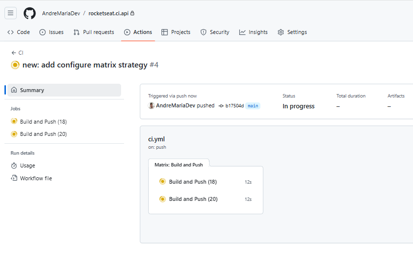


## Container Registry

É necessário criar uma conta no  https://hub.docker.com/explore


No `CI.yaml` nós vamos basicamente adicionar um `Step`, vamos chamar step de `build docker image` e vamos adicionar o comando  `run` sem uma action.
A máquina Ubuntu já possui o docker pré-instalado. Desta forma vamos editar o arquivo `CI.yaml`.

```hcl

name: CI

on:
  push:
    branches:
      - main


jobs:
  build:
    name: 'Build and Push'
    runs-on: ubuntu-latest
    strategy:
      matrix:
        node: [ 18, 20 ]
    steps:
      - uses: actions/checkout@v4

      - name: Setup node | ${{ matrix.node }}
        uses: actions/setup-node@v4
        with:
          node-version: ${{ matrix.node }}
      - run: npm ci
      - run: npm test

      - name: Generate tag
        id: generate_tag
        run: |
          SHA=$(echo $GITHUB_SHA | head -c7)
          echo "sha=$SHA" >> $GITHUB_OUTPUT

      - name: Build docker image
        run: docker build -t rocketseat-ci-api:${{ steps.generate_tag.outputs.sha }} .
```

Explicando : 
- name: Generate tag:

    `Nome da etapa`: "Generate tag". Esta etapa cria uma tag curta baseada no hash de confirmação (SHA) do commit atual.
    
    `id`: generate_tag: Define um identificador para a etapa, permitindo que suas saídas sejam usadas em outras etapas.
    
    run::
        
    `SHA=$(echo $GITHUB_SHA | head -c7)`: Extrai os primeiros 7 caracteres do hash do commit `(GITHUB_SHA)`, que é uma variável de ambiente do GitHub Actions.
    
    `echo "sha=$SHA" >> $GITHUB_OUTPUT`: Armazena o valor da variável SHA no GITHUB_OUTPUT, para que possa ser referenciada em etapas posteriores.

- name: Build docker image:

    `Nome da etapa`: "Build docker image". Esta etapa constrói uma imagem Docker.
    
    `run: docker build -t rocketseat-ci-api:${{ steps.generate_tag.outputs.sha }} .` :  docker build: Constrói a imagem Docker.

    `-t rocketseat-ci-api:${{ steps.generate_tag.outputs.sha }}` : Define a tag da imagem com o nome rocketseat-ci-api seguido pela tag gerada com a saída da etapa anterior (os primeiros 7 caracteres do hash).
    
    `.` : Indica que o Dockerfile está no diretório raiz do projeto.


Agora podemos realizar um commit na branch main.


`git add .`

`git commit -m "new: configure commit tag"`

`git push`


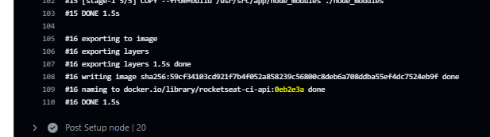

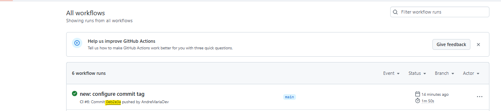

Agora vamos enviar a imagem criad para o Docker Hub.


No Git Hub Marketplace vamos pesquisar por `docker login`
https://github.com/marketplace?query=docker+login

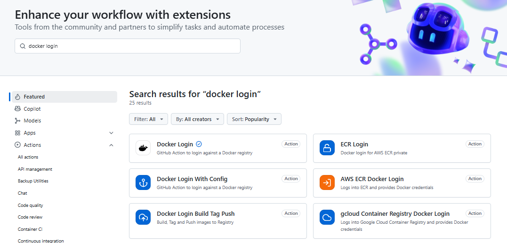

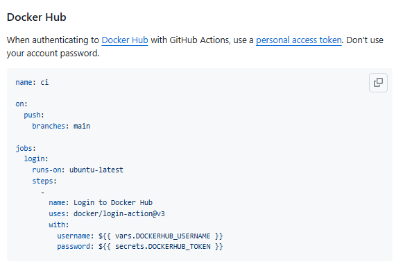


No `CI.yaml` nós vamos basicamente adicionar um `Step`, vamos chamar step de `Login into the container registry` e vamos adicionar o comando  `uses` 

```hcl

name: CI

on:
  push:
    branches:
      - main


jobs:
  build:
    name: 'Build and Push'
    runs-on: ubuntu-latest
    strategy:
      matrix:
        node: [ 18, 20 ]
    steps:
      - uses: actions/checkout@v4

      - name: Setup node | ${{ matrix.node }}
        uses: actions/setup-node@v4
        with:
          node-version: ${{ matrix.node }}
      - run: npm ci
      - run: npm test

      - name: Generate tag
        id: generate_tag
        run: |
          SHA=$(echo $GITHUB_SHA | head -c7)
          echo "sha=$SHA" >> $GITHUB_OUTPUT

      - name: Login into the container registry
        uses: docker/login-action@v3
        with:
          username: ${{ vars.DOCKERHUB_USERNAME }}
          password: ${{ secrets.DOCKERHUB_TOKEN }}

      - name: Build docker image
        run: docker build -t andremariadevops/rocketseat-ci-api:${{ steps.generate_tag.outputs.sha }} .

      - name: Push image
        run: docker push andremariadevops/rocketseat-ci-api:${{ steps.generate_tag.outputs.sha }}
```


Esse trecho de `login` é construído dessa forma para garantir que o GitHub Actions possa fazer login com segurança em um registro de contêiner (por exemplo, o Docker Hub) antes de executar comandos que exigem autenticação, como docker push. Vamos detalhar a construção de cada parte:
Explicação por partes

  `- name: Login into the container registry`
      É uma descrição do passo no job do GitHub Actions. Ajuda a identificar a etapa específica quando você visualiza os logs da execução.

  `uses: docker/login-action@v3`
      Especifica a ação do GitHub Actions que será usada. Neste caso, a ação docker/login-action na versão v3 é uma ação oficial da comunidade que facilita o login em registros de contêineres. Essa ação encapsula o processo de execução de docker login, tornando-o mais simples e seguro.

  `with:`
      Define os parâmetros que serão passados para a ação docker/login-action.

  `username: ${{ vars.DOCKERHUB_USERNAME }}`
      username é o nome de usuário do Docker Hub que será usado para fazer login. vars.DOCKERHUB_USERNAME é uma variável de ambiente definida nas configurações do repositório, que contém o nome de usuário. Usar ${{ }} permite que o GitHub Actions acesse essa variável dinamicamente.

  `password: ${{ secrets.DOCKERHUB_TOKEN }}`
      password é a senha ou token de acesso que será usado para autenticar o usuário. secrets.DOCKERHUB_TOKEN é um segredo armazenado com segurança no GitHub, que contém o token de acesso do Docker Hub. O uso de secrets é fundamental para proteger informações sensíveis, como senhas e tokens, garantindo que elas não fiquem expostas no código ou em logs.

No trecho `run: docker build -t andremariadevops/rocketseat-ci-api:${{ steps.generate_tag.outputs.sha }} .` temos `andremariadevops/` por que ?

No trecho `docker build -t andremariadevops/rocketseat-ci-api:${{ steps.generate_tag.outputs.sha }} .`, o andremariadevops é o nome do `namespace` ou `username` da sua conta no Docker Hub ou em um registro de contêiner. 

Ele é necessário para garantir que a imagem seja criada com uma tag específica que inclua a referência de quem a está publicando.


Para configurar o username e o password usados no GitHub Actions, você precisa definir as variáveis e segredos no repositório do GitHub. Aqui está como você pode fazer isso:
1. vars.DOCKERHUB_USERNAME

    vars se refere a variáveis de ambiente definidas no GitHub Actions. Você pode configurá-las diretamente no arquivo workflow ou por meio da interface do GitHub.

Configuração via Interface do GitHub:

    Vá até o repositório no GitHub.
    Clique em Settings (Configurações).
    No menu à esquerda, selecione Secrets and variables > Actions.
    Clique em New repository variable.
    Dê o nome DOCKERHUB_USERNAME e coloque o valor com seu nome de usuário do Docker Hub.
    Salve a variável.


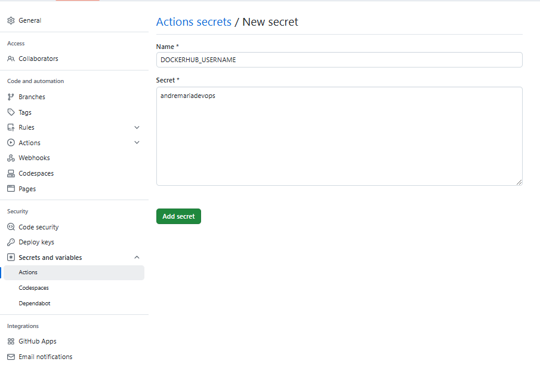

2. secrets.DOCKERHUB_TOKEN

    secrets se refere a segredos que são armazenados de forma segura no GitHub e são usados para manter informações sensíveis, como tokens e senhas.

Configuração de Segredos:

    Vá até o repositório no GitHub.
    Clique em Settings (Configurações).
    No menu à esquerda, selecione Secrets and variables > Actions > Secrets.
    Clique em New repository secret.
    Dê o nome DOCKERHUB_TOKEN e cole o token de acesso ao Docker Hub. Esse token pode ser gerado nas configurações da sua conta no Docker Hub:
        Vá para sua conta no Docker Hub.
        Clique em Account Settings (Configurações da Conta).
        Vá até Security (Segurança) e crie um Access Token.
    Salve o segredo.

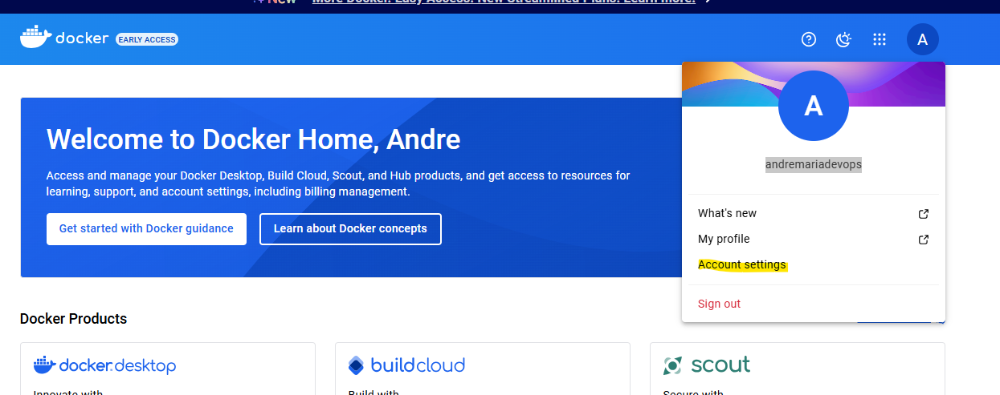

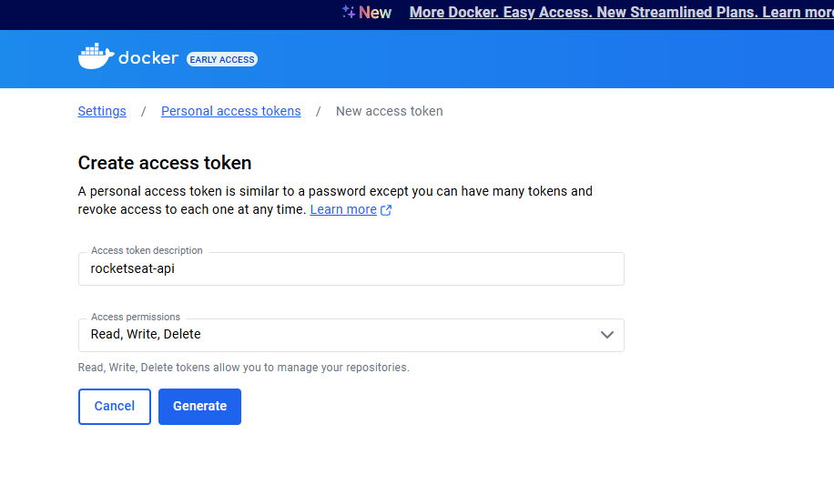

Resumo

    DOCKERHUB_USERNAME é configurado como uma variável no repositório.
    DOCKERHUB_TOKEN é configurado como um segredo seguro para proteger suas credenciais.

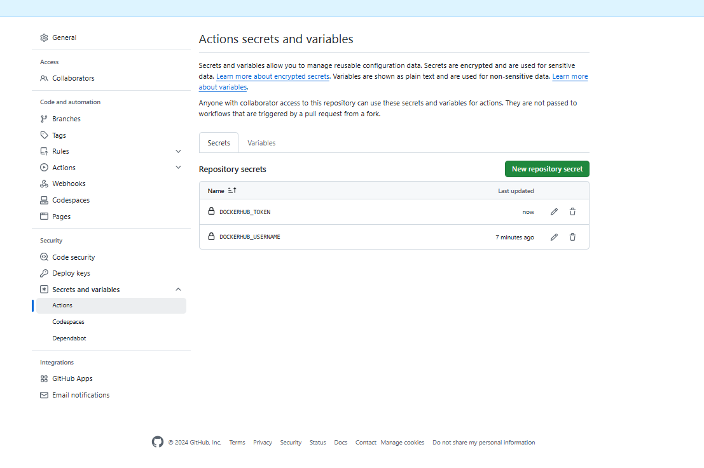


Agora podemos realizar um commit na branch main.


`git add .`

`git commit -m "new: configure push image"`

`git push`


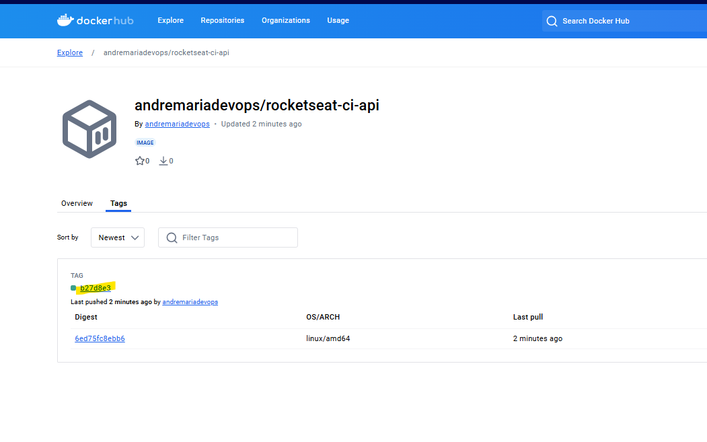

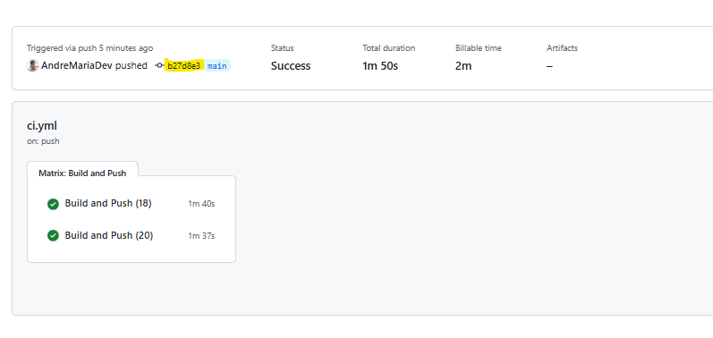


Agora vamos para as boas praticas :

vamos consultar https://github.com/marketplace/actions/build-and-push-docker-images

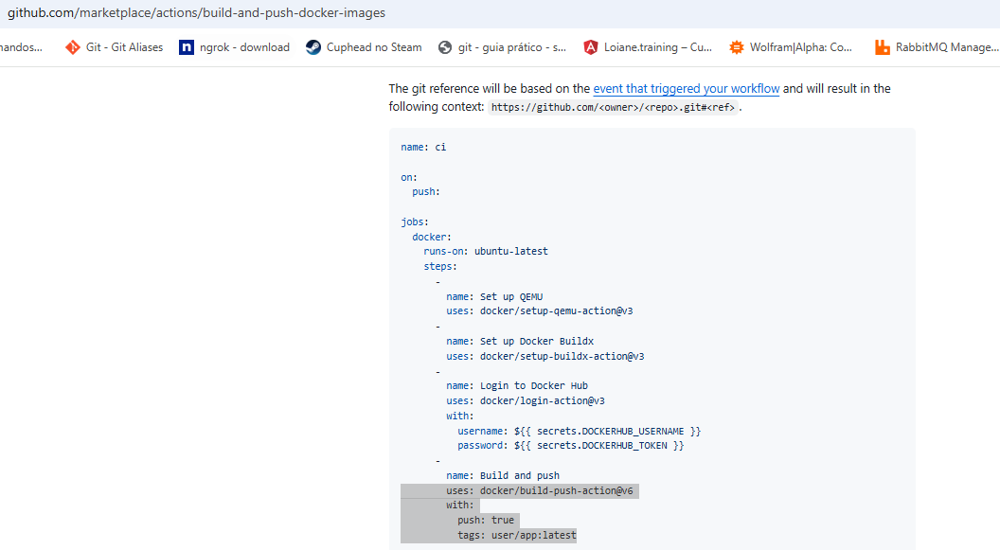

Agora vamos altera o código:

```hcl


name: CI

on:
  push:
    branches:
      - main


jobs:
  build:
    name: 'Build and Push'
    runs-on: ubuntu-latest
    # strategy:
    #   matrix:
    #     node: [ 18, 20 ]
    steps:
      - uses: actions/checkout@v4

      # - name: Setup node | ${{ matrix.node }}
      - name: Setup node
        uses: actions/setup-node@v4
        with:
          # node-version: ${{ matrix.node }}
          node-version: 18
      - run: npm ci
      - run: npm test

      - name: Generate tag
        id: generate_tag
        run: |
          SHA=$(echo $GITHUB_SHA | head -c7)
          echo "sha=$SHA" >> $GITHUB_OUTPUT

      - name: Login into the container registry
        uses: docker/login-action@v3
        with:
          username: ${{ secrets.DOCKERHUB_USERNAME }}
          password: ${{ secrets.DOCKERHUB_TOKEN }}

      - name: Build and Push
        uses: docker/build-push-action@v6
        with:
          push: true
          tags: andremariadevops/rocketseat-ci-api:${{ steps.generate_tag.outputs.sha }},andremariadevops/rocketseat-ci-api:latest
      # - name: Build docker image
      #   run: docker build -t andremariadevops/rocketseat-ci-api:${{ steps.generate_tag.outputs.sha }} .

      # - name: Push image
      #   run: docker push andremariadevops/rocketseat-ci-api:${{ steps.generate_tag.outputs.sha }}

```

Agora podemos realizar um commit na branch main.

`git add .`

`git commit -m "new: configure commit tag"`

`git push`


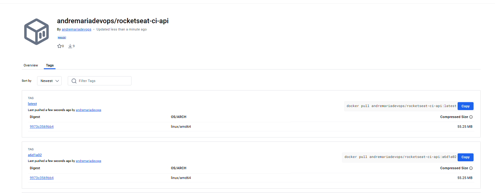


# Configurando repositório AWS

1- Criar a estrutura de login.

No Git Hub Marketplace vamos pesquisar por `aws credentials`
https://github.com/marketplace/actions/configure-aws-credentials-action-for-github-actions

Aqui vamos trabalhar com o conceito de OIDC

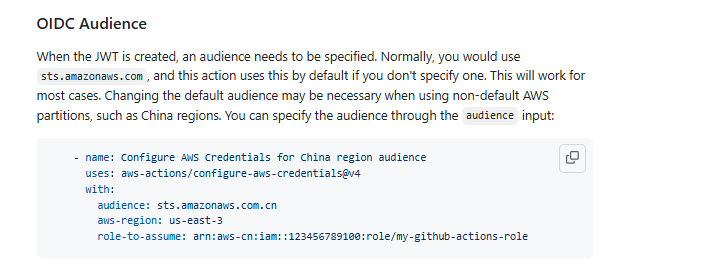

No Git Hub Marketplace vamos pesquisar por `ecr login aws`
https://github.com/marketplace/actions/amazon-ecr-login-action-for-github-actions

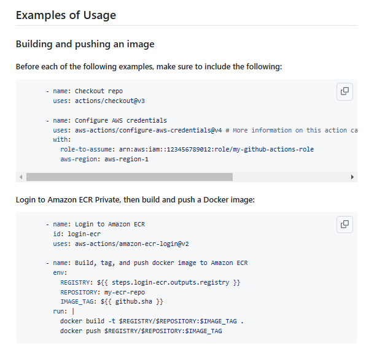

Agora vamos altera o código no arquivo `ci.yml`:

```hcl

name: CI

on:
  push:
    branches:
      - main


jobs:
  build:
    name: 'Build and Push'
    runs-on: ubuntu-latest
    # strategy:
    #   matrix:
    #     node: [ 18, 20 ]
    steps:
      - uses: actions/checkout@v4

      # - name: Setup node | ${{ matrix.node }}
      - name: Setup node
        uses: actions/setup-node@v4
        with:
          # node-version: ${{ matrix.node }}
          node-version: 18
      - run: npm ci
      - run: npm test

      - name: Generate tag
        id: generate_tag
        run: |
          SHA=$(echo $GITHUB_SHA | head -c7)
          echo "sha=$SHA" >> $GITHUB_OUTPUT
      
      - name: Configure AWS Credentials
        uses: aws-actions/configure-aws-credentials@v4
        with:
          aws-region: us-east-1
          role-to-assume: ''

      - name: Login to Amazon ECR
        id: login-ecr
        uses: aws-actions/amazon-ecr-login@v2


        
      # - name: Login into the container registry
      #   uses: docker/login-action@v3
      #   with:
      #     username: ${{ secrets.DOCKERHUB_USERNAME }}
      #     password: ${{ secrets.DOCKERHUB_TOKEN }}

      # - name: Build and Push
      #   uses: docker/build-push-action@v6
      #   with:
      #     push: true
      #     tags: andremariadevops/rocketseat-ci-api:${{ steps.generate_tag.outputs.sha }},andremariadevops/rocketseat-ci-api:latest
      # - name: Build docker image
      #   run: docker build -t andremariadevops/rocketseat-ci-api:${{ steps.generate_tag.outputs.sha }} .

      # - name: Push image
      #   run: docker push andremariadevops/rocketseat-ci-api:${{ steps.generate_tag.outputs.sha }}

```

`- name: Configure AWS Credentials`: Configura as credenciais da AWS para permitir operações com serviços AWS.

  `uses: aws-actions/configure-aws-credentials@v4`: Ação que configura as credenciais da AWS.
  
  `with:`: Especifica a região (us-east-1) e um campo `role-to-assume` que está vazio (deveria conter o ARN de um papel se necessário).

`- name: Login to Amazon ECR`: Faz login no Amazon Elastic Container Registry (ECR) para permitir o push de imagens de contêiner.

  `id: login-ecr`: Define um ID para a etapa.
  
  `uses: aws-actions/amazon-ecr-login@v2`: Utiliza uma ação para fazer login no ECR.


2- Criando recursos no IAM AWS

* Identity providers

* Role

* ECR

* Build Image

## Identity providers
Vamos criar uma nova pasta  rocketseat.iac

aqui vamos criar um arquivo `main.tf` e incluir o seguinte script

```hcl
terraform {
  required_providers {
    aws = {
      source = "hashicorp/aws"
      version = "5.73.0"
    }
  }
}

provider "aws" {
  profile = "VALOR-GERADO-NO-PASSO-1"
  region  = "VALOR-CONTIDO-NO-[Resumo das configurações]"
}
```

No terminal vamos rodar o seguinte comando :  `terraform init`. 

Logo apos vamos criara um arquivo `iam.tf`

vamos acessar o link : https://registry.terraform.io/providers/hashicorp/aws/latest/docs/resources/iam_openid_connect_provider


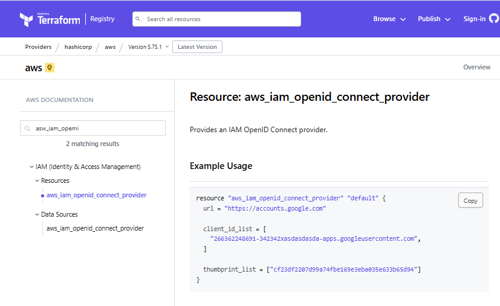


O GitHub Actions pode emitir tokens OIDC para autenticar seus jobs diretamente com provedores que suportam OIDC, sem precisar armazenar credenciais secretas.
Uso em serviços de nuvem:

    Configuração de permissões: Nos workflows do GitHub Actions, você pode configurar permissões de uso de OIDC. O token é emitido por https://token.actions.githubusercontent.com.

    Provedor de identidade: No lado do provedor (por exemplo, AWS, Azure ou GCP), você precisa registrar token.actions.githubusercontent.com como um provedor de identidade confiável.

    Uso em um workflow: No seu arquivo YAML de workflow, você pode solicitar um token OIDC


sts.amazonaws.com é o endpoint do serviço AWS Security Token Service (STS), que é usado para obter credenciais temporárias e seguras na AWS. Ele é frequentemente usado em combinação com autenticação baseada em OIDC (OpenID Connect) e GitHub Actions para permitir que workflows autenticados acessem recursos da AWS.

logo vamos adicionar o script no arquivo.

```hcl
resource "aws_iam_openid_connect_provider" "oidc-git" {
  url = "https://token.actions.githubusercontent.com"

  client_id_list = [
    "sts.amazonaws.com",
  ]

  thumbprint_list = ["*****************************"]

  tags = {
    IAC = "True"
  }
}
```

* Verificar se a sintax está correta: `terraform validate`

* Rodar o camando de pre planejamento : `terraform plan`

* Rodar e comando de execução : 

    a- necessário aprovar
        `terraform apply` (com etapa de confirmação)

    b- `terraform apply -auto-approve` (sem etapa de confirmação)


## Role

Agora vamos criara a role para preencher o `role-to-assume` no step `- name: Configure AWS Credentials` do arquivo `ci.yml`

para isso vamos seguir os passos

* No site console AWS vamos ao  Identity and Acess Management (IAM) .

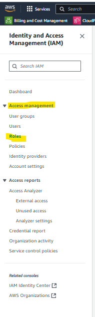

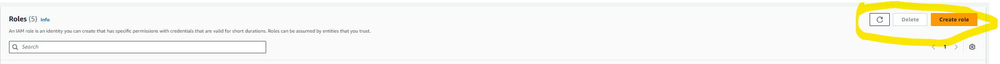

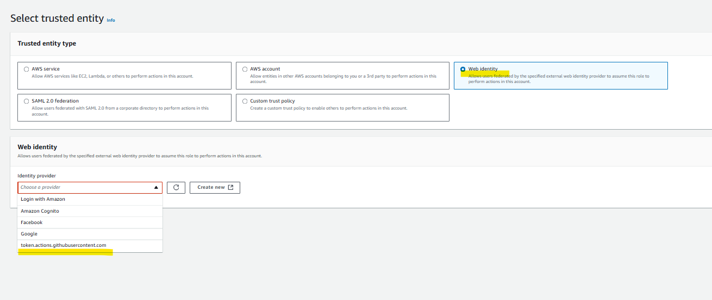

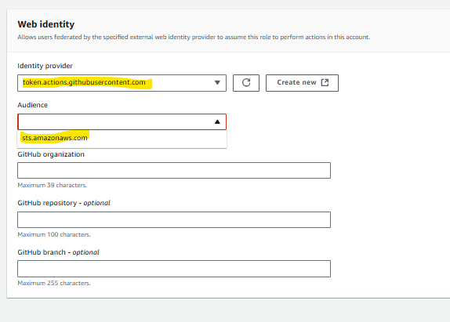


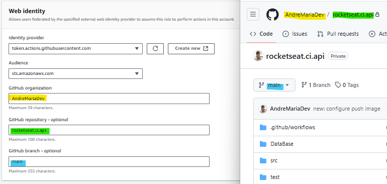


Como podemos ver os items `token.actions.githubusercontent.com` e `sts.amazonaws.com` foram criados anteriormente. Logo podemos utilizarmos aqui.

Logo apo´s clicar em next...


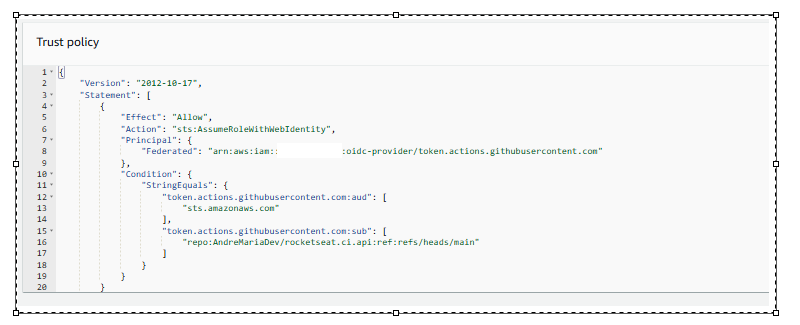

o processo cria esse json para validação da role, vamos copiar o conteudo e colcar no arquivo `ci.yml`.


mas antes vamos ao site do terraforme pegar um exemplo de como implementar o json ....

https://registry.terraform.io/providers/hashicorp/aws/latest/docs/resources/iam_role


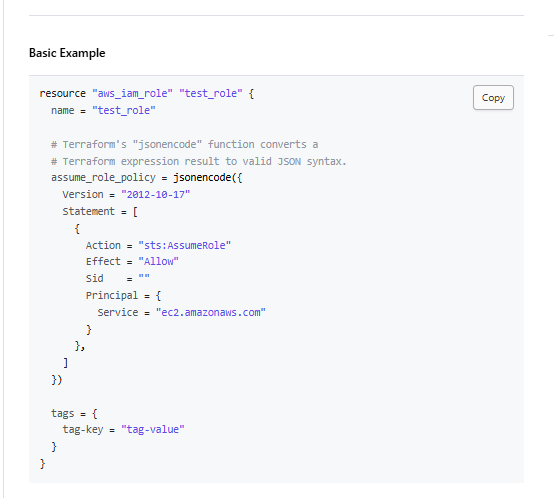

Vamos copiar e editar isso dentro do arquivo `iam.yml`.


```hcl
resource "aws_iam_openid_connect_provider" "oidc-git" {
  url = "https://token.actions.githubusercontent.com"

  client_id_list = [
    "sts.amazonaws.com",
  ]

  thumbprint_list = ["******************************************"]

  tags = {
    IAC = "True"
  }
}

resource "aws_iam_role" "ecr_role" {
  name = "ecr_role"

  # Terraform's "jsonencode" function converts a
  # Terraform expression result to valid JSON syntax.
  assume_role_policy = jsonencode({
    Statement = [
        {
            Effect = "Allow",
            Action = "sts:AssumeRoleWithWebIdentity",
            Principal = {
                Federated = "arn:aws:iam::*************:oidc-provider/token.actions.githubusercontent.com"
            },
            Condition = {
                StringEquals = {
                    "token.actions.githubusercontent.com:aud" = "sts.amazonaws.com"
                    "token.actions.githubusercontent.com:sub" = "repo:AndreMariaDev/rocketseat.ci.api:ref:refs/heads/main"
                }
            }
        }
    ]
    Version = "2012-10-17"
  })

  tags = {
    IAC = "True"
  }
}
```


* Rodar e comando de execução : 

    a- necessário aprovar
        `terraform apply` (com etapa de confirmação)

    b- `terraform apply -auto-approve` (sem etapa de confirmação)


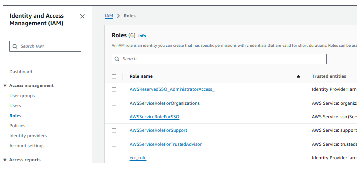

Vimos que foi criado com sucesso , agora vamos adicionar uma policy a nossa role.

Para isso vamos clicar na na role que acabamos de criar.
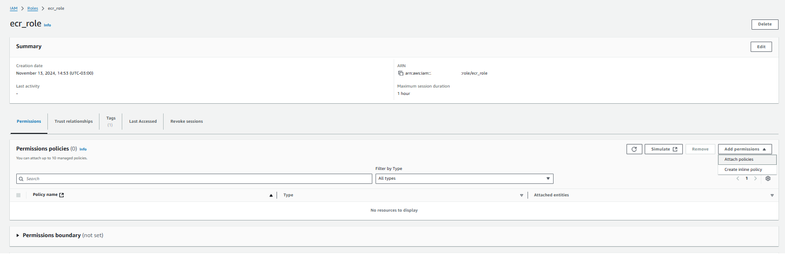


Vamos selecionar `Attach policy` conforme a imagem.

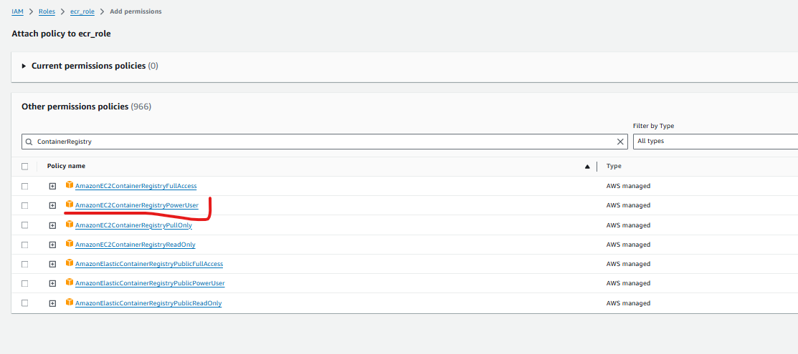

Vamos clicar o botão `+` conforme a imagem .


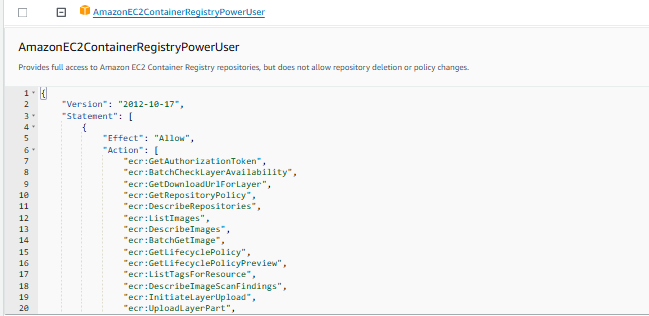

Aqui temos o exemplo .

Agora vamos voltar ao site do terraforme https://registry.terraform.io/providers/hashicorp/aws/latest/docs/resources/iam_role


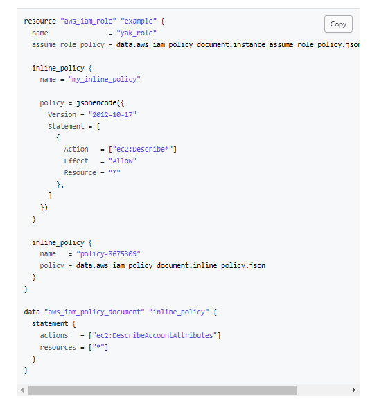


Vamos copiar o conteudo e incluir no arquivo `iam.tf` .

```hcl
resource "aws_iam_openid_connect_provider" "oidc-git" {
  url = "https://token.actions.githubusercontent.com"

  client_id_list = [
    "sts.amazonaws.com",
  ]

  thumbprint_list = ["*****************"]

  tags = {
    IAC = "True"
  }
}

resource "aws_iam_role" "ecr_role" {
  name = "ecr_role"

  assume_role_policy = jsonencode({
    Statement = [
      {
        Action = "sts:AssumeRoleWithWebIdentity",
        Condition = {
          StringEquals = {
            "token.actions.githubusercontent.com:aud" = "sts.amazonaws.com",
            "token.actions.githubusercontent.com:sub" = "repo:AndreMariaDev/rocketseat.ci.api:ref:refs/heads/main"
          }
        }
        Effect = "Allow",
        Principal = {
          Federated = "arn:aws:iam::************:oidc-provider/token.actions.githubusercontent.com"
        }
      }
    ]
    Version = "2012-10-17",
  })

  inline_policy {
    name = "ecr-app-permission"

    policy = jsonencode({
      Version = "2012-10-17"
      Statement = [
        {
            Sid    = "Statement1",
            Action = "apprunner:*",
            Effect = "Allow",
            Resource = "*"
        },
        {
            Sid    = "Statement2",
            Action = [
            "iam:PassRole",
            "iam:CreateServiceLinkedRole"
            ],
            Effect = "Allow",
            Resource = "*"
        },
        {
            Sid    = "Statement3"
            Action = [
            "ecr:GetDownloadUrlForLayer",
            "ecr:BatchGetImage",
            "ecr:BatchCheckLayerAvailability",
            "ecr:PutImage",
            "ecr:InitiateLayerUpload",
            "ecr:UploadLayerPart",
            "ecr:CompleteLayerUpload",
            "ecr:GetAuthorizationToken"
            ]
            Effect = "Allow"
            Resource = "*"
        }
      ]
    })
  }

  tags = {
    IAC = "True"
  }
}
```
## Explicação dos Statements na Política do Recurso `aws_iam_role "app-runner-role"`
#### Assume Role Policy (`assume_role_policy`)
Esta política define quem pode assumir a função. É utilizada para conceder permissões a um provedor de identidade para que possa solicitar tokens de segurança do AWS Security Token Service (STS) para essa função.

- **Action**: `"sts:AssumeRoleWithWebIdentity"`
  - **Descrição**: Permite que um provedor de identidade Web (neste caso, GitHub Actions) assuma a função.
- **Condition**:
  - **StringEquals**:
    - `"token.actions.githubusercontent.com:aud"` = `"sts.amazonaws.com"`: Garante que a audiência do token emitido seja o AWS STS.
    - `"token.actions.githubusercontent.com:sub"` = `"repo:AndreMariaDev/rocketseat.ci.api:ref:refs/heads/main"`: Especifica que a política só permitirá que tokens de um repositório específico (neste caso, `AndreMariaDev/rocketseat.ci.api`) e de uma branch específica (`main`) possam assumir a função.
- **Effect**: `"Allow"`: Autoriza o acesso de acordo com as condições especificadas.
- **Principal**:
  - **Federated**: `"arn:aws:iam::************:oidc-provider/token.actions.githubusercontent.com"`: Define o OIDC Provider do GitHub como entidade confiável para assumir a função.

#### Inline Policy (`inline_policy`)
Esta política embutida define as permissões da função e detalha as operações que a função pode realizar nos recursos da AWS.

##### 1. **Statement1: Permissões do App Runner**
- **Sid**: `"Statement1"`
- **Action**: `"apprunner:*"`
  - **Descrição**: Concede permissões completas (`*`) sobre o serviço AWS App Runner, que pode ser usado para executar aplicações e serviços com contêineres.
- **Effect**: `"Allow"`
- **Resource**: `"*"` (todas as instâncias de recursos do App Runner)
- **Motivo**: Permite que a função gerencie o ciclo de vida e operações relacionadas ao App Runner. Isso é útil quando se deseja implantar, gerenciar e monitorar serviços de contêiner usando o App Runner.

##### 2. **Statement2: Permissões de IAM**
- **Sid**: `"Statement2"`
- **Action**: `["iam:PassRole", "iam:CreateServiceLinkedRole"]`
  - **Descrição**:
    - `"iam:PassRole"`: Permite que a função delegue permissões a outros serviços para que possam atuar em seu nome.
    - `"iam:CreateServiceLinkedRole"`: Permite criar funções vinculadas a serviços que são automaticamente gerenciadas por serviços da AWS.
- **Effect**: `"Allow"`
- **Resource**: `"*"`
- **Motivo**: Necessário para que a função passe a si mesma para serviços como o App Runner e crie funções que o App Runner possa usar, garantindo a integração e o funcionamento adequado do pipeline.

##### 3. **Statement3: Permissões de ECR (Elastic Container Registry)**
- **Sid**: `"Statement3"`
- **Action**:
  - `"ecr:GetDownloadUrlForLayer"`: Obtém a URL para download de uma camada de imagem de contêiner.
  - `"ecr:BatchGetImage"`: Recupera metadados de imagens no repositório.
  - `"ecr:BatchCheckLayerAvailability"`: Verifica a disponibilidade das camadas da imagem no repositório.
  - `"ecr:PutImage"`: Insere uma imagem no repositório.
  - `"ecr:InitiateLayerUpload"`, `"ecr:UploadLayerPart"`, `"ecr:CompleteLayerUpload"`: Realizam o processo de upload de uma camada de imagem.
  - `"ecr:GetAuthorizationToken"`: Recupera um token de autenticação necessário para acessar o repositório ECR.
- **Effect**: `"Allow"`
- **Resource**: `"*"`
- **Motivo**: Necessário para que a função possa fazer pull e push de imagens para o Amazon ECR, garantindo que as imagens usadas e geradas pelo pipeline de CI/CD sejam armazenadas e acessadas de forma segura.

### Conclusão
Esses `Statements` foram configurados para permitir que a função `ecr_role` seja assumida pelo GitHub Actions para realizar operações automatizadas no App Runner, gerenciar permissões do IAM e realizar operações no Amazon ECR. Essas permissões são fundamentais para a automação do fluxo de trabalho de CI/CD, onde aplicações em contêineres são construídas, armazenadas no ECR e implantadas usando o App Runner.


* Rodar e comando de execução : 

    a- necessário aprovar
        `terraform apply` (com etapa de confirmação)

    b- `terraform apply -auto-approve` (sem etapa de confirmação)


Vamos verificar na aws agora :

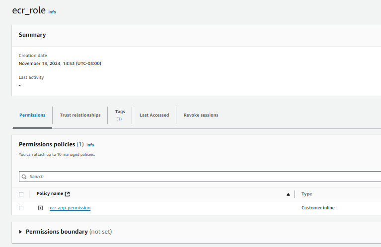


finalmente podemos altera o arquivo `ci.yml`


```hcl

name: CI

on:
  push:
    branches:
      - main

permissions:
  id-token: write
  contents: read

jobs:
  build:
    name: 'Build and Push'
    runs-on: ubuntu-latest
    # strategy:
    #   matrix:
    #     node: [ 18, 20 ]
    steps:
      - uses: actions/checkout@v4

      # - name: Setup node | ${{ matrix.node }}
      - name: Setup node
        uses: actions/setup-node@v4
        with:
          # node-version: ${{ matrix.node }}
          node-version: 18
      - run: npm ci
      - run: npm test

      - name: Generate tag
        id: generate_tag
        run: |
          SHA=$(echo $GITHUB_SHA | head -c7)
          echo "sha=$SHA" >> $GITHUB_OUTPUT
      
      - name: Configure AWS Credentials
        uses: aws-actions/configure-aws-credentials@v4
        with:
          aws-region: us-east-1
          role-to-assume: arn:aws:iam::************:role/ecr_role

      - name: Login to Amazon ECR
        id: login-ecr
        uses: aws-actions/amazon-ecr-login@v2


      # - name: Login into the container registry
      #   uses: docker/login-action@v3
      #   with:
      #     username: ${{ secrets.DOCKERHUB_USERNAME }}
      #     password: ${{ secrets.DOCKERHUB_TOKEN }}

      # - name: Build and Push
      #   uses: docker/build-push-action@v6
      #   with:
      #     push: true
      #     tags: andremariadevops/rocketseat-ci-api:${{ steps.generate_tag.outputs.sha }},andremariadevops/rocketseat-ci-api:latest
      # - name: Build docker image
      #   run: docker build -t andremariadevops/rocketseat-ci-api:${{ steps.generate_tag.outputs.sha }} .

      # - name: Push image
      #   run: docker push andremariadevops/rocketseat-ci-api:${{ steps.generate_tag.outputs.sha }}

```

podemos ver que o campo `role-to-assume` foi preenchido com o valor disponibilizado pelo `ecr_role`

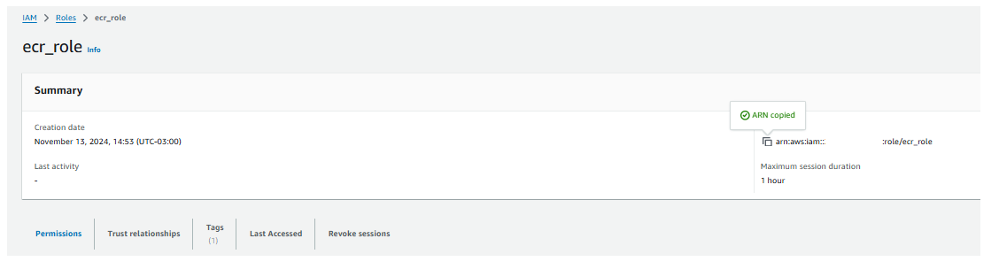

## ECR

Agora vamos criar o recurso ECR para tal vamos acesssar o site do terraform.

https://registry.terraform.io/providers/hashicorp/aws/latest/docs/data-sources/ecr_repository


Vemos na doc que é super simple, logo vamos criar um novo arquivo pasta rocketseat.iac

aqui vamos criar um arquivo ecr.tf e incluir o seguinte script:

```hcl

resource "aws_ecr_repository" "rocketseat-ci-api" {
  name                 = "rocketseat-ci"
  image_tag_mutability = "MUTABLE"

  image_scanning_configuration {
    scan_on_push = true
  }

  tags = {
    IAC = "True"
  }
}

```

* Rodar e comando de execução : 

    a- necessário aprovar
        `terraform apply` (com etapa de confirmação)

    b- `terraform apply -auto-approve` (sem etapa de confirmação)

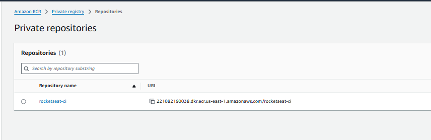


Agora podemos realizar o commit para o git e analisar o git hub actions 

`git add .`

`git commit -m "new: configure role and permissions"`

`git push`


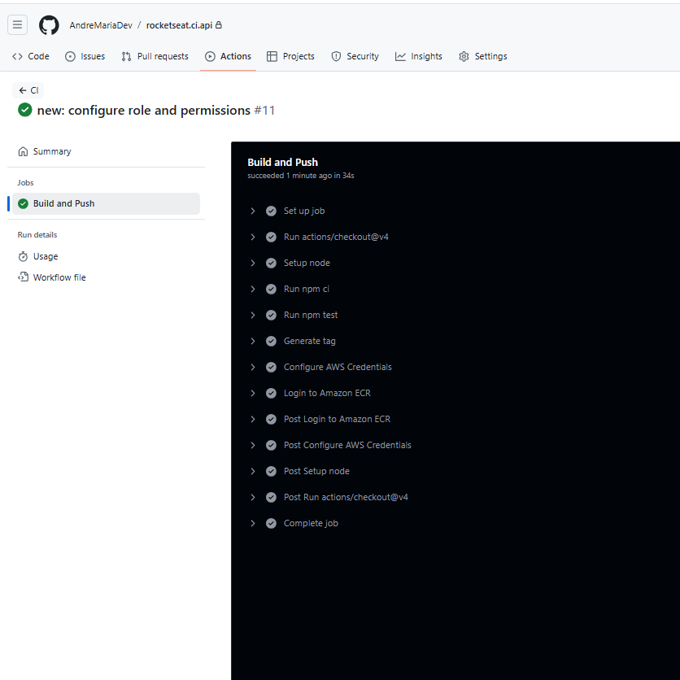


## Build Image


Agora para enviarmos a imagem da api para o ECR vamos edita o arquivo ci.yml com o seguinte código :

```hcl

name: CI

on:
  push:
    branches:
      - main

permissions:
  id-token: write
  contents: read

jobs:
  build:
    name: 'Build and Push'
    runs-on: ubuntu-latest
    # strategy:
    #   matrix:
    #     node: [ 18, 20 ]
    steps:
      - uses: actions/checkout@v4

      # - name: Setup node | ${{ matrix.node }}
      - name: Setup node
        uses: actions/setup-node@v4
        with:
          # node-version: ${{ matrix.node }}
          node-version: 18
      - run: npm ci
      - run: npm test

      - name: Generate tag
        id: generate_tag
        run: |
          SHA=$(echo $GITHUB_SHA | head -c7)
          echo "sha=$SHA" >> $GITHUB_OUTPUT
      
      - name: Configure AWS Credentials
        uses: aws-actions/configure-aws-credentials@v4
        with:
          aws-region: us-east-1
          role-to-assume: arn:aws:iam::************:role/ecr_role

      - name: Login to Amazon ECR
        id: login-ecr
        uses: aws-actions/amazon-ecr-login@v2

      - name: Build docker image
        env:
          REGISTRY: ${{ steps.login-ecr.outputs.registry }}
          TAG: ${{ steps.generate_tag.outputs.sha }}
        run: |
          docker build -t $REGISTRY/rocketseat-ci:$TAG .
          docker push $REGISTRY/rocketseat-ci:$TAG
```

### Explicação detalhada:

Build docker image:

`name: Build docker image`: Nome da etapa para identificar que essa etapa é responsável por construir a imagem Docker.

`env`: Define variáveis de ambiente que serão usadas na execução do comando run.

`REGISTRY: ${{ steps.login-ecr.outputs.registry }}`: A variável REGISTRY é preenchida com o valor da saída registry da etapa login-ecr. Essa saída contém o URL do registro Amazon ECR para o qual a imagem será enviada.

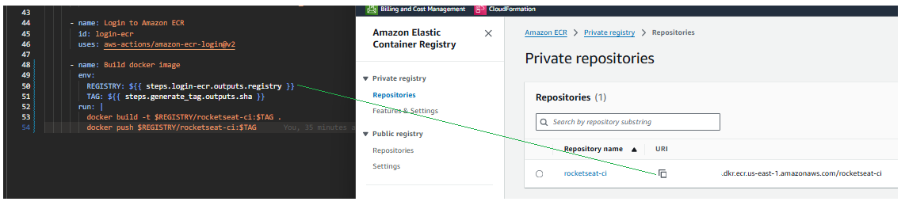

`TAG: ${{ steps.generate_tag.outputs.sha }}`: A variável TAG recebe o valor da saída sha da etapa generate_tag (não mostrada aqui, mas deve existir em uma etapa anterior). Geralmente, essa saída representa um hash único do commit ou uma tag gerada automaticamente, usada para versionar a imagem Docker.

`run`: O bloco run contém os comandos de shell que serão executados:

```
docker build -t $REGISTRY/rocketseat-ci:$TAG .
docker push $REGISTRY/rocketseat-ci:$TAG
```

`docker build -t $REGISTRY/rocketseat-ci:$TAG .`: Constrói uma imagem Docker a partir do Dockerfile presente no diretório atual (.). A opção -t define o nome e a tag da imagem, que será algo como 123456789012.dkr.ecr.us-east-1.amazonaws.com/rocketseat-ci:sha123abc.

`docker push $REGISTRY/rocketseat-ci:$TAG`: Envia a imagem recém-construída para o registro do Amazon ECR. O REGISTRY e a TAG definidos nas variáveis de ambiente são utilizados para especificar o destino exato no ECR.

Agora podemos realizar o commit para o git e analisar o git hub actions 

`git add .`

`git commit -m "new: push image to ecr repositry"`

`git push`


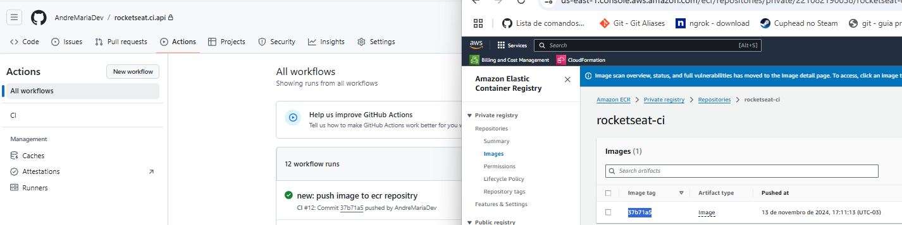


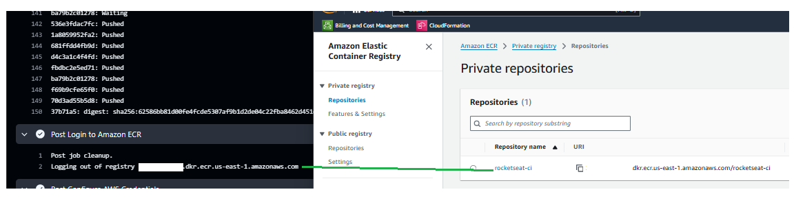


## Role App Runner

Agora vamos criar uma role para o running da aplicação para isso vamos add um novo resource no arquivo `aim.tf`

```hcl
resource "aws_iam_role" "app-runner-role" {
  name = "app-runner-role"
  assume_role_policy = jsonencode({})
}

```

para preencher o `assume_role_policy` vamos ao console aws e no produtoi IAM 

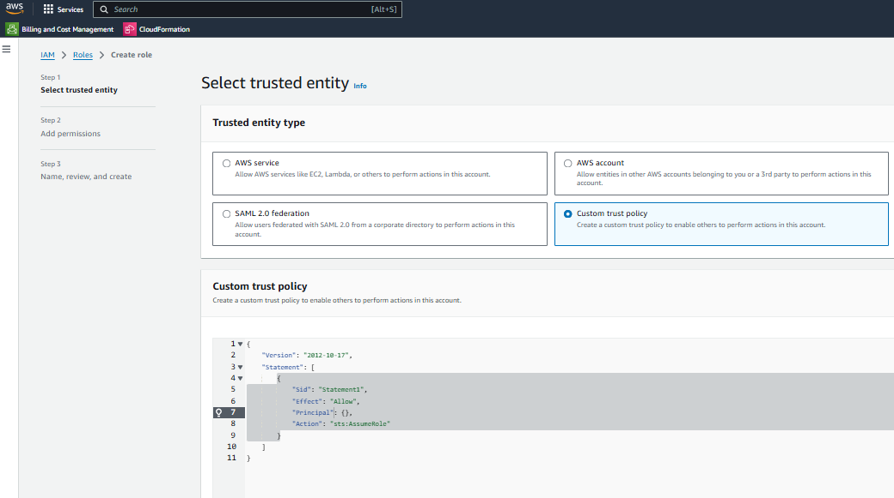

Vamos copiar o conteudo e add no item `assume_role_policy`


```hcl
resource "aws_iam_role" "app-runner-role" {
  name = "app-runner-role"

  assume_role_policy = jsonencode({
    Version = "2012-10-17",
    Statement = [
      {
        Effect = "Allow",
        Principal = {
          Service = "build.apprunner.amazonaws.com"
        },
        Action = "sts:AssumeRole"
      }
    ]
  })

  managed_policy_arns = [
    "arn:aws:iam::aws:policy/AmazonEC2ContainerRegistryReadOnly"
  ]

  tags = {
    IAC = "True"
  }
}
```

### Explicação dos Statements na Política do Recurso `aws_iam_role` `app-runner-role`

### 1. Papel do `Statement` no `assume_role_policy`

O bloco `assume_role_policy` define a política de confiança que especifica quais entidades (por exemplo, serviços ou usuários) têm permissão para assumir essa função (IAM Role). A estrutura de `Statement` no `assume_role_policy` faz o seguinte:

- **`Effect: "Allow"`**: Esta cláusula indica que a ação definida no `Action` é permitida.
- **`Principal`**: Especifica quem ou qual serviço pode assumir essa função. No caso, o `Service` é `build.apprunner.amazonaws.com`, que representa o App Runner da AWS. Isso significa que o serviço App Runner tem permissão para assumir essa função.
- **`Action: "sts:AssumeRole"`**: Esta é a ação permitida para o `Principal`, ou seja, o serviço App Runner pode usar a operação `sts:AssumeRole` para assumir a função.

**Motivo**: O `assume_role_policy` é necessário para que o serviço App Runner possa autenticar e usar a função. Isso permite que o App Runner obtenha permissões temporárias para acessar outros recursos da AWS com base nas políticas associadas à função.

### 2. Papel do `managed_policy_arns`

O parâmetro `managed_policy_arns` define as políticas gerenciadas pela AWS que são associadas à função. No exemplo, a política `arn:aws:iam::aws:policy/AmazonEC2ContainerRegistryReadOnly` está anexada à função.

- **`AmazonEC2ContainerRegistryReadOnly`**: Esta política gerenciada concede permissões de leitura para o Amazon Elastic Container Registry (ECR). Isso significa que qualquer serviço ou entidade que assuma essa função pode ler imagens do ECR, mas não pode fazer alterações (por exemplo, fazer upload de imagens).

**Motivo**: Essa política é necessária para permitir que o serviço App Runner acesse imagens de contêiner armazenadas no Amazon ECR. Isso é essencial para que o App Runner possa executar aplicações que dependem de imagens armazenadas nesse repositório.


A inclusão do `build.apprunner.amazonaws.com` como `Principal` permite que o serviço App Runner obtenha um token temporário através da chamada `sts:AssumeRole` e execute ações com as permissões definidas nessa role.

O `Principal` em uma política de assunção define quem ou o que tem permissão para assumir a role. Ele pode ser um usuário, um grupo, uma entidade federada ou, neste caso, um serviço AWS.


O `sts:AssumeRole` é uma ação do AWS Security Token Service (STS) que permite que uma entidade (como um usuário, serviço ou aplicação) assuma uma role IAM (Identity and Access Management). Esse processo gera credenciais temporárias que a entidade pode usar para acessar recursos da AWS com as permissões especificadas pela role assumida.

O `managed_policy_arns` especifica uma política gerenciada que é anexada à role.

A política `AmazonEC2ContainerRegistryReadOnly` concede permissões de leitura ao Amazon ECR (Elastic Container Registry). Isso é necessário para que o serviço App Runner possa puxar imagens de contêiner do ECR para implantar e executar aplicações.

### Por final teremos :

```hcl
resource "aws_iam_openid_connect_provider" "oidc-git" {
  url = "https://token.actions.githubusercontent.com"

  client_id_list = [
    "sts.amazonaws.com",
  ]

  thumbprint_list = ["****************************************"]

  tags = {
    IAC = "True"
  }
}

resource "aws_iam_role" "ecr_role" {
  name = "ecr_role"

  assume_role_policy = jsonencode({
    Statement = [
      {
        Action = "sts:AssumeRoleWithWebIdentity",
        Condition = {
          StringEquals = {
            "token.actions.githubusercontent.com:aud" = "sts.amazonaws.com",
            "token.actions.githubusercontent.com:sub" = "repo:AndreMariaDev/rocketseat.ci.api:ref:refs/heads/main"
          }
        }
        Effect = "Allow",
        Principal = {
          Federated = "arn:aws:iam::************:oidc-provider/token.actions.githubusercontent.com"
        }
      }
    ]
    Version = "2012-10-17",
  })

  inline_policy {
    name = "ecr-app-permission"

    policy = jsonencode({
      Version = "2012-10-17"
      Statement = [
        {
            Sid    = "Statement1",
            Action = "apprunner:*",
            Effect = "Allow",
            Resource = "*"
        },
        {
            Sid    = "Statement2",
            Action = [
            "iam:PassRole",
            "iam:CreateServiceLinkedRole"
            ],
            Effect = "Allow",
            Resource = "*"
        },
        {
            Sid    = "Statement3"
            Action = [
            "ecr:GetDownloadUrlForLayer",
            "ecr:BatchGetImage",
            "ecr:BatchCheckLayerAvailability",
            "ecr:PutImage",
            "ecr:InitiateLayerUpload",
            "ecr:UploadLayerPart",
            "ecr:CompleteLayerUpload",
            "ecr:GetAuthorizationToken"
            ]
            Effect = "Allow"
            Resource = "*"
        }
      ]
    })
  }

  tags = {
    IAC = "True"
  }
}

resource "aws_iam_role" "app-runner-role" {
  name = "app-runner-role"

  assume_role_policy = jsonencode({
    Version = "2012-10-17",
    Statement = [
      {
        Effect = "Allow",
        Principal = {
          Service = "build.apprunner.amazonaws.com"
        },
        Action = "sts:AssumeRole"
      }
    ]
  })

  managed_policy_arns = [
    "arn:aws:iam::aws:policy/AmazonEC2ContainerRegistryReadOnly"
  ]

  tags = {
    IAC = "True"
  }
}
```

### Deploy to App Runner