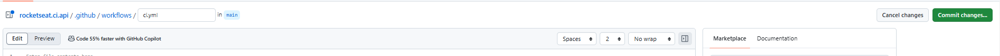
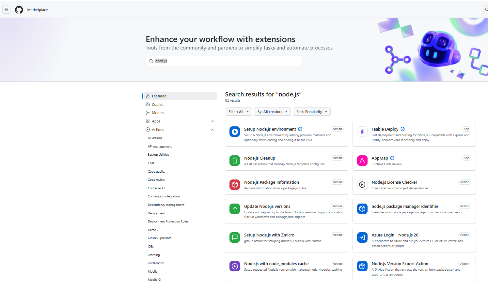
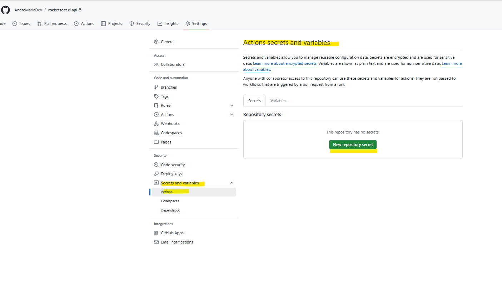

# CI/CD

## Entrega de Valor

Sem CI/CD 
* Time de desenvolvimento desenvolvem 
* Time de infra disponibiliza (ação manual)
* Correções mais demoradas 
* Ciclos de feedback maiores

## Entrega Contínua de Valor

* Rápido as interações 
* Um círculo menor de feedback
* Visualidade 
* Automação de todo o fluxo


### CI (Continuous Integration)
O que é?
* Mesclagem regular de código no repositório Central 
* Refere-se ao estágio de construção 
* Necessário que o time tenha a cultura de integração

Qual Problema Resolve?

* Impossibilita a demora na integração do código 
* Permite feedbacks técnicos mais rápidos 
* Visibilidade

Como Funciona?

* Validações em tempo de Pull Request (builds e testes).
* A partir de um código integrado na branch main 
* Inicia-se todo o processo de construção 
* Instalação de dependências, builds e testes

### CD (Continuous Delivery)

O que é?

* Colocar tudo em produção e/ou homologação (disponibilizar o que foi feito no CI em um ambiente)
* Continuação da CI
* Código pode ser liberado gradualmente (exemplo liberar uma feature de forma gradual, 10% to tráfico para um nicho de clientes específico )

Qual Problema Resolve?

* Permite a entrega de valor de forma automatizada
* Garante facilidade em possíveis fluxos de Roll back
* Visibilidade

Como Funciona?

* Depois do fluxo de CI
* Inicia-se todo o processo de publicação
* Publicação homologação e/ou produção


# CI/CD - Ferramentas (Pipeline)

* Jenkins
* CircleCI
* AzureDevOps !
* Gitlab CI !
* GitActions !

## CI/CD - GitActions (GitHubActions)

O que é?

* Ferramenta do github que possibilita a implementação do CI/CD
* É um orquestrador de workflow/job
* Um workflow pode ter várias ações
* Elimina a necessidade de integração com serviços externos
* Na conta free do gifthub conseguimos utilizar essa ferramenta, tendo 2.000 minutos por mês para utilizar.

### Componentes

* Workflow (Local onde é descrito todo o processo de automação)
* Actions (Tasks que contemplam o Workflow )
* Runners (responsável por rodar o Workflow)

## Configurando a primeira repositório

Aqui vamos utilizar o projeto que criamos na fase 2 utilizando o `DockerTutorial.md`

1. Criando repositório no GitHub 

https://github.com/AndreMariaDev/rocketseat.ci.api

2. GitHub Actions 

Quando navegamos no repositório do Git temos o menu de Abas principais neste menu temos o item relacionado ao Action.


Clicando no botão vamos para a página to actons :


Aqui Vamos clicar em `set up a workflow yourself`


Aqui vamos renomear o arquivo para ci.yml

Logo após vamos clicar no botão `Commit Changes`



Click novamente em `Commit Changes`


Logo após devemos rodar o comando no terminal `git pull` para obter o novo arquivo criado no site do github.


Podemos reparar que no visual Studio code foi criado um novo diretório githrubi/ workfroes contendo o arquivo contendo um novo arquivo


Agora vamos incluir o seguinte trecho de código:

```hcl
name: CI

jobs:
  build:
    name: 'Build and Push'
    runs-on: ubuntu-latest
```

Aqui temos :

* `name: CI`: Define o nome do workflow, que nesse caso é "CI" (Continuous Integration). Esse nome é usado para identificar o processo de CI no GitHub.

* `jobs:` Este é um agrupamento de tarefas (jobs) que o GitHub Actions executará como parte do workflow. Cada job contém uma sequência de etapas a serem realizadas.

* `build:` Este é o nome de um job específico dentro do workflow. Cada job é uma unidade independente que o GitHub executa. Aqui, o job é nomeado "build".

* `name: 'Build and Push':` Nomeia o job "Build and Push", descrevendo brevemente o que ele faz. Esse nome aparecerá na interface do GitHub Actions.

* `runs-on: ubuntu-latest:` Define o ambiente de execução para o job. Aqui, ele usará a máquina virtual mais recente com Ubuntu fornecida pelo GitHub (ubuntu-latest), que contém ferramentas comuns de desenvolvimento e compilação.

Agora vamos implementar o `steps`.

`steps:` Este é o agrupamento das etapas (steps) que o job "build" executará. Cada etapa é uma ação específica.

O primeiro item que vamos declara no steps é `acesso ao código`. É necessário a declaração do `Checkout` que referencia a branch.

O `Checkout` é necessário porque ele baixa o código do repositório Git para a máquina virtual onde o workflow está sendo executado. Sem essa etapa, o workflow não teria acesso aos arquivos do repositório, o que impede a execução de ações que dependem do código.

Para configuramos o `Checkout` vamos consultar o site : https://github.com/marketplace?type=actions


Vamos clicar em `Checkout : https://github.com/marketplace/actions/checkout


Logo após vamos copiar o trecho `- uses: actions/checkout@v4` e add no script 

```hcl
name: CI

jobs:
  build:
    name: 'Build and Push'
    runs-on: ubuntu-latest

    steps:
      - uses: actions/checkout@v4
```

Assim temos : 

* `- uses: actions/checkout@v4:` Essa linha define uma etapa que utiliza a ação actions/checkout na versão v4. O actions/checkout é uma ação oficial do GitHub que faz o "checkout" do repositório, ou seja, baixa o código-fonte do repositório para a máquina virtual de execução (no caso, o Ubuntu). Isso é necessário para que as próximas etapas do workflow possam acessar o código.


Agora podemos realizar um commit na branch main.

``
`git add .`
`git commit -m "new: add first configuration for actions"`
`git push`


Após executar o commit vamos consultar o repositório no github. No site vamos navegar até a aba Action.


Vimos que ao executar a ação foi gerado um log de erro :


Por que?

O erro "No event triggers defined in 'on'" ocorre porque o workflow YAML está sem uma seção on, que define os eventos que devem disparar o workflow.

A seção on é essencial para que o GitHub saiba em quais condições ele deve executar o workflow. 

Por exemplo, você pode configurar o workflow para ser disparado quando houver um push, pull_request, ou outro evento específico.

Logo vamos modificar o arquivo `.github\workflows\ci.yml` com o seguinte trecho.
 
```hcl
name: CI

on:
  push:
    branches:
      - main
      

jobs:
  build:
    name: 'Build and Push'
    runs-on: ubuntu-latest

    steps:
      - uses: actions/checkout@v4
```

Agora podemos realizar um commit na branch main.

``
`git add .`
`git commit -m "new: add configure trigger pipeline"`
`git push`


Agora vamos avançar em nosso script incluindo as configurações refrenetes a linguagem que nossa api foi desenvolvida.

Para isso vamos consultar novamente o site https://github.com/marketplace

Vamos pesquisar por `https://github.com/marketplace`




Logo vamos modificar o arquivo `.github\workflows\ci.yml` com o seguinte trecho.
 
```hcl
name: CI

on:
  push:
    branches:
      - main


jobs:
  build:
    name: 'Build and Push'
    runs-on: ubuntu-latest

    steps:
      - uses: actions/checkout@v4

      - name: Setup node
        uses: actions/setup-node@v4
```

O que acontece na etapa "Setup node"?

* name: Setup node: Esta linha dá um nome para a etapa dentro do job. O nome "Setup node" descreve que essa etapa será responsável por configurar o Node.js no ambiente do workflow.

* uses: actions/setup-node@v4:
        uses: O comando uses indica que estamos utilizando uma ação já existente no GitHub Actions.
        actions/setup-node: Especifica que estamos utilizando a ação oficial setup-node, que é usada para configurar o Node.js no ambiente de execução. Ela instala uma versão do Node.js, configura o gerenciador de pacotes npm (ou yarn), e prepara o ambiente para rodar tarefas específicas relacionadas ao Node.js.
        @v4: Indica que estamos utilizando a versão 4 da ação setup-node.

O que a ação setup-node faz?

A ação setup-node prepara o ambiente de execução do GitHub Actions para usar o Node.js. Ela pode realizar as seguintes funções, dependendo de como é configurada:

* Instalar o Node.js: Instala a versão especificada do Node.js (por padrão, a última versão estável, mas você pode especificar versões específicas).
    Configuração do npm ou yarn: Se o Node.js estiver sendo instalado, a ação também configura o npm (ou yarn) para gerenciamento de pacotes.
    Cache de dependências: A ação pode ajudar a configurar o cache de dependências (como pacotes npm), o que melhora o desempenho ao evitar a necessidade de baixar as dependências toda vez que o workflow rodar.


Mas vamos utilizar a abordagem de `Matrix Testing` do Setup Node.js Environment.
https://github.com/marketplace/actions/setup-node-js-environment

```hcl

name: CI

on:
  push:
    branches:
      - main


jobs:
  build:
    name: 'Build and Push'
    runs-on: ubuntu-latest
    strategy:
      matrix:
        node: [ 18, 20 ]
    steps:
      - uses: actions/checkout@v4

      - name: Setup node | ${{ matrix.node }}
        uses: actions/setup-node@v4
        with:
          node-version: ${{ matrix.node }}
      - run: npm ci
      - run: npm test

```


* `strategy`:

    Define uma estratégia de matriz (matrix) para o job.
    matrix permite rodar o job em diferentes variações de configuração, neste caso:
        node: [18, 20]: O job será executado duas vezes, uma para cada versão de Node.js especificada (18 e 20).

Essa abordagem ajuda a garantir que o código funcione corretamente em ambas as versões do Node.js.

* `- name: Setup node | ${{ matrix.node }}`:

    Configura o Node.js para a versão especificada no matrix.

    `${{ matrix.node }}`: Esse valor é uma variável que representa a versão do Node.js que está sendo usada no momento (18 ou 20). 
    Isso permite que o GitHub Actions rode o job com cada versão listada na matriz.

    `uses: actions/setup-node@v4`: Configura o Node.js usando a ação oficial setup-node.

    `with: node-version: ${{ matrix.node }}`: Define a versão do Node.js a ser usada de acordo com a versão especificada na matriz.

* `- run: npm ci`:

    Executa o comando npm ci, que instala as dependências do projeto. Esse comando é preferido em CI/CD porque instala as dependências de forma rápida e confiável, usando o package-lock.json.

* `- run: npm test`:

    Executa os testes do projeto usando npm test. Este comando roda os testes definidos no package.json para garantir que o código está funcionando conforme esperado.


Agora podemos realizar um commit na branch main.


`git add .`

`git commit -m "new: add configure matrix strategy"`

`git push`


## Container Registry

É necessário criar uma conta no  https://hub.docker.com/explore


No `CI.yaml` nós vamos basicamente adicionar um `Step`, vamos chamar step de `build docker image` e vamos adicionar o comando  `run` sem uma action.
A máquina Ubuntu já possui o docker pré-instalado. Desta forma vamos editar o arquivo `CI.yaml`.

```hcl

name: CI

on:
  push:
    branches:
      - main


jobs:
  build:
    name: 'Build and Push'
    runs-on: ubuntu-latest
    strategy:
      matrix:
        node: [ 18, 20 ]
    steps:
      - uses: actions/checkout@v4

      - name: Setup node | ${{ matrix.node }}
        uses: actions/setup-node@v4
        with:
          node-version: ${{ matrix.node }}
      - run: npm ci
      - run: npm test

      - name: Generate tag
        id: generate_tag
        run: |
          SHA=$(echo $GITHUB_SHA | head -c7)
          echo "sha=$SHA" >> $GITHUB_OUTPUT

      - name: Build docker image
        run: docker build -t rocketseat-ci-api:${{ steps.generate_tag.outputs.sha }} .
```

Explicando : 
- name: Generate tag:

    `Nome da etapa`: "Generate tag". Esta etapa cria uma tag curta baseada no hash de confirmação (SHA) do commit atual.
    
    `id`: generate_tag: Define um identificador para a etapa, permitindo que suas saídas sejam usadas em outras etapas.
    
    run::
        
    `SHA=$(echo $GITHUB_SHA | head -c7)`: Extrai os primeiros 7 caracteres do hash do commit `(GITHUB_SHA)`, que é uma variável de ambiente do GitHub Actions.
    
    `echo "sha=$SHA" >> $GITHUB_OUTPUT`: Armazena o valor da variável SHA no GITHUB_OUTPUT, para que possa ser referenciada em etapas posteriores.

- name: Build docker image:

    `Nome da etapa`: "Build docker image". Esta etapa constrói uma imagem Docker.
    
    `run: docker build -t rocketseat-ci-api:${{ steps.generate_tag.outputs.sha }} .` :  docker build: Constrói a imagem Docker.

    `-t rocketseat-ci-api:${{ steps.generate_tag.outputs.sha }}` : Define a tag da imagem com o nome rocketseat-ci-api seguido pela tag gerada com a saída da etapa anterior (os primeiros 7 caracteres do hash).
    
    `.` : Indica que o Dockerfile está no diretório raiz do projeto.


Agora podemos realizar um commit na branch main.


`git add .`

`git commit -m "new: configure commit tag"`

`git push`


Agora vamos enviar a imagem criad para o Docker Hub.


No Git Hub Marketplace vamos pesquisar por `docker login`
https://github.com/marketplace?query=docker+login


No `CI.yaml` nós vamos basicamente adicionar um `Step`, vamos chamar step de `Login into the container registry` e vamos adicionar o comando  `uses` 

```hcl

name: CI

on:
  push:
    branches:
      - main


jobs:
  build:
    name: 'Build and Push'
    runs-on: ubuntu-latest
    strategy:
      matrix:
        node: [ 18, 20 ]
    steps:
      - uses: actions/checkout@v4

      - name: Setup node | ${{ matrix.node }}
        uses: actions/setup-node@v4
        with:
          node-version: ${{ matrix.node }}
      - run: npm ci
      - run: npm test

      - name: Generate tag
        id: generate_tag
        run: |
          SHA=$(echo $GITHUB_SHA | head -c7)
          echo "sha=$SHA" >> $GITHUB_OUTPUT

      - name: Login into the container registry
        uses: docker/login-action@v3
        with:
          username: ${{ vars.DOCKERHUB_USERNAME }}
          password: ${{ secrets.DOCKERHUB_TOKEN }}

      - name: Build docker image
        run: docker build -t andremariadevops/rocketseat-ci-api:${{ steps.generate_tag.outputs.sha }} .

      - name: Push image
        run: docker push andremariadevops/rocketseat-ci-api:${{ steps.generate_tag.outputs.sha }}
```


Esse trecho de `login` é construído dessa forma para garantir que o GitHub Actions possa fazer login com segurança em um registro de contêiner (por exemplo, o Docker Hub) antes de executar comandos que exigem autenticação, como docker push. Vamos detalhar a construção de cada parte:
Explicação por partes

  `- name: Login into the container registry`
      É uma descrição do passo no job do GitHub Actions. Ajuda a identificar a etapa específica quando você visualiza os logs da execução.

  `uses: docker/login-action@v3`
      Especifica a ação do GitHub Actions que será usada. Neste caso, a ação docker/login-action na versão v3 é uma ação oficial da comunidade que facilita o login em registros de contêineres. Essa ação encapsula o processo de execução de docker login, tornando-o mais simples e seguro.

  `with:`
      Define os parâmetros que serão passados para a ação docker/login-action.

  `username: ${{ vars.DOCKERHUB_USERNAME }}`
      username é o nome de usuário do Docker Hub que será usado para fazer login. vars.DOCKERHUB_USERNAME é uma variável de ambiente definida nas configurações do repositório, que contém o nome de usuário. Usar ${{ }} permite que o GitHub Actions acesse essa variável dinamicamente.

  `password: ${{ secrets.DOCKERHUB_TOKEN }}`
      password é a senha ou token de acesso que será usado para autenticar o usuário. secrets.DOCKERHUB_TOKEN é um segredo armazenado com segurança no GitHub, que contém o token de acesso do Docker Hub. O uso de secrets é fundamental para proteger informações sensíveis, como senhas e tokens, garantindo que elas não fiquem expostas no código ou em logs.

No trecho `run: docker build -t andremariadevops/rocketseat-ci-api:${{ steps.generate_tag.outputs.sha }} .` temos `andremariadevops/` por que ?

No trecho `docker build -t andremariadevops/rocketseat-ci-api:${{ steps.generate_tag.outputs.sha }} .`, o andremariadevops é o nome do `namespace` ou `username` da sua conta no Docker Hub ou em um registro de contêiner. 

Ele é necessário para garantir que a imagem seja criada com uma tag específica que inclua a referência de quem a está publicando.


Para configurar o username e o password usados no GitHub Actions, você precisa definir as variáveis e segredos no repositório do GitHub. Aqui está como você pode fazer isso:
1. vars.DOCKERHUB_USERNAME

    vars se refere a variáveis de ambiente definidas no GitHub Actions. Você pode configurá-las diretamente no arquivo workflow ou por meio da interface do GitHub.

Configuração via Interface do GitHub:

    Vá até o repositório no GitHub.
    Clique em Settings (Configurações).
    No menu à esquerda, selecione Secrets and variables > Actions.
    Clique em New repository variable.
    Dê o nome DOCKERHUB_USERNAME e coloque o valor com seu nome de usuário do Docker Hub.
    Salve a variável.




2. secrets.DOCKERHUB_TOKEN

    secrets se refere a segredos que são armazenados de forma segura no GitHub e são usados para manter informações sensíveis, como tokens e senhas.

Configuração de Segredos:

    Vá até o repositório no GitHub.
    Clique em Settings (Configurações).
    No menu à esquerda, selecione Secrets and variables > Actions > Secrets.
    Clique em New repository secret.
    Dê o nome DOCKERHUB_TOKEN e cole o token de acesso ao Docker Hub. Esse token pode ser gerado nas configurações da sua conta no Docker Hub:
        Vá para sua conta no Docker Hub.
        Clique em Account Settings (Configurações da Conta).
        Vá até Security (Segurança) e crie um Access Token.
    Salve o segredo.


Resumo

    DOCKERHUB_USERNAME é configurado como uma variável no repositório.
    DOCKERHUB_TOKEN é configurado como um segredo seguro para proteger suas credenciais.


Agora podemos realizar um commit na branch main.


`git add .`

`git commit -m "new: configure push image"`

`git push`


Agora vamos para as boas praticas :

vamos consultar https://github.com/marketplace/actions/build-and-push-docker-images


Agora vamos altera o código:

```hcl


name: CI

on:
  push:
    branches:
      - main


jobs:
  build:
    name: 'Build and Push'
    runs-on: ubuntu-latest
    # strategy:
    #   matrix:
    #     node: [ 18, 20 ]
    steps:
      - uses: actions/checkout@v4

      # - name: Setup node | ${{ matrix.node }}
      - name: Setup node
        uses: actions/setup-node@v4
        with:
          # node-version: ${{ matrix.node }}
          node-version: 18
      - run: npm ci
      - run: npm test

      - name: Generate tag
        id: generate_tag
        run: |
          SHA=$(echo $GITHUB_SHA | head -c7)
          echo "sha=$SHA" >> $GITHUB_OUTPUT

      - name: Login into the container registry
        uses: docker/login-action@v3
        with:
          username: ${{ secrets.DOCKERHUB_USERNAME }}
          password: ${{ secrets.DOCKERHUB_TOKEN }}

      - name: Build and Push
        uses: docker/build-push-action@v6
        with:
          push: true
          tags: andremariadevops/rocketseat-ci-api:${{ steps.generate_tag.outputs.sha }},andremariadevops/rocketseat-ci-api:latest
      # - name: Build docker image
      #   run: docker build -t andremariadevops/rocketseat-ci-api:${{ steps.generate_tag.outputs.sha }} .

      # - name: Push image
      #   run: docker push andremariadevops/rocketseat-ci-api:${{ steps.generate_tag.outputs.sha }}

```

Agora podemos realizar um commit na branch main.

`git add .`

`git commit -m "new: configure commit tag"`

`git push`


