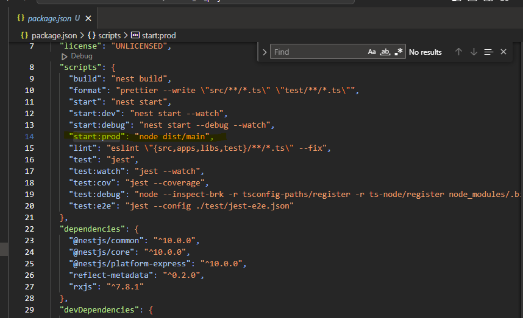

# Base para Criar um Dockerfile

Inicialmente, usamos os comandos básicos para rodar a aplicação no ambiente local.

1. `node install` (necessário caso a máquina não possua o Node)
2. Comando: `npm install`
3. Comando: `npm run build`
4. Comando: `npm run start`

No `Dockerfile`, temos uma ideia parecida, porém com alguns passos adicionais necessários para a criação do contêiner.

## Passos para Criar o Dockerfile

1. **Iniciamos com `FROM`**

    **ATENÇÃO**: Antes de selecionar uma imagem para indicar no `FROM`, é importante analisar pontos como:
    - Vulnerabilidade da versão selecionada
    - Número de pacotes contidos na versão
    - Tamanho da imagem

    ```dockerfile
    FROM node:18.20.4
    ```

2. **Indicamos o local de execução**

    ```dockerfile
    WORKDIR /usr/src/app
    ```

    - `/usr` é um diretório existente no Linux
    - `src/app` será criado no momento do build do `Dockerfile`

3. **Copiamos os arquivos para o contêiner**

    A indicação de arquivos está contida nas dependências do Node no arquivo `package.json` da aplicação.

    ```dockerfile
    COPY package.json ./
    ```

    **ATENÇÃO**: O comando `COPY` possui dois itens: DE e PARA. O caminho `./` é relativo ao `WORKDIR`.

4. **Executamos o comando de instalação das dependências**

    ```dockerfile
    RUN npm install
    ```

5. **Copiamos os arquivos da aplicação**

    ```dockerfile
    COPY . .
    ```

6. **Construímos a aplicação no contêiner**

    ```dockerfile
    RUN npm run build
    ```

    **ATENÇÃO**: É necessário expor uma porta para a aplicação. Nesse caso, usaremos a porta indicada no arquivo `src/main.ts`.

7. **Rodamos a aplicação**

    ```dockerfile
    CMD ["npm", "run", "start"]
    ```

## Modelo Completo

```dockerfile
FROM node:18.20.4

WORKDIR /usr/src/app

COPY package.json ./

RUN npm install

COPY . .

RUN npm run build

EXPOSE 3000

CMD ["npm", "run", "start"]
```


**No terminal vamos executar o seguinte comando docker**
```
docker build -t api-rocket .
```


**Para analisar a criação da imagem podemos rodar o comando docker image ls api-rocket**

**Como resultado temos :**

```
	REPOSITORY   TAG       IMAGE ID       CREATED              SIZE
	api-rocket   latest    2220e9ec6f3c   About a minute ago   747MB
```

**Devemos destacar que o campo SIZE será um ponto focal no futuro.**

**Rodando um container para a image:**
	```docker run --name api-rocket-container -p 3001:3000 -d api-rocket```

**Filtrando pelo nome do container:**
	```docker ps --filter name=api-rocket-container```
	**ou**
	```docker ps -a --filter name=api-rocket-container```

# Redes

## Criando uma rede:


**No terminal vamos executar o seguinte comando docker**
	```docker network create api-rocket-network```

**Conectando o container a rede:**

**Primeiro consultamos a lista de network**
```
	PS C:\Users\Andre Maria\Documents\Estudo\DevOps RecketSeat\nome_do_projeto> docker network ls

		NETWORK ID     NAME                                                DRIVER    SCOPE
		ff1bdac1e028   api-rocket-network                                  bridge    local
		7ed050a9f3a2   bridge                                              bridge    local
		105897f0844a   harpooncorp_harpoon-ext-desktop-extension_default   bridge    local
		5f21c6d263c3   host                                                host      local
		359c97620248   kubernetes.diveinto.io                              bridge    local
		62eb9c576c46   none                                                null      local
```
**Logo após consultamos a lista containers**

```
	PS C:\Users\Andre Maria\Documents\Estudo\DevOps RecketSeat\nome_do_projeto> docker ps --filter name=api-rocket-container

		CONTAINER ID   IMAGE        COMMAND                  CREATED         STATUS         PORTS                    NAMES
		54dc76d6c9d0   api-rocket   "docker-entrypoint.s…"   7 minutes ago   Up 5 minutes   0.0.0.0:3001->3000/tcp   api-rocket-container
```

**Para criar a conexão devemos passar o nome da rede e o nome do container**

```docker network connect api-rocket-network api-rocket-container```

**Vefificando se a rede está contendo o container**
	
```docker network inspect api-rocket-network```
	
## Criando um container com uma rede existente

**No terminal vamos executar o seguinte comando docker**
```docker run --network=api-rocket-network --name api-rocket-container -p 3001:3000 -d api-rocket```
	
	
## Acessando e manipular o conteudo do container

**Primeiro consultamos a lista containers**

```PS C:\Users\Andre Maria\Documents\Estudo\DevOps RecketSeat\nome_do_projeto> docker ps --filter name=api-rocket-container

	CONTAINER ID   IMAGE        COMMAND                  CREATED         STATUS         PORTS                    NAMES
	54dc76d6c9d0   api-rocket   "docker-entrypoint.s…"   7 minutes ago   Up 5 minutes   0.0.0.0:3001->3000/tcp   api-rocket-container
```
	
**Logo após selecionamos o container desejado e digitamos o seguinte código:**
	
```docker exec -it api-rocket-container bash```
	
<span style="color:red">***É importante destacar que a palavra chave bash só funciona para imagens que contem sub imagens debian!***</span>

<span style="color:green">***Para imagens do tipo alpine utilizamos o sh !***</span>

```docker exec -it api-rocket-container sh```

**Desta forma podemos verificar o conteudo do nosso container**
	
```
	PS C:\Users\Andre Maria\Documents\Estudo\DevOps RecketSeat\nome_do_projeto> docker exec -it api-rocket-container bash
	root@df616aec09e7:/usr/src/app# ls

	Dockerfile  dist          nest-cli.json  package-lock.json  src   tsconfig.build.json
	README.md   dockerignore  node_modules   package.json       test  tsconfig.json
```
	
**Para testar a manipulação vamos criar um arquivo log dentro da pasta src, para isso digitamos o seguinte código:**
	
```root@df616aec09e7:/usr/src/app# touch src/file.log```
	
**Podemos verificar a criação digitamos o seguinte código:**
	
```
	root@df616aec09e7:/usr/src/app# ls src
	app.controller.spec.ts  app.controller.ts  app.module.ts  app.service.ts  file.log  main.ts
```
	
**Agora vamos adicionar um text no arquivo file.log para isso digitamos o seguinte código:**
	
```
	root@df616aec09e7:/usr/src/app# echo "insert data in file log for teste" > src/file.log
```
	
**Podemos verificar o conteudo do arquivo file.log para isso digitamos o seguinte código:**

```
	root@df616aec09e7:/usr/src/app# cat src/file.log
	insert data in file log for teste
```
	
**Para sair do container digitamos o seguinte código:**
	
```
	root@df616aec09e7:/usr/src/app# exit
	exit

	What's next:
		Try Docker Debug for seamless, persistent debugging tools in any container or image → docker debug api-rocket-container
		Learn more at https://docs.docker.com/go/debug-cli/
```
	
### Abaixo temos 30 comandos do Linux frequentemente usados por iniciantes em DevOps:**


1.	`ls`: Lista arquivos e diretórios.
2.	`cd`: Navega entre diretórios.
3.	`pwd`: Exibe o diretório atual.
4.	`mkdir`: Cria um novo diretório.
5.	`rm`: Remove arquivos e diretórios.
6.	`cp`: Copia arquivos e diretórios.
7.	`mv`: Move ou renomeia arquivos e diretórios.
8.	`touch`: Cria um novo arquivo vazio.
9.	`cat`: Exibe o conteúdo de um arquivo.
10.	`less`: Exibe o conteúdo de um arquivo página por página.
11.	`grep`: Pesquisa um padrão específico em arquivos ou saídas de comandos.
12.	`chmod`: Altera as permissões de arquivos e diretórios.
13.	`chown`: Altera o proprietário de arquivos e diretórios.
14.	`ps`: Lista os processos em execução.
15.	`top`: Exibe informações em tempo real sobre os processos em execução.
16.	`kill`: Encerra um processo em execução.
17.	`tar`: Cria ou extrai arquivos compactados no formato .tar.
18.	`gzip`: Compacta arquivos.
19.	`unzip`: Extrai arquivos compactados.
20.	`df`: Exibe informações sobre o uso de disco.
21.	`du`: Exibe o espaço em disco usado por arquivos e diretórios.
22.	`ifconfig`: Exibe informações sobre interfaces de rede.
23.	`ping`: Verifica a conectividade de rede com um host específico.
24.	`ssh`: Conecta-se a um servidor remoto via SSH.
25.	`scp`: Copia arquivos entre o sistema local e um servidor remoto via SSH.
26.	`wget`: Baixa arquivos da web.
27.	`curl`: Faz solicitações HTTP e exibe o resultado.
28.	`crontab`: Gerencia tarefas agendadas.
29.	`systemctl`: Controla serviços do sistema.
30.	`history`: Exibe o histórico de comandos executados.

# Volumes

**Podemos considerar um volume como um diretório externo** 
	
**Para criar um volume digitamos o seguinte código:**
	
```docker volume create api-rocket-volume```
	
**Para validarmos digitamos o seguinte código:**
	
```docker volume inspect api-rocket-volume```
	
**Temos como resultado:**
```
[
	{
		"CreatedAt": "2024-10-19T20:25:15Z",
		"Driver": "local",
		"Labels": null,
		"Mountpoint": "/var/lib/docker/volumes/api-rocket-volume/_data",
		"Name": "api-rocket-volume",
		"Options": null,
		"Scope": "local"
	}
]
```
### PODEMOS VERIFICAR QUE O VOLUME CRIADO NÃO TEM RELAÇÃO COMO NENHUM CONTAINER.
		
## Associando um volume a um container
	
Primeito passo temos associal o caminha dos diretórios que queremos associar ao Volume.
Para isso vamos analisar o nosso arquivo Dockerfile, especificamente no trecho referente ao WORKDIR.
No `WORKDIR` temos um caminho especificado `"WORKDIR /usr/src/app"` o path `"/usr/src/app"` será para onde o Volume será apontado.
Desta forma para realizar a associação vamos digitar o seguinte código:
```	
		docker stop api-rocket-container
		docker rm api-rocket-container
		docker run --volume api-rocket-volume:/usr/src/app --network=api-rocket-network --name api-rocket-container -p 3001:3000 -d api-rocket
		
		docker inspect api-rocket-volume
```	
	
**Criação e persistência de um arquivo no volume.**
	
**Vamos manipular o arquivo file.log contido no container api-rocket-container. Para isso digitamos o seguinte código:**
```	
	PS C:\Users\Andre Maria\Documents\Estudo\DevOps RecketSeat\nome_do_projeto> docker exec -it api-rocket-container bash
```	
**Para testar a manipulação vamos criar um arquivo log dentro da pasta src, para isso digitamos o seguinte código:**
```	
		root@dd662164a458:/usr/src/app# touch src/file.log
```	
**Podemos verificar a criação digitamos o seguinte código:**
```	
	root@dd662164a458:/usr/src/app# ls src
	app.controller.spec.ts  app.controller.ts  app.module.ts  app.service.ts  file.log  main.ts
```		
**Agora vamos adicionar um text no arquivo file.log para isso digitamos o seguinte código:**
```	
	root@dd662164a458:/usr/src/app# echo "insert data by api-rocket-container" > src/file.log
```		
**Podemos verificar o conteudo do arquivo file.log para isso digitamos o seguinte código:**
```	
	root@dd662164a458:/usr/src/app#  cat src/file.log
	insert data by api-rocket-container	
```	
**Para sair do container digitamos o seguinte código:**
```	
	root@dd662164a458:/usr/src/app# exit
```	
**Agora vamos criar um novo container apontando para o mesmo volume. Para isso digitamos o seguinte código:**
```		
	PS C:\Users\Andre Maria\Documents\Estudo\DevOps RecketSeat\nome_do_projeto> docker run --volume api-rocket-volume:/usr/src/app --network=api-rocket-network --name api-rocket-container-other -p 3002:3000 -d api-rocket
	6ded198db4cf7a5f70c56973ff95729ca6d88f321bc49c56d1252ff6a6ab6e2a
```	
**Vamos manipular o arquivo file.log contido no volume api-rocket-volume. Para isso digitamos o seguinte código:**
```	
	PS C:\Users\Andre Maria\Documents\Estudo\DevOps RecketSeat\nome_do_projeto> docker exec -it api-rocket-container-other bash
```	
**Aqui vamos verificar se o container tambem acessa o arqui file.log contido no volume.**
```	
	root@6ded198db4cf:/usr/src/app# ls src
	app.controller.spec.ts  app.controller.ts  app.module.ts  app.service.ts  file.log  main.ts
```		
**Agora vamos adicionar um text no arquivo file.log para isso digitamos o seguinte código:**
```	
	root@6ded198db4cf:/usr/src/app# echo "insert data by api-rocket-container-other" >> src/file.log
```	
**Podemos verificar o conteudo do arquivo file.log para isso digitamos o seguinte código:**
```	
	root@6ded198db4cf:/usr/src/app# cat src/file.log
	insert data by api-rocket-container
	insert data by api-rocket-container-other
```	
**Para sair do container digitamos o seguinte código:**
```	
	root@6ded198db4cf:/usr/src/app# exit
```	
### Desta forma podemos comprovar que o volume e persistente.

# Otimização

### Otimizando size da imagem

Quando selecionamos o versão da imagem que utilizamos no trecho da palavra chave `FROM` temos o seguinte ponto:

    ```dockerfile
    FROM node:18.20.4
    ```
**ATENÇÃO**: É importante analisar pontos como:
- Vulnerabilidade da versão selecionada
- Número de pacotes contidos na versão
- Tamanho da imagem

Ao consultarmos o site do **DockerHub** temos os seguintes dados referentes a versão 18.20.4


Podemos ver que:

- Vulnerabilidade da versão selecionada <span style="color:red">**(107)**</span>
- Número de pacotes contidos na versão <span style="color:red">**(747)**</span>
- Tamanho da imagem <span style="color:red">**(5)**</span>

Quando analizamos o size da imagem podemos ver que o valor pode ser otimizado. Por que?

Porque quando criamos um container a responsabilidade daquele container é <span style="color:green">**EXECUTAR O BINÁRIO DA APLICAÇÃO!**</span> Qualquer coisa além <span style="color:red">**NÃO DEVE SER RESPONSABILIDADE DO CONTAINER!**</span>


**Exemplo** : Comandos como basilares do Linux <span style="color:red">**[ls, cat, touch ...]**</span> não devem exister no bash! Porque  a responsabilidade do container é rodar aplicação e não haver a necessidade de algo alem do eco-sistema da própria tecnologia.

Para solucionar esse problema surge uma versão mais enxuta, o <span style="color:green">**ALPINE!**</span>

Agora vamos consultarmos o site do **DockerHub** e procurar pela versão alpine. Temos os seguintes dados: 


Em resumo, a versão `node:18-alpine3.19` é geralmente preferida para ambientes de produção onde um contêiner mais leve e eficiente é desejável.

### Alterando o Dockerfile

1. **Iniciamos com `FROM`**

Vamos alterar De :

```dockerfile
FROM node:18.20.4
```
Para:

```dockerfile
FROM node:18-alpine3.19
```

## Modelo Completo

```dockerfile
FROM node:18-alpine3.19

WORKDIR /usr/src/app

COPY package.json ./

RUN npm install

COPY . .

RUN npm run build

EXPOSE 3000

CMD ["npm", "run", "start"]
```


2. **No terminal vamos executar o seguinte comando docker**
```
docker build -t api-rocket:v2 .
```

3. Após a execução podemos rodar o comando `ls` para verificarmos o size da no imagem

```
docker image ls api-rocket
```

```
REPOSITORY   TAG       IMAGE ID       CREATED             SIZE
api-rocket   v2        52c869bbceb4   About a minuteago   452MB
api-rocket   v1        fc0a2fce8d42   2 days ago          516MB
```

### Multi-stage builds

Com multi-stage builds, você usa várias instruções `FROM` no seu Dockerfile. Cada instrução `FROM` pode usar uma base diferente, e cada uma delas inicia um novo estágio do build. Você pode copiar seletivamente artefatos de um estágio para outro, deixando para trás tudo o que não quer na imagem final.

Exemplos:
* Necessidade de instalar um package especifico para conclusão do build.

* Ter uma imagem de produção com itens que não estão na responsabilidade de execução mas estão na responsabilidade de Build.


Em outras palavars, **Um package que não faz parte do ciclo de vida de excução da aplicação deve estar apenas no step de build**


Analisando o Dockerfile podemos ver que o nosso arquivo possui duas fases  

```dockerfile
# begin build
FROM node:18-alpine3.19

WORKDIR /usr/src/app

COPY package.json ./

RUN npm install

COPY . .

RUN npm run build
#end build

#begin excution
EXPOSE 3000

CMD ["npm", "run", "start"]
#end excution
```

Para implementarmos a ideia de Multi-stage no nosso arquivo vamos realizar os seguintes passos:

1. Incluir um alies na instrução `FROM` :

	Vamos alterar De :

	```dockerfile
	FROM node:18-alpine3.19
	```
	Para:

	```dockerfile
	FROM node:18-alpine3.19 AS build
	```
2. Vamos incluir uma nova instrução `FROM` semelhante a da fase de build após do contentário `#begin excution` .

	```dockerfile
	FROM node:18-alpine3.19
	```
3. Vamos incluir uma nova instrução `WORKDIR` semelhante a da fase de build.

	```dockerfile
	WORKDIR /usr/src/app
	```

4. Vamos incluir uma nova instrução `COPY` para copiar o conteudo de um estágio para o outro, nesse ponto vamos copiar os diretórios dist e node_modules.

	```dockerfile
	COPY --from=build /usr/src/app/dist ./dist
	COPY --from=build /usr/src/app/node_modules ./node_modules
	```

## Modelo Completo

```dockerfile
# begin build
FROM node:18-alpine3.19 AS build

WORKDIR /usr/src/app

COPY package.json ./

RUN npm install

COPY . .

RUN npm run build
#end build

#begin excution
FROM node:18-alpine3.19

WORKDIR /usr/src/app

COPY --from=build /usr/src/app/dist ./dist
COPY --from=build /usr/src/app/node_modules ./node_modules

EXPOSE 3000

CMD ["npm", "run", "start"]
#end excution
```

Modificado o nosso arquivo vamos rodar no terminal o comando de build para a nossa nova imagem.

```docker build -t api-rocket:v3 .```

Após a execução podemos consultar as imagens e comparamos o size entre as versões:

vamos rodar no terminal: ```docker image ls api-rocket```

```
REPOSITORY   TAG       IMAGE ID       CREATED          SIZE
api-rocket   v3        a9c2a090246f   47 seconds ago   274MB
api-rocket   v2        52c869bbceb4   37 hours ago     452MB
api-rocket   v1        fc0a2fce8d42   2 days ago       516MB
```

## Removendo dev-dependences 
Em nosso estudo utilisamos como projeto base um api back-end Nodejs que utiliza o framework Nestjs.
A estrutura do projeto possui o arquivo package.json responsável por algumas configurações do mesmo.
Entre as configurações temos o node `devDependencies`.

No contexto de um projeto Node.js com o framework NestJS, devDependencies são dependências que são usadas apenas durante o desenvolvimento e não são necessárias para a execução em produção. Elas são especificadas no arquivo package.json na seção "devDependencies".
Utilidade das devDependencies

* Ferramentas de Desenvolvimento: Incluem bibliotecas e ferramentas que ajudam durante o desenvolvimento, como TypeScript (compilador para JavaScript tipado), ts-node (execução de código TypeScript no Node.js), linters (por exemplo, ESLint), e formatadores de código (por exemplo, Prettier).

* Testes: Ferramentas para testes, como Jest, Supertest ou outras bibliotecas de teste de unidade e integração, são comumente encontradas em devDependencies.

* Compilação e Transpilers: Bibliotecas que são usadas para compilar ou transpilação de código, como Babel ou o próprio compilador TypeScript.

* Ferramentas de Build: Ferramentas como Webpack, Nest CLI ou outras que auxiliam na construção do projeto.

Por que usar devDependencies?

* Desempenho em Produção: Dependências de desenvolvimento não são instaladas em ambientes de produção, o que reduz o tamanho da aplicação e melhora o tempo de inicialização.

* Manutenção e Segurança: Manter dependências separadas facilita a gestão do projeto e ajuda a evitar problemas de segurança, uma vez que pacotes desnecessários não são instalados em produção.


Visto que é necessário descartar os packages referentes ao `devDependencies` vamos realizar algumas alterações no Dockerfile.

Vamos adicionar uma nova instrução RUN, porém no trecho  `RUN npm install ` vamos remover o `install` e vamos incluir o texto  `ci --only=production`

OBS: 
**Para usar `npm ci` no modo de produção em um Dockerfile,é preciso incluir  `--only=production` no comando. Este sinalizador instala apenas as dependências necessárias para produção, excluindo dependências de desenvolvimento.**

Aqui está o exemplo de como ficará o Dockerfile:

```dockerfile
# begin build
FROM node:18-alpine3.19 AS build

WORKDIR /usr/src/app

COPY package.json ./

RUN npm install

COPY . .

RUN npm run build

RUN npm ci --only=production
#end build

#begin excution
FROM node:18-alpine3.19

WORKDIR /usr/src/app

COPY --from=build /usr/src/app/dist ./dist
COPY --from=build /usr/src/app/node_modules ./node_modules

EXPOSE 3000

CMD ["npm", "run", "start"]
#end excution

```

Após a execução podemos consultar as imagens e comparamos o size entre as versões:

vamos rodar no terminal: ```docker image ls api-rocket```

```
REPOSITORY   TAG       IMAGE ID       CREATED             SIZE
api-rocket   v4        ceb158fe877d   8 seconds ago       137MB
api-rocket   v3        a9c2a090246f   About an hour ago   274MB
api-rocket   v2        52c869bbceb4   39 hours ago        452MB
api-rocket   v1        fc0a2fce8d42   2 days ago          516MB

```

Agora vamos cria um novo container, para isso vamos rodar no terminal: 

`docker run --volume api-rocket-volume:/usr/src/app --network=api-rocket-network --name api-rocket-container-v4 -p 3004:3000 -d api-rocket:v4`

**Agora podemos verificar o conteudo do nosso container**

<span style="color:green">***ATENÇÂO!!!! Para imagens do tipo alpine utilizamos o sh !***</span>

```docker exec -it api-rocket-container-v4 sh```

```
/usr/src/app # ls
Dockerfile           dist                 nest-cli.json        package-lock.json    src                  tsconfig.build.json
README.md            dockerignore         node_modules         package.json         test                 tsconfig.json
/usr/src/app # ^C
```


### Command start:prod

No passo anterior vimos como foi possível otimizar o size do container. Também vimos que realizando o build apenas com os packages de PRD teremos uma mudança significativa. Porém é necessário realizarmos algumas mudanças no Dockerfile referentes ao ambiente de PRD.

Mas antes vamos analisar o arquivo `package.json` ...



Como podemos ver na imagem acima temos no node `script` os comandos de start relacionados a cada ambiente: 

1. "start:dev": "nest start --watch"
2. "start:debug": "nest start --debug --watch"
3. "start:prod": "node dist/main"

Como preparamos o nosso container para rodar em PRD devemos modificar o Dockerfile.

1. Vamos incluir uma nova instrução `COPY` para copiar o package.json.

	```dockerfile
	COPY --from=build /usr/src/app/package.json ./package.json
	```
2. Vamos adicionar o ambiente no item `start` da instrução `CMD`
	```dockerfile
	COPY --from=build /usr/src/app/package.json ./package.json
	```

Aqui está o exemplo de como ficará o Dockerfile:

```dockerfile
# begin build
FROM node:18-alpine3.19 AS build

WORKDIR /usr/src/app

COPY package.json ./

RUN npm install

COPY . .

RUN npm run build

RUN npm ci --only=production
#end build

#begin excution
FROM node:18-alpine3.19

WORKDIR /usr/src/app

COPY --from=build /usr/src/app/package.json ./package.json
COPY --from=build /usr/src/app/dist ./dist
COPY --from=build /usr/src/app/node_modules ./node_modules

EXPOSE 3000

CMD ["npm", "run", "start:prod"]
#end excution

```


vamos rodar no terminal:  `docker build -t api-rocket:prd .`


# Trabalhando com multiplos containers

Vamos imaginar um cenário onde a nossa aplicação back-end consome dados de um banco de dados MySQL que estará rodando em um contêiner Docker.
Para criarmos o banco vamos rodar o seguinte comando no termial: 

```
docker run -d -p 3306:3306 -e MYSQL_ROOT_PASSWORD=root -e MYSQL_DATABASE=rocketseat-db -e MYSQL_USER=admin -e MYSQL_PASSWORD=root --name mysql-container mysql:8
```

Vamos entender os itens do camando acima.

1. `-d` : Esta opção executa o contêiner em segundo plano (detached mode). Isso significa que o terminal não ficará preso ao contêiner, permitindo que você continue a usar o terminal para outros comandos.

2. `-p 3306:3306` : Esta opção mapeia a porta 3306 do contêiner (onde o MySQL está ouvindo) para a porta 3306 do host. Isso permite que você acesse o MySQL no contêiner a partir do seu sistema host, usando localhost:3306.

3. `-e MYSQL_ROOT_PASSWORD=root` : Define a variável de ambiente MYSQL_ROOT_PASSWORD dentro do contêiner, especificando a senha para o usuário root do MySQL. Essa variável é necessária para a inicialização do MySQL.

4. `-e MYSQL_DATABASE=rocketseat-db` : Define a variável de ambiente MYSQL_DATABASE, que cria um banco de dados chamado rocketseat-db na inicialização do MySQL.

5. `-e MYSQL_USER=admin` : Define a variável de ambiente MYSQL_USER, que cria um novo usuário chamado admin no MySQL. Este usuário será utilizado para acessar o banco de dados.

6. `-e MYSQL_PASSWORD=root` : Define a variável de ambiente MYSQL_PASSWORD, que especifica a senha para o usuário admin que foi criado anteriormente.

7. `--name mysql-container` : Este parâmetro atribui um nome específico ao contêiner que está sendo criado. Nesse caso, o contêiner será chamado de mysql-container. Isso facilita a referência ao contêiner em comandos futuros.

8. `mysql:8` : Especifica a imagem que será usada para criar o contêiner. Aqui, mysql:8 refere-se à versão 8 da imagem oficial do MySQL. Se a imagem não estiver disponível localmente, o Docker fará o download da imagem do repositório Docker Hub.

Uma outra maneira de implementar o comando é criar um Dockerfile para o mesmo:

Aqui está um exemplo de `Dockerfile` que poderia ser usado para criar uma imagem Docker com `MySQL` configurado conforme o seu comando:

```dockerfile
# Use a imagem oficial do MySQL como base
FROM mysql:8

# Defina as variáveis de ambiente
ENV MYSQL_ROOT_PASSWORD=root
ENV MYSQL_DATABASE=rocketseat-db
ENV MYSQL_USER=admin
ENV MYSQL_PASSWORD=root

# Exponha a porta padrão do MySQL
EXPOSE 3306

# O MySQL será iniciado automaticamente quando o contêiner for executado
```

Explicação de Cada Linha

`FROM mysql:8` : Esta linha especifica que estamos usando a imagem oficial do MySQL versão 8 como base para a nossa imagem.

`ENV MYSQL_ROOT_PASSWORD=root` : Define a variável de ambiente MYSQL_ROOT_PASSWORD, que é necessária para configurar a senha do usuário root do MySQL.

`ENV MYSQL_DATABASE=rocketseat-db` : Define a variável de ambiente MYSQL_DATABASE, que cria um banco de dados chamado rocketseat-db quando o contêiner é iniciado.

`ENV MYSQL_USER=admin` : Define a variável de ambiente MYSQL_USER, que cria um novo usuário chamado admin.

`ENV MYSQL_PASSWORD=root` : Define a variável de ambiente MYSQL_PASSWORD, que especifica a senha para o usuário admin.

`EXPOSE 3306` : Expondo a porta 3306, que é a porta padrão que o MySQL usa. Isso é informativo e ajuda a indicar que a aplicação escuta nesta porta, mas não mapeia a porta no host como faz o comando docker run.

## Construindo e Executando a Imagem

Depois de criar o `Dockerfile`, você pode construir a imagem com o seguinte comando.

```dockerfile
docker build -t api-rocket-db:v1 .
```

Em seguida, você pode executar um contêiner com a imagem que acabou de construir usando um comando `docker run` semelhante ao que você forneceu:

```dockerfile
docker run -d -p 3306:3306 --name mysql-container api-rocket-db:v1
```

## Observações

* Conexão de Rede: O docker run original conecta a porta do contêiner à porta do host, algo que você ainda precisa fazer quando iniciar o contêiner a partir da imagem construída.

* Persistência de Dados: Se você precisar garantir que os dados do MySQL sejam persistidos, você deve considerar usar volumes do Docker com a opção -v no comando docker run ou adicionar a configuração de volumes em um arquivo docker-compose.yml.


## Construindo e Consumindo o Banco de Dados
Agora que construimos o container do banco vamos preparar o back-end para consumir.

1.  Instalando Dependências

Instale as dependências necessárias para conectar ao MySQL:

```dockerfile
npm install @nestjs/typeorm typeorm mysql2
```

2. Configurando o TypeORM

Edite o arquivo app.module.ts para incluir a configuração do TypeORM Responsável pela conexão da api com o Banco:

```dockerfile
// src/app.module.ts
import { Module } from '@nestjs/common';
import { TypeOrmModule } from '@nestjs/typeorm';
import { UsersModule } from './users/users.module'; // Módulo de usuários que você criará
import { User } from './users/user.entity'; // Entidade que você criará

@Module({
  imports: [
    TypeOrmModule.forRoot({
      type: 'mysql',
      host: 'localhost', // ou o nome do contêiner se estiver usando Docker Compose
      port: 3306,
      username: 'admin',
      password: 'root',
      database: 'rocketseat_db',
      entities: [],
      synchronize: true, // Não usar em produção
    }),
  ],
})
export class AppModule {}
```

3. Rodando a Aplicação

	Execute sua aplicação NestJS:

```dockerfile
npm run start
```

Ao executar a aplicação temos :

```dockerfile
C:\Users\Andre Maria\Documents\Estudo\DevOps RecketSeat\nome_do_projeto>npm run start

> nome_do_projeto@0.0.1 start
> nest start

[Nest] 2824  - 22/10/2024, 09:12:29     LOG [NestFactory] Starting Nest application...
[Nest] 2824  - 22/10/2024, 09:12:29     LOG [InstanceLoader] TypeOrmModule dependencies initialized +154ms
[Nest] 2824  - 22/10/2024, 09:12:29     LOG [InstanceLoader] AppModule dependencies initialized +1ms
[Nest] 2824  - 22/10/2024, 09:12:29     LOG [InstanceLoader] TypeOrmCoreModule dependencies initialized +117ms
[Nest] 2824  - 22/10/2024, 09:12:29     LOG [RoutesResolver] AppController {/}: +6ms
[Nest] 2824  - 22/10/2024, 09:12:29     LOG [RouterExplorer] Mapped {/, GET} route +2ms
[Nest] 2824  - 22/10/2024, 09:12:29     LOG [NestApplication] Nest application successfully started +3ms
```

Podemos ver que o `TypeOrm` foi iniciado `TypeOrmModule dependencies initialized`

Analisando as configurações feitas no back-end podemos ver que `host` está configurado para p `'localhost'` mas por que?

Fora do Docker: 
* Se a aplicação `NestJS` estiver rodando fora de um contêiner Docker, ou em uma rede diferente, o nome do contêiner não será reconhecido como `hostname`. 
Nesse caso, você precisará usar o `IP` ou o `hostname`(`'localhost'`) do host real onde o `MySQL` está rodando.

Mas como seria o cenário se rodamos pelo container?

Para isso vamos alterar o trecho `host` de `'localhost'` para `mysql-container`, desta forma teremos:

```dockerfile
// src/app.module.ts
import { Module } from '@nestjs/common';
import { TypeOrmModule } from '@nestjs/typeorm';
import { UsersModule } from './users/users.module'; // Módulo de usuários que você criará
import { User } from './users/user.entity'; // Entidade que você criará

@Module({
  imports: [
    TypeOrmModule.forRoot({
      type: 'mysql',
      host: 'mysql-container', // ou o nome do contêiner se estiver usando Docker Compose
      port: 3306,
      username: 'admin',
      password: 'root',
      database: 'rocketseat_db',
      entities: [],
      synchronize: true, // Não usar em produção
    }),
  ],
})
export class AppModule {}
```
Por que `mysql-container` ?

Resolução de DNS Interna do Docker:
* O Docker fornece um serviço de `DNS` interno que permite que os contêineres se resolvam pelo nome. 
Quando você cria e nomeia um contêiner `(--name mysql-container)`, 
o Docker faz com que esse nome esteja disponível como um endereço de rede. 
Isso significa que você pode acessar o contêiner `MySQL` a partir de outros contêineres 
usando mysql-container como o hostname.

Feita a alteração vamos rodar o seguinte comando para atualizar a imagem do nosso back-end:

```dockerfile
docker build -t api-rocket:prd1 .
```

Apos a atualização da imagem vamos rodar o comando para o container:


```dockerfile
docker run --name api-rocket-container-prd1 -p 3001:3000 -d api-rocket:prd1
```
Agora se verificarmos os logs do container api-rocket-container-prd1 teremos:

```dockerfile
PS C:\Users\Andre Maria\Documents\Estudo\DevOps RecketSeat\nome_do_projeto> docker logs api-rocket-container-prd1

> nome_do_projeto@0.0.1 start:prod
> node dist/main

[Nest] 18  - 10/22/2024, 4:32:12 PM     LOG [NestFactory] Starting Nest application...
[Nest] 18  - 10/22/2024, 4:32:13 PM     LOG [InstanceLoader] TypeOrmModule dependencies initialized +124ms
[Nest] 18  - 10/22/2024, 4:32:13 PM     LOG [InstanceLoader] AppModule dependencies initialized +0ms
[Nest] 18  - 10/22/2024, 4:32:18 PM   ERROR [TypeOrmModule] Unable to connect to the database. Retrying (1)...
Error: getaddrinfo EAI_AGAIN mysql-container
    at GetAddrInfoReqWrap.onlookup [as oncomplete] (node:dns:107:26)

```

Por que obtemos o erro relacionado ao `TypeOrmModule`?

* O erro ocorreu porque os contêineres não estavam em uma rede Docker com suporte a DNS. Conectar os contêineres a uma rede personalizada resolve esse problema, pois o Docker passa a fornecer a resolução de DNS necessária para que os contêineres se encontrem pelo nome.

No tema `Redes` abordamos os passos de criação `Network` e conexão de `Network` em containers.

**Primeiro consultamos a lista de network**
```
PS C:\Users\Andre Maria\Documents\Estudo\DevOps RecketSeat\nome_do_projeto> docker network ls

	NETWORK ID     NAME                                                DRIVER    SCOPE
	ff1bdac1e028   api-rocket-network                                  bridge    local
```

**Para criar a conexão do back-end devemos passar o nome da rede e o nome do container**

```docker network connect api-rocket-network api-rocket-container-prd1```

**Para criar a conexão do MySQL devemos passar o nome da rede e o nome do container**

```docker network connect api-rocket-network mysql-container```

Agora vamos verificar o los do conatiner back-end:

```
PS C:\Users\Andre Maria\Documents\Estudo\DevOps RecketSeat\nome_do_projeto> docker logs api-rocket-container-prd1

[Nest] 18  - 10/22/2024, 4:54:35 PM     LOG [NestFactory] Starting Nest application...
[Nest] 18  - 10/22/2024, 4:54:35 PM     LOG [InstanceLoader] TypeOrmModule dependencies initialized +105ms
```

# Orquestração de Containers

Usar uma ferramenta de orquestração de contêineres, como o Docker Compose, é mais vantajoso nesse cenário do que usar comandos docker run individuais.
Vamos ver os motivos pelos quais o Docker Compose é preferível para gerenciar uma configuração multi-contêiner:

1. Facilidade de Configuração e Manutenção
2. Configuração de Redes Automatizada
3. Ordem de Inicialização com depends_on (O Docker Compose permite definir dependências entre serviços usando a opção depends_on)
4. Facilidade para Compartilhar e Reproduzir o Ambiente
5. Melhor Gerenciamento de Variáveis de Ambiente
6. Facilidade de Escalonamento (Docker Compose permite escalar serviços rapidamente com o comando docker-compose up --scale)

### Agora, vamos criar e configurar o arquivo docker-compose.yaml e explicar os passos de sua configuração

O arquivo docker-compose.yaml configura um ambiente Docker com dois serviços: um banco de dados MySQL e uma aplicação Node.js (api-rocket). Vamos detalhar cada parte:
Estrutura do docker-compose.yaml

1.  Versão do Compose
        version: '3.7' indica a versão do Docker Compose a ser utilizada.

Serviços Configurados

2.  Serviço mysql
*        image: mysql:8: Usa a imagem oficial do MySQL na versão 8.
*        container_name: mysql-container: Nome do contêiner será mysql-container.
*        ports: - 3306:3306: Mapeia a porta 3306 do contêiner para a porta 3306 do host, permitindo o acesso ao MySQL.
*        environment: Define variáveis de ambiente para configurar o banco de dados:
            MYSQL_ROOT_PASSWORD: Senha do usuário root (root).
            MYSQL_DATABASE: Nome do banco de dados a ser criado (rocketseat-db).
            MYSQL_USER e MYSQL_PASSWORD: Credenciais para um usuário adicional (admin com senha root).
*        networks: Conecta o contêiner à rede personalizada api-rocket-network.

3.  Serviço api-rocket
*        build: context: .: Especifica que a construção da imagem será feita com base no diretório atual.
*        container_name: api-rocket-container: Nome do contêiner será api-rocket-container.
*        ports: - "3001:3000": Mapeia a porta 3000 do contêiner para a porta 3001 do host, permitindo o acesso à aplicação.
*        depends_on: - mysql: Especifica que o contêiner api-rocket deve ser iniciado após o contêiner mysql, garantindo que o banco de dados esteja pronto.
*        networks: Conecta o contêiner à rede personalizada api-rocket-network.

Redes

4.  Definição de Rede
        networks: api-rocket-network:: Cria uma rede do tipo bridge chamada api-rocket-network. Isso permite que os serviços se comuniquem entre si usando os nomes dos contêineres como hostnames.


### Resumo do Funcionamento

Essa configuração cria uma aplicação onde o contêiner api-rocket (aplicação NestJS) se conecta ao 
contêiner mysql (banco de dados), ambos rodando na mesma rede Docker (api-rocket-network). 
Isso facilita a comunicação entre eles e simplifica a configuração do ambiente. 

Aqui está o exemplo de como ficará o Dockerfile:

```docker-compose
version: '3.7' #indica a versão do Docker Compose a ser utilizada.
services:
  mysql:
    image: mysql:8 #Usa a imagem oficial do MySQL na versão 8.
    container_name: mysql-container #Nome do contêiner será mysql-container.
    volumes:
      - db:/var/lib/mysql
    ports:
      - 3306:3306 #Mapeia a porta 3306 do contêiner para a porta 3306 do host,
    environment: #Define variáveis de ambiente para configurar o banco de dados:
      - MYSQL_ROOT_PASSWORD=root #Senha do usuário root (root).
      - MYSQL_DATABASE=rocketseat-db #Nome do banco de dados a ser criado (rocketseat-db).
      - MYSQL_USER=admin #Credenciais para um usuário adicional (admin com senha root).
      - MYSQL_PASSWORD=root
    networks:
      - api-rocket-network #Conecta o contêiner à rede personalizada api-rocket-network.

  api-rocket:
    build:
      context: . #Especifica que a construção da imagem será feita com base no aqruivo Dockerfile
    container_name: api-rocket-container # Nome do contêiner será api-rocket-container
    ports:
      - "3001:3000" #Mapeia a porta 3000 do contêiner para a porta 3001 do host, permitindo o acesso à aplicação.
    depends_on:
      - mysql #Especifica que o contêiner api-rocket deve ser iniciado após o contêiner mysql, garantindo que o banco de dados esteja pronto.
    networks: #Conecta o contêiner à rede personalizada api-rocket-network.
      - api-rocket-network

networks:
  api-rocket-network:
    driver: bridge

volumes:
  db:

```