## Infra as Code

* Declaraçao de todos os recursos via código.
* Automatiza todo o fluxo de criação, edição e remoção de um recurso.


## GitOps
* Incorporar fluxos SCM no contexto operacional
* Controle de Versão em todo Fluxo


Overview IAC

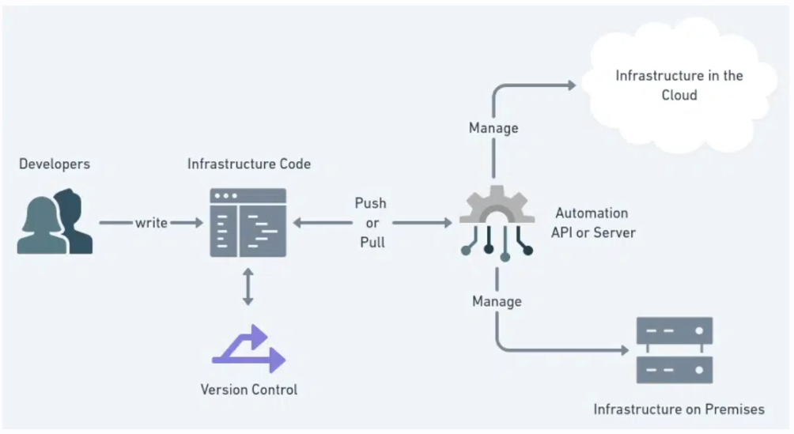

### Declarativo vs Imperativo.

Declarativo:
* Define o estado desejado
* Engloda todos os recursos do fluxo
* Matém estados passados no histórico
* Facilita possíveis declarações futuras

Imperativo:
* Define os comandos para criar o recurso
* Necessário execução em ordem
* Em alguns casos é possível manter o histórico dpo que foi feito


## AWS

## Terraform

https://developer.hashicorp.com/terraform

### Automate infrastructure on any cloud with Terraform
https://www.terraform.io/

Principais pontos Steps :
* Provedor: Usado para gerenciar. (https://registry.terraform.io/browse/providers)
* Resource: Pretence a um Provedor. (AWS, GCP, Azure ...)
* Modulo: Template de casos e necessidades (https://registry.terraform.io/browse/modules)

## C.L.I. Terraform

https://developer.hashicorp.com/terraform/cli


## AWS SSO

Instalar o AWS CLI
https://aws.amazon.com/pt/cli/


Acessar o POrtal da AWS 

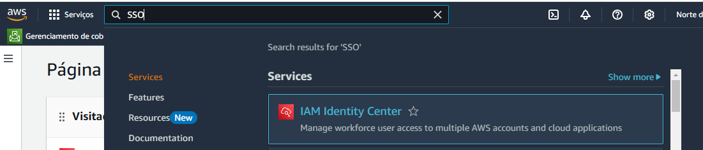

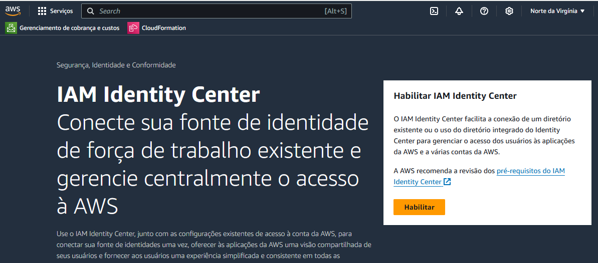

https://us-east-1.console.aws.amazon.com/iam/home?region=us-east-1#/security_credentials


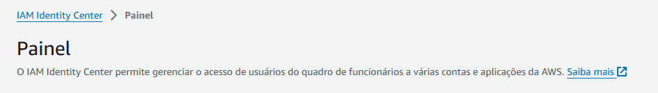

Configurando o SSO Profile

1. Configuração

    Após a criação do IAC SSO vamos configurar o SSO profile.

    Para isso vamos rodar o seguinte comando no terminal: `aws configure sso`

    Aqui o camando gera uma sequencia de perguntas. As respontas estão na sessão: **Resumo das configurações** do **IAM Identity Center**

    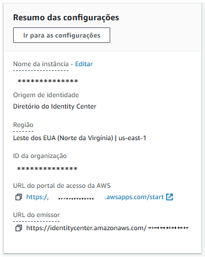

2. Terraform Profile

Para configurar o terraform profile vamos acessar o link : https://registry.terraform.io/browse/providers

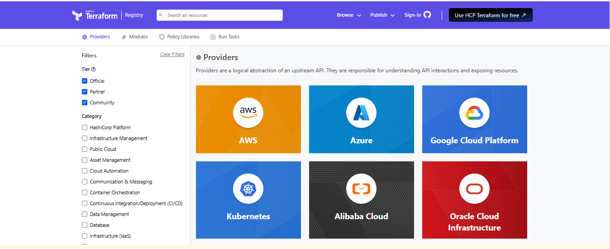

Em seguida selecionar AWS:

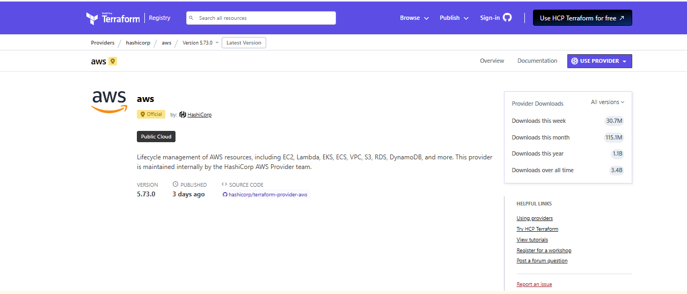

Em seguida selecionar o botão `USER PROVIDER`

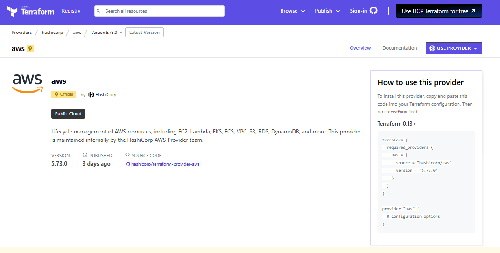
Abaixo temos o exemplo :

```hcl
terraform {
  required_providers {
    aws = {
      source = "hashicorp/aws"
      version = "5.73.0"
    }
  }
}

provider "aws" {
  profile = "VALOR-GERADO-NO-PASSO-1"
  region  = "VALOR-CONTIDO-NO-[Resumo das configurações]"
}
```
3. Criando um projeto exemplo

* Vamos criar uma pasta com nome `devops-iac`

* Abra a pasta no VS code

* Crie um arquivo providers.tf na raiz

* NO terminal vamos rodar o seguinte comando :  `terraform init`. Aqui o terraform cria alguns arquivos de inicialização baseado em informações contidas no `providers.tf`.

4. Criando nosso primeiro recurso - AWS

Para criar o primeiro recurso vamos seguir o passos:

* Crie um arquivo main.tf
* Adicione o recuro como o do exemplo:

aqui temos : 
```hcl
resource "aws_s3_bucket" "s3_bucket"{
    bucket = "rocketseat-bucket-iac-andre-maria"
}
```
resource "aws_s3_bucket" "s3_bucket":

    `aws_s3_bucket` é o tipo de recurso que está sendo criado, indicando que será um bucket no Amazon S3.
    `s3_bucket` é o nome do recurso dentro do Terraform. Este nome é usado para referenciar este recurso em outras partes do código.

bucket = "rocketseat-bucket-iac-andre-maria":

    Define o nome do bucket S3 na AWS. Neste caso, o bucket será chamado `rocketseat-bucket-iac-andre-maria`. Este nome deve ser único em toda a AWS, pois os nomes de buckets S3 são globais.

* Verificar se a sintax está correta: `terraform validate`

* Rodar o camando de pre planejamento : `terraform plan`

* Rodar e comando de execução : 

    a- necessário aprovar
        `terraform apply` (com etapa de confirmação)

    b- `terraform apply -auto-approve` (sem etapa de confirmação)


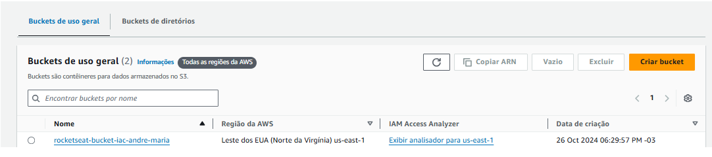

Caso queira remover :

	1- terraform plan --destroy
	2- terraform apply --destroy

5. WorkSpace

O WorkSpace possui um relacionamento one-to-many
onde um state seria associado a muitos WorkSpace.

Exemplo: Ambiente WorkSpace: `[dsv, hml, prd]`

* Para saber o workspace atual
`terraform workspace show`

* Para criar um workspace
`terraform workspace new dsv`

* Para listar 
`terraform workspace list`
    * default
    * dsv

* Para selecionar o workspace
`terraform workspace select default`

6. DataSource

* Crie um arquivo `datasources.tf`
* Adicione como o do exemplo:

```hcl
data "aws_s3_bucket" "s3_bucket_data" {
    bucket = "rocketseat-bucket-iac-andre-maria-${terraform.workspace}"
}
```
* Explicação dos elementos:

    data "aws_s3_bucket" "s3_bucket_data":

    * "aws_s3_bucket" indica que estamos usando um bloco de dados para buscar informações sobre um recurso existente, no caso, um bucket do Amazon S3.
    * "s3_bucket_data" é o nome dado a essa referência de dados no Terraform. Ele será usado para acessar as informações recuperadas do bucket em outras partes do código.

    bucket = "rocketseat-bucket-iac-andre-maria-${terraform.workspace}":

    * Especifica o nome do bucket do qual queremos obter informações.
    * "rocketseat-bucket-iac-andre-maria" é uma parte fixa do nome do bucket.
    * ${terraform.workspace} insere dinamicamente o nome do workspace atual do Terraform, permitindo que o nome do bucket seja específico para cada ambiente (por exemplo, desenvolvimento, teste ou produção).

7. Output (Saidas dos comandos apply)

* Crie um arquivo `outputs.tf`
* Adicione como o do exemplo:

```hcl
output bucket_domain_name {
  value       = data.aws_s3_bucket.s3_bucket_data.bucket_domain_name
  sensitive   = false
  description = "Nome de domínio do bucket S3"
  depends_on  = []
}

output bucket_region {
  value       = data.aws_s3_bucket.s3_bucket_data.region
  sensitive   = false
  description = "Regioão do Bucket"
  depends_on  = []
}
```

* Explicação dos elementos:

    output "bucket_domain_name":

    * Define uma saída chamada bucket_domain_name. Essa saída ficará disponível após a execução do Terraform, podendo ser utilizada em outras partes do código ou acessada para fins de visualização.

    value = data.aws_s3_bucket.s3_bucket_data.bucket_domain_name:

    * Atribui o valor a ser exibido na saída. Neste caso, o valor vem de data.aws_s3_bucket.s3_bucket_data.bucket_domain_name, que representa o nome de domínio do bucket S3 previamente buscado.
    * data.aws_s3_bucket.s3_bucket_data refere-se aos dados recuperados pelo bloco de dados aws_s3_bucket chamado s3_bucket_data.
    * bucket_domain_name é um atributo do recurso S3 que retorna o domínio público completo do bucket.

    sensitive = false:

    * Indica que o valor desta saída não é sensível (como uma senha ou chave de acesso). Quando sensitive é false, o valor pode ser exibido livremente no terminal ou nos arquivos de estado do Terraform.

    description = "Nome de domínio do bucket S3":

    * Fornece uma descrição que explica o que esta saída representa, ajudando a documentar o código.

    depends_on = []:

    * Este campo opcional pode ser usado para declarar explicitamente as dependências que a saída tem em relação a outros recursos ou dados no Terraform. Neste caso, ele está vazio, o que significa que não há dependências adicionais além das inferidas automaticamente.

* Verificar se a sintax está correta: `terraform validate`

* Rodar o camando de pre planejamento : `terraform plan`

* Rodar e comando de execução : 

    a- necessário aprovar
        `terraform apply` (com etapa de confirmação)

    b- `terraform apply -auto-approve` (sem etapa de confirmação)

8. Variable

Para evitar que tanha-mos código duplicados utilizamos o recurso de veriáveis.


Temos dois tipos de váriaveis 
`Configurativas` : (constantes) ou 
`Dinâmicas` 


* Crie um arquivo `variables.tf`
* Adicione como o do exemplo:

```hcl
variable "org_name" {
  type        = string
  default     = "rocketseat"
  description = "description"
}

```

* Explicação dos elementos:

    variable "org_name":

    * Define uma variável chamada org_name. Esse nome será utilizado em outras partes do código para referenciar o valor associado a essa variável.

    type = string:

    * Especifica o tipo de dado da variável. Neste caso, o tipo é string, ou seja, a variável deve conter um valor textual.

    default = "rocketseat":

    * Define o valor padrão da variável. Se nenhum valor for fornecido durante a execução do Terraform, o valor padrão será "rocketseat".
    * Esse valor pode ser sobrescrito ao passar outro valor para a variável via linha de comando, arquivos de variáveis ou outras fontes de entrada do Terraform.

    description = "description":

    * Fornece uma descrição para a variável, que explica o seu propósito ou uso. No exemplo fornecido, a descrição é genérica ("description"), mas é uma prática recomendada usar descrições informativas para documentar o que a variável representa, como "Nome da organização".


Agora com a variavel `org_name` criada podemos altera os códigos da aplicação que contém `"rocketseat"`

Datasource : 

```hcl
data "aws_s3_bucket" "s3_bucket_data" {
    bucket = "${var.org_name}-bucket-iac-andre-maria-${terraform.workspace}"
}
```

Nosso primeiro recurso - AWS

```hcl
resource "aws_s3_bucket" "s3_bucket"{
    bucket = "${var.org_name}-bucket-iac-andre-maria-${terraform.workspace}"

    tags = {
        Name = "First Bucket"
        Iac = true
        context = "${terraform.workspace}"
    }
}
```

9. Modulo

    Módulos são pacotes independentes de configurações do Terraform que são gerenciados como um grupo.

    O site do Terraform possui exemplos de Modulos por Providers:
    https://registry.terraform.io/browse/modules

    Modulos são similares a packages npm , onde vc pode consumir um ou compartilhar.

### Objetivo exemplo: `Utilizar o CloudFront com o S3`

O `CloudFront` precisa de alguns informações contidas no `S3`.
Nesse exemplo vamos trabalhar com conceitos de variáveis, outputs e datasource.

Vamos iniciar com a criação do Modulo para o S3.

Pensando na estrutura teremos o seguinte modelo.

```
.
├── main.tf
├── modules
│   └── s3
│       ├── main.tf
│       ├── outputs.tf
│       └── variables.tf
└── providers.tf
```
Logo vamos criar as pasta e os arquivos conforme o fluxo.

Após a criação vamos progamar o arquivo main.tf com a implementação do s3.

```hcl
resource "aws_s3_bucket" "bucket_to_cloudfront"{
    bucket = ""

    tags = {
    }
}
```
Após a criação vamos progamar o arquivo outputs.tf com a implementação do s3.

```hcl
output bucket_domain_name {
  value       = ""
  sensitive   = false
  description = "Nome de domínio do bucket S3"
  depends_on  = []
}
```

O próximo passo é vincular o module s3 a raiz. Para isso vamos adicionar as informações necessárias do novo module no arquivo main.tf contido na raiz.

```hcl
module "s3" {
    source = "./modules/s3"
}
```
Após a inclusão é necessário rodar o comando `terraform init` para realizar o install do s3 e o `terraform plan`.

Como resultado temos:
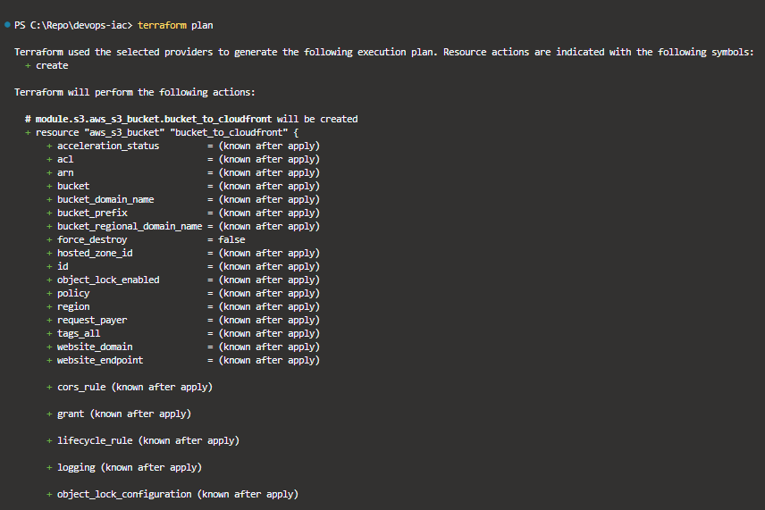

Podemos ver que o item `+ bucket_domain_name          = (known after apply)`

está com um valor randomico. Desta forma vamos codificar o nosso arquivo `variables.tf` .

```hcl
variable "s3_bucket_name" {
  type        = string
  description = "Nome do bucket"
}
```

Fito isso vamos agregar a nossa variavel a propriedade `bucket` contido no arquivo `main.tf` da pasta `s3`.

```hcl
resource "aws_s3_bucket" "bucket_to_cloudfront"{
    bucket = "${var.s3_bucket_name}-{terraform.workspace}"

    tags = {
    }
}
```

Para finalizar devemos indicar a variável no arquivo main.tf da raiz.

```hcl
module "s3" {
    source = "./modules/s3"
    s3_bucket_name = "tutorial-rocketset-iac"
}
```

Agora vamos rodar o comando `terraform plan` para vermos as mudanças.

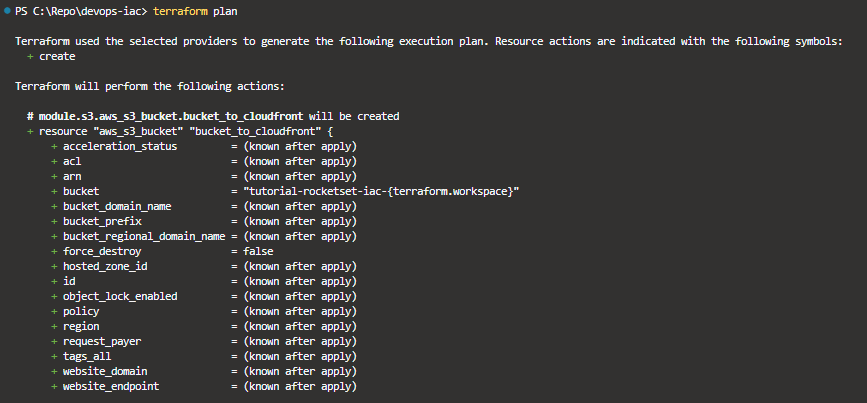

### ATENÇÃO! Toda variavel citada em um module deve estar presente no arquivo de variáveis!

Vamos agora iniciar a criação do Modulo para o Cloudfront.

Pensando na estrutura teremos o seguinte modelo.

```
.
├── main.tf
├── modules
│   └── s3
│       ├── main.tf
│       └── variables.tf
│   └── cloudfront
│       ├── main.tf
│       ├── outputs.tf
│       └── variables.tf
└── providers.tf
```

No caso do `Cloudfront` a implementação não é simples como a do `S3`.
Nesse caso vamos consultar a documentação disponobilizada pela a terraform pelo link : https://registry.terraform.io/providers/hashicorp/aws/latest/docs

Pesquisar por aws_cloudfront_distribution ...
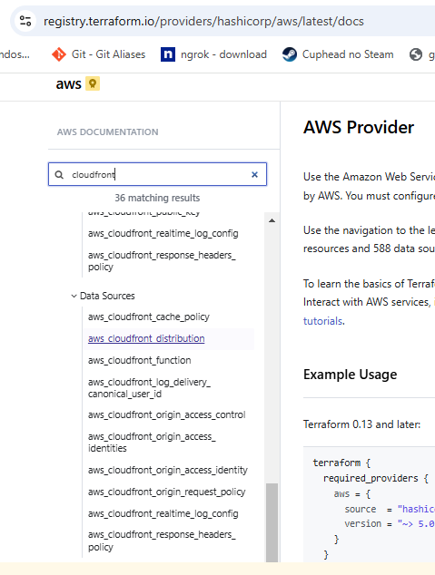

Selecione distribution.


como exemplo vamos inicialmente usar o seguintes valores : 

```hcl
resource "aws_cloudfront_distribution" "cloudfront" {
  enabled             = true

  origin {
    origin_id    = ""
    domain_name  = ""
    custom_origin_config {
        http_port               = 80
        https_port              = 443
        origin_protocol_policy  = "http-only"
        origin_ssl_protocols    = ["TLSv1"]
    }
  }

  default_cache_behavior {
    allowed_methods  = ["GET", "HEAD"]
    cached_methods   = ["GET", "HEAD"]
    target_origin_id = local.s3_origin_id

    forwarded_values {
      query_string = false

      cookies {
        forward = "all"
      }
    }

    viewer_protocol_policy = "redirect-to-https"
    min_ttl                = 0
    default_ttl            = 0
    max_ttl                = 0
  }

  restrictions {
    geo_restriction {
      restriction_type = "none"
    }
  }

  viewer_certificate {
    cloudfront_default_certificate = true
  }

  price_class = "PriceClass_200"

}
```

Logo vamos criar as pasta e os arquivos conforme o fluxo.

Após a criação vamos progamar o arquivo cloudfront/main.tf com a implementação do cloudfront.

É importante destacar que o cloudfront depende do s3, desta forma vamos declarar no ./main.tf o seguinte trecho.

```hcl
module "s3" {
    source = "./modules/s3"
    s3_bucket_name = "tutorial-rocketset-iac"
}

module "cloudfront" {
    source = "./modules/cloudfront"
}
```

Após a inclusão é necessário rodar o comando `terraform init` para realizar o install do `cloudfront` e rodar o comando `terraform plan`.

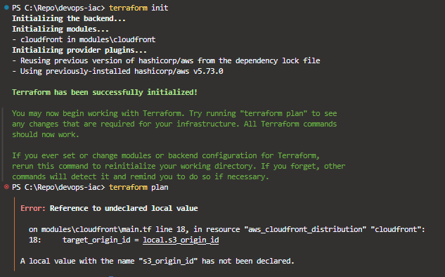

Esse erro foi apresentado porque ao configurar o cloudfront não incluimos um valor para apropriedade `origin_id`.

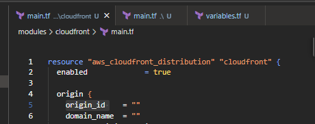

Informações como `origin_id` e `domain_name` são informações requeridas para a criação do `cloudfront`. Mas como e onde vamos obter tais informações.

Como destacamos anteriormente  `"É importante destacar que o cloudfront depende do s3 ..."`
Desta forma vamos configurar os outputs na pasta s3 para retronar as informações que queremos.

```hcl
output bucket_domain_name {
  value       = ""
  sensitive   = false
  description = "Nome de domínio do bucket S3"
  depends_on  = []
}

output bucket_id {
  value       = ""
  sensitive   = false
  description = "Id de domínio do bucket S3"
  depends_on  = []
}
```

No trecho acima temos a propriedade value contida em cada output, é nela que vamos incluir o valor desejado.
Para isso podemos criar um datasource ou pegar do próprio componente. 
Vamos usar a segunda abordagem.

```hcl
output bucket_domain_name {
  value       = aws_s3_bucket.bucket_to_cloudfront.bucket_domain_name
  sensitive   = false
  description = "Nome de domínio do bucket S3"
  depends_on  = []
}

output bucket_id {
  value       = aws_s3_bucket.bucket_to_cloudfront.id
  sensitive   = false
  description = "Id de domínio do bucket S3"
  depends_on  = []
}
```

Agora vamos incluir os outputs como saidas no module do s3

```hcl
module "s3" {
    source = "./modules/s3"
    s3_bucket_name = "tutorial-rocketset-iac"
}

module "cloudfront" {
    source = "./modules/cloudfront"
    bucket_domain_name = module.s3.bucket_domain_name
    origin_id = module.s3.bucket_id
    depends_on  = [
        module.s3
    ]
}
```
Agora vamos incluir as propriedades origin_id e bucket_domain_name no `./cloudfront/variables.tf` .

```hcl
variable "origin_id" {
  type        = string
  description = "Id do S3"
}

variable "bucket_domain_name" {
  type        = string
  description = "Domínio do S3"
}
```

Agora vamos incluir as propriedades origin_id e bucket_domain_name no `./cloudfront/main.tf` contidas no resource .

```hcl
resource "aws_cloudfront_distribution" "cloudfront" {
  enabled             = true

  origin {
    origin_id    = "${var.origin_id}"
    domain_name  = "${var.bucket_domain_name}"
    custom_origin_config {
        http_port               = 80
        https_port              = 443
        origin_protocol_policy  = "http-only"
        origin_ssl_protocols    = ["TLSv1"]
    }
  }

  default_cache_behavior {
    target_origin_id = var.origin_id
    allowed_methods  = ["GET", "HEAD"]
    cached_methods   = ["GET", "HEAD"]

    forwarded_values {
      query_string = false

      cookies {
        forward = "all"
      }
    }

    viewer_protocol_policy = "redirect-to-https"
    min_ttl                = 0
    default_ttl            = 0
    max_ttl                = 0
  }

  restrictions {
    geo_restriction {
      restriction_type = "none"
    }
  }

  viewer_certificate {
    cloudfront_default_certificate = true
  }

  price_class = "PriceClass_200"

}
```

Para finalizar podemos rodar o comando `terraform apply -auto-approve`.

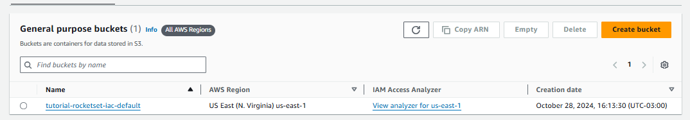

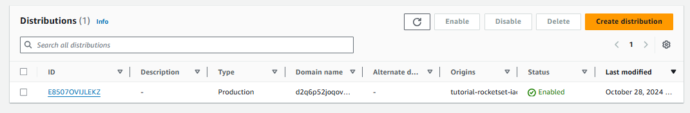