# Conhecendo o Kubernetes

## ✨ Contexto inicial e problema

### Cenário

- `"Temos Uma aplicação executando em container e essa execução em container traz algumas preocupações (Problemas)."`
- `"Temos várias aplicações executando em container e essa execução em container traz algumas preocupações (Problemas)."`

### Problemas

- `"E se um container falhar na execução?"`
- `"E se precisarmos de vários containers executando a mesma aplicação?"`
- `"E se precisarmos de um fluxo elástico?"`
- `"E se forem várias aplicações com vários containers?"`
- `"E o controle de uso de recursos de container?"`

## ✨ Esboço do problema

No cenário temos uma aplicação `"A"`, a aplicação `"A"` está contida em um container.

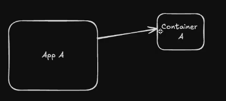

Quando o container a é executado, ele necessita de recursos computacionais

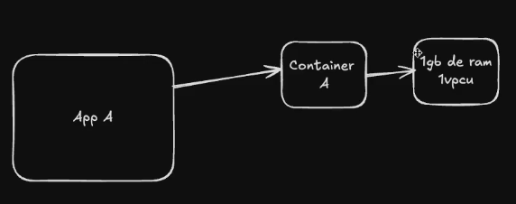

Caso ocorra algum problema no container ,o mesmo vai parar a execução e logo não existe mais.

Quando não trabalhamos com orquestração é muito difícil entender os motivos da causa do problema.

Quando não trabalhamos com orquestração não temos a visibilidade de quando um determinado problema irá ocorrer.

Caso ocorra o problema como será resolvido?

Sem a orquestração a solução desses problemas é muito complexa!

Logo é muito importante que esse cenário seja automatizado.

O kubernetes entra no senário para resolver esses problemas.

#### **`Conceitos Básicos do Kubernetes`**

**`Arquitetura`**

- `"Cluster"`: Conjunto de máquinas (nós) que executam aplicações em contêineres. Um cluster é composto por um `Master Node` e vários `Worker Nodes`.
- `"Node"`: Uma única máquina em execução em um cluster Kubernetes, pode ser física ou virtual.
- `"Pod"`: Unidade básica de execução em Kubernetes. Um `Pod` pode conter um ou mais contêineres que compartilham recursos de rede e armazenamento.


**`Objetos Principais`**

- `"Pod"`: O menor objeto implantável no Kubernetes. Ele encapsula um ou mais contêineres, com armazenamento compartilhado e configurações de rede.
- `"Deployment"`: Gerencia a criação e atualização de `Pods`. Facilita o controle de versões e rollback.
- `"Service"`: Define uma maneira de expor uma aplicação em execução como um serviço de rede.
- `"ConfigMap"`: Armazena dados de configuração em pares chave-valor que podem ser consumidos por contêineres.
- `"Secret"`: Semelhante ao `ConfigMap`, mas usado para armazenar dados sensíveis, como senhas e chaves de API.


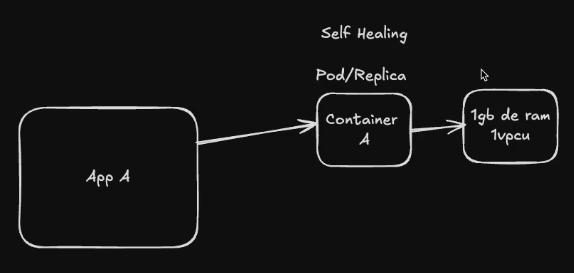

**`"Self-Healing no Kubernetes"`**

O **self-healing** no Kubernetes é um recurso que permite ao cluster detectar e corrigir automaticamente falhas em seus componentes, garantindo maior disponibilidade e resiliência das aplicações.

**`"Como funciona"`**
- **Pods com falhas**: Se um Pod falhar (parar de responder ou entrar em estado de erro), o Kubernetes recria ou substitui automaticamente o Pod para restaurar o estado desejado.
- **Nodes indisponíveis**: Se um nó (node) falhar, os Pods que estavam nele são redistribuídos para outros nós disponíveis.
- **Checagens de saúde**: Kubernetes utiliza *liveness probes* e *readiness probes* para monitorar continuamente os Pods e determinar se estão saudáveis.

**`"Para que serve"`**
1. **Garantir alta disponibilidade**: Minimiza o tempo de inatividade ao corrigir falhas rapidamente.
2. **Automatizar recuperação**: Evita a necessidade de intervenção manual para problemas comuns.
3. **Melhorar resiliência**: Ajuda a manter o sistema funcionando mesmo em condições adversas.

Este recurso é essencial para aplicações modernas que demandam escalabilidade e alta confiabilidade.

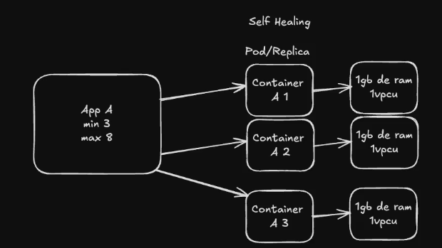

Nesse mecanismo e chamado de hpa (Horizontal Pod Autoscaler)


#### O que é Horizontal Pod Autoscaler (HPA)?

O **Horizontal Pod Autoscaler (HPA)** é um recurso do Kubernetes que ajusta automaticamente o número de réplicas de pods em um deployment, replica set ou stateful set com base na utilização de métricas observadas (como uso de CPU, memória ou métricas personalizadas). 

#### Para que serve?

O HPA é usado para:

- **Escalabilidade automática**: Garante que o número de pods atenda à demanda variável do aplicativo.
- **Eficiência de recursos**: Ajuda a evitar subutilização ou sobrecarga de recursos.
- **Alto desempenho**: Mantém o desempenho do aplicativo em momentos de picos de uso.
- **Otimização de custos**: Ajusta a quantidade de recursos usados para evitar desperdício.

#### Como funciona?

1. Monitora métricas definidas, como uso de CPU/memória ou métricas personalizadas através do API Metrics Server.
2. Calcula o número ideal de réplicas com base nas metas configuradas.
3. Escala automaticamente o número de pods para atingir as metas.

Exemplo de uso comum:
```yaml
apiVersion: autoscaling/v2
kind: HorizontalPodAutoscaler
metadata:
  name: app-a
spec:
  scaleTargetRef:
    apiVersion: apps/v1
    kind: Deployment
    name: my-app-a
  minReplicas: 3
  maxReplicas: 8
  metrics:
    - type: Resource
      resource:
        name: cpu
        target:
          type: Utilization
          averageUtilization: 70
```

## ✨ Principais componentes

#### Arquitetura do Kubernetes

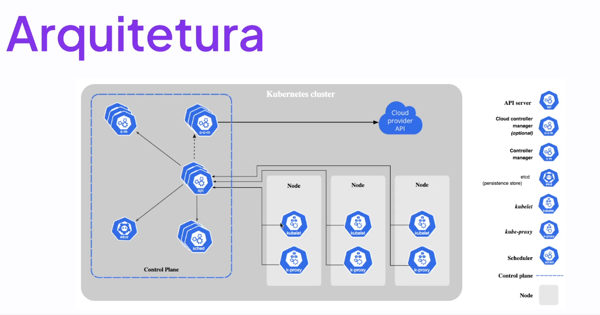

- **Control Plane**:
O **Control Plane** gerencia o estado desejado do cluster, monitorando e controlando os componentes do Kubernetes. Ele coordena os nós, agendando workloads e respondendo a eventos do sistema.

---

- **API Server**:
O **API Server** é o ponto de entrada para todas as interações externas e internas com o Kubernetes. Ele expõe a API RESTful do Kubernetes e é responsável por autenticar e validar as solicitações.

---

- **Cloud Controller Manager**:
O **Cloud Controller Manager** integra o Kubernetes ao provedor de nuvem. Ele gerencia recursos dependentes da infraestrutura da nuvem, como balanceadores de carga, volumes de armazenamento e nós virtuais.

---

- **ETCD (Persistence Store)**:
O **ETCD** é o armazenamento de dados distribuído usado pelo Kubernetes para salvar todos os dados do cluster. Ele é a única fonte de verdade, contendo configurações, estados de objetos e informações críticas.

---

- **Kubelet**:
O **Kubelet** é o agente que roda em cada nó do cluster. Ele recebe instruções do API Server e garante que os containers estejam rodando como especificado nos objetos Pod.

---

- **Kube-proxy**:
O **Kube-proxy** gerencia as regras de rede dentro do cluster, garantindo a comunicação entre Pods e serviços, além de lidar com o balanceamento de carga interno.

---

- **Scheduler**:
O **Scheduler** decide em qual nó os Pods recém-criados devem ser executados, baseando-se em fatores como recursos disponíveis, restrições de afinidade e anti-afinidade.

---

- **Node**:
O **Node** é uma máquina (física ou virtual) que executa os workloads do Kubernetes. Cada nó contém um **Kubelet**, um **Kube-proxy** e o ambiente necessário para rodar containers.


## ✨ Como executar um Cluster Kubernetes

Tipos de cluster

- Gerenciado : Pago [AWS-EKS, GCP-GKE, AZURE-AKS]
- Não Gerenciado : OnPremise, (na sua máquina)

## ✨ Configurando Ambiente

Ferramentas:

- Kubectl: CLI 
- lens (IDE)
- K9s 
- (na sua máquina) : Kind(`"Kubernetes in docker"`), Minikube, K3d/k3s

https://kubernetes.io/pt-br/docs/tasks/tools/

https://docs.k8slens.dev/

## ✨ Configurando e criando nosso primeiro Cluster

- Vamos criar uma cluster, para isso vamos digitar o seguinte comando no terminal:

```
kind create cluster --name=first-cluster-rocketseat
```

Logo apos no terminal e apresentado o resukltado da criação:
```hcl

ster --name=first-cluster-rocketseat
Creating cluster "first-cluster-rocketseat" ...
 • Ensuring node image (kindest/node:v1.31.2) 🖼  ...
 ✓ Ensuring node image (kindest/node:v1.31.2) 🖼
 • Preparing nodes 📦   ...
 ✓ Preparing nodes 📦
 • Writing configuration 📜  ...
 ✓ Writing configuration 📜
 • Starting control-plane 🕹️  ...
 ✓ Starting control-plane 🕹️
 • Installing CNI 🔌  ...
 ✓ Installing CNI 🔌
 • Installing StorageClass 💾  ...
 ✓ Installing StorageClass 💾
Set kubectl context to "kind-first-cluster-rocketseat"
You can now use your cluster with:

kubectl cluster-info --context kind-first-cluster-rocketseat

Not sure what to do next? 😅  Check out https://kind.sigs.k8s.io/docs/user/quick-start/

```

O result acima indicou a o uso do contexto : ```kubectl cluster-info --context kind-first-cluster-rocketseat```

```hcl

PS C:\Repo\k8s\first-cluster> kubectl cluster-info --context kind-first-cluster-rocketseat
Kubernetes control plane is running at https://127.0.0.1:49448
CoreDNS is running at https://127.0.0.1:49448/api/v1/namespaces/kube-system/services/kube-dns:dns/proxy

To further debug and diagnose cluster problems, use 'kubectl cluster-info dump'.

```

Agora vamos rtoadr o comando `kubectl` que apresentará a lista de coamndo que podemos usar:

```hcl

 kubectl 
kubectl controls the Kubernetes cluster manager.

 Find more information at: https://kubernetes.io/docs/reference/kubectl/

Basic Commands (Beginner):
  create          Create a resource from a file or from stdin
  expose          Take a replication controller, service, deployment or pod and expose it as a new Kubernetes service
  run             Run a particular image on the cluster
  set             Set specific features on objects

Basic Commands (Intermediate):
  explain         Get documentation for a resource
  get             Display one or many resources
  edit            Edit a resource on the server
  delete          Delete resources by file names, stdin, resources and names, or by resources and label selector

Deploy Commands:
  rollout         Manage the rollout of a resource
  scale           Set a new size for a deployment, replica set, or replication controller
  autoscale       Auto-scale a deployment, replica set, stateful set, or replication controller

Cluster Management Commands:
  certificate     Modify certificate resources
  cluster-info    Display cluster information
  top             Display resource (CPU/memory) usage
  cordon          Mark node as unschedulable
  uncordon        Mark node as schedulable
  drain           Drain node in preparation for maintenance
  taint           Update the taints on one or more nodes

Troubleshooting and Debugging Commands:
  describe        Show details of a specific resource or group of resources
  logs            Print the logs for a container in a pod
  attach          Attach to a running container
  exec            Execute a command in a container
  port-forward    Forward one or more local ports to a pod
  proxy           Run a proxy to the Kubernetes API server
  cp              Copy files and directories to and from containers
  auth            Inspect authorization
  debug           Create debugging sessions for troubleshooting workloads and nodes
  events          List events

Advanced Commands:
  diff            Diff the live version against a would-be applied version
  apply           Apply a configuration to a resource by file name or stdin
  patch           Update fields of a resource
  replace         Replace a resource by file name or stdin
  wait            Experimental: Wait for a specific condition on one or many resources
  kustomize       Build a kustomization target from a directory or URL

Settings Commands:
  label           Update the labels on a resource
  annotate        Update the annotations on a resource
  completion      Output shell completion code for the specified shell (bash, zsh, fish, or powershell)

Subcommands provided by plugins:

Other Commands:
  api-resources   Print the supported API resources on the server
  api-versions    Print the supported API versions on the server, in the form of "group/version"
  config          Modify kubeconfig files
  plugin          Provides utilities for interacting with plugins
  version         Print the client and server version information

Usage:
  kubectl [flags] [options]

Use "kubectl <command> --help" for more information about a given command.
Use "kubectl options" for a list of global command-line options (applies to all commands).

```

Logo vamos usar o seguinte comando : `kubectl get nodes`


```
PS C:\Repo\k8s\first-cluster> kubectl get nodes
NAME                                     STATUS   ROLES           AGE   VERSION
first-cluster-rocketseat-control-plane   Ready    control-plane   16m   v1.31.2
PS C:\Repo\k8s\first-cluster> 
```

Agora vamos abiri o lens.

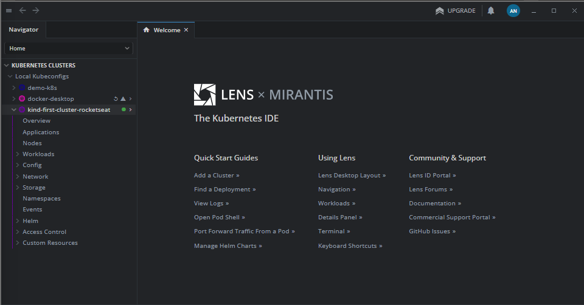


## ✨ Configurando Cluster com multiplos nós

Vamos Excluir o primeiro cluster : `kind delete cluster --name=first-cluster-rocketseat`

Agora vamos escrever um script manifesto para a criação de um novo cluster.

- `"kind.yaml"`: vamos criar um novo arquivo para incluir as intruções do novo cluster

- `"script base"`: Inclua o seguinte código

```hcl

kind: Cluster
apiVersion: kind.x-k8s.io/v1alpha4
nodes:
  - role: control-plane
  - role: worker
```

- `"Command"` : No terminal digite o seguinte comando :

`kind create cluster --config kind.yaml --name=secund-cluster-rocketseat` 

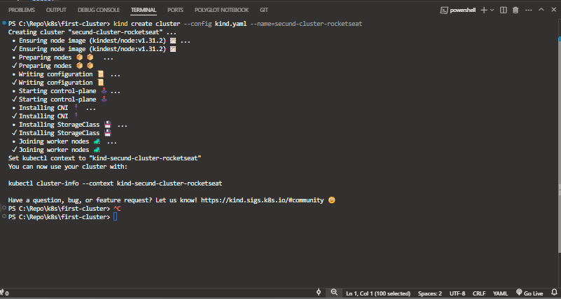

`kubectl cluster-info --context kind-secund-cluster-rocketseat`

`kubectl get nodes`

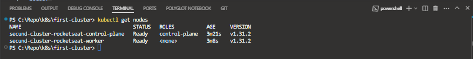

#### Explicação do Arquivo de Configuração Kind

Este é um arquivo de configuração para o Kubernetes in Docker (Kind), utilizado para criar clusters Kubernetes localmente com fins de desenvolvimento e teste.

---

##### **Cabeçalho**

```yaml
kind: Cluster
apiVersion: kind.x-k8s.io/v1alpha4
```

1. **`kind: Cluster`**
   - Especifica o tipo de recurso que o arquivo define.
   - Indica que o arquivo descreve um *cluster* completo do Kubernetes que será gerenciado pelo Kind.

2. **`apiVersion: kind.x-k8s.io/v1alpha4`**
   - Define a versão da API do Kind utilizada neste arquivo.
   - Esta versão controla as opções de configuração disponíveis para criar e gerenciar clusters.

---

##### **Configuração de Nós**

```yaml
nodes:
  - role: control-plane
  - role: worker
```

1. **`nodes`**
   - Define os nós (*nodes*) que farão parte do cluster.
   - Cada nó é uma instância do Kubernetes e pode ser configurado como um nó de controle ou de trabalho.

2. **`- role: control-plane`**
   - Define que o primeiro nó será um **nó de controle** (*control-plane*).
   - O nó de controle é responsável por executar os componentes principais do Kubernetes, incluindo:
     - **API Server**: Ponto de entrada para comandos e consultas ao cluster.
     - **Controller Manager**: Garante que o estado desejado dos objetos seja mantido.
     - **Scheduler**: Aloca pods em nós disponíveis.
     - **etcd**: Banco de dados chave-valor que armazena todos os dados do cluster.

3. **`- role: worker`**
   - Define que o segundo nó será um **nó de trabalho** (*worker*).
   - Os nós de trabalho executam os **pods**, que contêm os contêineres das aplicações.
   - Cada nó de trabalho é gerenciado pelo nó de controle e executa:
     - **kubelet**: Agente que garante que os contêineres dos pods sejam executados como especificado.
     - **kube-proxy**: Mantém regras de rede para a comunicação interna e externa do cluster.
     - **Container Runtime**: Software que executa os contêineres (ex.: Docker, containerd).

---

##### **Resumo**

Este arquivo cria um cluster Kubernetes com:

- **1 Nó de Controle**: Responsável por gerenciar o cluster.
- **1 Nó de Trabalho**: Responsável por executar os aplicativos em contêiner.

Para criar o cluster utilizando este arquivo, use o comando:

```bash
kind create cluster --config=<nome-do-arquivo.yaml>
```

Esse tipo de configuração é ideal para criar ambientes simples e locais, simulando clusters Kubernetes reais


# Orquestrando Containers


## ✨ Subindo o nosso primeiro Container

Aqui vamos iniciar a creação de um pod 

Como um Pod é responsável por (Rodar a nossa aplicação dentro do cluster)
Vamos trabalhar nesse ponto.


- `"imagem para o container"` : Vamos acessar o site do dockerhub https://hub.docker.com/_/nginx/tags?name=alpine


- `kubectl run nginx --image=nginx:stable-alpine3.20-perl`

- `kubectl get pods`

- `kubectl describe pod nginx`


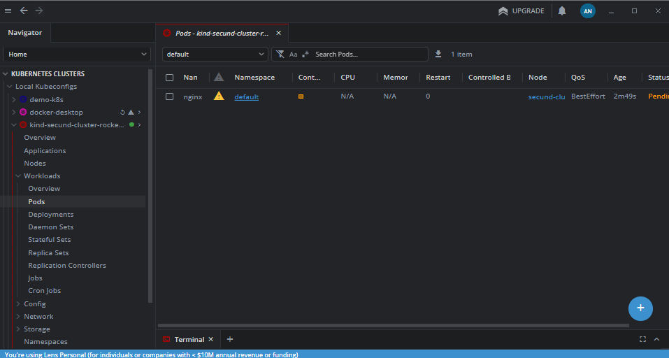

- `"Execução de forma IMPERATIVA"` : `kubectl run nginx --image=nginx:stable-alpine3.20-perl`

- `"Não temos o controlador"`

## ✨ Valor dos manifestos declarativos e namespaces

Vamos deletar o exemplo: ` kubectl delete pod nginx`

Agora vamos criar a namespace : `kubectl create namespace first-app`

Feito isso vamos criar o pod via arquivo. Para isso vamos criar um novo arquivo pod.yaml

#### Explicação Detalhada do Script YAML para Criação de um Pod no Kubernetes

Este documento explica cada passo do script YAML fornecido para criar um Pod no Kubernetes.

```yaml
apiVersion: v1
kind: Pod

metadata:
  name: nginx

spec:
  containers:
    - name : nginx
      image: nginx:stable-alpine3.20-perl
      ports:
        - containerPort: 80
      resources:
        requests:
          cpu: 100m
          memory: 64Mi
        limits:
          cpu: 200m
          memory: 128Mi
```

####  1. **Cabeçalho do Documento**

#### `apiVersion: v1`
- Define a versão da API do Kubernetes utilizada para este recurso.
- `v1` é a versão estável para recursos básicos como `Pod`.

#### `kind: Pod`
- Especifica o tipo de recurso que será criado.
- Neste caso, estamos criando um **Pod**, que é a menor unidade executável no Kubernetes.

---

#### 2. **Metadados do Pod**

#### `metadata:`
- Define informações adicionais sobre o recurso.

#### `name: nginx`
- Atribui o nome **nginx** ao Pod.
- Este nome deve ser único dentro do namespace onde o Pod está sendo criado.

---

#### 3. **Especificações do Pod**

#### `spec:`
- Contém a descrição detalhada de como o Pod será configurado.

#### `containers:`
- Define os containers que serão executados no Pod. Cada Pod pode conter um ou mais containers.

##### `- name: nginx`
- Especifica o nome do container.
- O nome deve ser único dentro do Pod e é usado para identificar o container.

##### `image: nginx:stable-alpine3.20-perl`
- Indica a imagem Docker que será usada para criar o container.
- Neste caso, a imagem é **nginx:stable-alpine3.20-perl**, que é uma versão leve e estável do servidor web NGINX.

##### `ports:`
- Define as portas expostas pelo container.

###### `- containerPort: 80`
- Especifica que o container exporá a porta **80**, comumente usada para serviços HTTP.

---

#### 4. **Recursos do Container**

#### `resources:`
- Configura os limites e as solicitações de recursos para o container.

#### `requests:`
- Representa a quantidade mínima de recursos garantidos para o container.

##### `cpu: 100m`
- O container requer pelo menos **100 millicores** (0,1 vCPU).

##### `memory: 64Mi`
- O container requer pelo menos **64 MiB** de memória.

#### `limits:`
- Representa a quantidade máxima de recursos que o container pode usar.

##### `cpu: 200m`
- O container pode usar até **200 millicores** (0,2 vCPU).

##### `memory: 128Mi`
- O container pode usar até **128 MiB** de memória.

---

#### Resumo
Este script YAML configura um Pod com:
- Um container baseado na imagem **nginx:stable-alpine3.20-perl**.
- Exposição da porta 80.
- Garantia de uso mínimo de **0,1 vCPU** e **64 MiB** de memória.
- Limite máximo de **0,2 vCPU** e **128 MiB** de memória.

O Pod criado é eficiente para serviços de baixa utilização, ideal para ambientes leves ou de desenvolvimento.

Agora vamos rodar o cmando :
´kubectl apply -f pod.yaml -n first-app´

#### Comando `kubectl apply -f pod.yaml -n first-app`

Este comando utiliza o `kubectl` para aplicar configurações de um arquivo YAML a um cluster Kubernetes. Aqui estão os detalhes de cada parte do comando:

#### 1. `kubectl`
- **Definição**: `kubectl` é a ferramenta de linha de comando utilizada para interagir com o Kubernetes.
- **Função neste comando**: Serve como a base para executar comandos que gerenciam recursos no cluster Kubernetes.

#### 2. `apply`
- **Definição**: O subcomando `apply` é usado para aplicar ou atualizar a configuração de recursos no cluster.
- **Função neste comando**: Indica ao Kubernetes que ele deve criar ou atualizar os recursos descritos no arquivo `pod.yaml`.

#### 3. `-f pod.yaml`
- **Definição**:
  - O argumento `-f` (abreviação de `--filename`) especifica o arquivo YAML contendo a definição dos recursos Kubernetes a serem aplicados.
  - `pod.yaml` é o nome do arquivo que contém a descrição dos recursos, como pods, services ou deployments.
- **Função neste comando**: Fornece ao `kubectl` os detalhes da configuração do pod para aplicação no cluster.

#### 4. `-n first-app`
- **Definição**:
  - `-n` (abreviação de `--namespace`) especifica o namespace no qual os recursos devem ser criados ou atualizados.
  - `first-app` é o nome do namespace alvo.
- **Função neste comando**: Garante que o recurso seja aplicado no namespace correto (neste caso, `first-app`).
  - Se o namespace não for especificado, o Kubernetes utiliza o namespace padrão (geralmente chamado `default`).

---

Com isso, o comando `kubectl apply -f pod.yaml -n first-app` permite criar ou atualizar recursos em um namespace Kubernetes de maneira organizada e eficiente.


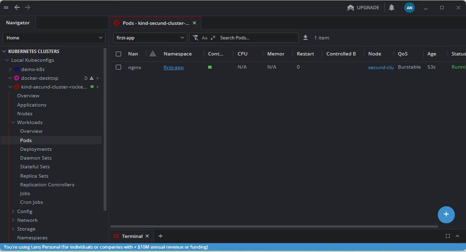


## ✨ Acessando container dentro do cluster

#### Explicação do Comando `kubectl port-forward pod/nginx -n first-app 8080:80`

O comando `kubectl port-forward` é usado no Kubernetes para encaminhar portas de um recurso (como um pod) no cluster para o ambiente local. Isso permite acessar aplicativos executados no cluster sem expô-los publicamente por meio de um serviço ou ingress.

#### Detalhamento do comando:

```bash
kubectl port-forward pod/nginx -n first-app 8080:80
```

#### Componentes do Comando:

1. **`kubectl port-forward`**:
   - Essa é a funcionalidade do `kubectl` que inicia o encaminhamento de portas.

2. **`pod/nginx`**:
   - Especifica o recurso que será o alvo do encaminhamento de portas.
   - Aqui, estamos nos referindo ao pod chamado `nginx`. O prefixo `pod/` indica explicitamente que o recurso é um pod.

3. **`-n first-app`**:
   - Especifica o namespace onde o pod está localizado.
   - Neste caso, o pod `nginx` pertence ao namespace `first-app`.

4. **`8080:80`**:
   - Define o mapeamento de portas.
   - O primeiro número (`8080`) é a porta na máquina local (host), que será usada para acessar o aplicativo.
   - O segundo número (`80`) é a porta no pod, onde o aplicativo está escutando.

#### O que acontece ao executar esse comando?

- Uma conexão é estabelecida entre o pod `nginx` no namespace `first-app` e a máquina local.
- As solicitações enviadas para `localhost:8080` (máquina local) serão encaminhadas para a porta `80` no pod `nginx` dentro do cluster Kubernetes.
- Não é necessário expor o serviço ou criar um recurso adicional para acessar o aplicativo.

#### Cenários de Uso

- **Depuração**:
  - Verificar se o aplicativo está funcionando corretamente no pod.
- **Desenvolvimento Local**:
  - Acessar aplicativos no cluster sem configurar serviços ou ingress.
- **Teste Temporário**:
  - Testar endpoints ou funcionalidades de um aplicativo diretamente.

#### Observações Importantes

1. **Necessidade de Acesso ao Cluster**:
   - O comando requer que você tenha permissões para acessar o namespace e o pod especificados.

2. **Conexão Limitada ao Tempo de Execução**:
   - O encaminhamento permanece ativo apenas enquanto o comando estiver em execução no terminal.

3. **Desempenho e Escalabilidade**:
   - Este método é ideal para uso em casos simples ou temporários. Para ambientes de produção, é recomendado usar serviços, ingress ou outras soluções mais robustas.

4. **Restrições de Portas Locais**:
   - Certifique-se de que a porta local especificada (`8080`) não esteja em uso por outro processo.

---

### Exemplo Prático

Após executar o comando:

```bash
kubectl port-forward pod/nginx -n first-app 8080:80
```

Você pode acessar o aplicativo executado no pod `nginx` digitando o seguinte no navegador ou usando ferramentas como `curl`:

```bash
http://localhost:8080
```

Isso redirecionará as solicitações para o pod `nginx` na porta `80` dentro do namespace `first-app` do cluster Kubernetes.


## ✨ Problemas e próximos passos

#### O Que Acontece ao deleta o `Pod` criados?

Ao deletar o Pod:

1. **`"Recriação Automática"`**: Não ocorrerá recriação automática porque o Pod foi criado diretamente sem estar associado a um controlador.
2. **`"Perda Permanente"`**: Uma vez deletado, o Pod e qualquer dado nele contido (se não houver volumes persistentes configurados) serão permanentemente removidos.

Usar um `"ReplicaSet"` poderia ser uma solução paliativa para garantir a recriação automática de um Pod caso ele seja excluído. 

#### O Que Acontece ao Deletar os Pods Criados por um ReplicaSet?

Se você deletar os pods criados por um **ReplicaSet** no Kubernetes, o ReplicaSet automaticamente recriará os pods para garantir que o número especificado em `spec.replicas` seja mantido. 

Esse comportamento faz parte do objetivo do ReplicaSet de assegurar que o estado desejado do sistema seja preservado.

---

#### Explicação Detalhada

#### 1. **ReplicaSet Monitora o Estado**
O ReplicaSet verifica constantemente o número de pods em execução, baseando-se no `selector.matchLabels`. 

- Quando detecta que há menos pods do que o especificado em `spec.replicas`, ele cria novos pods para restaurar o estado desejado.

---

#### 2. **Ação Após a Deleção**
- Ao deletar um pod gerenciado pelo ReplicaSet, ele detecta a ausência desse pod e recria um novo imediatamente.
- O novo pod será baseado no modelo definido na seção `template` do ReplicaSet.

---

#### 3. **Imutabilidade dos Pods**
- Os pods criados pelo ReplicaSet são independentes e imutáveis. Alterar diretamente um pod (como modificar sua configuração) não afeta o modelo do ReplicaSet.
- Se um pod for modificado manualmente, o ReplicaSet substituirá esse pod por outro que siga o modelo original.

---

#### 4. **Impacto no Cluster**
- Caso todos os pods gerenciados sejam deletados, o ReplicaSet recriará os pods até atingir o número especificado em `replicas`.
- Se os recursos do cluster (CPU, memória, etc.) forem insuficientes, o ReplicaSet continuará tentando recriar os pods até que os recursos estejam disponíveis.

---

#### Exceção: Deleção do Próprio ReplicaSet
- Se o **ReplicaSet** for deletado, todos os pods gerenciados por ele também serão removidos, já que dependem do ReplicaSet para existir.

---

#### Caso Prático
Você pode testar a recriação automática dos pods com os seguintes comandos:

1. **Deletar um Pod**:
   ```bash
   kubectl delete pod <nome-do-pod>
   ```


2. **Verificar os Pods Disponíveis**:
    ```bash
    kubectl get pods
    ```
    Após a execução, você verá que um novo pod foi recriado automaticamente, com um nome diferente, mas baseado no modelo definido no ReplicaSet.

#### Resumo

  - Manutenção do número de réplicas: O ReplicaSet garante que o número de réplicas definido seja sempre mantido.

  - Recriação automática: Pods deletados serão recriados automaticamente.

  - Imutabilidade: Alterar pods diretamente não afeta o modelo do ReplicaSet; eles serão substituídos.

  - Deleção do ReplicaSet: Se o ReplicaSet for deletado, os pods associados também serão removidos.

  Este comportamento torna o ReplicaSet uma ferramenta poderosa para manter a alta disponibilidade de aplicativos no Kubernetes.

## ✨ Criando um ReplicaSet

#### Usando o ReplicaSet
```yaml
apiVersion: apps/v1
kind: ReplicaSet

metadata:
  name: nginx

spec:
  replicas: 5
  selector:
    matchLabels:
      app: nginx
  template:
    metadata:
      labels:
        app: nginx
    spec: 
      containers:
        - name : nginx
          image: nginx:stable-alpine3.20-perl
          ports:
            - containerPort: 80
          resources:
            requests:
              cpu: 100m
              memory: 64Mi
            limits:
              cpu: 200m
              memory: 128Mi
```

#### Explicação do Comando ReplicaSet

O comando especificado é um manifesto em formato YAML usado para criar um **`"ReplicaSet"`** no Kubernetes. 

Um **`"ReplicaSet"`** é responsável por garantir que um número especificado de réplicas **`"(pods)"`**  esteja sempre em execução. 

Abaixo está a explicação detalhada de cada seção:

#### Estrutura do Manifesto

#### **`"apiVersion: apps/v1"`** 
Define a versão da API utilizada para o recurso. Nesse caso, o ReplicaSet usa a API `apps/v1`, que é estável para gerenciar aplicativos no Kubernetes.

---

#### **`"kind: ReplicaSet"`** 
Especifica o tipo de recurso que está sendo criado. Aqui, o recurso é um **ReplicaSet**.

---

#### **`"metadata:"`** 
Contém informações básicas de identificação do objeto.

- **name**: O nome do ReplicaSet. No exemplo, ele é chamado de `nginx`.

---

#### **`"spec:"`** 
Define a especificação desejada para o ReplicaSet, como o número de réplicas e a configuração dos pods.

#### **`"replicas: 5"`** 
Especifica o número desejado de réplicas do pod. O ReplicaSet garante que exatamente 5 pods estejam sempre em execução.

#### **`"selector:"`** 
Define como o ReplicaSet identifica os pods que ele deve gerenciar.

- **`matchLabels`**: Especifica os rótulos usados para associar os pods ao ReplicaSet. Neste caso, ele seleciona pods com o rótulo `app: nginx`.

#### **`"template:"`** 
Define o modelo (template) para os pods que o ReplicaSet irá criar. Essa seção é usada para configurar os pods.

- **`metadata`**:
  - **`labels`**: Define os rótulos atribuídos aos pods criados. Esses rótulos devem corresponder aos definidos em `selector.matchLabels`.

- **`spec`**: 
  Configurações específicas dos containers dentro dos pods.

#### **`"containers:"`** 
Lista os containers que devem ser executados no pod.

- **`name`**: Nome do container (no exemplo, `nginx`).
- **`image`**: Imagem do container a ser usada. Aqui, é especificada a imagem `nginx:stable-alpine3.20-perl`, que é uma versão leve do NGINX com suporte ao Perl.
- **`ports`**:
  - **`containerPort`**: Define a porta exposta pelo container. No exemplo, o container escuta na porta 80.

#### **`"resources:"`** 
Define as solicitações e limites de recursos para o container.

- **`requests`**: Recursos mínimos garantidos para o container.
  - **`cpu`**: `100m` (milicores de CPU) — o container receberá pelo menos 0,1 de um núcleo.
  - **`memory`**: `64Mi` — o container terá pelo menos 64 MiB de memória garantida.

- **`limits`**: Recursos máximos permitidos para o container.
  - **`cpu`**: `200m` (milicores de CPU) — o container não pode usar mais do que 0,2 de um núcleo.
  - **`memory`**: `128Mi` — o container não pode usar mais do que 128 MiB de memória.

---

#### Resumo
Este manifesto cria um **`"ReplicaSet"`** chamado `nginx`, que mantém 5 réplicas de um pod executando um container NGINX baseado na imagem `nginx:stable-alpine3.20-perl`. 
Os pods são configurados para escutar na porta 80 e possuem restrições de CPU e memória definidas para otimizar o uso de recursos do cluster.

Agora vamos executar o comando:

```bash
kubectl apply -f replicaset.yaml
```

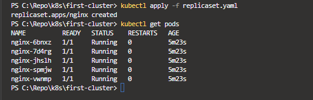

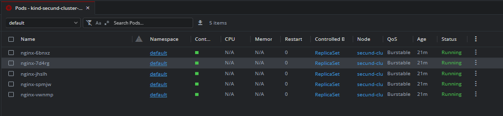


## ✨ Problemas de um ReplicaSet

#### Problemas de Usar o ReplicaSet no Kubernetes

O objeto **`"ReplicaSet"`** no Kubernetes é responsável por garantir que um número especificado de réplicas de um pod esteja sempre em execução. No entanto, seu uso direto pode trazer alguns problemas e limitações, principalmente quando comparado a outros recursos, como o **`"Deployment**. Abaixo estão os principais problemas e implicações de usar o ReplicaSet no comando fornecido:

1. **`"Falta de Gerenciamento de Atualizações**
O **`"ReplicaSet"`"`** não fornece uma maneira nativa de gerenciar atualizações ou rollbacks. Isso significa que:

- Para atualizar uma imagem ou qualquer outra configuração, o ReplicaSet existente precisa ser deletado ou modificado manualmente, o que pode causar interrupções.
- Rollbacks em caso de falhas não são automáticos. Se algo der errado, é necessário reverter manualmente a configuração para um estado anterior.

Em contrapartida, o **`"Deployment"`** abstrai o ReplicaSet e oferece suporte nativo para atualizações declarativas e seguras.

2. **`"Complexidade no Escalonamento Manual"`** 
Embora o ReplicaSet permita o escalonamento ajustando o campo `replicas`, o processo é manual e sujeito a erros. Ferramentas de escalonamento automático (Horizontal Pod Autoscaler) geralmente são configuradas em conjunto com um Deployment e não diretamente com um ReplicaSet.

3. **`"Gestão Limitada de Ciclo de Vida"`** 
O ReplicaSet não controla o ciclo de vida completo de um aplicativo. Ele apenas mantém a quantidade de réplicas definida, mas não gerencia estados intermediários, como:

- Estratégias de atualização (por exemplo, `RollingUpdate` ou `Recreate`).
- Orquestração em cenários de alta complexidade (como blue/green deployments ou canary deployments).

4. **`"Aumento do Risco de Configurações Incorretas"`** 
Sem a abstração e automação fornecidas por um Deployment:

- Configurações podem ser aplicadas de maneira inconsistente.
- Existe um risco maior de deletar ou alterar acidentalmente o ReplicaSet em produção, causando interrupções.

5. **`"Menor Adoção e Suporte"`** 
Na prática, o uso direto de ReplicaSets é raro, pois o Deployment é amplamente adotado devido à sua flexibilidade e recursos adicionais. Isso pode resultar em:

- Menor suporte de comunidades e ferramentas de terceiros.
- Dificuldades para integrar configurações de CI/CD e práticas modernas de DevOps diretamente com ReplicaSets.

6. **`"Observabilidade Reduzida"`** 
Enquanto um Deployment oferece melhores métricas e status para acompanhar o progresso de atualizações e escalonamento, o ReplicaSet não oferece esses níveis de observabilidade de maneira integrada.

#### Considerações Finais
Embora o ReplicaSet seja a base para recursos como o Deployment, seu uso direto é recomendado apenas para casos muito específicos, como:

- Cenários onde não é necessário realizar atualizações no aplicativo.
- Configurações extremamente simples e estáveis que não exigem a abstração e automação oferecidas por um Deployment.

Na maioria dos casos, é mais adequado usar um **`"Deployment"`** , que oferece um gerenciamento mais robusto, eficiente e seguro para aplicações no Kubernetes.

**`"LOGO O REPLICASET NÃO É UM OBJETOS DE IMPLANTAÇÃO MAS SIM UMA CONTROLADOR DE NÚMERO DE PODS. ELE NÃO TEM SUPORTE A TROCA DE TAGS."`**

## ✨ Criando um Deployment

Agora para resolver o problema visto no uso do **`"ReplicaSet"`** vamos criar um novo arquivo `deployment.yaml`

Após a criação do arquivo vamos preencher com o seguinte script:

```yaml

apiVersion: apps/v1
kind: Deployment

metadata:
  name: nginx

spec:
  replicas: 5
  selector:
    matchLabels:
      app: nginx
  template:
    metadata:
      labels:
        app: nginx
    spec:
      containers:
      - name: nginx
        image: nginx:stable-alpine3.20-perl
        resources:
          requests:
            cpu: 100m
            memory: 64Mi
          limits:
            memory: "128Mi"
            cpu: "200m"
        ports:
        - containerPort: 80


```

```bash
kubectl apply -f deployment.yaml -n first-app
```

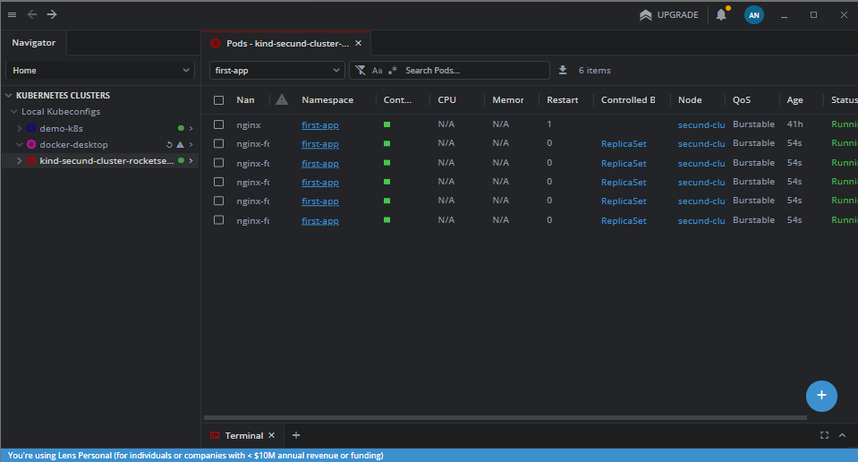

Vimos que a versão da imagem é `nginx:stable-alpine3.20-perl`
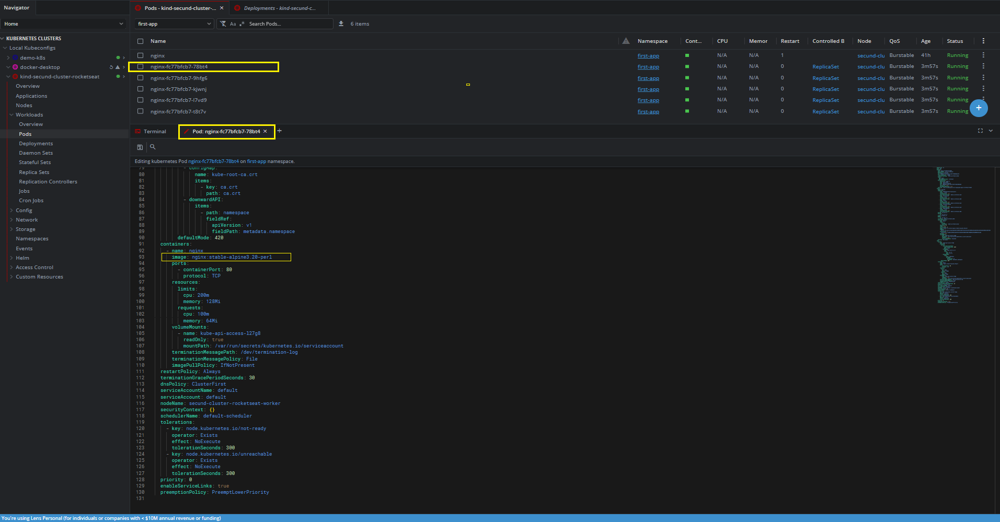


Para testar o ideia de troca de versão vamos editar o arquivo `deployment.yaml` substituindo `nginx:stable-alpine3.20-perl` para `nginx:mainline-alpine3.20-slim`

```yaml

apiVersion: apps/v1
kind: Deployment

metadata:
  name: nginx

spec:
  replicas: 5
  selector:
    matchLabels:
      app: nginx
  template:
    metadata:
      labels:
        app: nginx
    spec:
      containers:
      - name: nginx
        image: nginx:mainline-alpine3.20-slim
        resources:
          requests:
            cpu: 100m
            memory: 64Mi
          limits:
            memory: "128Mi"
            cpu: "200m"
        ports:
        - containerPort: 80


```

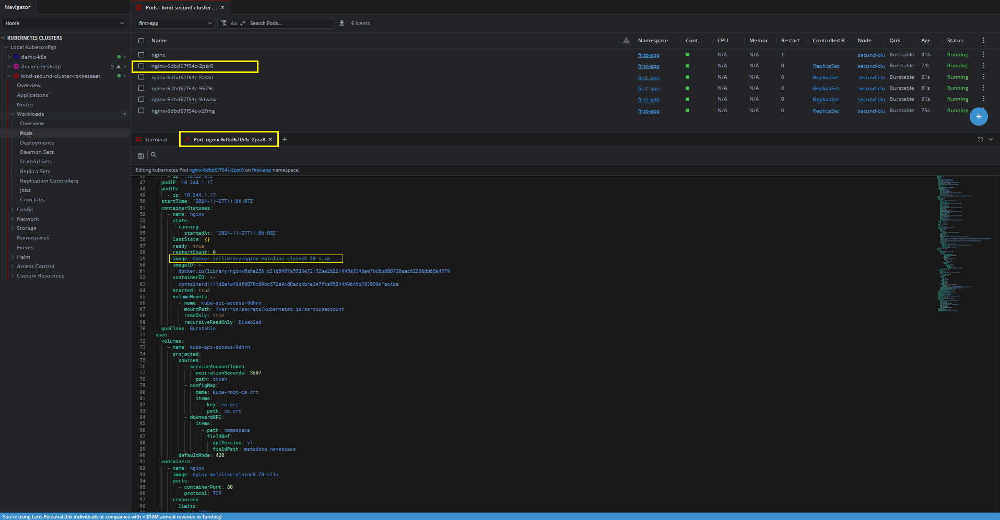


## ✨ Acessando Pods

Componente da interface de rede onde os acessos pelo Client é distribuido entre os pods.

Agora para resolver o problema de acesso vamos criar um novo arquivo `service.yaml`

Após a criação do arquivo vamos preencher com o seguinte script:

```yaml

apiVersion: v1
kind: Service
metadata:
  name: nginx-svc
spec:
  type: ClusterIP
  selector:
    app: nginx
  ports:
  - port: 80
    targetPort: 80 # - containerPort: 80 deployment.yaml


```

### Explicação Detalhada do Script YAML

O script abaixo descreve um recurso `Service` no Kubernetes, que atua como uma abstração para expor aplicações executadas em um conjunto de pods.

#### Linha a Linha do Script

#### Cabeçalho do Documento

```yaml
apiVersion: v1
```
- **apiVersion**: Define a versão da API Kubernetes utilizada para este recurso. Aqui, `v1` é a versão para recursos básicos como `Service`.

```yaml
kind: Service
```
- **kind**: Especifica o tipo de recurso Kubernetes. Neste caso, é um `Service`.

```yaml
metadata:
  name: nginx-svc
```
- **metadata**: Contém informações adicionais sobre o recurso.
  - **name**: Define o nome do `Service`, neste caso, `nginx-svc`.

### Especificações do Service

```yaml
spec:
```
- **spec**: Define a configuração detalhada do recurso. Tudo que está dentro de `spec` refere-se à implementação do `Service`.

```yaml
  type: ClusterIP
```
- **type**: Define como o `Service` será exposto.
  - **ClusterIP**: O padrão. Permite o acesso ao `Service` apenas dentro do cluster.

```yaml
  selector:
    app: nginx
```
- **selector**: Define os critérios para selecionar os pods associados ao `Service`.
  - **app: nginx**: Seleciona todos os pods com o rótulo `app: nginx`.

```yaml
  ports:
```
- **ports**: Define as portas expostas pelo `Service`.

#### Configuração de Portas

```yaml
  - port: 80
```
- **port**: Porta em que o `Service` estará escutando. Aqui, é a porta `80`.

```yaml
    targetPort: 80
```
- **targetPort**: Porta no container para onde o tráfego será redirecionado. Aqui, também é `80`.
  - Esta porta deve corresponder ao **containerPort** definido no manifesto do `Deployment` (por exemplo, `deployment.yaml`).

---

#### Resumo do Fluxo
1. **Criar o Service**:
   - O Kubernetes identifica que é um recurso do tipo `Service`.
2. **Filtrar Pods**:
   - Usa o seletor `app: nginx` para encontrar os pods associados.
3. **Redirecionar o Tráfego**:
   - O tráfego enviado para o `Service` na porta `80` é redirecionado para a porta `80` nos containers selecionados.


```bash
kubectl apply -f service.yaml -n first-app
```

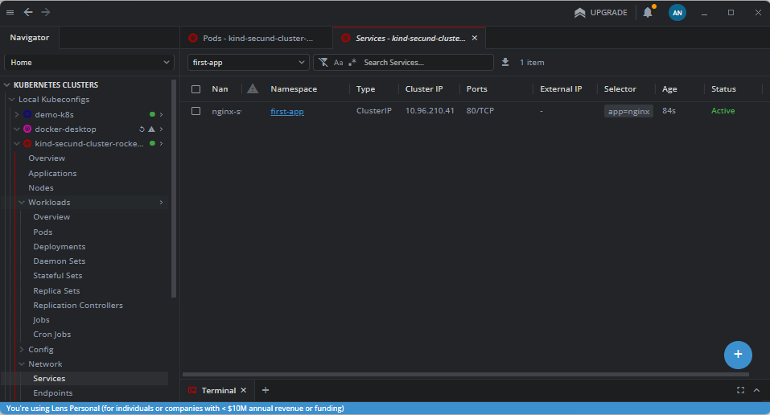


para acessar vamos rodar o seguinte comando:

```bash
kubectl port-forward svc/nginx-svc -n first-app 8080:80
```

### Explicação detalhada do comando
**Comando:**  
`kubectl port-forward svc/nginx-svc -n first-app 8080:80`

#### 1. **Contexto**  
Este comando é usado para criar um túnel local que encaminha o tráfego de uma porta no computador do usuário para uma porta em um serviço (Service) no cluster Kubernetes.

#### 2. **Componentes do comando**  

#### `kubectl`
É a ferramenta de linha de comando usada para interagir com clusters Kubernetes.  

#### `port-forward`
É um subcomando do `kubectl` que permite mapear uma porta do ambiente local para um pod ou serviço no cluster Kubernetes.  
- Com isso, você pode acessar recursos do cluster que normalmente não estariam expostos publicamente.  

#### `svc/nginx-svc`
Indica que o redirecionamento será feito para um **Service** chamado `nginx-svc`.  
- O prefixo `svc/` é usado para especificar que o alvo é um **Service**.  

#### `-n first-app`
Especifica o namespace onde o **Service** está localizado.  
- Neste caso, o namespace é `first-app`.  
- Se este argumento fosse omitido, o comando usaria o namespace padrão (`default`).  

#### `8080:80`
Define o mapeamento das portas:  
- `8080`: Porta local do computador onde o tráfego será recebido.  
- `80`: Porta do serviço dentro do cluster Kubernetes para a qual o tráfego será encaminhado.  
- O tráfego que chega em `localhost:8080` no ambiente local será redirecionado para o serviço `nginx-svc` na porta `80`.

---

#### 3. **Uso prático**  
Após executar este comando, você pode acessar o serviço `nginx-svc` diretamente no navegador ou com ferramentas como `curl` via:  

http://localhost:8080

#### 4. **Cenários de uso comuns**
- Testar um serviço no cluster sem configurá-lo como um recurso publicamente acessível.  
- Depuração ou desenvolvimento local, acessando serviços internos do Kubernetes de forma segura.  

---

#### 5. **Notas importantes**
- O comando precisa de acesso ao cluster Kubernetes configurado no `kubectl`.  
- Certifique-se de que a porta local (8080) não esteja em uso por outro processo antes de executar o comando.  
- Se o Service estiver configurado corretamente no cluster, o tráfego será redirecionado para os pods associados a ele.


Como vimos solucionamos o acesso interno aos pods , não não solucionamos o problema de acesso externo.
✨

# Explorando Deployment e cenários em uma aplicação real

## ✨ Conteinerizando a nossa aplicação

Vamos usar o DockerFile da Aplicação Exemplo da Sessão  Docker Tutorial.

## ✨ Criando os Objetos do Kubernetes

Vamos Utilizar o Docker Hub para trabalhar com as imagens da nossa aplicação

Desta forma é necessário fazer o login

```bash
docker login 
```

```yaml
# begin build
FROM node:18-alpine3.19 AS build

WORKDIR /usr/src/app

COPY package.json ./

RUN npm install

COPY . .

RUN npm run build

RUN npm ci --only=production
#end build

#begin excution
FROM node:18-alpine3.19

WORKDIR /usr/src/app

COPY --from=build /usr/src/app/package.json ./package.json
COPY --from=build /usr/src/app/dist ./dist
COPY --from=build /usr/src/app/node_modules ./node_modules

EXPOSE 3000

CMD ["npm", "run", "start:prod"]
#end excution
```

```bash
docker build -t api-rocket:v1 .
```

```bash
docker image ls api-rocket
```

```bash
docker tag api-rocket:v1 andremariadevops/api-rocket:v1 .
```

```bash
docker push andremariadevops/api-rocket:v1 
```

Agora vamos criar um objeto Deployment Kubernetes:

```yaml
apiVersion: apps/v1
kind: Deployment

metadata:
  name: api-rocket

spec:
  replicas: 2
  selector:
    matchLabels:
      api: api-rocket
  template:
    metadata:
      labels:
        api: api-rocket
    spec:
      containers:
      - name: api-rocket
        image: andremariadevops/api-rocket:v1
        resources:
          requests:
            cpu: 100m
            memory: 64Mi
          limits:
            cpu: "200m"
            memory: "128Mi"
        ports:
        - containerPort: 3000
```


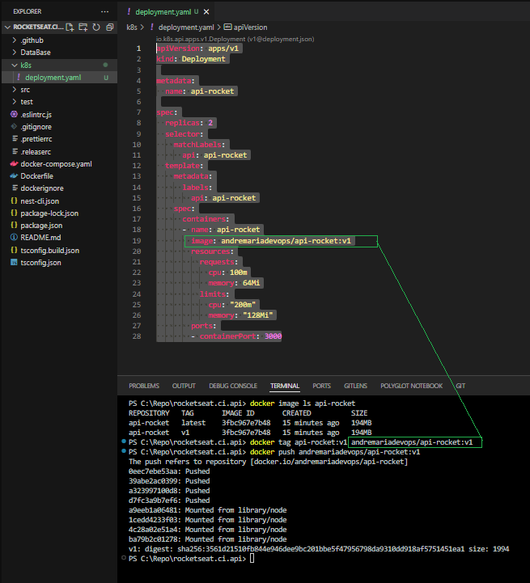

```bash
kubectl create namespace ns-rocket
```

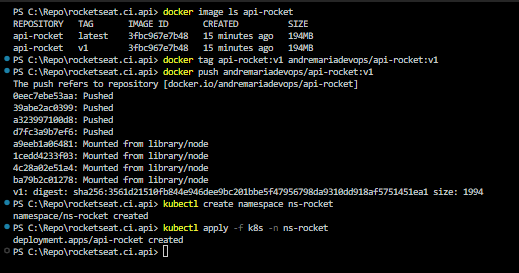


```bash
kubectl apply -f k8s -n ns-rocket
```


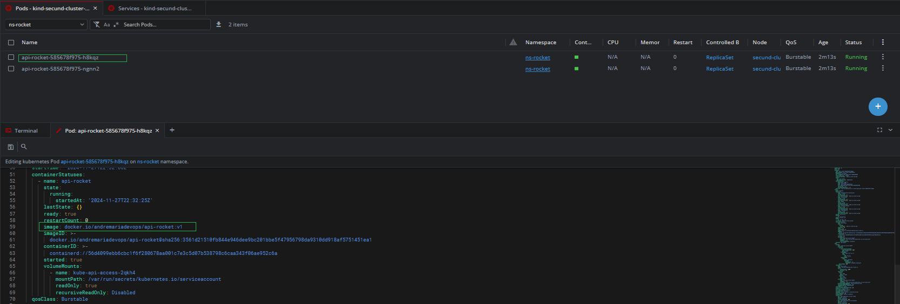

## ✨ Criando Service e explorando imagePullPolicy

Agora vamos criar um novo arquivo `service.yaml`

Após a criação do arquivo vamos preencher com o seguinte script:

```yaml

apiVersion: v1
kind: Service
metadata:
  name: api-rocket-svc
spec:
  type: ClusterIP
  selector:
    api: api-rocket #  selector: matchLabels: api: api-rocket deployment.yaml
  ports:
  - port: 80
    targetPort: 3000 # - containerPort: 80 deployment.yaml


```

```bash

kubectl apply -f k8s/service.yaml -n ns-rocket

```

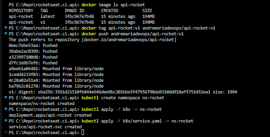

Vamos incluir um novo end-point em nossa api :

```typescript
import { Injectable } from '@nestjs/common';

@Injectable()
export class AppService {
  getHello(): string {
    return 'Rocketset Api!';
  }

  getExample(): string {
    return 'Estou rodando no K8s!';
  }
}
```

```typescript
import { Controller, Get } from '@nestjs/common';
import { AppService } from './app.service';

@Controller()
export class AppController {
  constructor(private readonly appService: AppService) {}

  @Get()
  getHello(): string {
    return this.appService.getHello();
  }

  @Get('/example-k8s')
  getExample(): string {
    return this.appService.getExample();
  }
}
```

NO cenário de CI/CD teriamos :

- 1 Commit 
- 2 Commit to build image
- 3 push
- 4 delevery

Como esse fluxo ainda não está automatizado vamos realizar manualmente os passos.

Mas antes vamos pensar sobre version e sua importância.

### Importância do Versionamento de Imagens Docker

- Por que versionar imagens Docker?

Manter o versionamento de imagens Docker é uma prática essencial para garantir a consistência, rastreabilidade e controle em ambientes de desenvolvimento, teste e produção. 

### Benefícios do Versionamento:

1. **Consistência entre Ambientes:**
   - Usar uma tag específica, como `v1.0.0` ou `1.2.3`, assegura que o ambiente de produção utilize exatamente a mesma versão de imagem que foi testada em desenvolvimento e homologação.
   - Evita problemas relacionados a mudanças inesperadas em imagens mais genéricas, como `latest`.

2. **Rastreabilidade:**
   - O versionamento permite identificar rapidamente qual versão da aplicação está em execução. Isso é fundamental para depuração, rollback e auditorias.
   - Sem versionamento, pode ser difícil ou impossível rastrear qual código ou configuração está sendo usado em um ambiente.

3. **Controle de Atualizações:**
   - Com imagens versionadas, atualizações podem ser planejadas e testadas cuidadosamente antes de serem aplicadas.
   - Reduz a probabilidade de interrupções ou falhas causadas por mudanças inesperadas.


### Conclusão

O versionamento de imagens Docker é crucial para garantir controle e estabilidade em ambientes de desenvolvimento e produção. A configuração do `"imagePullPolicy"`, por sua vez, regula como e quando as imagens devem ser atualizadas, complementando as boas práticas de versionamento e evitando problemas causados por mudanças inesperadas.


Logo vamos testar o cenário onde realizamos o `build` e `push` sem altera a version de v1 para v2.


```bash

docker build -t andremariadevops/api-rocket:v1 .

```


```bash

docker push andremariadevops/api-rocket:v1

```

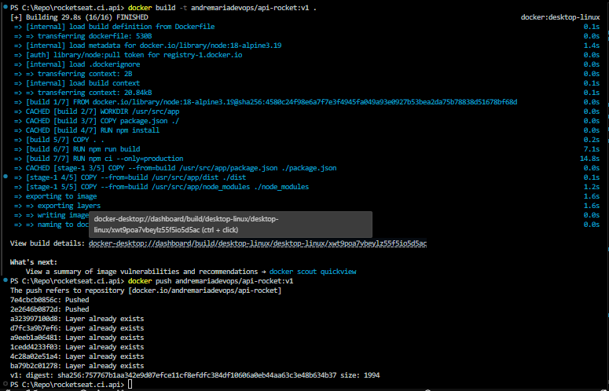


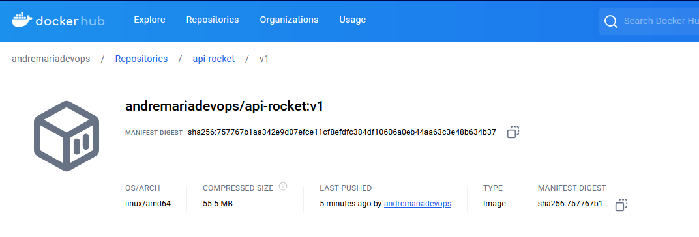

Agora será que no Kubernetes vamos conseguir fazer o deployment ?

Para testar vamos tentar acessar o novo end-point http://localhost:64730/example-k8s


Nesse caso para contornar esse problema vamos usar o `"imagePullPolicy:Always "`

Para isso vamos editar o arquuivo `deployment.yaml`

```yaml

apiVersion: apps/v1
kind: Deployment

metadata:
  name: api-rocket

spec:
  replicas: 2
  selector:
    matchLabels:
      api: api-rocket
  template:
    metadata:
      labels:
        api: api-rocket
    spec:
      containers:
      - name: api-rocket
        image: andremariadevops/api-rocket:v1
        imagePullPolicy: Always
        resources:
          requests:
            cpu: 100m
            memory: 64Mi
          limits:
            cpu: "200m"
            memory: "128Mi"
        ports:
        - containerPort: 3000

```

### Função do `"imagePullPolicy"`

O parâmetro `"imagePullPolicy"` é usado em ferramentas de orquestração, como Kubernetes, para controlar quando e como a imagem Docker deve ser baixada (ou puxada) do registro. Ele trabalha em conjunto com o versionamento para assegurar um comportamento previsível. 

### Valores Possíveis do `"imagePullPolicy"`:

1. **`Always`**:
   - Faz o download da imagem toda vez que o pod é iniciado.
   - Útil para tags não versionadas, como `latest`, garantindo que a versão mais recente esteja sempre em uso.
   - Pode aumentar o tempo de inicialização devido ao download constante da imagem.

2. **`IfNotPresent`**:
   - Apenas baixa a imagem se ela não estiver disponível no nó onde o pod está sendo executado.
   - Ideal para imagens versionadas, já que evita downloads desnecessários e aproveita as imagens já armazenadas localmente.

3. **`Never`**:
   - Nunca tenta baixar a imagem, assumindo que ela já está disponível localmente.
   - Geralmente usado em cenários controlados, como testes locais ou ambientes restritos sem acesso ao registro.

### Como o `"imagePullPolicy"` complementa o versionamento?

- Quando se usa **versionamento**, a política `IfNotPresent` é comumente utilizada para evitar downloads repetidos da mesma imagem, economizando largura de banda e acelerando o deployment.
- Para tags não versionadas, como `latest`, o uso de `Always` é recomendado para garantir que a versão mais recente da imagem seja usada. No entanto, essa prática é desencorajada em produção devido à falta de previsibilidade.


```bash

kubectl apply -f k8s/deployment.yaml -n ns-rocket

```

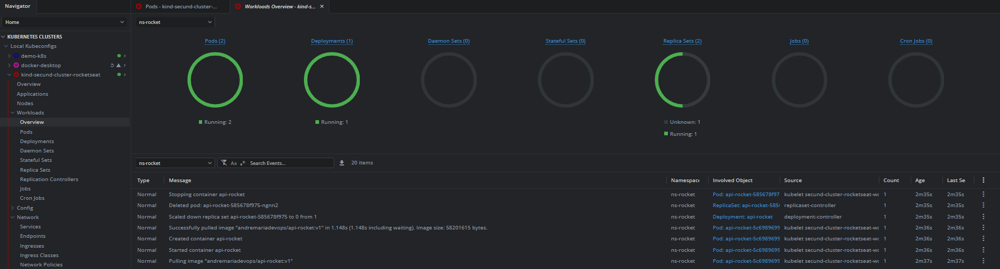


## ✨ Entendendo Problemas da Tag Latest

Vimos que a versão é muito importante para o health da aplicação.

Agora vamos descobrir como fazer um rollback da aplicação nesse cenário de má prática de não utilizar o vercionamento da imagem.


```bash
kubectl rollout history deployment/api-rocket -n ns-rocket
```


### Explicação do comando `kubectl rollout history deployment/api-rocket`

O comando `kubectl rollout history deployment/api-rocket` é usado para exibir o histórico de revisões de um *Deployment* específico no Kubernetes. No caso do comando apresentado, ele está sendo aplicado ao *Deployment* chamado `api-rocket`.

### Funcionamento
- **`kubectl rollout`**: É o comando relacionado à administração de atualizações e mudanças de recursos do tipo *Deployment* no Kubernetes.
- **`history`**: Esta subcomando exibe o histórico de revisões do *Deployment*, incluindo informações sobre alterações realizadas em diferentes versões.
- **`deployment/api-rocket`**: Especifica o recurso (neste caso, um *Deployment* chamado `api-rocket`) para o qual o histórico deve ser consultado.

### Saída Esperada
A saída do comando geralmente exibe uma tabela com as seguintes colunas:
- **REVISION**: O número da revisão (começando em 1 para o primeiro estado registrado).
- **CHANGE-CAUSE**: Uma descrição sobre a causa da mudança, se fornecida no momento da aplicação do comando `kubectl apply` ou `kubectl rollout`.


### Quando usar
- Para identificar alterações no *Deployment* ao longo do tempo.
- Para verificar quem ou o que realizou mudanças.
- Para auxiliar em *rollbacks* ou diagnósticos de problemas relacionados a alterações.


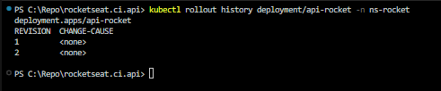

### Adicionando o CHANGE-CAUSE
Para que o campo `CHANGE-CAUSE` seja preenchido, é necessário especificar a causa da mudança ao aplicar alterações, utilizando a flag `--record`, como no exemplo abaixo:

```bash
kubectl apply -f deployment.yaml --record
```


`"kubectl rollout undo"`: Reverte o Deployment para uma revisão anterior, útil quando algo deu errado após uma atualização.

```bash
kubectl rollout undo deployment/api-rocket --to-revision=1 -n ns-rocket
```

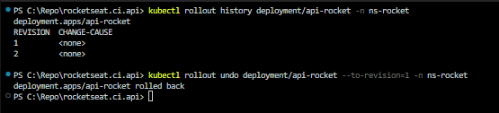

Agora vamos verificar e o end-point **`"/example-k8s"`** foi excluido das rotas da api.

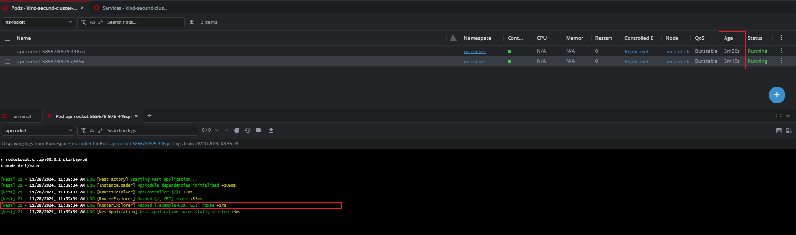

Como podemos ver a rota ainda existe. Mas por que?

Aqui o rollback faz o download da imagem ou reaproveita a mesma.
Como não alteramos a versão da imagem temos a perda o lastro, desta forma o rollback não foi realizado corretamente.


## ✨ Criando Nova Tag e Controlando Rollback da Aplicação

Agora que entendemos que não é uma boa prática sobre-escrever tags, vamos fazer algumas alterações.

Nesse caso para contornar esse problema vamos usar o `"imagePullPolicy:IfNotPresent "`

Para isso vamos editar o arquuivo `deployment.yaml`

```yaml

apiVersion: apps/v1
kind: Deployment

metadata:
  name: api-rocket

spec:
  replicas: 2
  selector:
    matchLabels:
      api: api-rocket
  template:
    metadata:
      labels:
        api: api-rocket
    spec:
      containers:
      - name: api-rocket
        image: andremariadevops/api-rocket:v2
        imagePullPolicy: IfNotPresent
        resources:
          requests:
            cpu: 100m
            memory: 64Mi
          limits:
            cpu: "200m"
            memory: "128Mi"
        ports:
        - containerPort: 3000

```


```typescript
import { Injectable } from '@nestjs/common';

@Injectable()
export class AppService {
  getHello(): string {
    return 'Rocketset Api!';
  }

  getExample(): string {
    
    return `Estou rodando no K8s! ${ Date.UTC }`;
  }
}
```

```bash

docker build -t andremariadevops/api-rocket:v2 .

```


```bash

docker push andremariadevops/api-rocket:v2

```

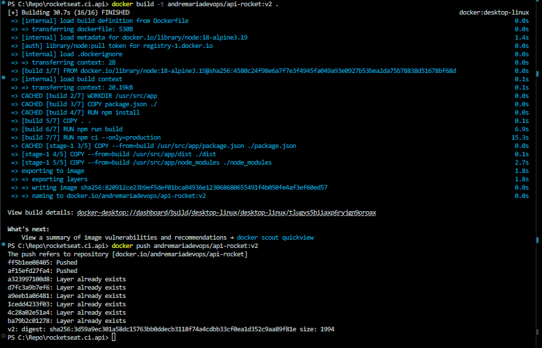


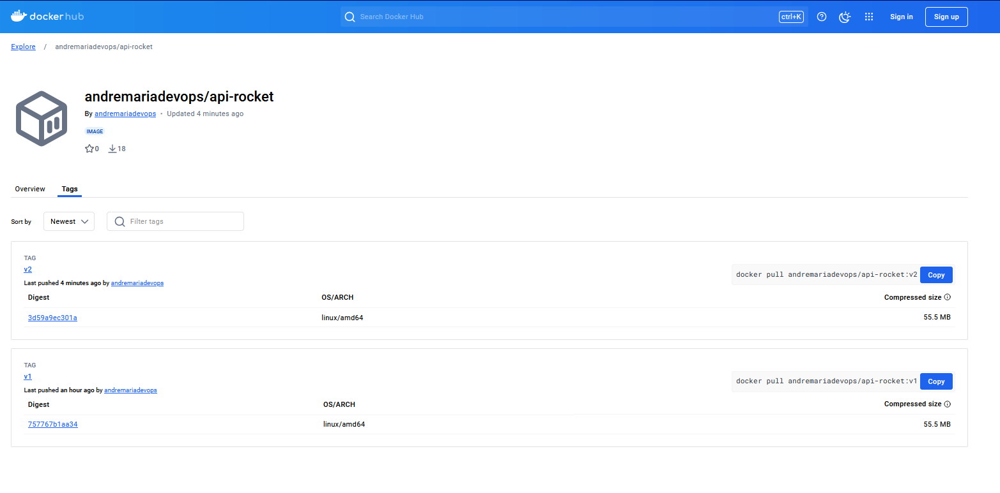

```bash

 kubectl apply -f k8s -n ns-rocket

```

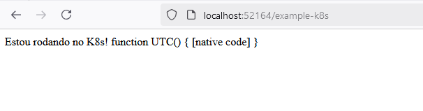


```
PS C:\Repo\rocketseat.ci.api> kubectl rollout history deployment/api-rocket -n ns-rocket
deployment.apps/api-rocket 
REVISION  CHANGE-CAUSE
2         <none>
3         <none>
4         <none>

PS C:\Repo\rocketseat.ci.api> 

```

**`"!Aqui todos os comando executados no terminal foram executados de forma imperativa!"`**

## ✨ Trabalhando Com Estratégias De Deploy

#### RollingUpdate

O **RollingUpdate** no Kubernetes é uma estratégia de atualização utilizada para atualizar os pods de forma controlada e sem causar downtime no serviço. Essa estratégia é usada no **Deployment** e no **StatefulSet**, permitindo substituir gradualmente os pods antigos por novos, garantindo que sempre haja um número mínimo de pods disponíveis durante o processo.

#### Como funciona o RollingUpdate?

#### 1. Troca Gradual de Pods
- O Kubernetes cria novos pods com a versão atualizada da aplicação.
- Em seguida, remove os pods antigos, um por vez, ou conforme a configuração.

#### 2. Configurações Principais
No arquivo YAML do Deployment ou StatefulSet, você pode configurar os seguintes parâmetros no campo `strategy`:

- **`maxUnavailable`**: Define o número máximo de pods que podem estar indisponíveis durante a atualização.
- **`maxSurge`**: Especifica quantos pods adicionais podem ser criados além do número desejado de réplicas.

#### Exemplo:

```yaml
apiVersion: apps/v1
kind: Deployment

metadata:
  name: api-rocket

spec:
  replicas: 2
  strategy:
    type: RollingUpdate
    rollingUpdate:
      maxUnavailable: 1
      maxSurge: 1
  selector:
    matchLabels:
      api: api-rocket
  template:
    metadata:
      labels:
        api: api-rocket
    spec:
      containers:
      - name: api-rocket
        image: andremariadevops/api-rocket:v2
        imagePullPolicy: IfNotPresent
        resources:
          requests:
            cpu: 100m
            memory: 64Mi
          limits:
            cpu: "200m"
            memory: "128Mi"
        ports:
        - containerPort: 3000
```

#### 3. Interrupção de Atualizações
- Se algo der errado, é possível interromper (pause) ou reverter a atualização (rollback) para evitar downtime ou problemas maiores.

#### 4. Comandos úteis
- **Pausar** uma atualização:
  ```bash
  kubectl rollout pause deployment/my-deployment
  ```
- **Retomar** a atualização:
  ```bash
  kubectl rollout resume deployment/my-deployment
  ```
- **Verificar o status** da atualização:
  ```bash
  kubectl rollout status deployment/my-deployment
  ```
- **Reverter** para uma versão anterior:
  ```bash
  kubectl rollout undo deployment/my-deployment
  ```

#### 5. Vantagens do RollingUpdate
- **Sem downtime**: Garante disponibilidade durante o processo.
- **Controlável**: Permite configurar tolerâncias para indisponibilidade e escalar gradualmente.

#### 6. Limitações
- Pode ser mais lento que uma substituição completa.
- Não é ideal para cenários em que é necessária consistência absoluta entre todos os pods (nesse caso, pode-se usar a estratégia **Recreate**).

Se precisar de um exemplo mais detalhado ou ajustes para um caso específico, me avise!


## ✨ Entendendo o Recreate

#### Estratégia `Recreate` no Kubernetes

A estratégia **`Recreate`** no Kubernetes é uma das duas principais estratégias de atualização disponíveis (a outra é **`RollingUpdate`**). Essa estratégia é utilizada em controladores como o **`Deployment`** e o **`StatefulSet`**, definindo como os pods devem ser gerenciados durante uma atualização.

#### O que é a estratégia `Recreate`?
- **Comportamento**: Na estratégia `Recreate`, todos os pods do conjunto antigo são **primeiro terminados** antes que os novos sejam criados. Isso significa que haverá um período de indisponibilidade enquanto a transição ocorre.
- **Configuração**: Essa estratégia é útil para aplicações que não suportam múltiplas versões em execução ao mesmo tempo ou quando o estado compartilhado entre as versões pode causar conflitos.

#### Quando usar `Recreate`?
- **Aplicações com estado**: Quando sua aplicação mantém um estado que pode ser corrompido se múltiplas instâncias (ou versões diferentes) forem executadas simultaneamente.
- **Conexões exclusivas**: Se o aplicativo usa conexões de longa duração, filas, ou qualquer recurso exclusivo que não permita concorrência entre múltiplas versões.
- **Compatibilidade restrita**: Quando não há compatibilidade retroativa ou compatibilidade entre versões (por exemplo, uma aplicação com mudanças radicais no banco de dados ou API).

#### Vantagens do `Recreate`
1. **Simplicidade**: A estratégia elimina a necessidade de gerenciar múltiplas versões simultaneamente.
2. **Evita conflitos**: Ideal para cenários em que as versões do aplicativo podem interferir uma na outra.
3. **Previsibilidade**: Como todos os pods antigos são encerrados antes de iniciar os novos, é mais fácil garantir consistência.

#### Desvantagens do `Recreate`
1. **Indisponibilidade**: Haverá um período de downtime entre o término dos pods antigos e o início dos novos.
2. **Impacto em usuários**: Pode não ser adequado para aplicações críticas onde a disponibilidade contínua é essencial.

#### Dicas ao usar `Recreate`
- **Planeje janelas de manutenção**: Use a estratégia durante períodos de baixa demanda para minimizar o impacto nos usuários.
- **Monitore os recursos**: Certifique-se de que os novos pods podem ser inicializados rapidamente para reduzir o downtime.
- **Use readiness probes**: Isso ajuda a garantir que os novos pods estejam totalmente funcionais antes de considerar a atualização como concluída.

A estratégia `Recreate` é um bom ajuste para cenários específicos, mas, para a maioria das aplicações modernas, a **estratégia `RollingUpdate`** é mais recomendada por evitar downtime.

## ✨ Explorando Variável de Ambiente na Aplicação

#### Configurar e Consumir Informações de um Arquivo `.env` no NestJS

No NestJS, você pode configurar e consumir informações de um arquivo `.env` usando o pacote `@nestjs/config`. Abaixo está um guia passo a passo:

---

#### 1. Instalar Dependências
Primeiro, instale o pacote necessário para trabalhar com variáveis de ambiente:

```bash
npm install @nestjs/config dotenv
```

---

#### 2. Criar um Arquivo `.env`
Crie um arquivo `.env` na raiz do seu projeto e adicione suas variáveis:


```env
APP=rocketseat-app
```

#### 3. Configurar o Módulo de Configuração no AppModule
No arquivo `app.module.ts`, importe e configure o módulo de configuração:

```typescript
import { Module } from '@nestjs/common';
import { ConfigModule } from '@nestjs/config';

@Module({
  imports: [
    ConfigModule.forRoot({
      isGlobal: true, // Torna o módulo global, não precisa importar em outros módulos
      envFilePath: '.env', // Caminho do arquivo .env (opcional, padrão é .env)
    }),
  ],
})
export class AppModule {}
```
#### 4. Consumir Variáveis no Código
Use o serviço `AppService` para acessar as variáveis de ambiente. Você pode injetar o `ConfigService` em qualquer lugar.

```typescript
import { Injectable } from '@nestjs/common';

@Injectable()
export class AppService {
  getHello(): string {
    return 'Rocketset Api!';
  }

  getExample(): string {
    
    return `Estou rodando no K8s! ${ Date.UTC }: ${process.env.APP}`;
  }
}
```

Agora, seu aplicativo NestJS está configurado para consumir e validar variáveis de ambiente do arquivo `.env`! 🚀

## ✨ Entendendo sobre o ConfigMap

```yaml
apiVersion: apps/v1
kind: Deployment

metadata:
  name: api-rocket

spec:
  replicas: 3
  strategy:
    type: RollingUpdate
    rollingUpdate:
      maxUnavailable: 20%
      maxSurge: 10%
  selector:
    matchLabels:
      api: api-rocket
  template:
    metadata:
      labels:
        api: api-rocket
    spec:
      containers:
      - name: api-rocket
        image: andremariadevops/api-rocket:v2
        imagePullPolicy: IfNotPresent
        resources:
          requests:
            cpu: 100m
            memory: 64Mi
          limits:
            cpu: "200m"
            memory: "128Mi"
        ports:
        - containerPort: 3000
```

```bash

kubectl apply -f k8s/deployment.yaml -n ns-rocket

```

```bash

docker build -t andremariadevops/api-rocket:v3 .

```


```bash

docker push andremariadevops/api-rocket:v3

```

```yaml
apiVersion: apps/v1
kind: Deployment

metadata:
  name: api-rocket

spec:
  replicas: 3
  strategy:
    type: RollingUpdate
    rollingUpdate:
      maxUnavailable: 20%
      maxSurge: 10%
  selector:
    matchLabels:
      api: api-rocket
  template:
    metadata:
      labels:
        api: api-rocket
    spec:
      containers:
      - name: api-rocket
        image: andremariadevops/api-rocket:v3
        imagePullPolicy: IfNotPresent
        resources:
          requests:
            cpu: 100m
            memory: 64Mi
          limits:
            cpu: "200m"
            memory: "128Mi"
        ports:
        - containerPort: 3000
```

```bash

kubectl apply -f k8s/deployment.yaml -n ns-rocket

```

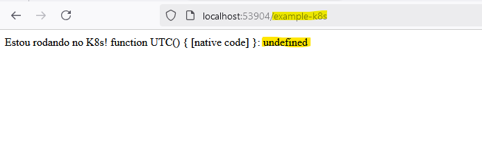


Como podemos ver o valor entre a APP do env e a aplicação estão indefinidos. Para resolvermos esse problema vamos criar um novo arquivo 
`configmap.yaml`.


```yaml
apiVersion: v1
kind: ConfigMap

metadata:
  name: api-rocket
data:
  app-name: rocketseat-app

```


#### Propósito do Script
A definição de um **ConfigMap** no Kubernetes. Um **ConfigMap** é usado para armazenar pares de chave-valor que podem ser utilizados pelas aplicações em contêiners, 
permitindo a configuração de aplicações sem necessidade de alterar suas imagens.


#### 1. `apiVersion: v1`
- **Significado:** Define a versão da API do Kubernetes que será usada para criar este objeto.
- **Detalhes:** A versão `v1` é a versão estável e comumente usada para objetos como ConfigMaps.

#### 2. `kind: ConfigMap`
- **Significado:** Especifica o tipo de recurso que está sendo definido.
- **Detalhes:** Neste caso, o recurso é um ConfigMap, que será usado para armazenar dados de configuração em forma de texto simples.

#### 3. `metadata:`
- **Significado:** Contém metadados sobre o recurso.
- **Detalhes:** Esta seção inclui informações como o nome do ConfigMap e, opcionalmente, labels e anotações para identificação e organização.

##### 3.1. `name: api-rocket`
- **Significado:** Define o nome do ConfigMap.
- **Detalhes:** O nome é `api-rocket`, que será usado para referenciar este ConfigMap em outros recursos do Kubernetes.

#### 4. `data:`
- **Significado:** Contém os dados de configuração em formato de pares de chave-valor.
- **Detalhes:** Os dados aqui definidos podem ser usados por aplicações para configurar seu funcionamento.

##### 4.1. `app-name: rocketseat-app`
- **Significado:** Define um par chave-valor onde:
  - `app-name` é a chave.
  - `rocketseat-app` é o valor associado à chave.
- **Detalhes:** Este valor pode ser utilizado por uma aplicação em execução para, por exemplo, identificar o nome do aplicativo.

### Exemplo de Uso
- Este ConfigMap pode ser montado como um arquivo ou passado como variável de ambiente para os contêiners que fazem parte de um **Pod** no Kubernetes.


### Benefícios do Uso do ConfigMap
- **Centralização de Configuração:** Facilita a alteração de parâmetros sem a necessidade de reconstruir as imagens dos contêineres.
- **Flexibilidade:** Permite que a mesma imagem seja usada em diferentes ambientes com configurações distintas.
- **Manutenção:** Facilita a gestão de configurações em ambientes dinâmicos e escaláveis.


```bash

kubectl apply -f k8s/configmap.yaml -n ns-rocket

```


```bash

kubectl apply -f k8s/deployment.yaml -n ns-rocket

```


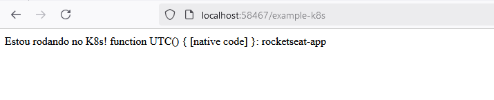

## ✨ Explorando o objeto Secret


Vamos criar um novo arquivo 
`secret.yaml`.

```yaml
apiVersion: v1
kind: Secret

metadata:
  name:  api-rocket-secrets
type: Opaque
data:
  api-key: cm9ja2V0c2VhdC1hcHA=

```

`app-key: cm9ja2V0c2VhdC1hcHA=` o valor da `app-key` deve ser em base 64 


```bash

kubectl apply -f k8s/secret.yaml -n ns-rocket

```

```bash

docker build -t andremariadevops/api-rocket:v4 .

```


```bash

docker push andremariadevops/api-rocket:v4

```

```yaml
apiVersion: apps/v1
kind: Deployment

metadata:
  name: api-rocket

spec:
  replicas: 3
  strategy:
    type: RollingUpdate
    rollingUpdate:
      maxUnavailable: 20%
      maxSurge: 10%
  selector:
    matchLabels:
      api: api-rocket
  template:
    metadata:
      labels:
        api: api-rocket
    spec:
      containers:
      - name: api-rocket
        image: andremariadevops/api-rocket:v4
        imagePullPolicy: IfNotPresent
        env:
          - name:  APP
            valueFrom:
              configMapKeyRef:
                name:  api-rocket
                key:  app-name
          - name:  API_KEY
            valueFrom:
              secretKeyRef:
                name:  api-rocket-secrets
                key:  api-key
        resources:
          requests:
            cpu: 100m
            memory: 64Mi
          limits:
            cpu: "200m"
            memory: "128Mi"
        ports:
        - containerPort: 3000
        - containerPort: 3000
```
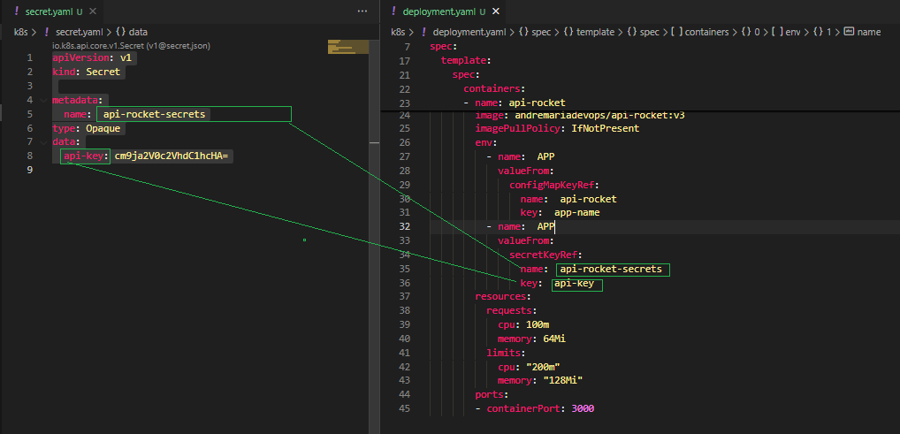


```bash

kubectl apply -f k8s/deployment.yaml -n ns-rocket

```

## ✨ Melhorando Gerenciamento de Envs

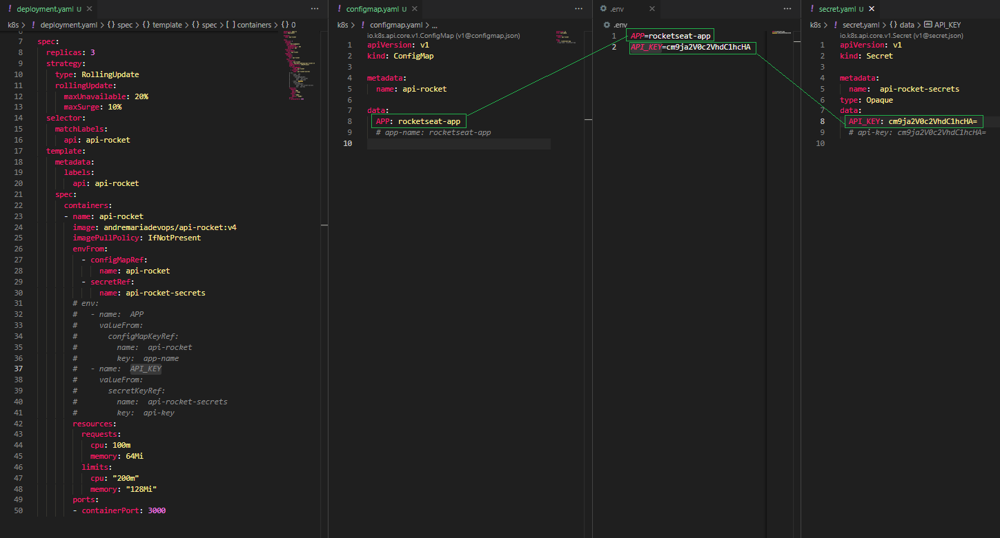

```yaml

apiVersion: apps/v1
kind: Deployment

metadata:
  name: api-rocket

spec:
  replicas: 3
  strategy:
    type: RollingUpdate
    rollingUpdate:
      maxUnavailable: 20%
      maxSurge: 10%
  selector:
    matchLabels:
      api: api-rocket
  template:
    metadata:
      labels:
        api: api-rocket
    spec:
      containers:
      - name: api-rocket
        image: andremariadevops/api-rocket:v4
        imagePullPolicy: IfNotPresent
        envFrom:
          - configMapRef:
              name: api-rocket
          - secretRef:
              name: api-rocket-secrets
        # env:
        #   - name:  APP
        #     valueFrom:
        #       configMapKeyRef:
        #         name:  api-rocket
        #         key:  app-name
        #   - name:  API_KEY
        #     valueFrom:
        #       secretKeyRef:
        #         name:  api-rocket-secrets
        #         key:  api-key
        resources:
          requests:
            cpu: 100m
            memory: 64Mi
          limits:
            cpu: "200m"
            memory: "128Mi"
        ports:
        - containerPort: 3000

```

```yaml
apiVersion: v1
kind: ConfigMap

metadata:
  name: api-rocket

data:
  APP: rocketseat-app
  # app-name: rocketseat-app

```

```yaml
apiVersion: v1
kind: Secret

metadata:
  name:  api-rocket-secrets
type: Opaque
data:
  API_KEY: cm9ja2V0c2VhdC1hcHA=
  # api-key: cm9ja2V0c2VhdC1hcHA=

```

#### Explicação das Mudanças nos Trechos Comentados do Deployment

No **Deployment** do Kubernetes, o trecho comentado utilizava variáveis de ambiente específicas referenciadas diretamente nos campos `env` (`APP` e `API_KEY`). No trecho atual, optou-se por utilizar os recursos `envFrom` para importar variáveis de ambiente de um **ConfigMap** e de um **Secret**. Essa alteração traz as seguintes vantagens:

---

#### 1. Manutenção Simplificada
- **Comentado**:
  - Variáveis de ambiente específicas (`APP` e `API_KEY`) são configuradas diretamente no `Deployment`. Caso outras variáveis precisem ser adicionadas ou modificadas, o arquivo do `Deployment` precisaria ser alterado.

- **Atual**:
  - O uso de `envFrom` permite que todas as variáveis contidas no `ConfigMap` e no `Secret` sejam automaticamente carregadas, evitando alterações repetidas no `Deployment`.

---

#### 2. Segregação de Responsabilidades
- **Comentado**:
  - Todas as definições de variáveis (tanto sensíveis quanto não sensíveis) estão no mesmo local.

- **Atual**:
  - Separar as variáveis sensíveis (`API_KEY`, no `Secret`) e não sensíveis (`APP`, no `ConfigMap`) melhora a organização e facilita o controle. **ConfigMaps** são usados para dados não confidenciais, enquanto **Secrets** são criptografados.

---

#### 3. Escalabilidade e Reutilização
- **Comentado**:
  - Cada variável de ambiente precisava ser explicitamente mapeada, tornando o arquivo de configuração menos reutilizável em diferentes cenários.

- **Atual**:
  - `ConfigMap` e `Secret` podem ser reutilizados por outros **Deployments** ou serviços que precisem das mesmas variáveis. Isso elimina redundâncias e simplifica a gestão de configurações.

---

#### 4. Redução de Erros
- **Comentado**:
  - O uso de `configMapKeyRef` e `secretKeyRef` exige especificar cada chave e pode levar a erros caso o nome ou a chave estejam incorretos.

- **Atual**:
  - `envFrom` reduz a possibilidade de erros, pois todas as chaves válidas no `ConfigMap` ou no `Secret` são automaticamente carregadas.

---

#### Alterações no **ConfigMap** e **Secret**

##### **ConfigMap**
- **Comentado**:
  - Definição direta da chave `app-name`, que é referenciada no `Deployment`.
- **Atual**:
  - Alterado para usar diretamente a variável `APP`, facilitando o carregamento pelo `envFrom` e mantendo consistência com o `.env`.

##### **Secret**
- **Comentado**:
  - Chave nomeada como `api-key`, usada diretamente no `Deployment`.
- **Atual**:
  - Alterada para `API_KEY`, mantendo consistência com o `.env` e simplificando o carregamento via `envFrom`.

---

#### Vantagens Adicionais
1. **Conformidade com Boas Práticas**: A separação entre ConfigMap e Secret é alinhada às práticas recomendadas do Kubernetes.
2. **Integração com Ferramentas DevOps**: O uso de `.env` como referência facilita a integração com pipelines de CI/CD e evita discrepâncias entre o ambiente local e o Kubernetes.
3. **Escalabilidade**: O novo formato suporta com facilidade a adição de mais variáveis, sem necessidade de alterações estruturais no `Deployment`.


```bash

kubectl apply -f k8s/secret.yaml -n ns-rocket

```

```bash

kubectl apply -f k8s/configmap.yaml -n ns-rocket

```

```bash

kubectl apply -f k8s/deployment.yaml -n ns-rocket

```


# Conhecendo o HPA

## O que é Escala

## Conhecendo a escala vertical

**`"Escala Vertical"`** 
- Aumenta o tamanho da máquina - em termos de cpu, memória, armazenamento.
- Necessário em casos de grande escala com apenas uma máquina.
- Menor redundância e maior risco de indisponibilidade.
- Limite do próprio hardware
- Promove down time dentro de um determinado período
- VPA dentro do k8s

## Explorando a escala horizontal

**`"Escala horizontal"`** 
- Replicação da infraestrutura.
- Visa Distribuir igualmente as cargas de trabalho.
- Aumento a tolerância a falhas.
- Por ser horizontal, temos uma maior redundância.
- A escala não está restrita aos limites do hardware.
- Condicionada aos recursos e/ou eventos - KEDA.
- ! Possíveis problemas na consistência de dados!

## Como o Metrics-Server funciona

O **`"Metrics"`** Server é um componente essencial no ecossistema do Kubernetes para coletar e expor métricas de uso de recursos `(como CPU e memória)` em tempo real dos nós e dos pods em um cluster. 

Ele é um substituto moderno para o antigo heapster e faz parte das APIs de métricas do Kubernetes.

---

#### **Como funciona o Metrics Server**

1. **Coleta de Métricas:**
   - O Metrics Server coleta métricas de uso de recursos diretamente dos agentes do Kubernetes, chamados de **kubelet**, que estão presentes em cada nó do cluster.
   - O kubelet usa o **cAdvisor** (integrado) para monitorar o uso de recursos no nível do nó e dos contêineres.

2. **Exposição de Métricas:**
   - As métricas coletadas pelo Metrics Server são expostas por meio da **API de métricas do Kubernetes** (`metrics.k8s.io`).
   - Essas métricas são disponibilizadas para componentes internos, como o **Horizontal Pod Autoscaler (HPA)**, e também podem ser acessadas por comandos como `kubectl top`.

3. **Eficiência e Escalabilidade:**
   - Ele é projetado para ser leve e eficiente, armazenando apenas métricas em tempo real (não mantém histórico).
   - É ideal para aplicações onde o foco está em ações imediatas baseadas em métricas, como escalonamento horizontal.

---

#### **Para que serve o Metrics Server**

1. **Escalonamento Horizontal Automático (HPA):**
   - Permite que o Kubernetes ajuste automaticamente o número de réplicas de um deployment ou replica set com base em métricas de uso de CPU e memória.

2. **Monitoramento em Tempo Real:**
   - Fornece informações sobre o consumo atual de recursos dos pods e nós do cluster.

## Adicionando o Metrics-Server no nosso Cluster"

Vamos acessar ao site :

https://github.com/kubernetes-sigs/metrics-server

Vamos rodar o seguinte comando :

```bash
kubectl apply -f https://github.com/kubernetes-sigs/metrics-server/releases/latest/download/components.yaml
```

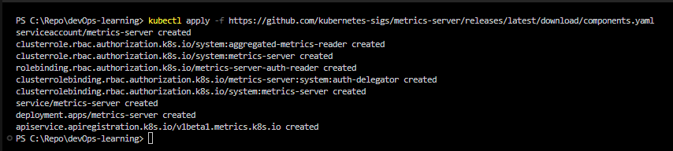

Vamos ver se funciona.

```bash
kubectl get po -n kube-system
```

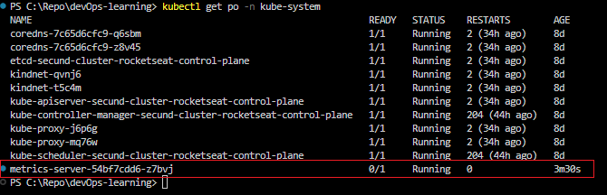

Como podemos ver na imagem o pod `metrics-server-54bf7cdd6-z7bvj` não esta em execução.

Para analizarmos melhor o problema vamos rodar o seguinte comando:

```bash
kubectl logs metrics-server-54bf7cdd6-z7bvj -n kube-system
```

```bash
E1203 22:07:33.612329       1 scraper.go:149] "Failed to scrape node" err="Get \"https://172.23.0.2:10250/metrics/resource\": tls: failed to verify certificate: x509: cannot validate certificate for 172.23.0.2 because it doesn't contain any IP SANs" node="secund-cluster-rocketseat-worker"
E1203 2
```

Como estamos em um ambiente local não é possível validar o certificado.

Para resolver esse problema vamos ao site https://github.com/kubernetes-sigs/metrics-server 

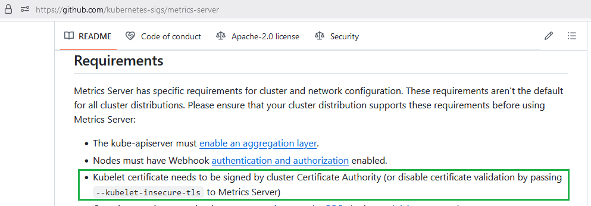

- primeiro é excluir o metrics-server

```bash
kubectl delete -f https://github.com/kubernetes-sigs/metrics-server/releases/latest/download/components.yaml
```

- Vamos acessar a pasta k8s e vamos rodar o seguinte comando:

```bash
wget https://github.com/kubernetes-sigs/metrics-server/releases/latest/download/components.yaml
```

ou 

```bash
Invoke-WebRequest -Uri https://github.com/kubernetes-sigs/metrics-server/releases/latest/download/components.yaml -OutFile components.yaml

```

Aqui fizemos o download para a pasta para internalizar o arquivo para que possamos configura-lo conforme a necessidade.


Agora vamos editar o conteudo do arquivo.

- renomear o arquivo para `metrics-server.yaml`
- vamos adicionar `--kubelet-insecure-tls` no trecho `- args` do trecho `Deployment` do arquivo.

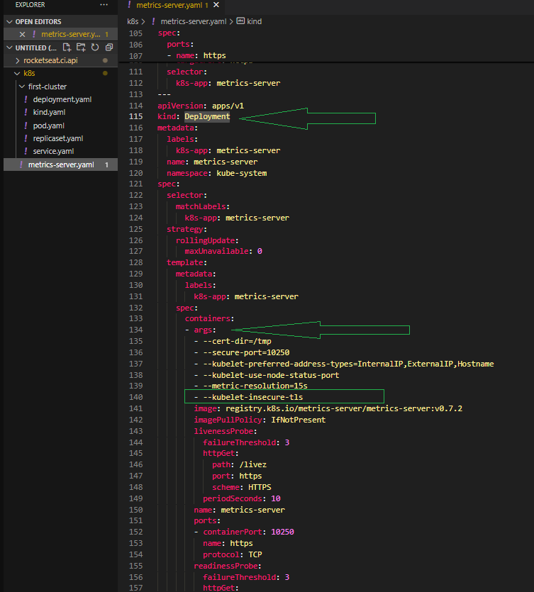

- vamos rodar o camando

```bash
kubectl apply -f metrics-server.yaml
```

```bash
kubectl get po -n kube-system
```

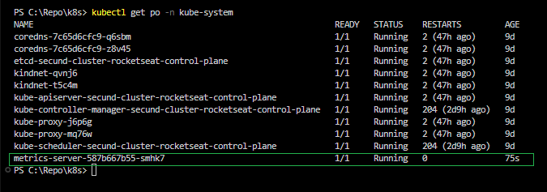

agora podemos ver que as metricas nos pods relacionados a nossa api possuem valores:

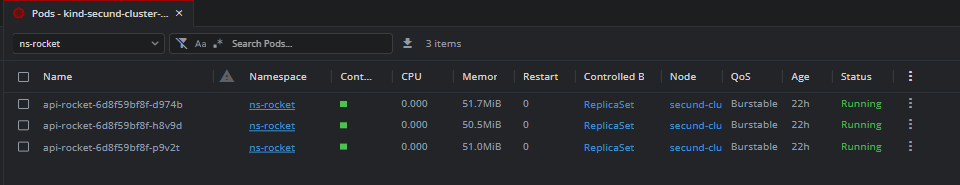

- Consultando logs pleo comando:

```bash
kubectl top po -n ns-rocket
```

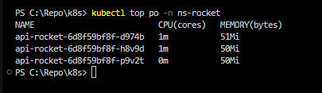

## Entendendo os Principais Triggers

## Explorando a V1 do HPA

Vamos criar uma novo arquivo `hpa.yaml`

```yaml
apiVersion: autoscaling/v1
kind: HorizontalPodAutoscaler

metadata:
  name: api-rocket-hpa
spec:
  scaleTargetRef:
    apiVersion: apps/v1
    kind: Deployment
    name: api-rocket
  minReplicas: 3
  maxReplicas: 8
  targetCPUUtilizationPercentage: 75

```

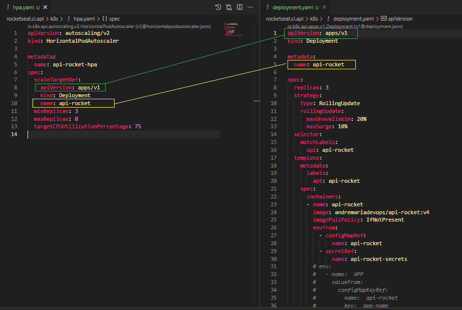


```bash
kubectl apply -f k8s/hpa.yaml -n ns-rocket
```

```bash
kubectl get hpa -n ns-rocket
```

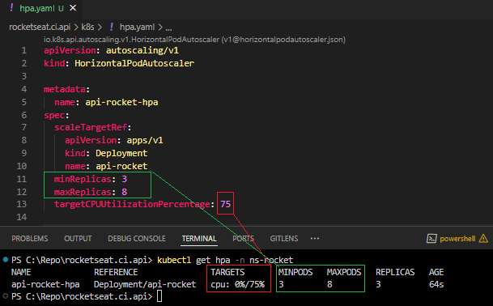

Aqui estamos usando a v1 para o hpa vamos. Vamos fazer o upgrade para V2. Mas antes vamos excluir o hpa do cluster.

```bash
kubectl delete -f k8s/hpa.yaml -n ns-rocket
```
Vamos renomear o arquivo para `hpa-v1.yaml`

```yaml
apiVersion: autoscaling/v2
kind: HorizontalPodAutoscaler

metadata:
  name: api-rocket-hpa
spec:
  scaleTargetRef:
    apiVersion: apps/v1
    kind: Deployment
    name: api-rocket
  minReplicas: 3
  maxReplicas: 8
  metrics:
  - type: Resource
    resource:
      name: cpu
      target:
        type: Utilization
        averageUtilization: 75
  - type: Resource
    resource:
      name: memory
      target:
        type: Utilization
        averageUtilization: 80
  
```

```bash
kubectl apply -f k8s/hpa.yaml -n ns-rocket
```

```bash
kubectl get hpa -n ns-rocket
```

```bash
PS C:\Repo\rocketseat.ci.api> kubectl get hpa -n ns-rocket
NAME             REFERENCE               TARGETS                        MINPODS   MAXPODS   REPLICAS   AGE
api-rocket-hpa   Deployment/api-rocket   cpu: 0%/75%, memory: 79%/80%   3         8         3          36s
PS C:\Repo\rocketseat.ci.api> 

```

## Criando o HPA Utilizando a V2

Vamos criar uma novo arquivo `hpa.yaml`

```yaml

apiVersion: autoscaling/v2
kind: HorizontalPodAutoscaler

metadata:
  name: api-rocket-hpa
spec:
  scaleTargetRef:
    apiVersion: apps/v1
    kind: Deployment
    name: api-rocket
  minReplicas: 3
  maxReplicas: 8
  metrics:
  - type: Resource
    resource:
      name: cpu
      target:
        type: Utilization
        averageUtilization: 75
  - type: Resource
    resource:
      name: memory
      target:
        type: Utilization
        averageUtilization: 80
  

```

```bash
kubectl apply -f k8s/hpa-v2.yaml -n ns-rocket
```

```bash
kubectl get hpa -n ns-rocket
```

## Estressando a Nossa Aplicação


Vamos testar a ideia de `HorizontalPodAutoscaler` estressando a aplicação.

Para isso vamos acessar o site : https://github.com/fortio/fortio

Aqui temos a possibilidade de realizar testes de carga.

```bash
kubectl run -it fortio -n ns-rocket --rm --image=fortio/fortio -- load -qps 6000 -t 120s -c 50 "http://api-rocket-svc/example-k8s"
```
#### Descrição do Comando

Este comando executa um **teste de carga** em um serviço web hospedado no Kubernetes usando a ferramenta **Fortio**. Abaixo está o detalhamento de cada parte do comando.

---

#### Partes do Comando

#### 1. `kubectl run`
- **`kubectl`**: Ferramenta CLI para interagir com clusters Kubernetes.
- **`run`**: Cria e executa um pod no cluster Kubernetes.

#### 2. Nome do pod: `fortio`
- Define o nome do pod temporário como **`fortio`**.

#### 3. `-it`
- **`-i`**: Habilita entrada interativa para o pod.
- **`-t`**: Ativa o modo de terminal, conectando seu terminal local ao processo do pod.

#### 4. `-n ns-rocket`
- Especifica o **namespace** Kubernetes onde o pod será criado.
- **`ns-rocket`**: Nome do namespace.

#### 5. `--rm`
- Remove automaticamente o pod após sua execução. Isso evita acumular pods temporários.

#### 6. `--image=fortio/fortio`
- Define a **imagem Docker** a ser usada.
- **`fortio/fortio`**: Imagem da ferramenta Fortio, usada para testes de desempenho e carga.

#### 7. `-- load`
- Ativa o modo **teste de carga** no Fortio.

#### 8. `-qps 6000`
- Define o número de **requisições por segundo (QPS)**.
- **`6000`**: Envia **6.000 requisições por segundo**.

#### 9. `-t 120s`
- Especifica a **duração do teste**.
- **`120s`**: O teste será executado por **120 segundos (2 minutos)**.

#### 10. `-c 50`
- Define o número de **conexões simultâneas (threads)**.
- **`50`**: Usa **50 conexões simultâneas** durante o teste.

#### 11. `"http://api-rocket-svc/example-k8s"`
- Define o **endpoint** a ser testado.
- **`http://api-rocket-svc/example-k8s`**: URL do serviço que será submetido ao teste de carga.
- Como está dentro do Cluster é possível enxergar o serviço.
---

#### Resumo do que o comando faz

1. Cria um pod temporário no namespace **`ns-rocket`** utilizando a imagem do Fortio.
2. Executa um teste de carga contra o endpoint **`http://api-rocket-svc/example-k8s`**.
3. Envia **6.000 requisições por segundo** durante **120 segundos**, utilizando **50 conexões simultâneas**.
4. Após o término do teste, o pod é automaticamente removido.

---

#### Resultados Esperados

Durante o teste, o Fortio coleta as seguintes métricas:
- **Latência das requisições** (ex.: p95, p99).
- **Taxa de sucesso** das requisições.
- **Erros de rede** ou falhas no serviço.


```bash

Connection time histogram (s) : count 50 avg 0.00077979046 +/- 0.002684 min 4.5061e-05 max 0.015008246 sum 0.038989523
# range, mid point, percentile, count
>= 4.5061e-05 <= 0.001 , 0.000522531 , 94.00, 47
> 0.004 <= 0.005 , 0.0045 , 96.00, 1
> 0.011 <= 0.012 , 0.0115 , 98.00, 1
> 0.014 <= 0.0150082 , 0.0145041 , 100.00, 1
# target 50% 0.00054329
# target 75% 0.000802784
# target 90% 0.000958481
# target 99% 0.0145041
# target 99.9% 0.0149578
Sockets used: 50 (for perfect keepalive, would be 50)
Uniform: false, Jitter: false, Catchup allowed: true
IP addresses distribution:
10.96.107.209:80: 50
Code 200 : 165015 (100.0 %)
Response Header Sizes : count 165015 avg 228 +/- 0 min 228 max 228 sum 37623420
Response Body/Total Sizes : count 165015 avg 298 +/- 0 min 298 max 298 sum 49174470
All done 165015 calls (plus 50 warmup) 36.354 ms avg, 1374.1 qps
Session ended, resume using 'kubectl attach fortio -c fortio -i -t' command when the pod is running
pod "fortio" deleted

```

## Explorando mais cenários de estresse

Vamos alterar o arquivo `app.service.ts` da aplicação :

```typescript
import { Injectable } from '@nestjs/common';
import  { createWriteStream } from 'fs'
@Injectable()
export class AppService {
  getHello(): string {
    console.log(`secret: ${ process.env.API_KEY }`)
    return 'Rocketset Api!';
  }

  getExample(): string {
    const file = createWriteStream('rocketseat.txt')
    for (let index = 0; index <= 10000; index++) {
      file.write('Estou escrevendo em um arquivo\n');
    }
    file.end();
    return `Estou rodando no K8s! ${ Date.UTC }: ${process.env.APP}`;
  }
}
```

```bash
docker build -t andremariadevops/api-rocket:v5 .    
```

```bash

docker push andremariadevops/api-rocket:v5  

```

```yaml
apiVersion: apps/v1
kind: Deployment

metadata:
  name: api-rocket

spec:
  replicas: 3
  strategy:
    type: RollingUpdate
    rollingUpdate:
      maxUnavailable: 20%
      maxSurge: 10%
  selector:
    matchLabels:
      api: api-rocket
  template:
    metadata:
      labels:
        api: api-rocket
    spec:
      containers:
      - name: api-rocket
        image: andremariadevops/api-rocket:v5
        imagePullPolicy: IfNotPresent
        envFrom:
          - configMapRef:
              name: api-rocket
          - secretRef:
              name: api-rocket-secrets
        # env:
        #   - name:  APP
        #     valueFrom:
        #       configMapKeyRef:
        #         name:  api-rocket
        #         key:  app-name
        #   - name:  API_KEY
        #     valueFrom:
        #       secretKeyRef:
        #         name:  api-rocket-secrets
        #         key:  api-key
        resources:
          requests:
            cpu: 100m
            memory: 64Mi
          limits:
            cpu: "200m"
            memory: "128Mi"
        ports:
        - containerPort: 3000
```

```bash
 kubectl apply -f k8s/deployment.yaml -n ns-rocket 
```

Agora vamos iniciar o nosso teste de estesse

```bash
kubectl run -it fortio -n ns-rocket --rm --image=fortio/fortio -- load -qps 6000 -t 120s -c 50 "http://api-rocket-svc/example-k8s"
```

```bash
Connection time histogram (s) : count 252 avg 0.00070557625 +/- 0.003099 min 4.8129e-05 max 0.03114827 sum 0.177805214
# range, mid point, percentile, count
>= 4.8129e-05 <= 0.001 , 0.000524065 , 95.63, 241
> 0.001 <= 0.002 , 0.0015 , 96.83, 3
> 0.002 <= 0.003 , 0.0025 , 97.62, 2
> 0.003 <= 0.004 , 0.0035 , 98.02, 1
> 0.004 <= 0.005 , 0.0045 , 98.41, 1
> 0.006 <= 0.007 , 0.0065 , 98.81, 1
> 0.025 <= 0.03 , 0.0275 , 99.60, 2
> 0.03 <= 0.0311483 , 0.0305741 , 100.00, 1
# target 50% 0.000543895
# target 75% 0.000793761
# target 90% 0.000943681
# target 99% 0.0262
# target 99.9% 0.0308589
Sockets used: 252 (for perfect keepalive, would be 50)
Uniform: false, Jitter: false, Catchup allowed: true
IP addresses distribution:
10.96.107.209:80: 252
Code  -1 : 120 (2.8 %)
Code 200 : 4159 (97.2 %)
Response Header Sizes : count 4279 avg 221.60598 +/- 37.64 min 0 max 228 sum 948252
Response Body/Total Sizes : count 4279 avg 289.64291 +/- 49.2 min 0 max 298 sum 1239382
All done 4279 calls (plus 50 warmup) 1413.665 ms avg, 34.9 qps
Session ended, resume using 'kubectl attach fortio -c fortio -i -t' command when the pod is running
pod "fortio" deleted
```

## Alterando Recursos e Réplicas da Aplicação

NO ultimo test temos como resultado ***`"All done 4279 calls (plus 50 warmup) 1413.665 ms avg, 34.9 qps"`***

vamos altera o arquivo `hpa-v2.yaml` 

```yaml
apiVersion: autoscaling/v2
kind: HorizontalPodAutoscaler

metadata:
  name: api-rocket-hpa
spec:
  scaleTargetRef:
    apiVersion: apps/v1
    kind: Deployment
    name: api-rocket
  minReplicas: 6
  maxReplicas: 10
  metrics:
  - type: Resource
    resource:
      name: cpu
      target:
        type: Utilization
        averageUtilization: 75
  - type: Resource
    resource:
      name: memory
      target:
        type: Utilization
        averageUtilization: 80
  
```

vamos altera o arquivo `deployment.yaml` 

```yaml
apiVersion: apps/v1
kind: Deployment

metadata:
  name: api-rocket

spec:
  replicas: 6
  strategy:
    type: RollingUpdate
    rollingUpdate:
      maxUnavailable: 20%
      maxSurge: 10%
  selector:
    matchLabels:
      api: api-rocket
  template:
    metadata:
      labels:
        api: api-rocket
    spec:
      containers:
      - name: api-rocket
        image: andremariadevops/api-rocket:v5
        imagePullPolicy: IfNotPresent
        envFrom:
          - configMapRef:
              name: api-rocket
          - secretRef:
              name: api-rocket-secrets
        # env:
        #   - name:  APP
        #     valueFrom:
        #       configMapKeyRef:
        #         name:  api-rocket
        #         key:  app-name
        #   - name:  API_KEY
        #     valueFrom:
        #       secretKeyRef:
        #         name:  api-rocket-secrets
        #         key:  api-key
        resources:
          requests:
            cpu: 400m
            memory: 64Mi
          limits:
            cpu: "700m"
            memory: "128Mi"
        ports:
        - containerPort: 3000
```

```bash
kubectl run -it fortio -n ns-rocket --rm --image=fortio/fortio -- load -qps 6000 -t 120s -c 50 "http://api-rocket-svc/example-k8s"
```

```bash

Connection time histogram (s) : count 51 avg 0.024701479 +/- 0.03977 min 8.0373e-05 max 0.100979221 sum 1.25977541
# range, mid point, percentile, count
>= 8.0373e-05 <= 0.001 , 0.000540186 , 52.94, 27
> 0.001 <= 0.002 , 0.0015 , 56.86, 2
> 0.004 <= 0.005 , 0.0045 , 58.82, 1
> 0.005 <= 0.006 , 0.0055 , 66.67, 4
> 0.006 <= 0.007 , 0.0065 , 70.59, 2
> 0.016 <= 0.018 , 0.017 , 72.55, 1
> 0.03 <= 0.035 , 0.0325 , 74.51, 1
> 0.035 <= 0.04 , 0.0375 , 76.47, 1
> 0.04 <= 0.045 , 0.0425 , 78.43, 1
> 0.08 <= 0.09 , 0.085 , 80.39, 1
> 0.09 <= 0.1 , 0.095 , 84.31, 2
> 0.1 <= 0.100979 , 0.10049 , 100.00, 8
# target 50% 0.000946945
# target 75% 0.03625
# target 90% 0.100355
# target 99% 0.100917
# target 99.9% 0.100973
Sockets used: 51 (for perfect keepalive, would be 50)
Uniform: false, Jitter: false, Catchup allowed: true
IP addresses distribution:
10.96.107.209:80: 51
Code 200 : 10003 (100.0 %)
Response Header Sizes : count 10003 avg 228 +/- 0 min 228 max 228 sum 2280684
Response Body/Total Sizes : count 10003 avg 298 +/- 0 min 298 max 298 sum 2980894
All done 10003 calls (plus 50 warmup) 600.651 ms avg, 82.9 qps
Session ended, resume using 'kubectl attach fortio -c fortio -i -t' command when the pod is running
pod "fortio" deleted
```

***`"All done 4279 calls (plus 50 warmup) 1413.665 ms avg, 34.9 qps"`***
***`"All done 10003 calls (plus 50 warmup) 600.651 ms avg, 82.9 qps"`***

Como podemos ver, o teste foi executado em um desempenho superior.

## Definindo tempo de reação para escalonar a quantidade de réplicas

Vamos alterar o arquivo `hpa-v2.yaml`

```yaml
apiVersion: autoscaling/v2
kind: HorizontalPodAutoscaler

metadata:
  name: api-rocket-hpa
spec:
  scaleTargetRef:
    apiVersion: apps/v1
    kind: Deployment
    name: api-rocket
  minReplicas: 6
  maxReplicas: 10
  metrics:
  - type: Resource
    resource:
      name: cpu
      target:
        type: Utilization
        averageUtilization: 75
  - type: Resource
    resource:
      name: memory
      target:
        type: Utilization
        averageUtilization: 80
  behavior:
    scaleDown:
        stabilizationWindowSeconds: 30
        policies:
          - type: Pods
            value: 2
            periodSeconds: 15
        #   - type: Percent
        #     value: 20
        #     periodSeconds: 15
        # selectPolicy : Max
```


#### Comportamento do HorizontalPodAutoscaler (HPA)

O trecho `behavior` define o comportamento personalizado de escalonamento do **HorizontalPodAutoscaler (HPA)** ao aumentar ou diminuir o número de réplicas dos pods em um cluster Kubernetes. Vamos analisar cada parte desse trecho:

---

#### Seção: behavior

Essa seção é opcional e permite configurar políticas específicas para **escalonamento para cima** (`scaleUp`) ou **escalonamento para baixo** (`scaleDown`), fornecendo maior controle sobre como e quando o HPA deve realizar essas ações.

---

#### scaleDown (Escalonamento para baixo)

Aqui, configura-se como o HPA reduzirá o número de réplicas dos pods.

#### stabilizationWindowSeconds: 30

- Especifica uma "janela de estabilização" de **30 segundos**.
- Isso significa que o HPA esperará **30 segundos** antes de decidir reduzir o número de réplicas após detectar que o uso de recursos está abaixo do alvo.
- Serve para evitar que o HPA oscile frequentemente entre diferentes números de réplicas em situações de carga variável (chamado de *flapping*).

---

#### policies

Define as políticas para limitar como o **escalonamento para baixo** pode ocorrer. Neste exemplo, há apenas uma política ativa:

- **type: Pods**
  - Essa política controla diretamente o número de réplicas que podem ser reduzidas em uma única ação.
  - **value: 2**: Especifica que, no máximo, o HPA pode reduzir **2 réplicas** de uma só vez.
  - **periodSeconds: 15**: Especifica que essa redução máxima (**2 réplicas**) pode ocorrer a cada **15 segundos**.

---

#### Comentário

As linhas comentadas indicam que o HPA poderia usar outra política (baseada em **porcentagem**), mas ela foi desativada. Se a política `Percent` fosse ativada:

- **type: Percent**: O HPA reduziria as réplicas com base em uma porcentagem do número total de pods em execução.
- **value: 20**: Reduziria no máximo **20%** dos pods em execução.

#### selectPolicy

Define qual política usar se houver várias aplicáveis. Por exemplo:

- **Max**: Escolhe a política que resulta na maior redução (mais agressiva).
- **Min**: Escolhe a política que resulta na menor redução (mais conservadora).

⚠️ Apenas uma política pode ser aplicada por vez, e o `selectPolicy` especifica qual deve ser priorizada se houver múltiplas políticas ativas.


#### Explicação do Trecho `behavior` para `scaleUp` no HorizontalPodAutoscaler (HPA)

O trecho `behavior` configura o comportamento do **HorizontalPodAutoscaler (HPA)** para escalonamento **para cima** (`scaleUp`), ou seja, aumentar o número de réplicas dos pods quando há aumento na carga. Abaixo está uma explicação detalhada:

#### Trecho `scaleUp`

```yaml
apiVersion: autoscaling/v2
kind: HorizontalPodAutoscaler

metadata:
  name: api-rocket-hpa
spec:
  scaleTargetRef:
    apiVersion: apps/v1
    kind: Deployment
    name: api-rocket
  minReplicas: 6
  maxReplicas: 10
  metrics:
  - type: Resource
    resource:
      name: cpu
      target:
        type: Utilization
        averageUtilization: 75
  - type: Resource
    resource:
      name: memory
      target:
        type: Utilization
        averageUtilization: 80
  behavior:
    scaleDown:
        stabilizationWindowSeconds: 30
        policies:
          - type: Pods
            value: 2
            periodSeconds: 15
        #   - type: Percent
        #     value: 20
        #     periodSeconds: 15
        # selectPolicy : Max
    scaleUp:
        stabilizationWindowSeconds: 5
        policies:
          - type: Pods
            value: 2
            periodSeconds: 5
```
#### Seção: `scaleUp`

Essa seção define como o HPA irá aumentar o número de réplicas do Deployment.

#### `stabilizationWindowSeconds: 5`
- Especifica uma janela de estabilização de **5 segundos**.
- Isso significa que o HPA esperará **5 segundos** antes de aumentar o número de réplicas, mesmo que as métricas indiquem a necessidade de escalonamento.
- Esse intervalo reduz oscilações rápidas no número de réplicas, garantindo que o aumento seja consistente.

#### `policies`
Define as políticas que limitam como o escalonamento para cima ocorrerá. Aqui, há apenas uma política ativa:

- **`type: Pods`**
  - Define que o aumento será baseado no número absoluto de réplicas.
  - **`value: 2`**: O HPA pode aumentar no máximo **2 réplicas** por vez.
  - **`periodSeconds: 5`**: Esse aumento de 2 réplicas pode ocorrer no máximo a cada **5 segundos**.

---

#### Como Funciona o Escalonamento para Cima

Quando o HPA detecta que a carga em um Deployment ultrapassou os limites definidos nas métricas (como uso de CPU ou memória), ele inicia o processo de escalonamento para cima. O comportamento é configurado da seguinte maneira:

#### Janela de Estabilização (`stabilizationWindowSeconds`)
- Serve para prevenir oscilações rápidas no número de réplicas causadas por variações momentâneas na carga.

#### Política Baseada em Réplicas Absolutas (`type: Pods`)
- Permite um aumento controlado no número de réplicas.
- Por exemplo, se há **4 réplicas** atualmente e a carga exige mais réplicas, o HPA só adicionará **até 2 réplicas** em intervalos de **5 segundos**, mesmo que mais réplicas sejam necessárias.

---

#### Vantagens do Trecho Configurado

#### **Controle Fino do Escalonamento**
- Evita um aumento excessivo e rápido no número de réplicas, o que pode levar ao uso ineficiente de recursos.
- Permite um ajuste gradual e controlado.

#### **Estabilidade**
- Reduz oscilações no número de réplicas, mesmo em cenários de carga variável.

#### **Respostas Rápidas**
- A janela de estabilização curta (**5 segundos**) permite respostas quase imediatas em situações de alta demanda.


Agora vamos testar a alteração rodando o comando 

```bash
kubectl apply -f k8s/hpa-v2.yaml -n ns-rocket
```


Agora podemos dora novamente o teste de estresse:

```bash
kubectl run -it fortio -n ns-rocket --rm --image=fortio/fortio -- load -qps 6000 -t 120s -c 50 "http://api-rocket-svc/example-k8s"
```

```bash
Connection time histogram (s) : count 57 avg 0.0013138895 +/- 0.00426 min 7.8184e-05 max 0.02913538 sum 0.074891704
# range, mid point, percentile, count
>= 7.8184e-05 <= 0.001 , 0.000539092 , 85.96, 49
> 0.001 <= 0.002 , 0.0015 , 92.98, 4
> 0.003 <= 0.004 , 0.0035 , 94.74, 1
> 0.004 <= 0.005 , 0.0045 , 96.49, 1
> 0.014 <= 0.016 , 0.015 , 98.25, 1
> 0.025 <= 0.0291354 , 0.0270677 , 100.00, 1
# target 50% 0.000606308
# target 75% 0.000879972
# target 90% 0.001575
# target 99% 0.0267782
# target 99.9% 0.0288997
Sockets used: 57 (for perfect keepalive, would be 50)
Uniform: false, Jitter: false, Catchup allowed: true
IP addresses distribution:
10.96.107.209:80: 57
Code 200 : 10411 (100.0 %)
Response Header Sizes : count 10411 avg 228 +/- 0 min 228 max 228 sum 2373708
Response Body/Total Sizes : count 10411 avg 298 +/- 0 min 298 max 298 sum 3102478
All done 10411 calls (plus 50 warmup) 579.522 ms avg, 85.7 qps
Session ended, resume using 'kubectl attach fortio -c fortio -i -t' command when the pod is running
pod "fortio" deleted
```

Comparando o resultado com as outras execuções de teste de estresse temos:

***`"All done 4279 calls (plus 50 warmup) 1413.665 ms avg, 34.9 qps"`***
***`"All done 10003 calls (plus 50 warmup) 600.651 ms avg, 82.9 qps"`***

***`"All done 10411 calls (plus 50 warmup) 579.522 ms avg, 85.7 qps"`***