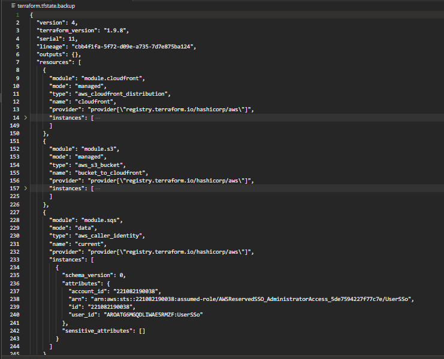

# State

O estado so é alterado quando o resultado do comando `terraform apply` ou `terraform apply -auto-approve` for de sucesso.

Caso exista uma alteração via console aws e a mesma não esteja no arquivo `terraform.tfstate` como resultado teremos uma `dissonância de estado`

Logo será sobrescrito conforme o conteudo contido no arquivo `terraform.tfstate`.

# Backup

O arquivo `terraform.tfstate.backup` possue as informações de implementação de recursos em um nível de v-1 referente ao arquivo `terraform.tfstate` . 

