Criando recursos utilizando IAC

Configurando roles

Criando permissões na Role

Migrando para o ECR

Configurando serviço do container

Deploy da aplicação

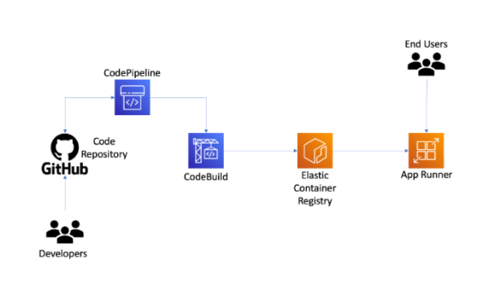


# Configurando repositório AWS

## 1- Criar a estrutura de login.

No Git Hub Marketplace vamos pesquisar por `aws credentials`
https://github.com/marketplace/actions/configure-aws-credentials-action-for-github-actions

Aqui vamos trabalhar com o conceito de OIDC

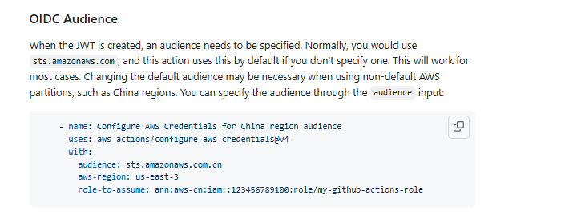

No Git Hub Marketplace vamos pesquisar por `ecr login aws`
https://github.com/marketplace/actions/amazon-ecr-login-action-for-github-actions

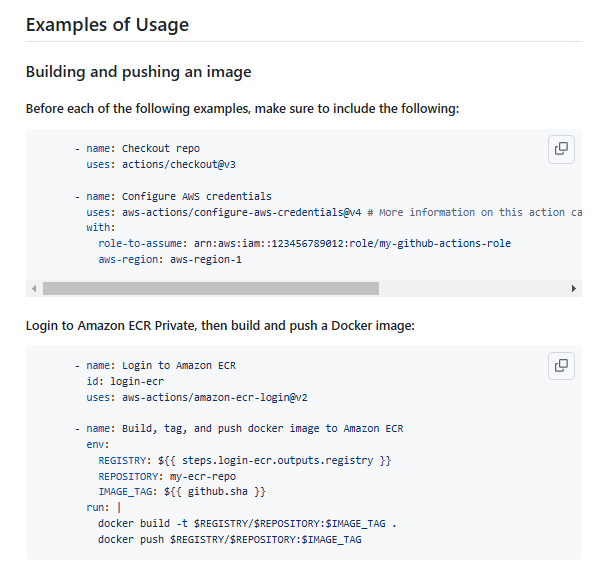

Agora vamos altera o código no arquivo `ci.yml`:

```hcl

name: CI

on:
  push:
    branches:
      - main


jobs:
  build:
    name: 'Build and Push'
    runs-on: ubuntu-latest
    # strategy:
    #   matrix:
    #     node: [ 18, 20 ]
    steps:
      - uses: actions/checkout@v4

      # - name: Setup node | ${{ matrix.node }}
      - name: Setup node
        uses: actions/setup-node@v4
        with:
          # node-version: ${{ matrix.node }}
          node-version: 18
      - run: npm ci
      - run: npm test

      - name: Generate tag
        id: generate_tag
        run: |
          SHA=$(echo $GITHUB_SHA | head -c7)
          echo "sha=$SHA" >> $GITHUB_OUTPUT
      
      - name: Configure AWS Credentials
        uses: aws-actions/configure-aws-credentials@v4
        with:
          aws-region: us-east-1
          role-to-assume: ''

      - name: Login to Amazon ECR
        id: login-ecr
        uses: aws-actions/amazon-ecr-login@v2

```

##### **Atenção** Para o script acima funcionar é necessário a `"estrutura de provider"` e a `"criaçãoe configuração das roles"`

### Explicação dos itens inseridos

- **name**: `Configure AWS Credentials`: Configura as credenciais da AWS para permitir operações com serviços AWS.

  `uses: aws-actions/configure-aws-credentials@v4`: Ação que configura as credenciais da AWS.
  
  `with:`: Especifica a região (us-east-1) e um campo `role-to-assume` que está vazio (deveria conter o ARN de um papel se necessário).

- **name**: `Login to Amazon ECR`: Faz login no Amazon Elastic Container Registry (ECR) para permitir o push de imagens de contêiner.

  `id: login-ecr`: Define um ID para a etapa.
  
  `uses: aws-actions/amazon-ecr-login@v2`: Utiliza uma ação para fazer login no ECR.

## 2- Criando recursos no IAM AWS

* Identity providers

* Role

* ECR

* Build Image


###  **Identity providers**

Nessa fase vamos criar uma nova pasta `iac` no workspace .
Um novo arquivo `main.tf` e incluir o seguinte script

```hcl
terraform {
  required_providers {
    aws = {
      source = "hashicorp/aws"
      version = "5.73.0"
    }
  }
}

provider "aws" {
  profile = "VALOR-GERADO-NO-PASSO-1"
  region  = "VALOR-CONTIDO-NO-[Resumo das configurações]"
}
```

No terminal vamos rodar o seguinte comando :  `terraform init`. 

Vamos criar um novo arquivo `iam.tf`. Aqui vamos configurar o `OIDC` para isso 
vamos acessar o link : https://registry.terraform.io/providers/hashicorp/aws/latest/docs/resources/iam_openid_connect_provider


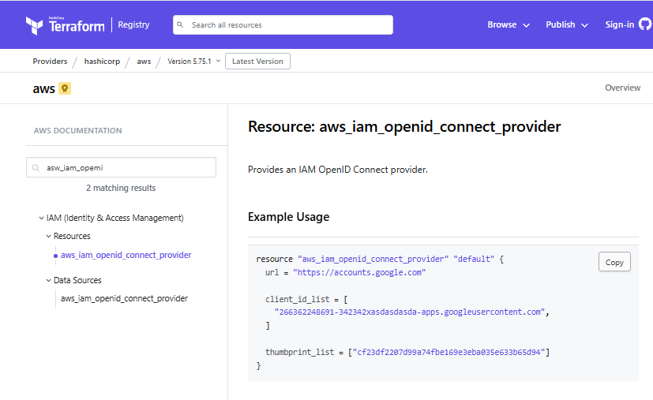


O **GitHub** Actions pode emitir tokens **OIDC** para autenticar seus jobs diretamente com provedores que suportam **OIDC**, sem precisar armazenar credenciais secretas.
Uso em serviços de nuvem:

- `"Configuração de permissões"`: Nos workflows do GitHub Actions, você pode configurar permissões de uso de OIDC. O token é emitido por https://token.actions.githubusercontent.com.

- `"Provedor de identidade"`: No lado do provedor (por exemplo, AWS, Azure ou GCP), você precisa registrar token.actions.githubusercontent.com como um provedor de identidade confiável.

- `"Uso em um workflow"`: No seu arquivo YAML de workflow, você pode solicitar um token OIDC

- `"sts.amazonaws.com"`:  É o endpoint do serviço AWS Security Token Service (STS). É usado para obter credenciais temporárias e seguras na AWS. Ele é frequentemente usado em combinação com autenticação baseada em **OIDC (OpenID Connect)** e **GitHub Actions** para permitir que workflows autenticados acessem recursos da AWS.


Pelo console aws teriamos :
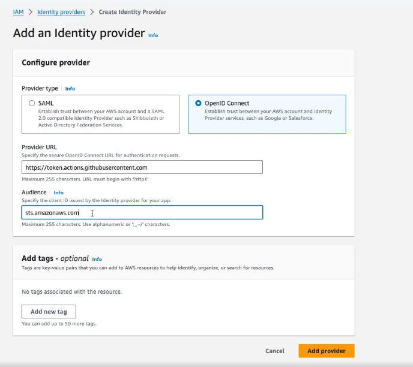

add-identity-provider-console

Logo vamos adicionar o script no arquivo.

```hcl
resource "aws_iam_openid_connect_provider" "oidc-git" {
  url = "https://token.actions.githubusercontent.com"

  client_id_list = [
    "sts.amazonaws.com",
  ]

  thumbprint_list = ["*****************************"]

  tags = {
    IAC = "True"
  }
}
```

- `"Verificar se a sintax está correta"`: `terraform validate`

- `"Rodar o camando de pre planejamento"`: `terraform plan`

- `"Rodar e comando de execução"`: 

    a- necessário aprovar
        `terraform apply` (com etapa de confirmação)

    b- `terraform apply -auto-approve` (sem etapa de confirmação)

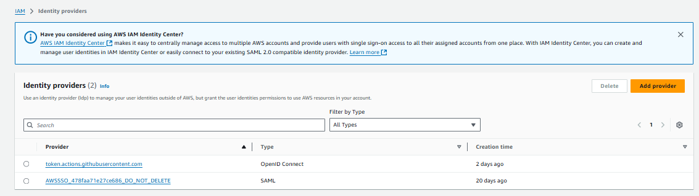


###  **Role**

Na pipeline do arquivo `ci.yml` incluimos a role `"role-to-assume"` no step `"Configure AWS Credentials"` essa role precisa ter conexão com o `"aws_iam_openid_connect_provider"` `"oidc-git"` que criamos na fase anterior.

Para isso vamos criar a role do tipo `"Web identity"`.

O `"Web identity"` possui acesso federado **Federated** (externo), esse acesso vai assumir uma role dentro da conta.


Como configuramos em nossa pipeline o step `"Configure AWS Credentials"` que usa como rota o `"token.actions.githubusercontent.com"` contido no `"**Identity providers**"` esse nova role vai assumir o acesso.


Para isso vamos seguir os passos

* No site console AWS vamos ao  Identity and Acess Management (IAM) .

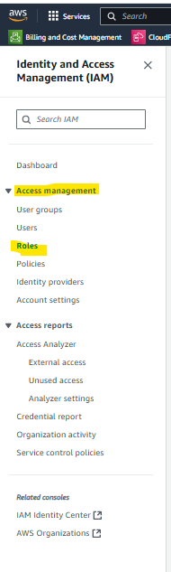

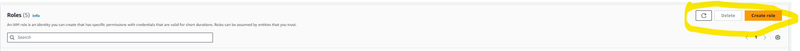

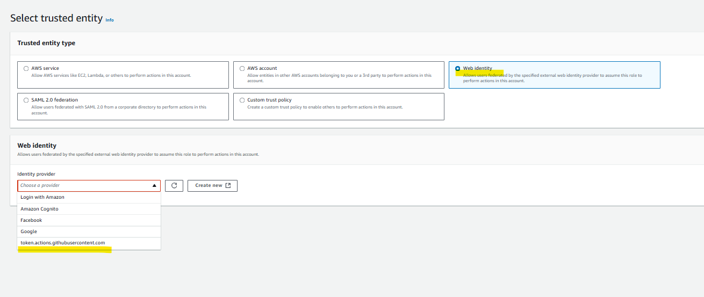

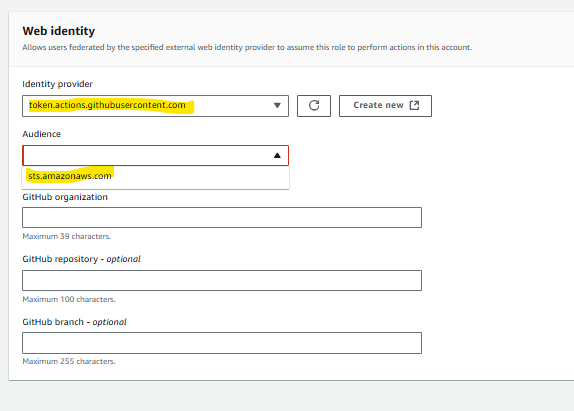


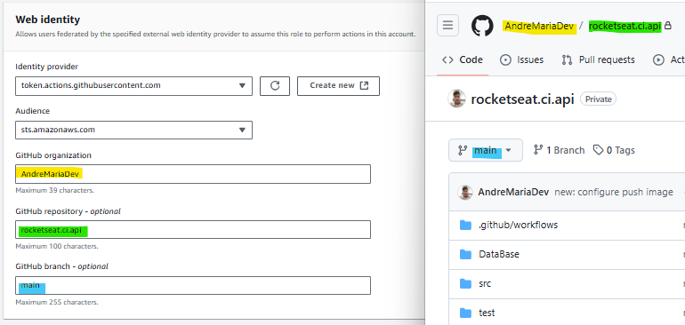


Logo apo´s clicar em next...


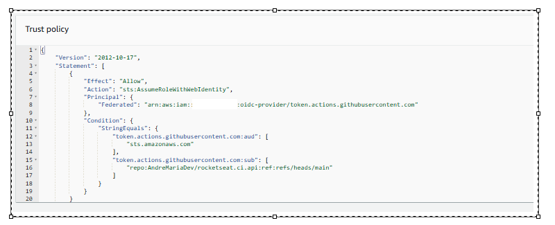

O processo cria esse json para validação da role, vamos copiar o contéudo e colcar no arquivo `ci.yml`.


Mas antes, vamos ao site do terraforme pegar um exemplo de como implementar o json ....

https://registry.terraform.io/providers/hashicorp/aws/latest/docs/resources/iam_role


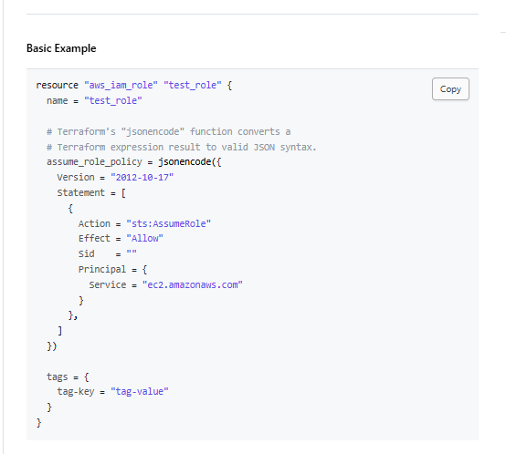

Com queremos criar uma role que `"possui acesso federado"` **Federated** ...

Vamos copiar e editar isso dentro do arquivo `iam.yml`.


```hcl
resource "aws_iam_openid_connect_provider" "oidc-git" {
  url = "https://token.actions.githubusercontent.com"

  client_id_list = [
    "sts.amazonaws.com",
  ]

  thumbprint_list = ["******************************************"]

  tags = {
    IAC = "True"
  }
}

resource "aws_iam_role" "ecr_role" {
  name = "ecr_role"

  # Terraform's "jsonencode" function converts a
  # Terraform expression result to valid JSON syntax.
  assume_role_policy = jsonencode({
    Statement = [
        {
            Effect = "Allow",
            Action = "sts:AssumeRoleWithWebIdentity",
            Principal = {
                Federated = ""
            },
            Condition = {
                StringEquals = {
                    "token.actions.githubusercontent.com:aud" = "sts.amazonaws.com"
                    "token.actions.githubusercontent.com:sub" = "repo:AndreMariaDev/rocketseat.ci.api:ref:refs/heads/main"
                }
            }
        }
    ]
    Version = "2012-10-17"
  })

  tags = {
    IAC = "True"
  }
}
```
para preencher o campo  `Principal = { Federated = "" },` vamos copiar a valor contido no ARN do `"**Identity providers**"` contido no site aws console.


```hcl
resource "aws_iam_openid_connect_provider" "oidc-git" {
  url = "https://token.actions.githubusercontent.com"

  client_id_list = [
    "sts.amazonaws.com",
  ]

  thumbprint_list = ["******************************************"]

  tags = {
    IAC = "True"
  }
}

resource "aws_iam_role" "ecr_role" {
  name = "ecr_role"

  # Terraform's "jsonencode" function converts a
  # Terraform expression result to valid JSON syntax.
  assume_role_policy = jsonencode({
    Statement = [
        {
            Effect = "Allow",
            Action = "sts:AssumeRoleWithWebIdentity",
            Principal = {
                Federated = "arn:aws:iam::*************:oidc-provider/token.actions.githubusercontent.com"
            },
            Condition = {
                StringEquals = {
                    "token.actions.githubusercontent.com:aud" = "sts.amazonaws.com"
                    "token.actions.githubusercontent.com:sub" = "repo:AndreMariaDev/rocketseat.ci.api:ref:refs/heads/main"
                }
            }
        }
    ]
    Version = "2012-10-17"
  })

  tags = {
    IAC = "True"
  }
}
```

#### Explicação dos Statements na Política do Recurso `aws_iam_role "ecr_role"`
#### Assume Role Policy (`assume_role_policy`)
Esta política define quem pode assumir a função. É utilizada para conceder permissões a um provedor de identidade para que possa solicitar tokens de segurança do AWS Security Token Service (STS) para essa função.

- **Action**: `"sts:AssumeRoleWithWebIdentity"`
  - **Descrição**: Permite que um provedor de identidade Web (neste caso, GitHub Actions) assuma a função.
- **Condition**:
  - **StringEquals**:
    - `"token.actions.githubusercontent.com:aud"` = `"sts.amazonaws.com"`: Garante que a audiência do token emitido seja o AWS STS.
    - `"token.actions.githubusercontent.com:sub"` = `"repo:AndreMariaDev/rocketseat.ci.api:ref:refs/heads/main"`: Especifica que a política só permitirá que tokens de um repositório específico (neste caso, `AndreMariaDev/rocketseat.ci.api`) e de uma branch específica (`main`) possam assumir a função.
- **Effect**: `"Allow"`: Autoriza o acesso de acordo com as condições especificadas.
- **Principal**:
  - **Federated**: `"arn:aws:iam::************:oidc-provider/token.actions.githubusercontent.com"`: Define o OIDC Provider do GitHub como entidade confiável para assumir a função. É o `"aws_iam_openid_connect_provider"` `"oidc-git"`


#### Executando terminal 

- `"Verificar se a sintax está correta"`: `terraform validate`

- `"Rodar o camando de pre planejamento"`: `terraform plan`

- `"Rodar e comando de execução"`: 

    a- necessário aprovar
        `terraform apply` (com etapa de confirmação)

    b- `terraform apply -auto-approve` (sem etapa de confirmação)

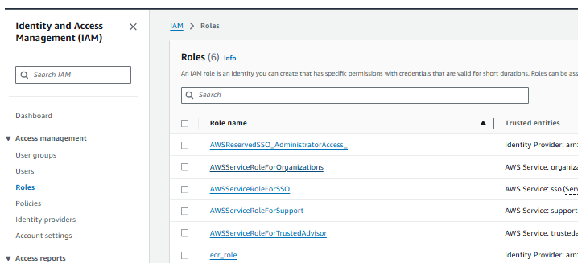

Vimos que foi criado com sucesso , agora vamos preencher o campo  `"role-to-assume"` no step `"Configure AWS Credentials"` com o valor ARN da role `"ecr_role"` que acabamos de criar.

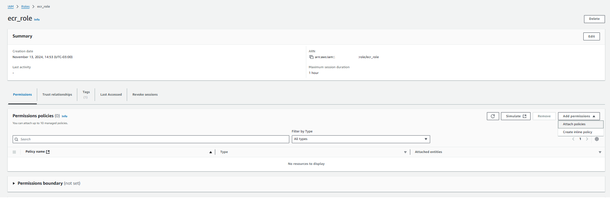


```hcl

name: CI

on:
  push:
    branches:
      - main

permissions:
  id-token: write
  contents: read

jobs:
  build:
    name: 'Build and Push'
    runs-on: ubuntu-latest
    # strategy:
    #   matrix:
    #     node: [ 18, 20 ]
    steps:
      - uses: actions/checkout@v4

      # - name: Setup node | ${{ matrix.node }}
      - name: Setup node
        uses: actions/setup-node@v4
        with:
          # node-version: ${{ matrix.node }}
          node-version: 18
      - run: npm ci
      - run: npm test

      - name: Generate tag
        id: generate_tag
        run: |
          SHA=$(echo $GITHUB_SHA | head -c7)
          echo "sha=$SHA" >> $GITHUB_OUTPUT
      
      - name: Configure AWS Credentials
        uses: aws-actions/configure-aws-credentials@v4
        with:
          aws-region: us-east-1
          role-to-assume: arn:aws:iam::************:role/ecr_role

      - name: Login to Amazon ECR
        id: login-ecr
        uses: aws-actions/amazon-ecr-login@v2

```

#### Configurando o permissionamento da role `"ecr_role"`

Para adicionar as permnissões necessárias para o role `"ecr_role"`, vamos seguir os passos :


- **Adicionar uma policy**

**(1)** Vamos clicar na na role que acabamos de criar.


Vamos selecionar `Attach policy` conforme a imagem.

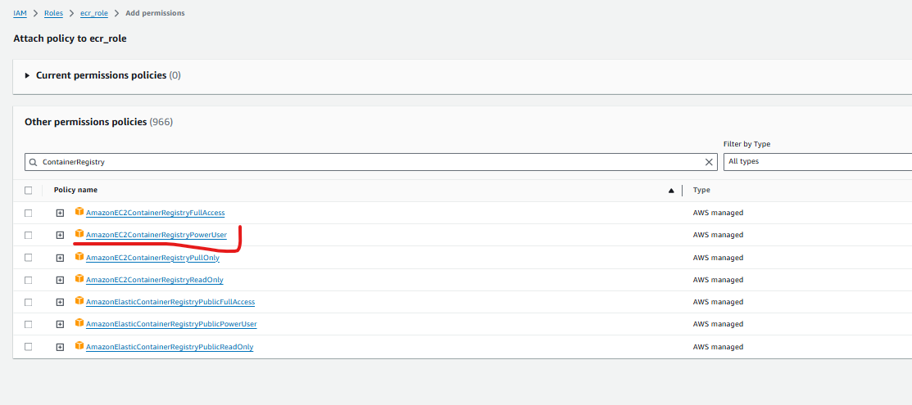

**(2)** Vamos clicar o botão `+` conforme a imagem e selecionar `"AmazonEC2ContainerRegistryPowerUser"`


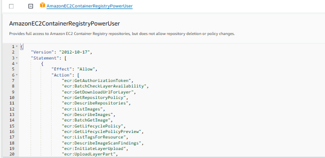

Aqui temos um exemplo de policy, para entender como vamos implementar na role  `"ecr_role"`, vamos ao site do terraforme https://registry.terraform.io/providers/hashicorp/aws/latest/docs/resources/iam_role para visualizar eum exemplo de implementação.


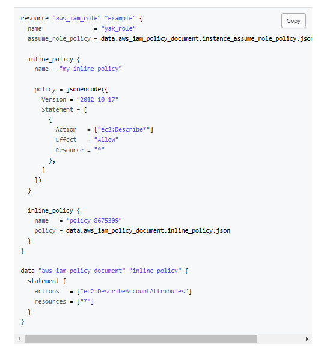


Vamos copiar o conteudo e incluir no arquivo `iam.tf` .

```hcl
resource "aws_iam_openid_connect_provider" "oidc-git" {
  url = "https://token.actions.githubusercontent.com"

  client_id_list = [
    "sts.amazonaws.com",
  ]

  thumbprint_list = ["*****************"]

  tags = {
    IAC = "True"
  }
}

resource "aws_iam_role" "ecr_role" {
  name = "ecr_role"

  assume_role_policy = jsonencode({
    Statement = [
      {
        Action = "sts:AssumeRoleWithWebIdentity",
        Condition = {
          StringEquals = {
            "token.actions.githubusercontent.com:aud" = "sts.amazonaws.com",
            "token.actions.githubusercontent.com:sub" = "repo:AndreMariaDev/rocketseat.ci.api:ref:refs/heads/main"
          }
        }
        Effect = "Allow",
        Principal = {
          Federated = "arn:aws:iam::************:oidc-provider/token.actions.githubusercontent.com"
        }
      }
    ]
    Version = "2012-10-17",
  })

  inline_policy {
    name = "ecr-app-permission"

    policy = jsonencode({
      Version = "2012-10-17"
      Statement = [
        {
            Sid    = "Statement3"
            Action = [
            "ecr:GetDownloadUrlForLayer",
            "ecr:BatchGetImage",
            "ecr:BatchCheckLayerAvailability",
            "ecr:PutImage",
            "ecr:InitiateLayerUpload",
            "ecr:UploadLayerPart",
            "ecr:CompleteLayerUpload",
            "ecr:GetAuthorizationToken"
            ]
            Effect = "Allow"
            Resource = "*"
        }
      ]
    })
  }

  tags = {
    IAC = "True"
  }
}
```

#### Explicação dos Statements na Política do Recurso `aws_iam_role "ecr_role"`

#### Inline Policy (`inline_policy`)

**Statement3: Permissões de ECR (Elastic Container Registry)**
- **Sid**: `"Statement3"`
- **Action**:
  - `"ecr:GetDownloadUrlForLayer"`: Obtém a URL para download de uma camada de imagem de contêiner.
  - `"ecr:BatchGetImage"`: Recupera metadados de imagens no repositório.
  - `"ecr:BatchCheckLayerAvailability"`: Verifica a disponibilidade das camadas da imagem no repositório.
  - `"ecr:PutImage"`: Insere uma imagem no repositório.
  - `"ecr:InitiateLayerUpload"`, `"ecr:UploadLayerPart"`, `"ecr:CompleteLayerUpload"`: Realizam o processo de upload de uma camada de imagem.
  - `"ecr:GetAuthorizationToken"`: Recupera um token de autenticação necessário para acessar o repositório ECR.
- **Effect**: `"Allow"`
- **Resource**: `"*"`
- **Motivo**: Necessário para que a função possa fazer pull e push de imagens para o Amazon ECR, garantindo que as imagens usadas e geradas pelo pipeline de CI/CD sejam armazenadas e acessadas de forma segura.

#### Executando terminal 

- `"Verificar se a sintax está correta"`: `terraform validate`

- `"Rodar o camando de pre planejamento"`: `terraform plan`

- `"Rodar e comando de execução"`: 

    a- necessário aprovar
        `terraform apply` (com etapa de confirmação)

    b- `terraform apply -auto-approve` (sem etapa de confirmação)


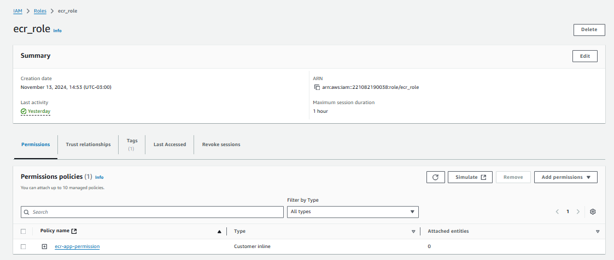


### **ECR**

Agora vamos criar o recurso ECR. Para tal vamos acesssar o site do terraform.

https://registry.terraform.io/providers/hashicorp/aws/latest/docs/data-sources/ecr_repository


Vemos na doc que é super simples, logo vamos criar um novo arquivo pasta `rocketseat.iac`

Aqui vamos criar um arquivo `ecr.tf` e incluir o seguinte script:

```hcl

resource "aws_ecr_repository" "rocketseat-ci-api" {
  name                 = "rocketseat-ci"
  image_tag_mutability = "MUTABLE"

  image_scanning_configuration {
    scan_on_push = true
  }

  tags = {
    IAC = "True"
  }
}

```

#### Executando terminal 

- `"Verificar se a sintax está correta"`: `terraform validate`

- `"Rodar o camando de pre planejamento"`: `terraform plan`

- `"Rodar e comando de execução"`: 

    a- necessário aprovar
        `terraform apply` (com etapa de confirmação)

    b- `terraform apply -auto-approve` (sem etapa de confirmação)

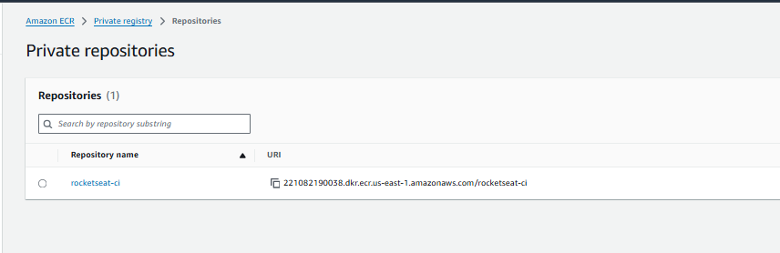


#### Executando terminal 

- `git add .`

- `git commit -m "new: configure role and permissions"`

- `git push`


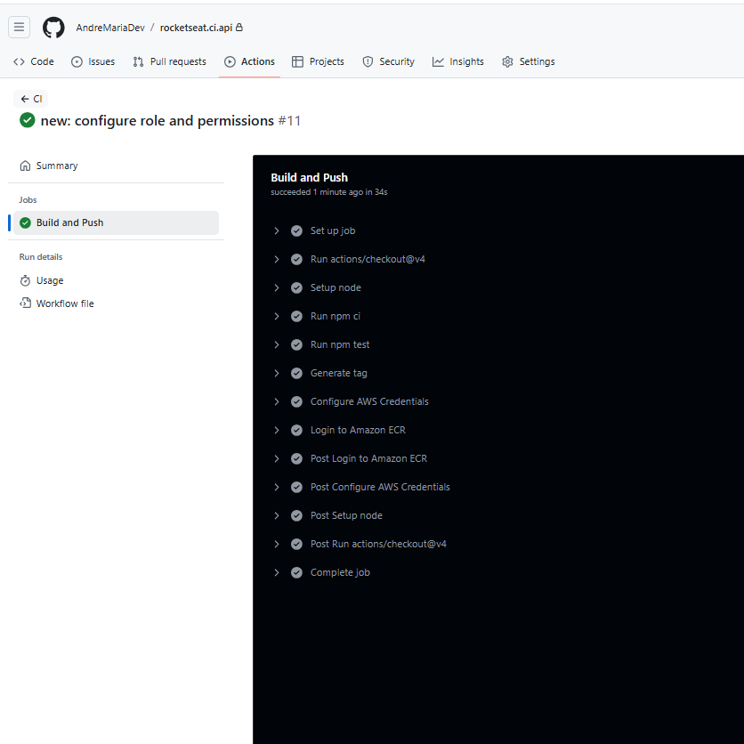

### **Build Image**

Agora para enviarmos a imagem da api para o ECR vamos edita o arquivo ci.yml com o seguinte código :

```hcl

name: CI

on:
  push:
    branches:
      - main

permissions:
  id-token: write
  contents: read

jobs:
  build:
    name: 'Build and Push'
    runs-on: ubuntu-latest
    # strategy:
    #   matrix:
    #     node: [ 18, 20 ]
    steps:
      - uses: actions/checkout@v4

      # - name: Setup node | ${{ matrix.node }}
      - name: Setup node
        uses: actions/setup-node@v4
        with:
          # node-version: ${{ matrix.node }}
          node-version: 18
      - run: npm ci
      - run: npm test

      - name: Generate tag
        id: generate_tag
        run: |
          SHA=$(echo $GITHUB_SHA | head -c7)
          echo "sha=$SHA" >> $GITHUB_OUTPUT
      
      - name: Configure AWS Credentials
        uses: aws-actions/configure-aws-credentials@v4
        with:
          aws-region: us-east-1
          role-to-assume: arn:aws:iam::************:role/ecr_role

      - name: Login to Amazon ECR
        id: login-ecr
        uses: aws-actions/amazon-ecr-login@v2

      - name: Build docker image
        env:
          REGISTRY: ${{ steps.login-ecr.outputs.registry }}
          TAG: ${{ steps.generate_tag.outputs.sha }}
        run: |
          docker build -t $REGISTRY/rocketseat-ci:$TAG .
          docker push $REGISTRY/rocketseat-ci:$TAG
```

#### Explicação detalhada:

- **Build docker image**:

- **`name: Build docker image`**: Nome da etapa para identificar que essa etapa é responsável por construir a imagem Docker.

- **`env`**: Define variáveis de ambiente que serão usadas na execução do comando run.

- **`REGISTRY: ${{ steps.login-ecr.outputs.registry }}`**: A variável REGISTRY é preenchida com o valor da saída `registry` do `output` da etapa `login-ecr`. Essa saída contém o URL do registro Amazon ECR para o qual a imagem será enviada.

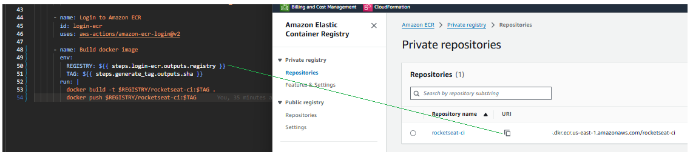

- **`TAG: ${{ steps.generate_tag.outputs.sha }}`**: A variável TAG recebe o valor da saída sha da etapa generate_tag (não mostrada aqui, mas deve existir em uma etapa anterior). Geralmente, essa saída representa um hash único do commit ou uma tag gerada automaticamente, usada para versionar a imagem Docker.

- **`run`**: O bloco run contém os comandos de shell que serão executados:

```hcl
docker build -t $REGISTRY/rocketseat-ci:$TAG .
docker push $REGISTRY/rocketseat-ci:$TAG
```

- **`docker build -t $REGISTRY/rocketseat-ci:$TAG .`**: Constrói uma imagem Docker a partir do Dockerfile presente no diretório atual (.). A opção -t define o nome e a tag da imagem, que será algo como 123456789012.dkr.ecr.us-east-1.amazonaws.com/rocketseat-ci:sha123abc.

- **`docker push $REGISTRY/rocketseat-ci:$TAG`**: Envia a imagem recém-construída para o registro do Amazon ECR. O REGISTRY e a TAG definidos nas variáveis de ambiente são utilizados para especificar o destino exato no ECR.


#### Executando terminal 

- `git add .`

- `git commit -m "new: push image to ecr repositry"`

- `git push`


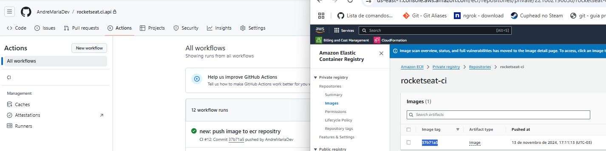


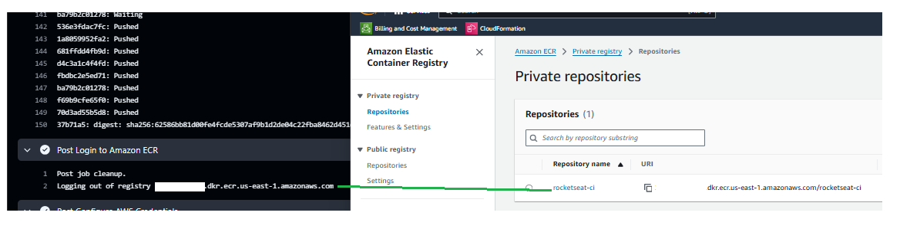


### **Role App Runner**

Agora vamos criar uma role para o running da aplicação. Para isso vamos adicionar um novo resource no arquivo `aim.tf`

```hcl
resource "aws_iam_role" "app-runner-role" {
  name = "app-runner-role"
  assume_role_policy = jsonencode({})
}

```

Para preencher o `assume_role_policy` vamos ao console aws e no produto IAM >> Role>>  Create role.
Aqui vamos copiar trecho destacado na imagem abaixo:

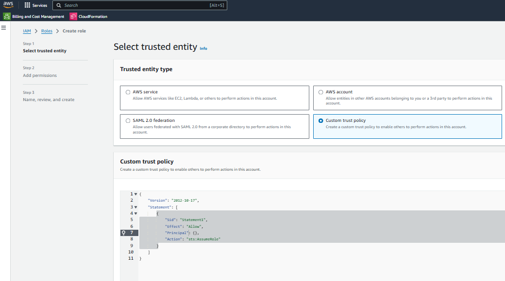

Vamos copiar o conteudo e adicionar no item `assume_role_policy`


```hcl
resource "aws_iam_role" "app-runner-role" {
  name = "app-runner-role"

  assume_role_policy = jsonencode({
    Version = "2012-10-17",
    Statement = [
      {
        Effect = "Allow",
        Principal = {
          Service = "build.apprunner.amazonaws.com"
        },
        Action = "sts:AssumeRole"
      }
    ]
  })

  managed_policy_arns = [
    "arn:aws:iam::aws:policy/AmazonEC2ContainerRegistryReadOnly"
  ]

  tags = {
    IAC = "True"
  }
}
```

#### Explicação dos Statements na Política do Recurso `aws_iam_role` `app-runner-role`

#### 1. Papel do `Statement` no `assume_role_policy`

O bloco `assume_role_policy` define a política de confiança que especifica quais entidades (por exemplo, serviços ou usuários) têm permissão para assumir essa função (IAM Role). 

A estrutura de `Statement` no `assume_role_policy` faz o seguinte:

- **`Effect: "Allow"`**: Esta cláusula indica que a ação definida no `Action` é permitida.
- **`Principal`**: Especifica quem ou qual serviço pode assumir essa função. No caso, o `Service` é `build.apprunner.amazonaws.com`, que representa o App Runner da AWS. Isso significa que o serviço App Runner tem permissão para assumir essa função `"(acesso ao ecr)"`.
- **`Action: "sts:AssumeRole"`**: Esta é a ação permitida para o `Principal`, ou seja, o serviço App Runner pode usar a operação `sts:AssumeRole` para assumir a função.

**Motivo**: O `assume_role_policy` é necessário para que o serviço App Runner possa autenticar e usar a função. Isso permite que o App Runner obtenha permissões temporárias para acessar outros recursos da AWS com base nas políticas associadas à função.

#### 2. Papel do `managed_policy_arns`

O parâmetro `managed_policy_arns` define as políticas gerenciadas pela AWS que são associadas à função. No exemplo, a política `arn:aws:iam::aws:policy/AmazonEC2ContainerRegistryReadOnly` está anexada à função.

- **`AmazonEC2ContainerRegistryReadOnly`**: Esta política gerenciada concede permissões de leitura para o Amazon Elastic Container Registry (ECR). Isso significa que qualquer serviço ou entidade que assuma essa função pode ler imagens do ECR, mas não pode fazer alterações (por exemplo, fazer upload de imagens).

**Motivo**: Essa política é necessária para permitir que o serviço App Runner acesse imagens de contêiner armazenadas no Amazon ECR. Isso é essencial para que o App Runner possa executar aplicações que dependem de imagens armazenadas nesse repositório.


#### Executando terminal 

- `"Verificar se a sintax está correta"`: `terraform validate`

- `"Rodar o camando de pre planejamento"`: `terraform plan`

- `"Rodar e comando de execução"`: 

    a- necessário aprovar
        `terraform apply` (com etapa de confirmação)

    b- `terraform apply -auto-approve` (sem etapa de confirmação)


#### Criando novos Statements na Política do Recurso `aws_iam_role "ecr_role"`

```
#...

  inline_policy {
    name = "ecr-app-permission"

    policy = jsonencode({
      Version = "2012-10-17"
      Statement = [
        {
            Sid    = "Statement1",
            Action = "apprunner:*",
            Effect = "Allow",
            Resource = "*"
        },
        {
            Sid    = "Statement3"
            Action = [
            "ecr:GetDownloadUrlForLayer",
            "ecr:BatchGetImage",
            "ecr:BatchCheckLayerAvailability",
            "ecr:PutImage",
            "ecr:InitiateLayerUpload",
            "ecr:UploadLayerPart",
            "ecr:CompleteLayerUpload",
            "ecr:GetAuthorizationToken"
            ]
            Effect = "Allow"
            Resource = "*"
        }
      ]
    })
  }

#...

```


##### 1. **Statement1: Permissões do App Runner**
- **Sid**: `"Statement1"`
- **Action**: `"apprunner:*"`
  - **Descrição**: Concede permissões completas (`*`) sobre o serviço AWS App Runner, que pode ser usado para executar aplicações e serviços com contêineres.
- **Effect**: `"Allow"`
- **Resource**: `"*"` (todas as instâncias de recursos do App Runner)
- **Motivo**: Permite que a função gerencie o ciclo de vida e operações relacionadas ao App Runner. Isso é útil quando se deseja implantar, gerenciar e monitorar serviços de contêiner usando o App Runner.


```
#...

  inline_policy {
    name = "ecr-app-permission"

    policy = jsonencode({
      Version = "2012-10-17"
      Statement = [
        {
            Sid    = "Statement1",
            Action = "apprunner:*",
            Effect = "Allow",
            Resource = "*"
        },
        {
            Sid    = "Statement2",
            Action = [
            "iam:PassRole",
            "iam:CreateServiceLinkedRole"
            ],
            Effect = "Allow",
            Resource = "*"
        },
        {
            Sid    = "Statement3"
            Action = [
            "ecr:GetDownloadUrlForLayer",
            "ecr:BatchGetImage",
            "ecr:BatchCheckLayerAvailability",
            "ecr:PutImage",
            "ecr:InitiateLayerUpload",
            "ecr:UploadLayerPart",
            "ecr:CompleteLayerUpload",
            "ecr:GetAuthorizationToken"
            ]
            Effect = "Allow"
            Resource = "*"
        }
      ]
    })
  }

#...

```


##### 2. **Statement2: Permissões de IAM**
- **Sid**: `"Statement2"`
- **Action**: `["iam:PassRole", "iam:CreateServiceLinkedRole"]`
  - **Descrição**:
    - `"iam:PassRole"`: Permite que a função delegue permissões a outros serviços para que possam atuar em seu nome.
    - `"iam:CreateServiceLinkedRole"`: Permite criar funções vinculadas a serviços que são automaticamente gerenciadas por serviços da AWS.
- **Effect**: `"Allow"`
- **Resource**: `"*"`
- **Motivo**: Necessário para que a função passe a si mesma para serviços como o App Runner e crie funções que o App Runner possa usar, garantindo a integração e o funcionamento adequado do pipeline.


Assim teremos o script completo da seguinte maneira: 

```hcl
resource "aws_iam_openid_connect_provider" "oidc-git" {
  url = "https://token.actions.githubusercontent.com"

  client_id_list = [
    "sts.amazonaws.com",
  ]

  thumbprint_list = ["*****************"]

  tags = {
    IAC = "True"
  }
}

resource "aws_iam_role" "ecr_role" {
  name = "ecr_role"

  assume_role_policy = jsonencode({
    Statement = [
      {
        Action = "sts:AssumeRoleWithWebIdentity",
        Condition = {
          StringEquals = {
            "token.actions.githubusercontent.com:aud" = "sts.amazonaws.com",
            "token.actions.githubusercontent.com:sub" = "repo:AndreMariaDev/rocketseat.ci.api:ref:refs/heads/main"
          }
        }
        Effect = "Allow",
        Principal = {
          Federated = "arn:aws:iam::************:oidc-provider/token.actions.githubusercontent.com"
        }
      }
    ]
    Version = "2012-10-17",
  })

  inline_policy {
    name = "ecr-app-permission"

    policy = jsonencode({
      Version = "2012-10-17"
      Statement = [
        {
            Sid    = "Statement1",
            Action = "apprunner:*",
            Effect = "Allow",
            Resource = "*"
        },
        {
            Sid    = "Statement2",
            Action = [
            "iam:PassRole",
            "iam:CreateServiceLinkedRole"
            ],
            Effect = "Allow",
            Resource = "*"
        },
        {
            Sid    = "Statement3"
            Action = [
            "ecr:GetDownloadUrlForLayer",
            "ecr:BatchGetImage",
            "ecr:BatchCheckLayerAvailability",
            "ecr:PutImage",
            "ecr:InitiateLayerUpload",
            "ecr:UploadLayerPart",
            "ecr:CompleteLayerUpload",
            "ecr:GetAuthorizationToken"
            ]
            Effect = "Allow"
            Resource = "*"
        }
      ]
    })
  }

  tags = {
    IAC = "True"
  }
}
```

#### Executando terminal 

- `"Verificar se a sintax está correta"`: `terraform validate`

- `"Rodar o camando de pre planejamento"`: `terraform plan`

- `"Rodar e comando de execução"`: 

    a- necessário aprovar
        `terraform apply` (com etapa de confirmação)

    b- `terraform apply -auto-approve` (sem etapa de confirmação)


Vamos verificar na aws agora :

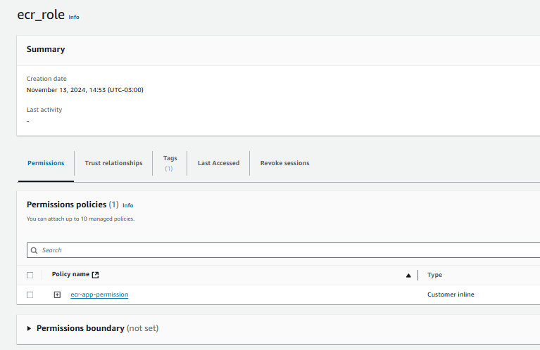


### **Deploy to App Runner**


**`Deploy to App Runner`**

- **Papel do App Runner**: Esse step faz o deploy da imagem Docker recém-criada para o serviço rocketseat-api no Amazon App Runner.

- **Motivo**: O App Runner é uma plataforma da AWS que facilita o deploy de aplicações baseadas em containers. Esse step garante que a aplicação esteja disponível e rodando em um ambiente de produção após a conclusão do build.

``` hcl
- name: Deploy to App Runner
  id: deploy-apprunner
  uses: awslabs/amazon-app-runner-deploy@main
  with:
    service: rocketseat-api
    image: ${{ steps.build-docker-image.outputs.image }}
    access-role-arn: arn:aws:iam::***************:role/app-runner-role
    region: us-east-1
    cpu: 1
    memory: 2
    port: 3000
```

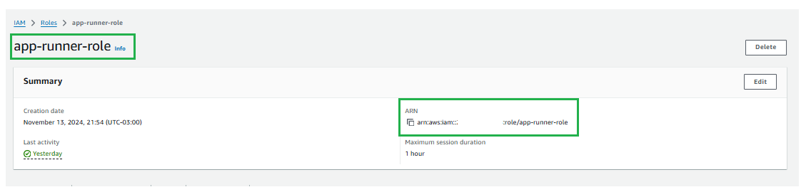


Mas antes de implementar o `Deploy to App Runner` vamos implementar a indicação da imagem no `Build docker image`

```
      - name: Build docker image
        id: build-docker-image
        env:
          REGISTRY: ${{ steps.login-ecr.outputs.registry }}
          TAG: ${{ steps.generate_tag.outputs.sha }}
        run: |
          docker build -t $REGISTRY/rocketseat-ci:$TAG .
          docker push $REGISTRY/rocketseat-ci:$TAG
          IMAGE=$(echo $REGISTRY/rocketseat-ci:$TAG)
          echo "image=$IMAGE" >> $GITHUB_OUTPUT
```
No item "Construção e Push da Imagem Docker", o trecho:

- **`IMAGE=$(echo $REGISTRY/rocketseat-ci:$TAG)`**

- **`echo "image=$IMAGE" >> $GITHUB_OUTPUT`**

Tem como objetivo construir a URL da imagem Docker e armazená-la na variável de saída do GitHub Actions, para que a imagem gerada possa ser usada em etapas subsequentes, como o deploy.
Explicação detalhada:

- **`IMAGE=$(echo $REGISTRY/rocketseat-ci:$TAG)`**:

  O que faz?: Esse comando cria a URL completa da imagem Docker que será armazenada no Amazon Elastic Container Registry (ECR). Ele junta o nome do repositório (rocketseat-ci) com o TAG gerado anteriormente para a imagem.

    **`$REGISTRY`** é o valor obtido da saída do step de login no ECR, que representa o endpoint do repositório de imagens Docker (por exemplo, 123456789012.dkr.ecr.us-east-1.amazonaws.com).

    **`$TAG`** é o hash do commit, gerado pelo step de "Generate tag", que é usado para identificar unicamente a versão da imagem. O resultado dessa operação seria algo como 123456789012.dkr.ecr.us-east-1.amazonaws.com/rocketseat-ci:abcd123, que é a tag única para a imagem Docker.

  **Motivo** para a implementação: Criar essa URL completa é necessário para que o GitHub Actions possa referenciar a imagem no ECR de forma precisa. Em vez de gerar uma string manualmente em cada step subsequente, essa variável facilita a reutilização do valor da URL de forma dinâmica e sem erros, além de garantir que a imagem correta seja usada no deploy.

- **`echo "image=$IMAGE" >> $GITHUB_OUTPUT`**:

  O que faz?: Esse comando grava a URL completa da imagem Docker gerada na variável de saída $GITHUB_OUTPUT. Essa variável de saída é uma maneira de comunicar o valor da variável IMAGE para outros steps do workflow no GitHub Actions.

  A variável **`$GITHUB_OUTPUT`** é um arquivo especial que permite passar informações entre os steps do workflow. Quando você escreve no arquivo, qualquer step que o segue pode acessar o valor armazenado.

  **Motivo** para a implementação: A URL da imagem Docker precisa ser acessada em etapas subsequentes, como o deploy. Armazená-la no arquivo de saída permite que outras etapas, como o deploy para o App Runner, usem essa informação sem ter que reprocessar ou reconstituir a URL novamente. Isso também melhora a manutenção e a legibilidade do workflow, pois a URL é calculada uma vez e passada diretamente.


Agora temos como arquivo `ci.yml`
```hcl

name: CI

on:
  push:
    branches:
      - main

permissions:
  id-token: write
  contents: read

jobs:
  build:
    name: 'Build and Push'
    runs-on: ubuntu-latest
    # strategy:
    #   matrix:
    #     node: [ 18, 20 ]
    steps:
      - uses: actions/checkout@v4

      # - name: Setup node | ${{ matrix.node }}
      - name: Setup node
        uses: actions/setup-node@v4
        with:
          # node-version: ${{ matrix.node }}
          node-version: 18
      - run: npm ci
      - run: npm test

      - name: Generate tag
        id: generate_tag
        run: |
          SHA=$(echo $GITHUB_SHA | head -c7)
          echo "sha=$SHA" >> $GITHUB_OUTPUT
      
      - name: Configure AWS Credentials
        uses: aws-actions/configure-aws-credentials@v4
        with:
          aws-region: us-east-1
          role-to-assume: arn:aws:iam::***************:role/ecr_role

      - name: Login to Amazon ECR
        id: login-ecr
        uses: aws-actions/amazon-ecr-login@v2

      - name: Build docker image
        id: build-docker-image
        env:
          REGISTRY: ${{ steps.login-ecr.outputs.registry }}
          TAG: ${{ steps.generate_tag.outputs.sha }}
        run: |
          docker build -t $REGISTRY/rocketseat-ci:$TAG .
          docker push $REGISTRY/rocketseat-ci:$TAG
          IMAGE=$(echo $REGISTRY/rocketseat-ci:$TAG)
          echo "image=$IMAGE" >> $GITHUB_OUTPUT

      - name: Deploy to App Runner
        id: deploy-apprunner
        uses: awslabs/amazon-app-runner-deploy@main
        with:
          service: rocketseat-api
          image: ${{ steps.build-docker-image.outputs.image }}
          access-role-arn : arn:aws:iam::***************:role/app-runner-role
          region: us-east-1
          cpu : 1
          memory : 2
          port: 3000
```


#### Executando terminal 

- `git add .`

- `git commit -m "new: teste app runner"`

- `git push`

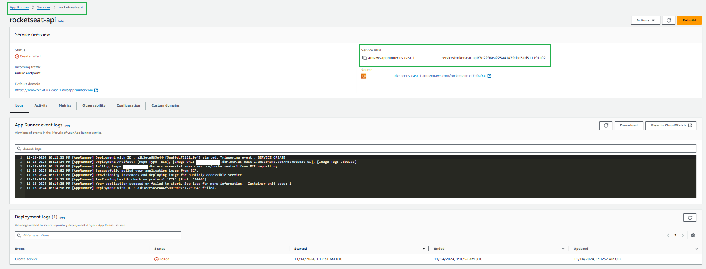

#### Podemos visualizar a imagrem abaixo a correlação enter os resurces e steps.

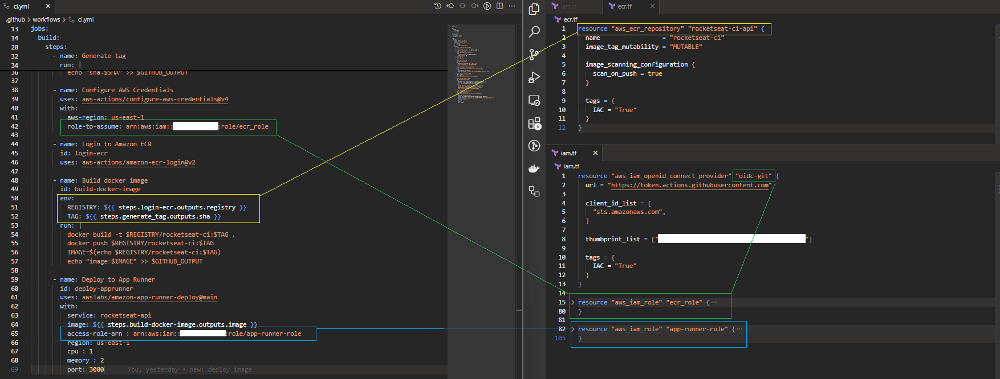

Pensando em um fluxo geral temos o seguinte diagrama:

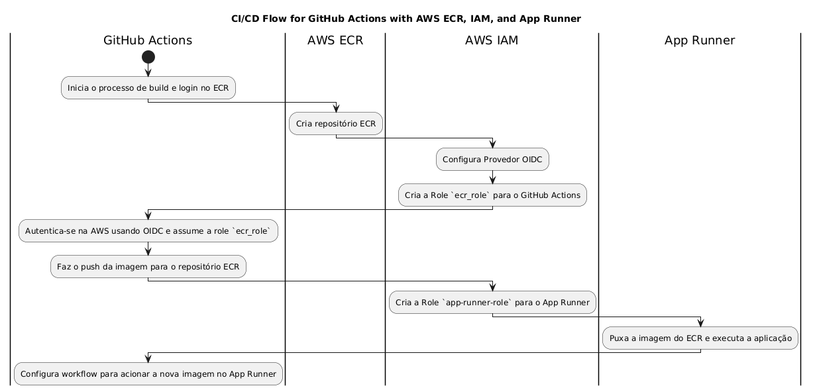


#### Steps:

1. **GitHub Actions**: Inicia o processo de build e login no repositório ECR.
   - **Passo 1**: Build e preparação da imagem do container.

2. **AWS ECR**: Armazenamento e gerenciamento das imagens de container.
   - **Passo 1**: Criar repositório ECR (`aws_ecr_repository`).

3. **AWS IAM**: Configurar provedores de autenticação e permissões.
   - **Passo 2**: Configurar Provedor OIDC (`aws_iam_openid_connect_provider`).
   - **Passo 3**: Criar a Role `ecr_role` para o GitHub Actions, permitindo acesso ao repositório ECR.

4. **GitHub Actions**: Autentica-se na AWS usando OIDC e assume a role `ecr_role`.
   - **Passo 3**: Assumir a `ecr_role` e fazer o push da imagem para o repositório ECR.

5. **App Runner**: Configuração de permissões para execução de aplicações.
   - **Passo 4**: Criar a Role `app-runner-role` para permitir que o App Runner acesse o ECR e outros recursos necessários.

6. **GitHub Actions**: Aciona o App Runner para atualizar e implantar a aplicação.
   - **Passo 5**: Configurar o workflow do GitHub Actions para integrar com App Runner e acionar a nova imagem.


### **Outras melhorias no CI**

```hcl

name: CI

on:
  push:
    branches:
      - main

permissions:
  id-token: write
  contents: read

jobs:
  build:
    name: 'Build and Push'
    runs-on: ubuntu-latest
    # strategy:
    #   matrix:
    #     node: [ 18, 20 ]
    steps:
      - uses: actions/checkout@v4

      # - name: Setup node | ${{ matrix.node }}
      - name: Setup node
        uses: actions/setup-node@v4
        with:
          # node-version: ${{ matrix.node }}
          node-version: 18
      - run: npm ci
      - run: npm test

      - name: Generate tag
        id: generate_tag
        run: |
          SHA=$(echo $GITHUB_SHA | head -c7)
          echo "sha=$SHA" >> $GITHUB_OUTPUT
      
      - name: Configure AWS Credentials
        uses: aws-actions/configure-aws-credentials@v4
        with:
          aws-region: us-east-1
          role-to-assume: arn:aws:iam::221082190038:role/ecr_role

      - name: Login to Amazon ECR
        id: login-ecr
        uses: aws-actions/amazon-ecr-login@v2

      - name: Build docker image
        id: build-docker-image
        env:
          REGISTRY: ${{ steps.login-ecr.outputs.registry }}
          TAG: ${{ steps.generate_tag.outputs.sha }}
        run: |
          docker build -t $REGISTRY/rocketseat-ci:$TAG .
          docker push $REGISTRY/rocketseat-ci:$TAG
          docker tag $REGISTRY/rocketseat-ci:$TAG $REGISTRY/rocketseat-ci:latest
          docker push $REGISTRY/rocketseat-ci:latest
          IMAGE=$(echo $REGISTRY/rocketseat-ci:$TAG)
          echo "image=$IMAGE" >> $GITHUB_OUTPUT

      - name: Deploy to App Runner
        id: deploy-apprunner
        uses: awslabs/amazon-app-runner-deploy@main
        with:
          service: rocketseat-api
          image: ${{ steps.build-docker-image.outputs.image }}
          access-role-arn : arn:aws:iam::221082190038:role/app-runner-role
          region: us-east-1
          cpu : 1
          memory : 2
          port: 3000
          wait-for-service-stability-seconds: 180

      - name: App Runner Check
        run: echo "App Runner running... ${{ steps.deploy-apprunner.outputs.service-url }}"
```