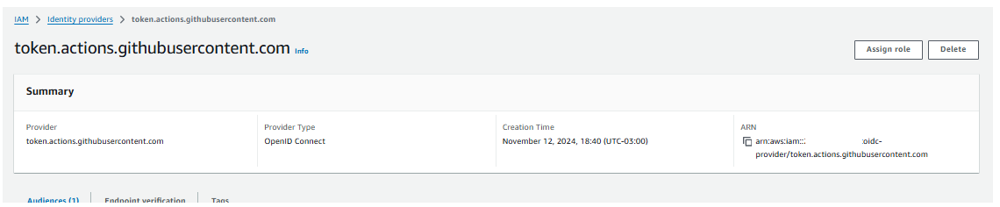

Criando recursos utilizando IAC

Configurando roles

Criando permissões na Role

Migrando para o ECR

Configurando serviço do container

Deploy da aplicação


# Configurando repositório AWS

## 1- Criar a estrutura de login.

No Git Hub Marketplace vamos pesquisar por `aws credentials`
https://github.com/marketplace/actions/configure-aws-credentials-action-for-github-actions

Aqui vamos trabalhar com o conceito de OIDC


No Git Hub Marketplace vamos pesquisar por `ecr login aws`
https://github.com/marketplace/actions/amazon-ecr-login-action-for-github-actions


Agora vamos altera o código no arquivo `ci.yml`:

```hcl

name: CI

on:
  push:
    branches:
      - main


jobs:
  build:
    name: 'Build and Push'
    runs-on: ubuntu-latest
    # strategy:
    #   matrix:
    #     node: [ 18, 20 ]
    steps:
      - uses: actions/checkout@v4

      # - name: Setup node | ${{ matrix.node }}
      - name: Setup node
        uses: actions/setup-node@v4
        with:
          # node-version: ${{ matrix.node }}
          node-version: 18
      - run: npm ci
      - run: npm test

      - name: Generate tag
        id: generate_tag
        run: |
          SHA=$(echo $GITHUB_SHA | head -c7)
          echo "sha=$SHA" >> $GITHUB_OUTPUT
      
      - name: Configure AWS Credentials
        uses: aws-actions/configure-aws-credentials@v4
        with:
          aws-region: us-east-1
          role-to-assume: ''

      - name: Login to Amazon ECR
        id: login-ecr
        uses: aws-actions/amazon-ecr-login@v2

```

##### **Atenção** Para o script acima funcionar é necessário a `"estrutura de provider"` e a `"criaçãoe configuração das roles"`

### Explicação dos itens inseridos

- **name**: `Configure AWS Credentials`: Configura as credenciais da AWS para permitir operações com serviços AWS.

  `uses: aws-actions/configure-aws-credentials@v4`: Ação que configura as credenciais da AWS.
  
  `with:`: Especifica a região (us-east-1) e um campo `role-to-assume` que está vazio (deveria conter o ARN de um papel se necessário).

- **name**: `Login to Amazon ECR`: Faz login no Amazon Elastic Container Registry (ECR) para permitir o push de imagens de contêiner.

  `id: login-ecr`: Define um ID para a etapa.
  
  `uses: aws-actions/amazon-ecr-login@v2`: Utiliza uma ação para fazer login no ECR.

## 2- Criando recursos no IAM AWS

* Identity providers

* Role

* ECR

* Build Image


###  **Identity providers**

Nessa fase vamos criar uma nova pasta `iac` no workspace .
Um novo arquivo `main.tf` e incluir o seguinte script

```hcl
terraform {
  required_providers {
    aws = {
      source = "hashicorp/aws"
      version = "5.73.0"
    }
  }
}

provider "aws" {
  profile = "VALOR-GERADO-NO-PASSO-1"
  region  = "VALOR-CONTIDO-NO-[Resumo das configurações]"
}
```

No terminal vamos rodar o seguinte comando :  `terraform init`. 

Vamos criar um novo arquivo `iam.tf`. Aqui vamos configurar o `OIDC` para isso 
vamos acessar o link : https://registry.terraform.io/providers/hashicorp/aws/latest/docs/resources/iam_openid_connect_provider


O **GitHub** Actions pode emitir tokens **OIDC** para autenticar seus jobs diretamente com provedores que suportam **OIDC**, sem precisar armazenar credenciais secretas.
Uso em serviços de nuvem:

- `"Configuração de permissões"`: Nos workflows do GitHub Actions, você pode configurar permissões de uso de OIDC. O token é emitido por https://token.actions.githubusercontent.com.

- `"Provedor de identidade"`: No lado do provedor (por exemplo, AWS, Azure ou GCP), você precisa registrar token.actions.githubusercontent.com como um provedor de identidade confiável.

- `"Uso em um workflow"`: No seu arquivo YAML de workflow, você pode solicitar um token OIDC

- `"sts.amazonaws.com"`:  É o endpoint do serviço AWS Security Token Service (STS). É usado para obter credenciais temporárias e seguras na AWS. Ele é frequentemente usado em combinação com autenticação baseada em **OIDC (OpenID Connect)** e **GitHub Actions** para permitir que workflows autenticados acessem recursos da AWS.


Pelo console aws teriamos :


add-identity-provider-console

Logo vamos adicionar o script no arquivo.

```hcl
resource "aws_iam_openid_connect_provider" "oidc-git" {
  url = "https://token.actions.githubusercontent.com"

  client_id_list = [
    "sts.amazonaws.com",
  ]

  thumbprint_list = ["*****************************"]

  tags = {
    IAC = "True"
  }
}
```

- `"Verificar se a sintax está correta"`: `terraform validate`

- `"Rodar o camando de pre planejamento"`: `terraform plan`

- `"Rodar e comando de execução"`: 

    a- necessário aprovar
        `terraform apply` (com etapa de confirmação)

    b- `terraform apply -auto-approve` (sem etapa de confirmação)


###  **Role**

Na pipeline do arquivo `ci.yml` incluimos a role `"role-to-assume"` no step `"Configure AWS Credentials"` essa role precisa ter conexão com o `"aws_iam_openid_connect_provider"` `"oidc-git"` que criamos na fase anterior.

Para isso vamos criar a role do tipo `"Web identity"`.

O `"Web identity"` possui acesso federado **Federated** (externo), esse acesso vai assumir uma role dentro da conta.


Como configuramos em nossa pipeline o step `"Configure AWS Credentials"` que usa como rota o `"token.actions.githubusercontent.com"` contido no `"**Identity providers**"` esse nova role vai assumir o acesso.


Para isso vamos seguir os passos

* No site console AWS vamos ao  Identity and Acess Management (IAM) .


Logo apo´s clicar em next...


O processo cria esse json para validação da role, vamos copiar o contéudo e colcar no arquivo `ci.yml`.


Mas antes, vamos ao site do terraforme pegar um exemplo de como implementar o json ....

https://registry.terraform.io/providers/hashicorp/aws/latest/docs/resources/iam_role


Com queremos criar uma role que `"possui acesso federado"` **Federated** ...

Vamos copiar e editar isso dentro do arquivo `iam.yml`.


```hcl
resource "aws_iam_openid_connect_provider" "oidc-git" {
  url = "https://token.actions.githubusercontent.com"

  client_id_list = [
    "sts.amazonaws.com",
  ]

  thumbprint_list = ["******************************************"]

  tags = {
    IAC = "True"
  }
}

resource "aws_iam_role" "ecr_role" {
  name = "ecr_role"

  # Terraform's "jsonencode" function converts a
  # Terraform expression result to valid JSON syntax.
  assume_role_policy = jsonencode({
    Statement = [
        {
            Effect = "Allow",
            Action = "sts:AssumeRoleWithWebIdentity",
            Principal = {
                Federated = ""
            },
            Condition = {
                StringEquals = {
                    "token.actions.githubusercontent.com:aud" = "sts.amazonaws.com"
                    "token.actions.githubusercontent.com:sub" = "repo:AndreMariaDev/rocketseat.ci.api:ref:refs/heads/main"
                }
            }
        }
    ]
    Version = "2012-10-17"
  })

  tags = {
    IAC = "True"
  }
}
```
para preencher o campo  `Principal = { Federated = "" },` vamos copiar a valor contido no ARN do `"**Identity providers**"` contido no site aws console.



```hcl
resource "aws_iam_openid_connect_provider" "oidc-git" {
  url = "https://token.actions.githubusercontent.com"

  client_id_list = [
    "sts.amazonaws.com",
  ]

  thumbprint_list = ["******************************************"]

  tags = {
    IAC = "True"
  }
}

resource "aws_iam_role" "ecr_role" {
  name = "ecr_role"

  # Terraform's "jsonencode" function converts a
  # Terraform expression result to valid JSON syntax.
  assume_role_policy = jsonencode({
    Statement = [
        {
            Effect = "Allow",
            Action = "sts:AssumeRoleWithWebIdentity",
            Principal = {
                Federated = "arn:aws:iam::*************:oidc-provider/token.actions.githubusercontent.com"
            },
            Condition = {
                StringEquals = {
                    "token.actions.githubusercontent.com:aud" = "sts.amazonaws.com"
                    "token.actions.githubusercontent.com:sub" = "repo:AndreMariaDev/rocketseat.ci.api:ref:refs/heads/main"
                }
            }
        }
    ]
    Version = "2012-10-17"
  })

  tags = {
    IAC = "True"
  }
}
```

#### Explicação dos Statements na Política do Recurso `aws_iam_role "ecr_role"`
#### Assume Role Policy (`assume_role_policy`)
Esta política define quem pode assumir a função. É utilizada para conceder permissões a um provedor de identidade para que possa solicitar tokens de segurança do AWS Security Token Service (STS) para essa função.

- **Action**: `"sts:AssumeRoleWithWebIdentity"`
  - **Descrição**: Permite que um provedor de identidade Web (neste caso, GitHub Actions) assuma a função.
- **Condition**:
  - **StringEquals**:
    - `"token.actions.githubusercontent.com:aud"` = `"sts.amazonaws.com"`: Garante que a audiência do token emitido seja o AWS STS.
    - `"token.actions.githubusercontent.com:sub"` = `"repo:AndreMariaDev/rocketseat.ci.api:ref:refs/heads/main"`: Especifica que a política só permitirá que tokens de um repositório específico (neste caso, `AndreMariaDev/rocketseat.ci.api`) e de uma branch específica (`main`) possam assumir a função.
- **Effect**: `"Allow"`: Autoriza o acesso de acordo com as condições especificadas.
- **Principal**:
  - **Federated**: `"arn:aws:iam::************:oidc-provider/token.actions.githubusercontent.com"`: Define o OIDC Provider do GitHub como entidade confiável para assumir a função. É o `"aws_iam_openid_connect_provider"` `"oidc-git"`


#### Executando terminal 

- `"Verificar se a sintax está correta"`: `terraform validate`

- `"Rodar o camando de pre planejamento"`: `terraform plan`

- `"Rodar e comando de execução"`: 

    a- necessário aprovar
        `terraform apply` (com etapa de confirmação)

    b- `terraform apply -auto-approve` (sem etapa de confirmação)


Vimos que foi criado com sucesso , agora vamos preencher o campo  `"role-to-assume"` no step `"Configure AWS Credentials"` com o valor ARN da role `"ecr_role"` que acabamos de criar.


```hcl

name: CI

on:
  push:
    branches:
      - main

permissions:
  id-token: write
  contents: read

jobs:
  build:
    name: 'Build and Push'
    runs-on: ubuntu-latest
    # strategy:
    #   matrix:
    #     node: [ 18, 20 ]
    steps:
      - uses: actions/checkout@v4

      # - name: Setup node | ${{ matrix.node }}
      - name: Setup node
        uses: actions/setup-node@v4
        with:
          # node-version: ${{ matrix.node }}
          node-version: 18
      - run: npm ci
      - run: npm test

      - name: Generate tag
        id: generate_tag
        run: |
          SHA=$(echo $GITHUB_SHA | head -c7)
          echo "sha=$SHA" >> $GITHUB_OUTPUT
      
      - name: Configure AWS Credentials
        uses: aws-actions/configure-aws-credentials@v4
        with:
          aws-region: us-east-1
          role-to-assume: arn:aws:iam::************:role/ecr_role

      - name: Login to Amazon ECR
        id: login-ecr
        uses: aws-actions/amazon-ecr-login@v2

```

#### Configurando o permissionamento da role `"ecr_role"`

Para adicionar as permnissões necessárias para o role `"ecr_role"`, vamos seguir os passos :


- **Adicionar uma policy**

**(1)** Vamos clicar na na role que acabamos de criar.


Vamos selecionar `Attach policy` conforme a imagem.


**(2)** Vamos clicar o botão `+` conforme a imagem e selecionar `"AmazonEC2ContainerRegistryPowerUser"`


Aqui temos um exemplo de policy, para entender como vamos implementar na role  `"ecr_role"`, vamos ao site do terraforme https://registry.terraform.io/providers/hashicorp/aws/latest/docs/resources/iam_role para visualizar eum exemplo de implementação.


Vamos copiar o conteudo e incluir no arquivo `iam.tf` .

```hcl
resource "aws_iam_openid_connect_provider" "oidc-git" {
  url = "https://token.actions.githubusercontent.com"

  client_id_list = [
    "sts.amazonaws.com",
  ]

  thumbprint_list = ["*****************"]

  tags = {
    IAC = "True"
  }
}

resource "aws_iam_role" "ecr_role" {
  name = "ecr_role"

  assume_role_policy = jsonencode({
    Statement = [
      {
        Action = "sts:AssumeRoleWithWebIdentity",
        Condition = {
          StringEquals = {
            "token.actions.githubusercontent.com:aud" = "sts.amazonaws.com",
            "token.actions.githubusercontent.com:sub" = "repo:AndreMariaDev/rocketseat.ci.api:ref:refs/heads/main"
          }
        }
        Effect = "Allow",
        Principal = {
          Federated = "arn:aws:iam::************:oidc-provider/token.actions.githubusercontent.com"
        }
      }
    ]
    Version = "2012-10-17",
  })

  inline_policy {
    name = "ecr-app-permission"

    policy = jsonencode({
      Version = "2012-10-17"
      Statement = [
        {
            Sid    = "Statement3"
            Action = [
            "ecr:GetDownloadUrlForLayer",
            "ecr:BatchGetImage",
            "ecr:BatchCheckLayerAvailability",
            "ecr:PutImage",
            "ecr:InitiateLayerUpload",
            "ecr:UploadLayerPart",
            "ecr:CompleteLayerUpload",
            "ecr:GetAuthorizationToken"
            ]
            Effect = "Allow"
            Resource = "*"
        }
      ]
    })
  }

  tags = {
    IAC = "True"
  }
}
```

#### Explicação dos Statements na Política do Recurso `aws_iam_role "ecr_role"`

#### Inline Policy (`inline_policy`)

**Statement3: Permissões de ECR (Elastic Container Registry)**
- **Sid**: `"Statement3"`
- **Action**:
  - `"ecr:GetDownloadUrlForLayer"`: Obtém a URL para download de uma camada de imagem de contêiner.
  - `"ecr:BatchGetImage"`: Recupera metadados de imagens no repositório.
  - `"ecr:BatchCheckLayerAvailability"`: Verifica a disponibilidade das camadas da imagem no repositório.
  - `"ecr:PutImage"`: Insere uma imagem no repositório.
  - `"ecr:InitiateLayerUpload"`, `"ecr:UploadLayerPart"`, `"ecr:CompleteLayerUpload"`: Realizam o processo de upload de uma camada de imagem.
  - `"ecr:GetAuthorizationToken"`: Recupera um token de autenticação necessário para acessar o repositório ECR.
- **Effect**: `"Allow"`
- **Resource**: `"*"`
- **Motivo**: Necessário para que a função possa fazer pull e push de imagens para o Amazon ECR, garantindo que as imagens usadas e geradas pelo pipeline de CI/CD sejam armazenadas e acessadas de forma segura.

#### Executando terminal 

- `"Verificar se a sintax está correta"`: `terraform validate`

- `"Rodar o camando de pre planejamento"`: `terraform plan`

- `"Rodar e comando de execução"`: 

    a- necessário aprovar
        `terraform apply` (com etapa de confirmação)

    b- `terraform apply -auto-approve` (sem etapa de confirmação)


### **ECR**

Agora vamos criar o recurso ECR. Para tal vamos acesssar o site do terraform.

https://registry.terraform.io/providers/hashicorp/aws/latest/docs/data-sources/ecr_repository


Vemos na doc que é super simples, logo vamos criar um novo arquivo pasta `rocketseat.iac`

Aqui vamos criar um arquivo `ecr.tf` e incluir o seguinte script:

```hcl

resource "aws_ecr_repository" "rocketseat-ci-api" {
  name                 = "rocketseat-ci"
  image_tag_mutability = "MUTABLE"

  image_scanning_configuration {
    scan_on_push = true
  }

  tags = {
    IAC = "True"
  }
}

```

#### Executando terminal 

- `"Verificar se a sintax está correta"`: `terraform validate`

- `"Rodar o camando de pre planejamento"`: `terraform plan`

- `"Rodar e comando de execução"`: 

    a- necessário aprovar
        `terraform apply` (com etapa de confirmação)

    b- `terraform apply -auto-approve` (sem etapa de confirmação)


#### Executando terminal 

- `git add .`

- `git commit -m "new: configure role and permissions"`

- `git push`


