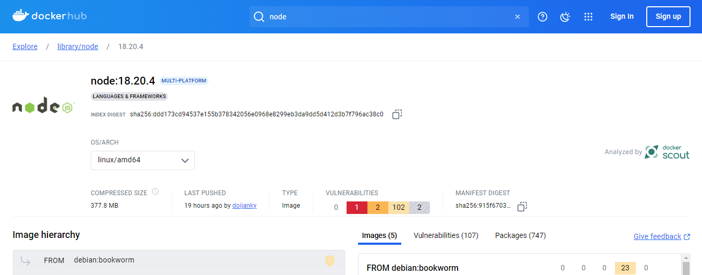
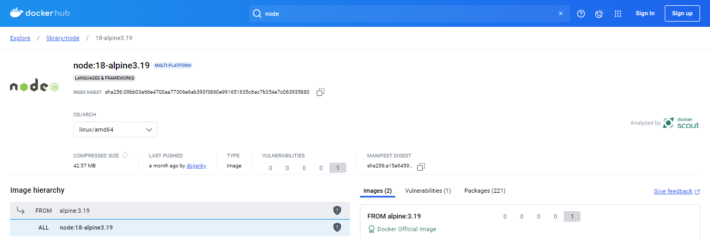

# Base para Criar um Dockerfile

Inicialmente, usamos os comandos básicos para rodar a aplicação no ambiente local.

1. `node install` (necessário caso a máquina não possua o Node)
2. Comando: `npm install`
3. Comando: `npm run build`
4. Comando: `npm run start`

No `Dockerfile`, temos uma ideia parecida, porém com alguns passos adicionais necessários para a criação do contêiner.

## Passos para Criar o Dockerfile

1. **Iniciamos com `FROM`**

    **ATENÇÃO**: Antes de selecionar uma imagem para indicar no `FROM`, é importante analisar pontos como:
    - Vulnerabilidade da versão selecionada
    - Número de pacotes contidos na versão
    - Tamanho da imagem

    ```dockerfile
    FROM node:18.20.4
    ```

2. **Indicamos o local de execução**

    ```dockerfile
    WORKDIR /usr/src/app
    ```

    - `/usr` é um diretório existente no Linux
    - `src/app` será criado no momento do build do `Dockerfile`

3. **Copiamos os arquivos para o contêiner**

    A indicação de arquivos está contida nas dependências do Node no arquivo `package.json` da aplicação.

    ```dockerfile
    COPY package.json ./
    ```

    **ATENÇÃO**: O comando `COPY` possui dois itens: DE e PARA. O caminho `./` é relativo ao `WORKDIR`.

4. **Executamos o comando de instalação das dependências**

    ```dockerfile
    RUN npm install
    ```

5. **Copiamos os arquivos da aplicação**

    ```dockerfile
    COPY . .
    ```

6. **Construímos a aplicação no contêiner**

    ```dockerfile
    RUN npm run build
    ```

    **ATENÇÃO**: É necessário expor uma porta para a aplicação. Nesse caso, usaremos a porta indicada no arquivo `src/main.ts`.

7. **Rodamos a aplicação**

    ```dockerfile
    CMD ["npm", "run", "start"]
    ```

## Modelo Completo

```dockerfile
FROM node:18.20.4

WORKDIR /usr/src/app

COPY package.json ./

RUN npm install

COPY . .

RUN npm run build

EXPOSE 3000

CMD ["npm", "run", "start"]
```


**No terminal vamos executar o seguinte comando docker**
```
docker build -t api-rocket .
```


**Para analisar a criação da imagem podemos rodar o comando docker image ls api-rocket**

**Como resultado temos :**

```
	REPOSITORY   TAG       IMAGE ID       CREATED              SIZE
	api-rocket   latest    2220e9ec6f3c   About a minute ago   747MB
```

**Devemos destacar que o campo SIZE será um ponto focal no futuro.**

**Rodando um container para a image:**
	```docker run --name api-rocket-container -p 3001:3000 -d api-rocket```

**Filtrando pelo nome do container:**
	```docker ps --filter name=api-rocket-container```
	**ou**
	```docker ps -a --filter name=api-rocket-container```

# Redes

## Criando uma rede:


**No terminal vamos executar o seguinte comando docker**
	```docker network create api-rocket-network```

**Conectando o container a rede:**

**Primeiro consultamos a lista de network**
```
	PS C:\Users\Andre Maria\Documents\Estudo\DevOps RecketSeat\nome_do_projeto> docker network ls

		NETWORK ID     NAME                                                DRIVER    SCOPE
		ff1bdac1e028   api-rocket-network                                  bridge    local
		7ed050a9f3a2   bridge                                              bridge    local
		105897f0844a   harpooncorp_harpoon-ext-desktop-extension_default   bridge    local
		5f21c6d263c3   host                                                host      local
		359c97620248   kubernetes.diveinto.io                              bridge    local
		62eb9c576c46   none                                                null      local
```
**Logo após consultamos a lista containers**

```
	PS C:\Users\Andre Maria\Documents\Estudo\DevOps RecketSeat\nome_do_projeto> docker ps --filter name=api-rocket-container

		CONTAINER ID   IMAGE        COMMAND                  CREATED         STATUS         PORTS                    NAMES
		54dc76d6c9d0   api-rocket   "docker-entrypoint.s…"   7 minutes ago   Up 5 minutes   0.0.0.0:3001->3000/tcp   api-rocket-container
```

**Para criar a conecção devemos passar o nome da rede e o nome do container**

```docker network connect api-rocket-network api-rocket-container```

**Vefificando se a rede está contendo o container**
	
```docker network inspect api-rocket-network```
	
## Criando um container com uma rede existente

**No terminal vamos executar o seguinte comando docker**
```docker run --network=api-rocket-network --name api-rocket-container -p 3001:3000 -d api-rocket```
	
	
## Acessando e manipular o conteudo do container

**Primeiro consultamos a lista containers**

```PS C:\Users\Andre Maria\Documents\Estudo\DevOps RecketSeat\nome_do_projeto> docker ps --filter name=api-rocket-container

	CONTAINER ID   IMAGE        COMMAND                  CREATED         STATUS         PORTS                    NAMES
	54dc76d6c9d0   api-rocket   "docker-entrypoint.s…"   7 minutes ago   Up 5 minutes   0.0.0.0:3001->3000/tcp   api-rocket-container
```
	
**Logo após selecionamos o container desejado e digitamos o seguinte código:**
	
```docker exec -it api-rocket-container bash```
	
<span style="color:red">***É importante destacar que a palavra chave bash só funciona para imagens que contem sub imagens debian!***</span>

<span style="color:green">***Para imagens do tipo alpine utilizamos o sh !***</span>

```docker exec -it api-rocket-container sh```

**Desta forma podemos verificar o conteudo do nosso container**
	
```
	PS C:\Users\Andre Maria\Documents\Estudo\DevOps RecketSeat\nome_do_projeto> docker exec -it api-rocket-container bash
	root@df616aec09e7:/usr/src/app# ls

	Dockerfile  dist          nest-cli.json  package-lock.json  src   tsconfig.build.json
	README.md   dockerignore  node_modules   package.json       test  tsconfig.json
```
	
**Para testar a manipulação vamos criar um arquivo log dentro da pasta src, para isso digitamos o seguinte código:**
	
```root@df616aec09e7:/usr/src/app# touch src/file.log```
	
**Podemos verificar a criação digitamos o seguinte código:**
	
```
	root@df616aec09e7:/usr/src/app# ls src
	app.controller.spec.ts  app.controller.ts  app.module.ts  app.service.ts  file.log  main.ts
```
	
**Agora vamos adicionar um text no arquivo file.log para isso digitamos o seguinte código:**
	
```
	root@df616aec09e7:/usr/src/app# echo "insert data in file log for teste" > src/file.log
```
	
**Podemos verificar o conteudo do arquivo file.log para isso digitamos o seguinte código:**

```
	root@df616aec09e7:/usr/src/app# cat src/file.log
	insert data in file log for teste
```
	
**Para sair do container digitamos o seguinte código:**
	
```
	root@df616aec09e7:/usr/src/app# exit
	exit

	What's next:
		Try Docker Debug for seamless, persistent debugging tools in any container or image → docker debug api-rocket-container
		Learn more at https://docs.docker.com/go/debug-cli/
```
	
### Abaixo temos 30 comandos do Linux frequentemente usados por iniciantes em DevOps:**


1.	`ls`: Lista arquivos e diretórios.
2.	`cd`: Navega entre diretórios.
3.	`pwd`: Exibe o diretório atual.
4.	`mkdir`: Cria um novo diretório.
5.	`rm`: Remove arquivos e diretórios.
6.	`cp`: Copia arquivos e diretórios.
7.	`mv`: Move ou renomeia arquivos e diretórios.
8.	`touch`: Cria um novo arquivo vazio.
9.	`cat`: Exibe o conteúdo de um arquivo.
10.	`less`: Exibe o conteúdo de um arquivo página por página.
11.	`grep`: Pesquisa um padrão específico em arquivos ou saídas de comandos.
12.	`chmod`: Altera as permissões de arquivos e diretórios.
13.	`chown`: Altera o proprietário de arquivos e diretórios.
14.	`ps`: Lista os processos em execução.
15.	`top`: Exibe informações em tempo real sobre os processos em execução.
16.	`kill`: Encerra um processo em execução.
17.	`tar`: Cria ou extrai arquivos compactados no formato .tar.
18.	`gzip`: Compacta arquivos.
19.	`unzip`: Extrai arquivos compactados.
20.	`df`: Exibe informações sobre o uso de disco.
21.	`du`: Exibe o espaço em disco usado por arquivos e diretórios.
22.	`ifconfig`: Exibe informações sobre interfaces de rede.
23.	`ping`: Verifica a conectividade de rede com um host específico.
24.	`ssh`: Conecta-se a um servidor remoto via SSH.
25.	`scp`: Copia arquivos entre o sistema local e um servidor remoto via SSH.
26.	`wget`: Baixa arquivos da web.
27.	`curl`: Faz solicitações HTTP e exibe o resultado.
28.	`crontab`: Gerencia tarefas agendadas.
29.	`systemctl`: Controla serviços do sistema.
30.	`history`: Exibe o histórico de comandos executados.

# Volumes

**Podemos considerar um volume como um diretório externo** 
	
**Para criar um volume digitamos o seguinte código:**
	
```docker volume create api-rocket-volume```
	
**Para validarmos digitamos o seguinte código:**
	
```docker volume inspect api-rocket-volume```
	
**Temos como resultado:**
```
[
	{
		"CreatedAt": "2024-10-19T20:25:15Z",
		"Driver": "local",
		"Labels": null,
		"Mountpoint": "/var/lib/docker/volumes/api-rocket-volume/_data",
		"Name": "api-rocket-volume",
		"Options": null,
		"Scope": "local"
	}
]
```
### PODEMOS VERIFICAR QUE O VOLUME CRIADO NÃO TEM RELAÇÃO COMO NENHUM CONTAINER.
		
## Associando um volume a um container
	
Primeito passo temos associal o caminha dos diretórios que queremos associar ao Volume.
Para isso vamos analisar o nosso arquivo Dockerfile, especificamente no trecho referente ao WORKDIR.
No `WORKDIR` temos um caminho especificado `"WORKDIR /usr/src/app"` o path `"/usr/src/app"` será para onde o Volume será apontado.
Desta forma para realizar a associação vamos digitar o seguinte código:
```	
		docker stop api-rocket-container
		docker rm api-rocket-container
		docker run --volume api-rocket-volume:/usr/src/app --network=api-rocket-network --name api-rocket-container -p 3001:3000 -d api-rocket
		
		docker inspect api-rocket-volume
```	
	
**Criação e persistência de um arquivo no volume.**
	
**Vamos manipular o arquivo file.log contido no container api-rocket-container. Para isso digitamos o seguinte código:**
```	
	PS C:\Users\Andre Maria\Documents\Estudo\DevOps RecketSeat\nome_do_projeto> docker exec -it api-rocket-container bash
```	
**Para testar a manipulação vamos criar um arquivo log dentro da pasta src, para isso digitamos o seguinte código:**
```	
		root@dd662164a458:/usr/src/app# touch src/file.log
```	
**Podemos verificar a criação digitamos o seguinte código:**
```	
	root@dd662164a458:/usr/src/app# ls src
	app.controller.spec.ts  app.controller.ts  app.module.ts  app.service.ts  file.log  main.ts
```		
**Agora vamos adicionar um text no arquivo file.log para isso digitamos o seguinte código:**
```	
	root@dd662164a458:/usr/src/app# echo "insert data by api-rocket-container" > src/file.log
```		
**Podemos verificar o conteudo do arquivo file.log para isso digitamos o seguinte código:**
```	
	root@dd662164a458:/usr/src/app#  cat src/file.log
	insert data by api-rocket-container	
```	
**Para sair do container digitamos o seguinte código:**
```	
	root@dd662164a458:/usr/src/app# exit
```	
**Agora vamos criar um novo container apontando para o mesmo volume. Para isso digitamos o seguinte código:**
```		
	PS C:\Users\Andre Maria\Documents\Estudo\DevOps RecketSeat\nome_do_projeto> docker run --volume api-rocket-volume:/usr/src/app --network=api-rocket-network --name api-rocket-container-other -p 3002:3000 -d api-rocket
	6ded198db4cf7a5f70c56973ff95729ca6d88f321bc49c56d1252ff6a6ab6e2a
```	
**Vamos manipular o arquivo file.log contido no volume api-rocket-volume. Para isso digitamos o seguinte código:**
```	
	PS C:\Users\Andre Maria\Documents\Estudo\DevOps RecketSeat\nome_do_projeto> docker exec -it api-rocket-container-other bash
```	
**Aqui vamos verificar se o container tambem acessa o arqui file.log contido no volume.**
```	
	root@6ded198db4cf:/usr/src/app# ls src
	app.controller.spec.ts  app.controller.ts  app.module.ts  app.service.ts  file.log  main.ts
```		
**Agora vamos adicionar um text no arquivo file.log para isso digitamos o seguinte código:**
```	
	root@6ded198db4cf:/usr/src/app# echo "insert data by api-rocket-container-other" >> src/file.log
```	
**Podemos verificar o conteudo do arquivo file.log para isso digitamos o seguinte código:**
```	
	root@6ded198db4cf:/usr/src/app# cat src/file.log
	insert data by api-rocket-container
	insert data by api-rocket-container-other
```	
**Para sair do container digitamos o seguinte código:**
```	
	root@6ded198db4cf:/usr/src/app# exit
```	
### Desta forma podemos comprovar que o volume e persistente.

# Multi Stage Build

### Otimizando Size da Imagem

Quando selecionamos o versão da imagem que utilizamos no trecho da palavra chave `FROM` temos o seguinte ponto:

    ```dockerfile
    FROM node:18.20.4
    ```
**ATENÇÃO**: É importante analisar pontos como:
- Vulnerabilidade da versão selecionada
- Número de pacotes contidos na versão
- Tamanho da imagem

Ao consultarmos o site do **DockerHub** temos os seguintes dados referentes a versão 18.20.4



Podemos ver que:

- Vulnerabilidade da versão selecionada <span style="color:red">**(107)**</span>
- Número de pacotes contidos na versão <span style="color:red">**(747)**</span>
- Tamanho da imagem <span style="color:red">**(5)**</span>

Quando analizamos o size da imagem podemos ver que o valor pode ser otimizado. Por que?

Porque quando criamos um container a responsabilidade daquele container é <span style="color:green">**EXECUTAR O BINÁRIO DA APLICAÇÃO!**</span> Qualquer coisa além <span style="color:red">**NÃO DEVE SER RESPONSABILIDADE DO CONTAINER!**</span>


**Exemplo** : Comandos como basilares do Linux <span style="color:red">**[ls, cat, touch ...]**</span> não devem exister no bash! Porque  a responsabilidade do container é rodar aplicação e não haver a necessidade de algo alem do eco-sistema da própria tecnologia.

Para solucionar esse problema surge uma versão mais enxuta, o <span style="color:green">**ALPINE!**</span>

Agora vamos consultarmos o site do **DockerHub** e procurar pela versão alpine. Temos os seguintes dados: 

