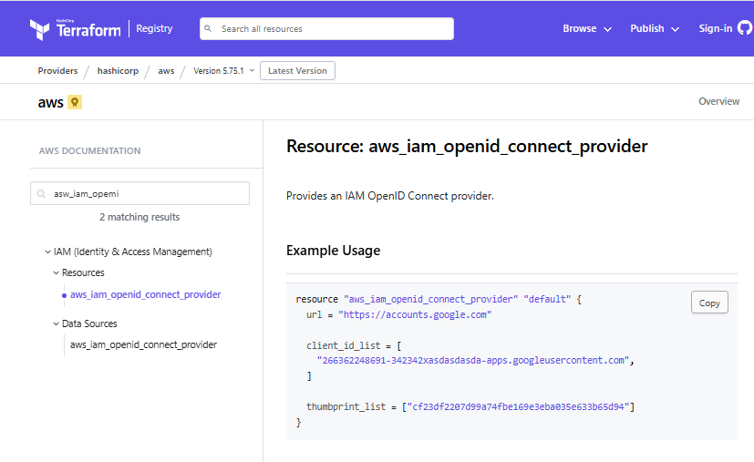
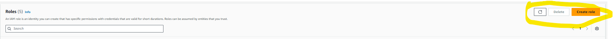
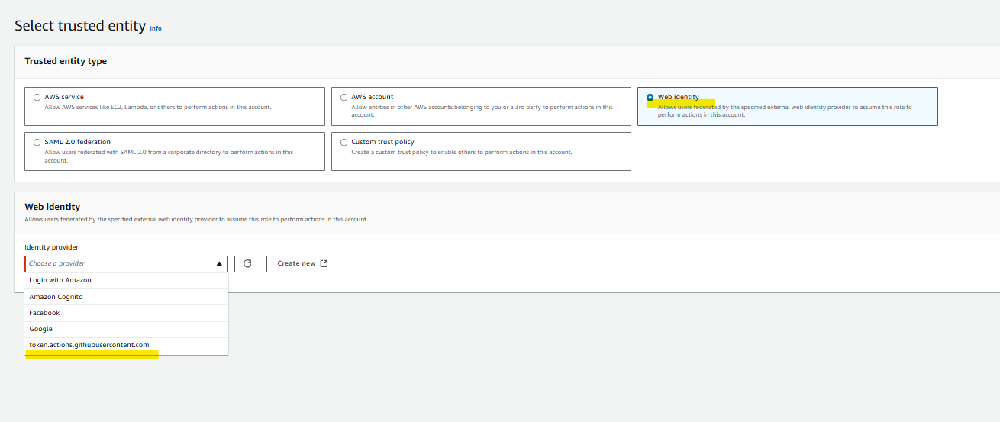
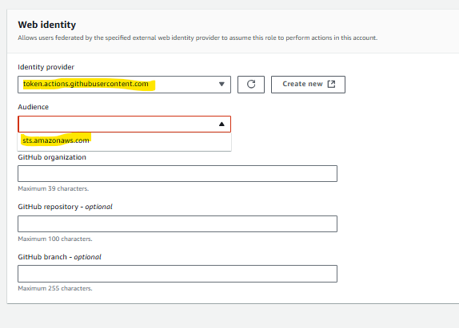
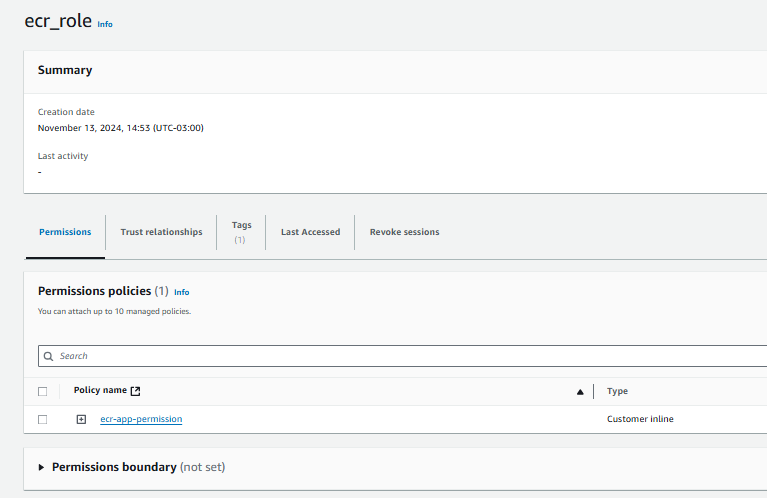
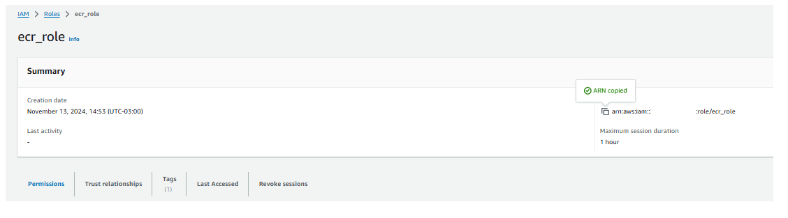
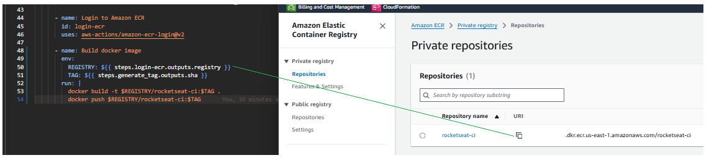
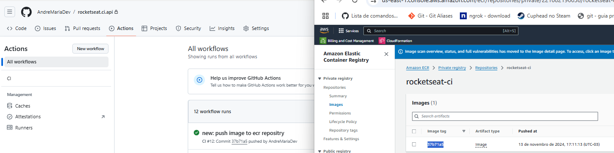
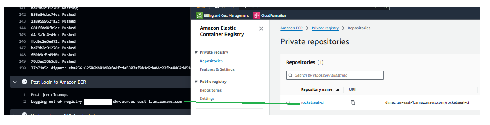
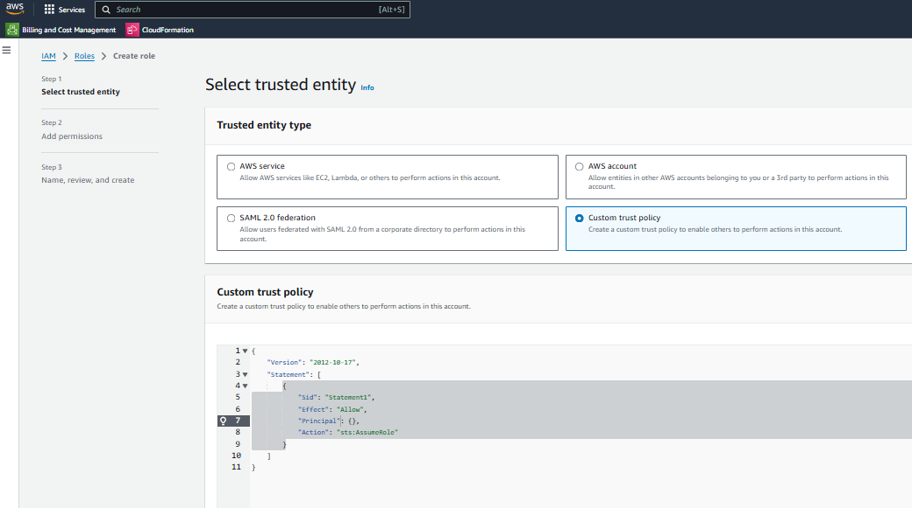

# Configurando repositório AWS

1- Criar a estrutura de login.

No Git Hub Marketplace vamos pesquisar por `aws credentials`
https://github.com/marketplace/actions/configure-aws-credentials-action-for-github-actions

Aqui vamos trabalhar com o conceito de OIDC


No Git Hub Marketplace vamos pesquisar por `ecr login aws`
https://github.com/marketplace/actions/amazon-ecr-login-action-for-github-actions


Agora vamos altera o código no arquivo `ci.yml`:

```hcl

name: CI

on:
  push:
    branches:
      - main


jobs:
  build:
    name: 'Build and Push'
    runs-on: ubuntu-latest
    # strategy:
    #   matrix:
    #     node: [ 18, 20 ]
    steps:
      - uses: actions/checkout@v4

      # - name: Setup node | ${{ matrix.node }}
      - name: Setup node
        uses: actions/setup-node@v4
        with:
          # node-version: ${{ matrix.node }}
          node-version: 18
      - run: npm ci
      - run: npm test

      - name: Generate tag
        id: generate_tag
        run: |
          SHA=$(echo $GITHUB_SHA | head -c7)
          echo "sha=$SHA" >> $GITHUB_OUTPUT
      
      - name: Configure AWS Credentials
        uses: aws-actions/configure-aws-credentials@v4
        with:
          aws-region: us-east-1
          role-to-assume: ''

      - name: Login to Amazon ECR
        id: login-ecr
        uses: aws-actions/amazon-ecr-login@v2

```

`- name: Configure AWS Credentials`: Configura as credenciais da AWS para permitir operações com serviços AWS.

  `uses: aws-actions/configure-aws-credentials@v4`: Ação que configura as credenciais da AWS.
  
  `with:`: Especifica a região (us-east-1) e um campo `role-to-assume` que está vazio (deveria conter o ARN de um papel se necessário).

`- name: Login to Amazon ECR`: Faz login no Amazon Elastic Container Registry (ECR) para permitir o push de imagens de contêiner.

  `id: login-ecr`: Define um ID para a etapa.
  
  `uses: aws-actions/amazon-ecr-login@v2`: Utiliza uma ação para fazer login no ECR.


2- Criando recursos no IAM AWS

* Identity providers

* Role

* ECR

* Build Image

## Identity providers
Vamos criar uma nova pasta  rocketseat.iac

aqui vamos criar um arquivo `main.tf` e incluir o seguinte script

```hcl
terraform {
  required_providers {
    aws = {
      source = "hashicorp/aws"
      version = "5.73.0"
    }
  }
}

provider "aws" {
  profile = "VALOR-GERADO-NO-PASSO-1"
  region  = "VALOR-CONTIDO-NO-[Resumo das configurações]"
}
```

No terminal vamos rodar o seguinte comando :  `terraform init`. 

Logo apos vamos criar um arquivo `iam.tf`

vamos acessar o link : https://registry.terraform.io/providers/hashicorp/aws/latest/docs/resources/iam_openid_connect_provider





O GitHub Actions pode emitir tokens OIDC para autenticar seus jobs diretamente com provedores que suportam OIDC, sem precisar armazenar credenciais secretas.
Uso em serviços de nuvem:

    Configuração de permissões: Nos workflows do GitHub Actions, você pode configurar permissões de uso de OIDC. O token é emitido por https://token.actions.githubusercontent.com.

    Provedor de identidade: No lado do provedor (por exemplo, AWS, Azure ou GCP), você precisa registrar token.actions.githubusercontent.com como um provedor de identidade confiável.

    Uso em um workflow: No seu arquivo YAML de workflow, você pode solicitar um token OIDC


sts.amazonaws.com é o endpoint do serviço AWS Security Token Service (STS), que é usado para obter credenciais temporárias e seguras na AWS. Ele é frequentemente usado em combinação com autenticação baseada em OIDC (OpenID Connect) e GitHub Actions para permitir que workflows autenticados acessem recursos da AWS.

logo vamos adicionar o script no arquivo.

```hcl
resource "aws_iam_openid_connect_provider" "oidc-git" {
  url = "https://token.actions.githubusercontent.com"

  client_id_list = [
    "sts.amazonaws.com",
  ]

  thumbprint_list = ["*****************************"]

  tags = {
    IAC = "True"
  }
}
```

* Verificar se a sintax está correta: `terraform validate`

* Rodar o camando de pre planejamento : `terraform plan`

* Rodar e comando de execução : 

    a- necessário aprovar
        `terraform apply` (com etapa de confirmação)

    b- `terraform apply -auto-approve` (sem etapa de confirmação)


## Role

Agora vamos criar a role para preencher o `role-to-assume` no step `- name: Configure AWS Credentials` do arquivo `ci.yml`

para isso vamos seguir os passos

* No site console AWS vamos ao  Identity and Acess Management (IAM) .









Como podemos ver os items `token.actions.githubusercontent.com` e `sts.amazonaws.com` foram criados anteriormente. Logo podemos utilizarmos aqui.

Logo apo´s clicar em next...


o processo cria esse json para validação da role, vamos copiar o conteudo e colcar no arquivo `ci.yml`.


mas antes vamos ao site do terraforme pegar um exemplo de como implementar o json ....

https://registry.terraform.io/providers/hashicorp/aws/latest/docs/resources/iam_role


Vamos copiar e editar isso dentro do arquivo `iam.yml`.


```hcl
resource "aws_iam_openid_connect_provider" "oidc-git" {
  url = "https://token.actions.githubusercontent.com"

  client_id_list = [
    "sts.amazonaws.com",
  ]

  thumbprint_list = ["******************************************"]

  tags = {
    IAC = "True"
  }
}

resource "aws_iam_role" "ecr_role" {
  name = "ecr_role"

  # Terraform's "jsonencode" function converts a
  # Terraform expression result to valid JSON syntax.
  assume_role_policy = jsonencode({
    Statement = [
        {
            Effect = "Allow",
            Action = "sts:AssumeRoleWithWebIdentity",
            Principal = {
                Federated = "arn:aws:iam::*************:oidc-provider/token.actions.githubusercontent.com"
            },
            Condition = {
                StringEquals = {
                    "token.actions.githubusercontent.com:aud" = "sts.amazonaws.com"
                    "token.actions.githubusercontent.com:sub" = "repo:AndreMariaDev/rocketseat.ci.api:ref:refs/heads/main"
                }
            }
        }
    ]
    Version = "2012-10-17"
  })

  tags = {
    IAC = "True"
  }
}
```


* Rodar e comando de execução : 

    a- necessário aprovar
        `terraform apply` (com etapa de confirmação)

    b- `terraform apply -auto-approve` (sem etapa de confirmação)


Vimos que foi criado com sucesso , agora vamos adicionar uma policy a nossa role.

Para isso vamos clicar na na role que acabamos de criar.


Vamos selecionar `Attach policy` conforme a imagem.


Vamos clicar o botão `+` conforme a imagem .


Aqui temos o exemplo .

Agora vamos voltar ao site do terraforme https://registry.terraform.io/providers/hashicorp/aws/latest/docs/resources/iam_role


Vamos copiar o conteudo e incluir no arquivo `iam.tf` .

```hcl
resource "aws_iam_openid_connect_provider" "oidc-git" {
  url = "https://token.actions.githubusercontent.com"

  client_id_list = [
    "sts.amazonaws.com",
  ]

  thumbprint_list = ["*****************"]

  tags = {
    IAC = "True"
  }
}

resource "aws_iam_role" "ecr_role" {
  name = "ecr_role"

  assume_role_policy = jsonencode({
    Statement = [
      {
        Action = "sts:AssumeRoleWithWebIdentity",
        Condition = {
          StringEquals = {
            "token.actions.githubusercontent.com:aud" = "sts.amazonaws.com",
            "token.actions.githubusercontent.com:sub" = "repo:AndreMariaDev/rocketseat.ci.api:ref:refs/heads/main"
          }
        }
        Effect = "Allow",
        Principal = {
          Federated = "arn:aws:iam::************:oidc-provider/token.actions.githubusercontent.com"
        }
      }
    ]
    Version = "2012-10-17",
  })

  inline_policy {
    name = "ecr-app-permission"

    policy = jsonencode({
      Version = "2012-10-17"
      Statement = [
        {
            Sid    = "Statement1",
            Action = "apprunner:*",
            Effect = "Allow",
            Resource = "*"
        },
        {
            Sid    = "Statement2",
            Action = [
            "iam:PassRole",
            "iam:CreateServiceLinkedRole"
            ],
            Effect = "Allow",
            Resource = "*"
        },
        {
            Sid    = "Statement3"
            Action = [
            "ecr:GetDownloadUrlForLayer",
            "ecr:BatchGetImage",
            "ecr:BatchCheckLayerAvailability",
            "ecr:PutImage",
            "ecr:InitiateLayerUpload",
            "ecr:UploadLayerPart",
            "ecr:CompleteLayerUpload",
            "ecr:GetAuthorizationToken"
            ]
            Effect = "Allow"
            Resource = "*"
        }
      ]
    })
  }

  tags = {
    IAC = "True"
  }
}
```
## Explicação dos Statements na Política do Recurso `aws_iam_role "app-runner-role"`
#### Assume Role Policy (`assume_role_policy`)
Esta política define quem pode assumir a função. É utilizada para conceder permissões a um provedor de identidade para que possa solicitar tokens de segurança do AWS Security Token Service (STS) para essa função.

- **Action**: `"sts:AssumeRoleWithWebIdentity"`
  - **Descrição**: Permite que um provedor de identidade Web (neste caso, GitHub Actions) assuma a função.
- **Condition**:
  - **StringEquals**:
    - `"token.actions.githubusercontent.com:aud"` = `"sts.amazonaws.com"`: Garante que a audiência do token emitido seja o AWS STS.
    - `"token.actions.githubusercontent.com:sub"` = `"repo:AndreMariaDev/rocketseat.ci.api:ref:refs/heads/main"`: Especifica que a política só permitirá que tokens de um repositório específico (neste caso, `AndreMariaDev/rocketseat.ci.api`) e de uma branch específica (`main`) possam assumir a função.
- **Effect**: `"Allow"`: Autoriza o acesso de acordo com as condições especificadas.
- **Principal**:
  - **Federated**: `"arn:aws:iam::************:oidc-provider/token.actions.githubusercontent.com"`: Define o OIDC Provider do GitHub como entidade confiável para assumir a função.

#### Inline Policy (`inline_policy`)
Esta política embutida define as permissões da função e detalha as operações que a função pode realizar nos recursos da AWS.

##### 1. **Statement1: Permissões do App Runner**
- **Sid**: `"Statement1"`
- **Action**: `"apprunner:*"`
  - **Descrição**: Concede permissões completas (`*`) sobre o serviço AWS App Runner, que pode ser usado para executar aplicações e serviços com contêineres.
- **Effect**: `"Allow"`
- **Resource**: `"*"` (todas as instâncias de recursos do App Runner)
- **Motivo**: Permite que a função gerencie o ciclo de vida e operações relacionadas ao App Runner. Isso é útil quando se deseja implantar, gerenciar e monitorar serviços de contêiner usando o App Runner.

##### 2. **Statement2: Permissões de IAM**
- **Sid**: `"Statement2"`
- **Action**: `["iam:PassRole", "iam:CreateServiceLinkedRole"]`
  - **Descrição**:
    - `"iam:PassRole"`: Permite que a função delegue permissões a outros serviços para que possam atuar em seu nome.
    - `"iam:CreateServiceLinkedRole"`: Permite criar funções vinculadas a serviços que são automaticamente gerenciadas por serviços da AWS.
- **Effect**: `"Allow"`
- **Resource**: `"*"`
- **Motivo**: Necessário para que a função passe a si mesma para serviços como o App Runner e crie funções que o App Runner possa usar, garantindo a integração e o funcionamento adequado do pipeline.

##### 3. **Statement3: Permissões de ECR (Elastic Container Registry)**
- **Sid**: `"Statement3"`
- **Action**:
  - `"ecr:GetDownloadUrlForLayer"`: Obtém a URL para download de uma camada de imagem de contêiner.
  - `"ecr:BatchGetImage"`: Recupera metadados de imagens no repositório.
  - `"ecr:BatchCheckLayerAvailability"`: Verifica a disponibilidade das camadas da imagem no repositório.
  - `"ecr:PutImage"`: Insere uma imagem no repositório.
  - `"ecr:InitiateLayerUpload"`, `"ecr:UploadLayerPart"`, `"ecr:CompleteLayerUpload"`: Realizam o processo de upload de uma camada de imagem.
  - `"ecr:GetAuthorizationToken"`: Recupera um token de autenticação necessário para acessar o repositório ECR.
- **Effect**: `"Allow"`
- **Resource**: `"*"`
- **Motivo**: Necessário para que a função possa fazer pull e push de imagens para o Amazon ECR, garantindo que as imagens usadas e geradas pelo pipeline de CI/CD sejam armazenadas e acessadas de forma segura.

### Conclusão
Esses `Statements` foram configurados para permitir que a função `ecr_role` seja assumida pelo GitHub Actions para realizar operações automatizadas no App Runner, gerenciar permissões do IAM e realizar operações no Amazon ECR. Essas permissões são fundamentais para a automação do fluxo de trabalho de CI/CD, onde aplicações em contêineres são construídas, armazenadas no ECR e implantadas usando o App Runner.


* Rodar e comando de execução : 

    a- necessário aprovar
        `terraform apply` (com etapa de confirmação)

    b- `terraform apply -auto-approve` (sem etapa de confirmação)


Vamos verificar na aws agora :




finalmente podemos altera o arquivo `ci.yml`


```hcl

name: CI

on:
  push:
    branches:
      - main

permissions:
  id-token: write
  contents: read

jobs:
  build:
    name: 'Build and Push'
    runs-on: ubuntu-latest
    # strategy:
    #   matrix:
    #     node: [ 18, 20 ]
    steps:
      - uses: actions/checkout@v4

      # - name: Setup node | ${{ matrix.node }}
      - name: Setup node
        uses: actions/setup-node@v4
        with:
          # node-version: ${{ matrix.node }}
          node-version: 18
      - run: npm ci
      - run: npm test

      - name: Generate tag
        id: generate_tag
        run: |
          SHA=$(echo $GITHUB_SHA | head -c7)
          echo "sha=$SHA" >> $GITHUB_OUTPUT
      
      - name: Configure AWS Credentials
        uses: aws-actions/configure-aws-credentials@v4
        with:
          aws-region: us-east-1
          role-to-assume: arn:aws:iam::************:role/ecr_role

      - name: Login to Amazon ECR
        id: login-ecr
        uses: aws-actions/amazon-ecr-login@v2


      # - name: Login into the container registry
      #   uses: docker/login-action@v3
      #   with:
      #     username: ${{ secrets.DOCKERHUB_USERNAME }}
      #     password: ${{ secrets.DOCKERHUB_TOKEN }}

      # - name: Build and Push
      #   uses: docker/build-push-action@v6
      #   with:
      #     push: true
      #     tags: andremariadevops/rocketseat-ci-api:${{ steps.generate_tag.outputs.sha }},andremariadevops/rocketseat-ci-api:latest
      # - name: Build docker image
      #   run: docker build -t andremariadevops/rocketseat-ci-api:${{ steps.generate_tag.outputs.sha }} .

      # - name: Push image
      #   run: docker push andremariadevops/rocketseat-ci-api:${{ steps.generate_tag.outputs.sha }}

```

podemos ver que o campo `role-to-assume` foi preenchido com o valor disponibilizado pelo `ecr_role`



## ECR

Agora vamos criar o recurso ECR para tal vamos acesssar o site do terraform.

https://registry.terraform.io/providers/hashicorp/aws/latest/docs/data-sources/ecr_repository


Vemos na doc que é super simple, logo vamos criar um novo arquivo pasta rocketseat.iac

aqui vamos criar um arquivo ecr.tf e incluir o seguinte script:

```hcl

resource "aws_ecr_repository" "rocketseat-ci-api" {
  name                 = "rocketseat-ci"
  image_tag_mutability = "MUTABLE"

  image_scanning_configuration {
    scan_on_push = true
  }

  tags = {
    IAC = "True"
  }
}

```

* Rodar e comando de execução : 

    a- necessário aprovar
        `terraform apply` (com etapa de confirmação)

    b- `terraform apply -auto-approve` (sem etapa de confirmação)


Agora podemos realizar o commit para o git e analisar o git hub actions 

`git add .`

`git commit -m "new: configure role and permissions"`

`git push`


## Build Image


Agora para enviarmos a imagem da api para o ECR vamos edita o arquivo ci.yml com o seguinte código :

```hcl

name: CI

on:
  push:
    branches:
      - main

permissions:
  id-token: write
  contents: read

jobs:
  build:
    name: 'Build and Push'
    runs-on: ubuntu-latest
    # strategy:
    #   matrix:
    #     node: [ 18, 20 ]
    steps:
      - uses: actions/checkout@v4

      # - name: Setup node | ${{ matrix.node }}
      - name: Setup node
        uses: actions/setup-node@v4
        with:
          # node-version: ${{ matrix.node }}
          node-version: 18
      - run: npm ci
      - run: npm test

      - name: Generate tag
        id: generate_tag
        run: |
          SHA=$(echo $GITHUB_SHA | head -c7)
          echo "sha=$SHA" >> $GITHUB_OUTPUT
      
      - name: Configure AWS Credentials
        uses: aws-actions/configure-aws-credentials@v4
        with:
          aws-region: us-east-1
          role-to-assume: arn:aws:iam::************:role/ecr_role

      - name: Login to Amazon ECR
        id: login-ecr
        uses: aws-actions/amazon-ecr-login@v2

      - name: Build docker image
        env:
          REGISTRY: ${{ steps.login-ecr.outputs.registry }}
          TAG: ${{ steps.generate_tag.outputs.sha }}
        run: |
          docker build -t $REGISTRY/rocketseat-ci:$TAG .
          docker push $REGISTRY/rocketseat-ci:$TAG
```

### Explicação detalhada:

Build docker image:

`name: Build docker image`: Nome da etapa para identificar que essa etapa é responsável por construir a imagem Docker.

`env`: Define variáveis de ambiente que serão usadas na execução do comando run.

`REGISTRY: ${{ steps.login-ecr.outputs.registry }}`: A variável REGISTRY é preenchida com o valor da saída registry da etapa login-ecr. Essa saída contém o URL do registro Amazon ECR para o qual a imagem será enviada.



`TAG: ${{ steps.generate_tag.outputs.sha }}`: A variável TAG recebe o valor da saída sha da etapa generate_tag (não mostrada aqui, mas deve existir em uma etapa anterior). Geralmente, essa saída representa um hash único do commit ou uma tag gerada automaticamente, usada para versionar a imagem Docker.

`run`: O bloco run contém os comandos de shell que serão executados:

```
docker build -t $REGISTRY/rocketseat-ci:$TAG .
docker push $REGISTRY/rocketseat-ci:$TAG
```

`docker build -t $REGISTRY/rocketseat-ci:$TAG .`: Constrói uma imagem Docker a partir do Dockerfile presente no diretório atual (.). A opção -t define o nome e a tag da imagem, que será algo como 123456789012.dkr.ecr.us-east-1.amazonaws.com/rocketseat-ci:sha123abc.

`docker push $REGISTRY/rocketseat-ci:$TAG`: Envia a imagem recém-construída para o registro do Amazon ECR. O REGISTRY e a TAG definidos nas variáveis de ambiente são utilizados para especificar o destino exato no ECR.

Agora podemos realizar o commit para o git e analisar o git hub actions 

`git add .`

`git commit -m "new: push image to ecr repositry"`

`git push`








## Role App Runner

Agora vamos criar uma role para o running da aplicação para isso vamos add um novo resource no arquivo `aim.tf`

```hcl
resource "aws_iam_role" "app-runner-role" {
  name = "app-runner-role"
  assume_role_policy = jsonencode({})
}

```

para preencher o `assume_role_policy` vamos ao console aws e no produtoi IAM 



Vamos copiar o conteudo e add no item `assume_role_policy`


```hcl
resource "aws_iam_role" "app-runner-role" {
  name = "app-runner-role"

  assume_role_policy = jsonencode({
    Version = "2012-10-17",
    Statement = [
      {
        Effect = "Allow",
        Principal = {
          Service = "build.apprunner.amazonaws.com"
        },
        Action = "sts:AssumeRole"
      }
    ]
  })

  managed_policy_arns = [
    "arn:aws:iam::aws:policy/AmazonEC2ContainerRegistryReadOnly"
  ]

  tags = {
    IAC = "True"
  }
}
```

### Explicação dos Statements na Política do Recurso `aws_iam_role` `app-runner-role`

### 1. Papel do `Statement` no `assume_role_policy`

O bloco `assume_role_policy` define a política de confiança que especifica quais entidades (por exemplo, serviços ou usuários) têm permissão para assumir essa função (IAM Role). A estrutura de `Statement` no `assume_role_policy` faz o seguinte:

- **`Effect: "Allow"`**: Esta cláusula indica que a ação definida no `Action` é permitida.
- **`Principal`**: Especifica quem ou qual serviço pode assumir essa função. No caso, o `Service` é `build.apprunner.amazonaws.com`, que representa o App Runner da AWS. Isso significa que o serviço App Runner tem permissão para assumir essa função.
- **`Action: "sts:AssumeRole"`**: Esta é a ação permitida para o `Principal`, ou seja, o serviço App Runner pode usar a operação `sts:AssumeRole` para assumir a função.

**Motivo**: O `assume_role_policy` é necessário para que o serviço App Runner possa autenticar e usar a função. Isso permite que o App Runner obtenha permissões temporárias para acessar outros recursos da AWS com base nas políticas associadas à função.

### 2. Papel do `managed_policy_arns`

O parâmetro `managed_policy_arns` define as políticas gerenciadas pela AWS que são associadas à função. No exemplo, a política `arn:aws:iam::aws:policy/AmazonEC2ContainerRegistryReadOnly` está anexada à função.

- **`AmazonEC2ContainerRegistryReadOnly`**: Esta política gerenciada concede permissões de leitura para o Amazon Elastic Container Registry (ECR). Isso significa que qualquer serviço ou entidade que assuma essa função pode ler imagens do ECR, mas não pode fazer alterações (por exemplo, fazer upload de imagens).

**Motivo**: Essa política é necessária para permitir que o serviço App Runner acesse imagens de contêiner armazenadas no Amazon ECR. Isso é essencial para que o App Runner possa executar aplicações que dependem de imagens armazenadas nesse repositório.


A inclusão do `build.apprunner.amazonaws.com` como `Principal` permite que o serviço App Runner obtenha um token temporário através da chamada `sts:AssumeRole` e execute ações com as permissões definidas nessa role.

O `Principal` em uma política de assunção define quem ou o que tem permissão para assumir a role. Ele pode ser um usuário, um grupo, uma entidade federada ou, neste caso, um serviço AWS.


O `sts:AssumeRole` é uma ação do AWS Security Token Service (STS) que permite que uma entidade (como um usuário, serviço ou aplicação) assuma uma role IAM (Identity and Access Management). Esse processo gera credenciais temporárias que a entidade pode usar para acessar recursos da AWS com as permissões especificadas pela role assumida.

O `managed_policy_arns` especifica uma política gerenciada que é anexada à role.

A política `AmazonEC2ContainerRegistryReadOnly` concede permissões de leitura ao Amazon ECR (Elastic Container Registry). Isso é necessário para que o serviço App Runner possa puxar imagens de contêiner do ECR para implantar e executar aplicações.

### Por final teremos :

```hcl
resource "aws_iam_openid_connect_provider" "oidc-git" {
  url = "https://token.actions.githubusercontent.com"

  client_id_list = [
    "sts.amazonaws.com",
  ]

  thumbprint_list = ["****************************************"]

  tags = {
    IAC = "True"
  }
}

resource "aws_iam_role" "ecr_role" {
  name = "ecr_role"

  assume_role_policy = jsonencode({
    Statement = [
      {
        Action = "sts:AssumeRoleWithWebIdentity",
        Condition = {
          StringEquals = {
            "token.actions.githubusercontent.com:aud" = "sts.amazonaws.com",
            "token.actions.githubusercontent.com:sub" = "repo:AndreMariaDev/rocketseat.ci.api:ref:refs/heads/main"
          }
        }
        Effect = "Allow",
        Principal = {
          Federated = "arn:aws:iam::************:oidc-provider/token.actions.githubusercontent.com"
        }
      }
    ]
    Version = "2012-10-17",
  })

  inline_policy {
    name = "ecr-app-permission"

    policy = jsonencode({
      Version = "2012-10-17"
      Statement = [
        {
            Sid    = "Statement1",
            Action = "apprunner:*",
            Effect = "Allow",
            Resource = "*"
        },
        {
            Sid    = "Statement2",
            Action = [
            "iam:PassRole",
            "iam:CreateServiceLinkedRole"
            ],
            Effect = "Allow",
            Resource = "*"
        },
        {
            Sid    = "Statement3"
            Action = [
            "ecr:GetDownloadUrlForLayer",
            "ecr:BatchGetImage",
            "ecr:BatchCheckLayerAvailability",
            "ecr:PutImage",
            "ecr:InitiateLayerUpload",
            "ecr:UploadLayerPart",
            "ecr:CompleteLayerUpload",
            "ecr:GetAuthorizationToken"
            ]
            Effect = "Allow"
            Resource = "*"
        }
      ]
    })
  }

  tags = {
    IAC = "True"
  }
}

resource "aws_iam_role" "app-runner-role" {
  name = "app-runner-role"

  assume_role_policy = jsonencode({
    Version = "2012-10-17",
    Statement = [
      {
        Effect = "Allow",
        Principal = {
          Service = "build.apprunner.amazonaws.com"
        },
        Action = "sts:AssumeRole"
      }
    ]
  })

  managed_policy_arns = [
    "arn:aws:iam::aws:policy/AmazonEC2ContainerRegistryReadOnly"
  ]

  tags = {
    IAC = "True"
  }
}
```

### Deploy to App Runner