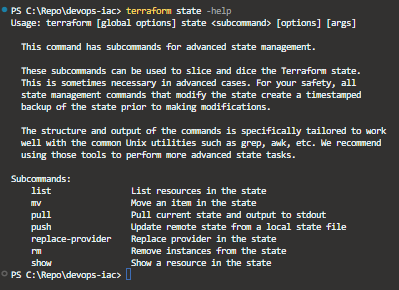

# State

Na aplicação temos o arquivo `terraform.tfstate`
O terraform se orienta pelo state. O State possui de forma declarativa todo o estado da infraestrutura.

O estado so é alterado quando o resultado do comando `terraform apply` ou `terraform apply -auto-approve` for de sucesso.

Caso exista uma alteração via console aws e a mesma não esteja no arquivo `terraform.tfstate` como resultado teremos uma `dissonância de estado`

Logo será sobrescrito conforme o conteudo contido no arquivo `terraform.tfstate`.

# Backup

O arquivo `terraform.tfstate.backup` possue as informações de implementação de recursos em um nível de v-1 referente ao arquivo `terraform.tfstate` atual . 


## Advanced state managment

O terraforme possui em sua lista de comando um comando especifico para atuar com o `state`.

`terraform state`




## Vercionamento 

Aqui a ideia é não realizar o commit para o repo git do arquivo `terraform.tfstate` mas como vamos adm isso?

O `terraform.tfstate` deve ser gerenciado de uma maneira remota. Uma maneira de realizar isso é uasr o `S3` como recurso para gerenciar o estado `back-end remoto` !

A ideia é trabalharmos com um  `terraform.tfstate` onde o run de uma terraform local aponte para o `terraform.tfstate` contido no `S3` e não para o `terraform.tfstate` local.

Para isso vamos seguir os passos:

1. Crair uma `buket` especifico para o `state`.

No arquivo `providers.tf` vamos adicionar o seguinte trecho.

```hcl

terraform {
  required_providers {
    aws = {
      source  = "hashicorp/aws"
      version = "5.73.0"
    }
  }
}

provider "aws" {
  profile = "****************"
  region  = "us-east-1"
}

resource "aws_s3_bucket" "terraform_state" {
  bucket = var.state_bucket

  lifecycle{
    prevent_destroy = true
  }
}
```
Como não podemos deletar o state 

o elemento `prevent_destroy` indicar que o bucket que contém o `terraform.tfstate` não será deletado.

2. Vamos criar um novo arquivo na raiz `./variables.tf` 

```hcl

variable "state_bucket" {
  type        = string
  default     = "rocketseat-sate-bucket-tf"
  description = "Bucket com estado"
}

```
podemos rodar o comando `terraform plan`


Para finalizar podemos rodar o comando `terraform apply -auto-approve`.


Agora vamosa configurar o `back-end`

3. Back-end Configure

Vamos editar o arquivo  `providers.tf` novamente.

```hcl

terraform {
  required_providers {
    aws = {
      source  = "hashicorp/aws"
      version = "5.73.0"
    }
  }
  backend "s3" {
    bucket    = "rocketseat-sate-bucket-tf"
    region  = "us-east-1"
    key     = "terraform.tfstate"
    encrypt = true
    profile = "****************"
  }
}

provider "aws" {
  profile = "******************"
  region  = "us-east-1"
}

resource "aws_s3_bucket" "terraform_state" {
  bucket = var.state_bucket

  lifecycle {
    prevent_destroy = true
  }
}
```

Após a criação é necessário rodar o comando `terraform init` e rodar o comando `terraform plan`

Para finalizar podemos rodar o comando `terraform apply -auto-approve`.


4. Ativar o vercionamneto

Consultado a documentação do terraform temos: 
https://registry.terraform.io/providers/hashicorp/aws/latest/docs/resources/s3_bucket_versioning

Vamos editar o arquivo  `providers.tf` novamente.

```hcl

terraform {
  required_providers {
    aws = {
      source  = "hashicorp/aws"
      version = "5.73.0"
    }
  }
  backend "s3" {
    bucket    = "rocketseat-sate-bucket-tf"
    region  = "us-east-1"
    key     = "terraform.tfstate"
    encrypt = true
    profile = "****************"
  }
}

provider "aws" {
  profile = "******************"
  region  = "us-east-1"
}

resource "aws_s3_bucket" "terraform_state" {
  bucket = var.state_bucket

  lifecycle {
    prevent_destroy = true
  }
}

resource "aws_s3_bucket_versioning" "terraform_state" {
  bucket = aws_s3_bucket.terraform_state.bucket
  versioning_configuration {
    status = "Enabled"
  }

  depends_on = [
    aws_s3_bucket.terraform_state
  ]
}

```

Após a criação é necessário rodar o comando `terraform plan`

Para finalizar podemos rodar o comando `terraform apply -auto-approve`.


## Destroy por recurso

Para Excluir um recuros especifico devemos rodar o seguinte comando:

`terraform plan --destroy --target PATH`

 Onde `PATH` sria o recuros que queremos excluir exemplo :

 `PATH` =  module.[nome_module].[resource].[name]

 exemplo : 
 `PATH` =  module.s3.aws_s3_bucket.bucket_to_cloudfront

 


 ## Criando o gitignore

 ```hcl

*.tfstate
*.tfstate.*
*.tfvars
**/.terraform/*

```