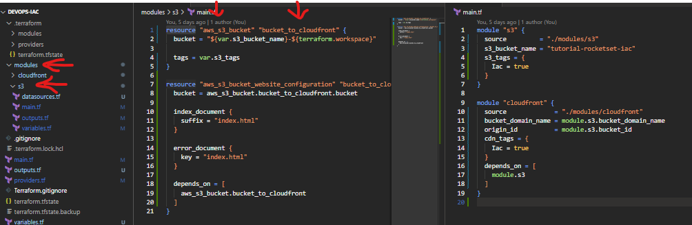

## Login AWS:

- **`"Login CLI AWS"`**: 
    ```bash
    aws sso login --profile AdministratorAccess-<number>
    ```


## Comand Terraform


- **`"Verificar se a sintax está correta"`**: 

    ```bash
    terraform validate
    ```

- **`"Rodar o camando de pre planejamento"`**: 

    ```bash
    terraform plan
    ```

- **`"Rodar e comando de execução"`**:

    - a- necessário aprovar terraform apply (com etapa de confirmação)

        ```bash
        terraform apply
        ```


    - b- terraform apply -auto-approve (sem etapa de confirmação)


        ```bash
        terraform apply -auto-approve 
        ```

- **`"Caso queira remover"`**:

    ```bash
    terraform plan --destroy
    ```

    ```bash
    terraform apply --destroy
    ```

```bash

```

- **`"Para saber o workspace atual"`**: 

    ```bash
    terraform workspace show
    ```

- **`"Para criar um workspace"`**: 

    ```bash
    terraform workspace new dsv
    ```

- **`"Para listar os workspace"`**: 

    ```bash
    terraform workspace list
    ```

- **`"Para selecionar o workspace"`**: 

    ```bash
    terraform workspace select default
    ```

### Destroy por recurso

Para Excluir um recuros especifico devemos rodar o seguinte comando:

`terraform plan --destroy --target PATH`

 Onde `PATH` seria o recuros que queremos excluir exemplo :

 `PATH` =  module.[nome_module].[resource].[name]

 exemplo : 
 `PATH` =  module.s3.aws_s3_bucket.bucket_to_cloudfront

 