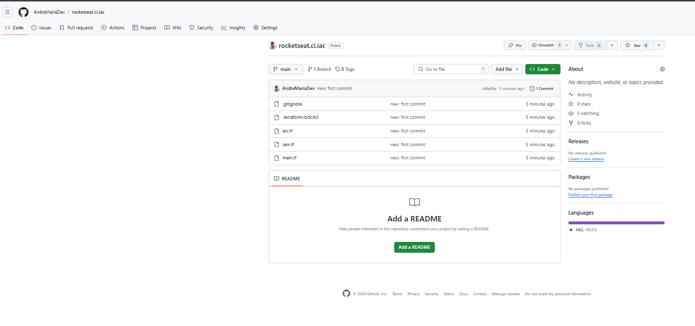
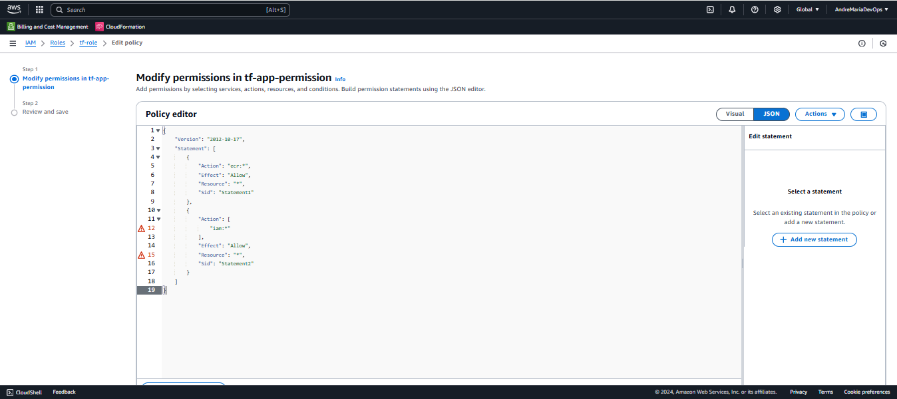

# Pipeline de intraestrutura

Aqui veremos :

*  Criando repo e estruturando pipeline

*  Configurando permissões

*  Rodando pipeline pela 1° vez

*  Criando Bucket S3

*  Configurando back-end

*  Remote state e boas práticas

*  Boas práticas em pipelines no geral

*  Fechamento do módulo e últimos ajustes

*  Criando repo e estruturando pipeline

## Criando repo e estruturando pipeline

Aqui vamos aplicar os conceitos de CI/CD no contexto iac.

Vamos colocar o nosso iac no git hub e criar uma pipeline para ele.

Então vamos criar uma novo repositório no Git.

https://github.com/new 

create-new-repository


Agora vamos criar um novo arquivo no projeto iac. Esse arquivo será um gitignore.


No arquivo vamos adicionar o código.
```hcl
*.tfstate
*.tfstate.*
*.tfvars

**/.terraform/*
```

Agora vamos subir a aplicação para o repo.




Agora vamos iniciar a implementação da pipeline do iac.

Vamos criar os diretórios e o arquivo ci.yml 

`.github\workflows\ci.yml`


https://github.com/hashicorp/setup-terraform

Como o ubuntu não possui o terraform configurado vamos realizar a etapa configurativa do terraform aqui.


agora vamos implementar uma estrutura inicial para o pipeline.

```hcl

name: CI

on:
  push:
    branches:
      - main

jobs:
  
  run-terraform:
    name: 'Run terraform'
    runs-on: ubuntu-latest

    steps:
      - name: configure aws credentials
        uses: aws-actions/configure-aws-credentials@v4
        with:
          aws-region: us-east-1
          role-to-assume: 

      - name: Setup terraform
        uses: hashicorp/setup-terraform@v3
        with:
          terraform_version: 1.8.4

      - name: Run terraform init
        run: terraform init

      - name: Run terraform format
        run: terraform fmt -check

      - name: Run terraform plan
        run: terraform plan

      - name: Run terraform apply
        run: terraform apply -auto-approve

```


#### Explicação Detalhada do Script de CI

#### Nome do Workflow
```yaml
name: CI
```
- O workflow é chamado `CI`, indicando que é um processo de Integração Contínua.

#### Evento que Aciona o Workflow
```yaml
on:
  push:
    branches:
      - main
```
- O workflow será acionado quando houver um `push` (envio de alterações) para a branch `main`. Isso significa que sempre que novas mudanças forem enviadas para a branch `main`, o workflow será executado.

#### Definição dos `jobs`
```yaml
jobs:
  run-terraform:
    name: 'Run terraform'
    runs-on: ubuntu-latest
```
- O `job` é chamado `run-terraform` e a execução é nomeada como "Run terraform".
- `runs-on: ubuntu-latest` indica que o job será executado em um ambiente que usa a versão mais recente do Ubuntu.

#### Passos do `job`
##### 1. Configuração das Credenciais da AWS
```yaml
    steps:
      - name: configure aws credentials
        uses: aws-actions/configure-aws-credentials@v4
        with:
          aws-region: us-east-1
          role-to-assume: 
```
- Utiliza a **action** `aws-actions/configure-aws-credentials` (versão 4) para configurar as credenciais da AWS.
- `aws-region: us-east-1` define a região da AWS onde os recursos serão acessados.
- `role-to-assume` é usado para especificar um **role** que será assumido para autenticação com credenciais temporárias.

##### 2. Configuração do Terraform
```yaml
      - name: Setup terraform
        uses: hashicorp/setup-terraform@v3
        with:
          terraform_version: 1.8.4
```
- Configura o Terraform no ambiente de execução usando a **action** `hashicorp/setup-terraform` (versão 3).
- `terraform_version: 1.8.4` assegura que a versão 1.8.4 do Terraform seja instalada.

##### 3. Inicialização do Terraform
```yaml
      - name: Run terraform init
        run: terraform init
```
- Executa o comando `terraform init`, que inicializa o diretório de trabalho com os arquivos de configuração do Terraform. Esse comando baixa plugins e prepara o ambiente.

##### 4. Verificação de Formatação
```yaml
      - name: Run terraform format
        run: terraform fmt -check
```
- Executa `terraform fmt -check`, que verifica se os arquivos de configuração estão formatados corretamente. Se não estiverem, o job falha.

##### 5. Execução do `terraform plan`
```yaml
      - name: Run terraform plan
        run: terraform plan
```
- Executa `terraform plan`, que cria um plano de execução mostrando as mudanças que o Terraform fará na infraestrutura.

##### 6. Aplicação das Mudanças com `terraform apply`
```yaml
      - name: Run terraform apply
        run: terraform apply -auto-approve
```
- Executa `terraform apply -auto-approve`, que aplica as mudanças descritas no plano sem a necessidade de confirmação manual. O `-auto-approve` automatiza a aceitação.

#### Resumo
Este workflow automatiza a execução do Terraform, desde a configuração das credenciais da AWS até a aplicação de mudanças na infraestrutura. Ele é executado automaticamente quando há um `push` para a branch `main`, garantindo que as mudanças sejam aplicadas de forma consistente e rápida.


#### Executando terminal 

- `git add .`

- `git commit -m "new: configure terraform"`

- `git push`

## Configurando permissões

Analisando o código que implementamos, a nossa pipeline precisa do step de chekout. 
Logo vamos implementar no arquivo `ci.yml`.

```hcl

name: CI

on:
  push:
    branches:
      - main

jobs:
  
  run-terraform:
    name: 'Run terraform'
    runs-on: ubuntu-latest

    steps:
      - name: Checkout
        uses: actions/checkout@v4

      - name: configure aws credentials
        uses: aws-actions/configure-aws-credentials@v4
        with:
          aws-region: us-east-1
          role-to-assume: 

      - name: Setup terraform
        uses: hashicorp/setup-terraform@v3
        with:
          terraform_version: 1.8.4

      - name: Run terraform init
        run: terraform init

      - name: Run terraform format
        run: terraform fmt -check

      - name: Run terraform plan
        run: terraform plan

      - name: Run terraform apply
        run: terraform apply -auto-approve

```

Agora vamos implementar a role necessária ao `"configure aws credentials"`.

Para isso vamos incluir uma nova role no arquivo `iam.yml`.

Essa role é semelhante a que usamos na implementação da pipeline do api.

O código seria o seguinte:

```hcl
....

resource "aws_iam_role" "tf_role" {
  name = "tf_role"

  assume_role_policy = jsonencode({
    Statement = [
      {
        Action = "sts:AssumeRoleWithWebIdentity",
        Condition = {
          StringEquals = {
            "token.actions.githubusercontent.com:aud" = "sts.amazonaws.com",
            "token.actions.githubusercontent.com:sub" = "repo:AndreMariaDev/rocketseat.ci.iac:ref:refs/heads/main"
          }
        }
        Effect = "Allow",
        Principal = {
          Federated = "arn:aws:iam::***************:oidc-provider/token.actions.githubusercontent.com"
        }
      }
    ]
    Version = "2012-10-17",
  })

  tags = {
    IAC = "True"
  }
}

....
```

Resumo Completo:

1. O código cria uma Role IAM chamada "tf_role".
2. A Role pode ser assumida por identidades federadas autenticadas via GitHub (usando tokens OIDC).
3. Somente o repositório AndreMariaDev/rocketseat.ci.iac, branch main, pode usar esta Role.
4. Tags adicionais ajudam a identificar que o recurso foi gerado via IAC.

Detalhes:

1. **Bloco resource "aws_iam_role" "tf_role"**

    * Descrição: Define um recurso de Role (IAM Role) no AWS.
    * Identificador do Recurso:
        aws_iam_role: Tipo de recurso que estamos criando (uma Role IAM).
        "tf_role": Nome lógico do recurso no Terraform. É usado para referenciar este recurso em outras partes do código.

2. **name = "tf_role"**

    * Define o nome da Role no AWS como "tf_role". Este será o identificador visível no console AWS.

3. **assume_role_policy**

    * Este atributo define a política de confiança da Role IAM. Essa política controla quem pode assumir a Role.
    * Valor atribuído: O valor usa a Role jsonencode, que converte um bloco de dados em formato JSON (obrigatório para políticas IAM).

    Detalhes da política de confiança:

    * `Version = "2012-10-17"`: Indica a versão da linguagem de política do AWS IAM.
    * `Statement`: Bloco principal que contém os detalhes da permissão.

    Dentro de Statement:

    * `Effect = "Allow"`:
        * Permite que a ação especificada seja realizada.

    * `Action = "sts:AssumeRoleWithWebIdentity"`:
        * Permite que identidades federadas (como um provedor OpenID Connect - OIDC) assumam essa Role.

    * `Condition`:
        * Adiciona condições específicas que precisam ser atendidas para que a Role possa ser assumida.

    Detalhes de Condition:

    * `StringEquals`:
        * Define que o valor do token OIDC precisa coincidir exatamente com os critérios definidos.
        * `"token.actions.githubusercontent.com`
        * `" = "sts.amazonaws.com"`:
            * Garante que o público (aud) do token seja direcionado ao serviço STS da AWS.
        * `"token.actions.githubusercontent.com`
        `" = "repo:AndreMariaDev/rocketseat.ci.iac:ref/heads/main"`:
           * Garante que a solicitação está vindo de um repositório específico no GitHub (AndreMariaDev/rocketseat.ci.iac), da branch main.

    * `Principal`:
        * Define quem está autorizado a assumir essa Role.
        * `Federated`:
            * Especifica o provedor OIDC usado para autenticação.
            * `arn:aws:iam::************:oidc-provider/token.actions.githubusercontent.com`:
                * ARN (Amazon Resource Name) do provedor OIDC usado (neste caso, o GitHub).

4. **tags**

    * Adiciona tags ao recurso IAM. As tags são metadados úteis para identificar, organizar e gerenciar recursos na AWS.
    * Chave/Valor:
        * `IAC = "True"`: Indica que esta Role foi criada como parte de uma infraestrutura como código (IAC).

Como vimos no detalamento acima a nossa role **"aws_iam_role" "tf_role"** trabalha com identidades federadas (como um provedor OpenID Connect - OIDC) necessitam de permissões a nível de pipeline. Assim presisamos incluir as permissões em nosso arquivo `ci.yml`.

O código seria o seguinte: 

```hcl

name: CI

on:
  push:
    branches:
      - main

permissions:
  id-token: write
  contents: write

jobs:
  
  run-terraform:
    name: 'Run terraform'
    runs-on: ubuntu-latest

    steps:
      - name: Checkout
        uses: actions/checkout@v4

      - name: configure aws credentials
        uses: aws-actions/configure-aws-credentials@v4
        with:
          aws-region: us-east-1
          role-to-assume: 

      - name: Setup terraform
        uses: hashicorp/setup-terraform@v3
        with:
          terraform_version: 1.8.4

      - name: Run terraform init
        run: terraform init

      - name: Run terraform format
        run: terraform fmt -check

      - name: Run terraform plan
        run: terraform plan

      - name: Run terraform apply
        run: terraform apply -auto-approve


```

#### Executando terminal 

- `"Verificar se a sintax está correta"`: `terraform validate`

- `"Rodar o camando de pre planejamento"`: `terraform plan`

- `"Rodar e comando de execução"`: 

    a- necessário aprovar
        `terraform apply` (com etapa de confirmação)

    b- `terraform apply -auto-approve` (sem etapa de confirmação)


Logo apos cole a informação contida do arn no campo `"role-to-assume:"` 


```hcl

name: CI

on:
  push:
    branches:
      - main

permissions:
  id-token: write
  contents: write

jobs:
  
  run-terraform:
    name: 'Run terraform'
    runs-on: ubuntu-latest

    steps:
      - name: Checkout
        uses: actions/checkout@v4

      - name: configure aws credentials
        uses: aws-actions/configure-aws-credentials@v4
        with:
          aws-region: us-east-1
          role-to-assume: arn:aws:iam::***************:role/tf_role

      - name: Setup terraform
        uses: hashicorp/setup-terraform@v3
        with:
          terraform_version: 1.8.4

      - name: Run terraform init
        run: terraform init

      - name: Run terraform format
        run: terraform fmt -check

      - name: Run terraform plan
        run: terraform plan

      - name: Run terraform apply
        run: terraform apply -auto-approve


```

#### Executando terminal 

- `git add .`

- `git commit -m "new: add token permission"`

- `git push`


## Rodando pipeline pela 1° vez

Aqui vamos configurar o acesso. Para isso vamos adicionar as politicas de acesso.

No arquivo iam.tf vamos adicionar o seguinte trecho de código.

```hcl

resource "aws_iam_role_policy" "tf-app-permission" {
  name = "tf-app-permission"
  role = aws_iam_role.tf-role.name # Replace 'example' with your IAM role resource name

  policy = jsonencode({
    Version = "2012-10-17",
    Statement = [
      {
        Sid      = "Statement1",
        Action   = "ecr:*",
        Effect   = "Allow",
        Resource = "*"
      },
      {
        Sid      = "Statement2",
        Action   = "iam:*",
        Effect   = "Allow",
        Resource = "*"
      }
    ]
  })
}

```

### Explicação do Script Terraform: `aws_iam_role_policy`

Este script cria e associa uma política a um IAM Role na AWS, utilizando o recurso `aws_iam_role_policy` do Terraform. Ele é configurado para conceder permissões específicas a serviços da AWS, como ECR e IAM. Vamos detalhar cada parte:

### Estrutura do Script

### Recurso: `aws_iam_role_policy`
- **`aws_iam_role_policy "tf-app-permission"`**: Define o nome do recurso no Terraform, neste caso, chamado `tf-app-permission`.

### Configurações da Política
1. **`name`**:
   - Nome da política, neste caso, `"tf-app-permission"`.
   - Este nome será usado para identificar a política na AWS.

2. **`role`**:
   - Especifica o IAM Role ao qual a política será associada.
   - O valor `aws_iam_role.tf-role.name` é uma referência ao nome do recurso do IAM Role criado em outro lugar no código Terraform.

3. **`policy`**:
   - Define o conteúdo da política em formato JSON, codificado utilizando a função `jsonencode` do Terraform.

### Estrutura da Política (JSON)
A política segue o formato JSON da AWS IAM, com os seguintes elementos:

#### **`Version`**
- `"2012-10-17"`: É a versão do documento de política. Deve ser mantida como está, pois define o esquema atual usado pelas políticas de IAM.

#### **`Statement`**
- Contém uma lista de declarações de permissões. Cada declaração tem as seguintes propriedades:
  - **`Sid`**: Um identificador opcional da declaração, neste caso, `"Statement1"` e `"Statement2"`.
  - **`Action`**: Define as ações permitidas. No script:
    - `"ecr:*"`: Permite todas as ações no serviço Amazon Elastic Container Registry (ECR).
    - `"iam:*"`: Permite todas as ações no serviço AWS Identity and Access Management (IAM).
  - **`Effect`**: Define o efeito da declaração, que pode ser:
    - `"Allow"`: Permite as ações especificadas.
    - `"Deny"`: Bloqueia as ações especificadas.
  - **`Resource`**: Especifica os recursos para os quais as permissões são aplicáveis:
    - `"*"`: Aplica as permissões a todos os recursos.

### Resumo
Este script:
1. Cria uma política com permissões amplas para os serviços ECR (`ecr:*`) e IAM (`iam:*`).
2. Aplica essas permissões a **todos os recursos** (`Resource = "*"`) associados ao IAM Role especificado.
3. É adequado para cenários de desenvolvimento ou testes, mas não deve ser usado em produção sem restrições de segurança mais rigorosas, como limitar recursos específicos em vez de usar `"*"`.

### Considerações de Segurança
- **Permissões amplas**: Permitir todas as ações (`ecr:*`, `iam:*`) em todos os recursos pode representar um risco de segurança.
- **Recomendação**: Para produção, especifique ações e recursos específicos para minimizar os privilégios concedidos (princípio de menor privilégio).

#### Executando terminal 

- `"Verificar se a sintax está correta"`: `terraform validate`

- `"Rodar o camando de pre planejamento"`: `terraform plan`

- `"Rodar e comando de execução"`: 

    a- necessário aprovar
        `terraform apply` (com etapa de confirmação)

    b- `terraform apply -auto-approve` (sem etapa de confirmação)



Agora vamos criar as secrets para o step : `"Configure AWS Credentials"`


Configuração via Interface do GitHub:

- Vá até o repositório no GitHub.
- Clique em Settings (Configurações).
- No menu à esquerda, selecione Secrets and variables > Actions.
- Clique em New repository variable.
- Dê o nome NOME_SECRET e coloque o valor correspondente.
- Salve a variável.


Crie três secrets para os campos correspondentes:


- `"aws-region: ${{ secrets.AWS_REGION }}"`

- `"role-to-assume: ${{ secrets.ROLE_ASSUME }}"`


- `"terraform_version: ${{ vars.TF_VERSION }}"`


```hcl

name: CI

on:
  push:
    branches:
      - main

permissions:
  id-token: write
  contents: read

jobs:
  
  run-terraform:
    name: 'Run terraform'
    runs-on: ubuntu-latest

    steps:
      - name: Checkout
        uses: actions/checkout@v4

      - name: Configure AWS Credentials
        uses: aws-actions/configure-aws-credentials@v4
        with:
          aws-region: ${{ secrets.AWS_REGION }}
          role-to-assume: ${{ secrets.ROLE_ASSUME }}

      - name: Setup terraform
        uses: hashicorp/setup-terraform@v3
        with:
          terraform_version: ${{ vars.TF_VERSION }}

      - name: Run terraform init
        run: terraform init

      - name: Run terraform format
        run: terraform fmt -check

      - name: Run terraform plan
        run: terraform plan

      - name: Run terraform apply
        run: terraform apply -auto-approve
```

## Criando Bucket S3

Vamos configura o armazenamento do state no S3.

Para isso vamos editar o arquivo `main.ft`. Aqui vamos incluir um resource para o s3.

```hcl

terraform {
  required_providers {
    aws = {
      source  = "hashicorp/aws"
      version = "5.73.0"
    }
  }
}

provider "aws" {
  profile = "AdministratorAccess-***************"
  region  = "us-east-1"
}

resource "aws_s3_bucket" "terraform-state-iac" {
  bucket        = "rocketseat-state-iac"
  force_destroy = true

  lifecycle {
    prevent_destroy = true
  }

  tags = {
    IAC = "True"
  }
}

```
#### Executando terminal 

- `"Verificar se a sintax está correta"`: `terraform validate`

- `"Rodar o camando de pre planejamento"`: `terraform plan`

- `"Rodar e comando de execução"`: 

    a- necessário aprovar
        `terraform apply` (com etapa de confirmação)

    b- `terraform apply -auto-approve` (sem etapa de confirmação)


Agora vomos liar o vercionamento. Para isso vamos acessar  https://registry.terraform.io/providers/hashicorp/aws/latest/docs

Pesquise por `"aws_s3_bucket_versioning"`


```hcl

terraform {
  required_providers {
    aws = {
      source  = "hashicorp/aws"
      version = "5.73.0"
    }
  }
}

provider "aws" {
  profile = "AdministratorAccess-***************"
  region  = "us-east-1"
}

resource "aws_s3_bucket" "terraform-state-iac" {
  bucket        = "rocketseat-state-iac"
  force_destroy = true

  lifecycle {
    prevent_destroy = true
  }

  tags = {
    IAC = "True"
  }
}

resource "aws_s3_bucket_versioning" "terraform-state-iac" {
  bucket = "rocketseat-state-iac"

  versioning_configuration {
    status = "Enabled"
  }
  
}

```

#### Executando terminal 

- `"Verificar se a sintax está correta"`: `terraform validate`

- `"Rodar o camando de pre planejamento"`: `terraform plan`

- `"Rodar e comando de execução"`: 

    a- necessário aprovar
        `terraform apply` (com etapa de confirmação)

    b- `terraform apply -auto-approve` (sem etapa de confirmação)


## Configurando back-end

Vamos configurar o backend para o s3  para isso vamos edita o arquivo `main.tf` adicionando o seguinte trecho:


```hcl

terraform {
  required_providers {
    aws = {
      source  = "hashicorp/aws"
      version = "5.73.0"
    }
  }

  backend "s3" {
    bucket = "rocketseat-state-iac"
    key    = "state/terraform.tfstate"
    region = "us-east-1"
  }
  
}

provider "aws" {
  ##profile = "AdministratorAccess-221082190038"
  region = "us-east-1"
}

resource "aws_s3_bucket" "terraform-state-iac" {
  bucket        = "rocketseat-state-iac"
  force_destroy = true

  lifecycle {
    prevent_destroy = true
  }

  tags = {
    IAC = "True"
  }
}

resource "aws_s3_bucket_versioning" "terraform-state-iac" {
  bucket = "rocketseat-state-iac"

  versioning_configuration {
    status = "Enabled"
  }

}

```

# Explicação do Script Terraform

Este script de configuração do Terraform define os provedores necessários e especifica o backend onde o estado do Terraform será armazenado.

### **Bloco `backend`**
Configura o backend onde o Terraform armazenará o arquivo de estado (`terraform.tfstate`). Este arquivo é essencial para acompanhar os recursos criados e gerenciados pelo Terraform.

- **`s3`**: Especifica que o backend é o serviço Amazon S3.
  - **`bucket`**: Nome do bucket S3 onde o arquivo de estado será armazenado. Neste caso, é `rocketseat-state-iac`.
  - **`key`**: Define o caminho do arquivo de estado dentro do bucket. Aqui, está definido como `state/terraform.tfstate`.
  - **`region`**: Define a região da AWS onde o bucket S3 está localizado, que é `us-east-1` neste caso.

---

## Funcionamento
1. **Provedor AWS**: O Terraform utilizará o provedor AWS na versão 5.73.0 para interagir com os recursos da AWS.
2. **Backend S3**: O estado do Terraform será armazenado no bucket S3 especificado. Isso é útil para:
   - Compartilhar o estado entre equipes.
   - Garantir persistência e segurança do estado.
   - Permitir bloqueio remoto para evitar alterações simultâneas no estado.

### **Vantagens do Backend S3**
- **Segurança**: Permite a aplicação de políticas do IAM e criptografia.
- **Resiliência**: O S3 oferece alta disponibilidade para armazenar o estado.
- **Colaboração**: Permite que vários desenvolvedores compartilhem o mesmo estado.

---

## Resumo
Este script configura o Terraform para usar o provedor AWS (versão 5.73.0) e armazena o estado no backend S3, garantindo um controle eficiente e seguro dos recursos gerenciados.


#### Executando terminal 

- `"Verificar se a sintax está correta"`: `terraform validate`

- `"Rodar o camando de para reiniciar o terraform"`: `terraform init`


    


Agora vamos adicionar  a permissão para o s3 na policy do `"aws_iam_role" "tf-role"`.

Vamos editar o arquivo `iam.tf`.

```hcl
...
resource "aws_iam_role_policy" "tf-app-permission" {
  name = "tf-app-permission"
  role = aws_iam_role.tf-role.name # Replace 'example' with your IAM role resource name

  policy = jsonencode({
    Version = "2012-10-17",
    Statement = [
      {
        Sid      = "Statement1",
        Action   = "ecr:*",
        Effect   = "Allow",
        Resource = "*"
      },
      {
        Sid      = "Statement2",
        Action   = "iam:*",
        Effect   = "Allow",
        Resource = "*"
      },
      {
        Sid      = "Statement3",
        Action   = "s3:*",
        Effect   = "Allow",
        Resource = "*"
      }
    ]
  })
}
...
```

Também vamos editar o arquivo `ci.yml` adicionando novas permissions


```
permissions:
  id-token: write
  contents: write

```

## Remote state e boas práticas

Como realizamos as alterações no passo anterior, vamos executar.


#### Executando terminal 

- `"Verificar se a sintax está correta"`: `terraform validate`

- `"Rodar o camando de pre planejamento"`: `terraform plan`

- `"Rodar e comando de execução"`: 

    a- necessário aprovar
        `terraform apply` (com etapa de confirmação)

    b- `terraform apply -auto-approve` (sem etapa de confirmação)

Podemos agora rodar a pipeline.


#### Executando terminal 

- `git add .`

- `git commit -m "new: configure backend"`

- `git push`

## Boas práticas em pipelines no geral


Vamos adicionar o seguinte trecho no `if: github.ref == 'refs/heads/main' && github.event_name == 'push'` no step `- name: Run terraform apply` do arquivo `ci.yml`.

# Explicação do Script do GitHub Actions

Este script faz parte de um workflow do GitHub Actions e é responsável por executar o comando `terraform apply` automaticamente, mas apenas em condições específicas.

## Linha por Linha:

### 1. `- name: Run terraform apply`
Esta linha dá um nome à etapa do workflow. O nome é exibido nos logs e na interface do GitHub Actions, permitindo identificar facilmente a função desta etapa.  
**Descrição:** "Executar o comando `terraform apply`."

---

### 2. `if: github.ref == 'refs/heads/main' && github.event_name == 'push'`
Esta linha define uma **condição** para a execução da etapa. 

- **`github.ref == 'refs/heads/main'`**  
  Verifica se o branch atual é o branch `main`. Isso significa que esta etapa só será executada se a ação estiver sendo disparada no branch `main`.

- **`github.event_name == 'push'`**  
  Verifica se o evento que disparou o workflow foi um **push** (envio de código ou alterações para o repositório).

- **Operador lógico `&&`**  
  Ambas as condições devem ser verdadeiras para que a etapa seja executada:
  1. A branch deve ser `main`.
  2. O evento deve ser um **push**.

Se qualquer uma dessas condições for falsa, a etapa será ignorada.

---

### 3. `run: terraform apply -auto-approve`
Define o comando a ser executado.

- **`terraform apply`**  
  Executa a aplicação do plano Terraform no ambiente configurado. Este comando provisiona ou atualiza a infraestrutura conforme definido nos arquivos `.tf`.

- **`-auto-approve`**  
  Evita a necessidade de confirmação manual (normalmente exigida para aplicar mudanças).  
  Sem esta flag, o comando pausaria para pedir uma confirmação (Y/n). Usar `-auto-approve` automatiza completamente o processo, ideal para pipelines.

---

## Resumo do Funcionamento
1. O workflow só executa esta etapa quando:
   - O evento for um **push**.
   - O branch afetado for o `main`.
2. O Terraform aplica as mudanças automaticamente, sem pedir confirmação.

---

## Considerações de Segurança
Usar o flag `-auto-approve` pode ser perigoso, especialmente em um ambiente de produção, pois mudanças na infraestrutura são aplicadas sem revisão manual. Certifique-se de revisar o plano (`terraform plan`) em uma etapa anterior antes de usar este comando.

Agora vamos incluir algo muito importante em nosso processo.

***`"terraform cost estimation aws"`***

O terraform cost estimation aws é uma ferramenta que ajuda a prever os custos da pipeline no cloud, realizando um cálculo estimado dos gastos.

Basta seguir os passos  do link para implementar:  https://www.infracost.io/docs/#quick-start

Após a implementação dodemos ver no terminal uma estimativa.


Aqui vamos criara variávies e secrets para i pipeline do api, assim vamos editar o arquivo `ci.yml` do repo api.


Configuração via Interface do GitHub:

- Vá até o repositório no GitHub.
- Clique em Settings (Configurações).
- No menu à esquerda, selecione Secrets and variables > Actions.
- Clique em New repository variable.
- Dê o nome NOME_SECRET e coloque o valor correspondente.
- Salve a variável.


Crie três secrets para os campos correspondentes:

- `"aws-region: ${{ secrets.AWS_REGION }}"`

- `"role-to-assume: ${{ secrets.AWS_LOGIN_ROLE }} "`

- `"service: ${{ vars.SERVICE_RUNNER_NAME }}"`

## Fechamento do módulo e últimos ajustes

